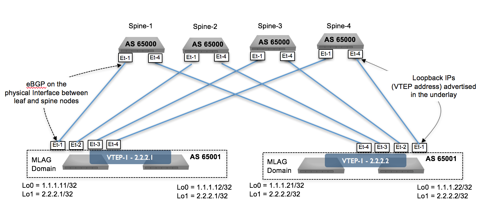

    

<!-- @import "[TOC]" {cmd="toc" depthFrom=1 depthTo=6 orderedList=false} -->

<!-- code_chunk_output -->

- [Ansible Arista Validated Design](#ansible-arista-validated-design)
  - [Quick Start](#quick-start)
  - [Resources](#resources)
- [License](#license)
- [Ask question or report issue](#ask-question-or-report-issue)
- [Contribute](#contribute)

<!-- /code_chunk_output -->

# Ansible Arista Validated Design

Repository provides modules and roles to build an EVPN/VXLAN fabric using Ansible to build and deploy configuration to devices.

Devices configuration are based on [Arista EVPN Design Guide](https://www.arista.com/en/solutions/design-guides) and cover a generic Unified Cloud Network environment.



## Quick Start

```shell
# Configure Python virtual environment
$ virtualenv -p $(which python) .venv
$ source .venv/bin/activate

# Install Python requirements
$ pip install -r requirements.txt

# Edit Inventory file
$ vim inventory.yml

# Edit fabric variables
# Change values to point to your own information
$ vim group_vars/A_DC_FABRIC.yml

# Run ansible playbooks
$ cd examples/evpn-design-guide/
$ ansible-playbook a-dc-fabric-config.yml --tags "documentation"
```

## Resources

- EOS Ansible modules are documented part of [Ansible core modules](https://docs.ansible.com/ansible/latest/modules/list_of_network_modules.html#eos)

- [An eBGP EVPN over eBGP network design](https://eos.arista.com/evpn-configuration-ebgp-design-for-evpn-overlay-network/)

# License

Project is published under [Apache License](LICENSE).

# Ask question or report issue

Please open an issue on Github this is the fastest way to get an answer.

# Contribute

Contributing pull requests are gladly welcomed for this repository. If you are planning a big change, please start a discussion first to make sure we’ll be able to merge it.