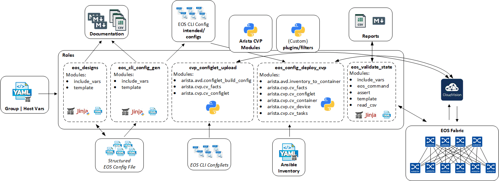
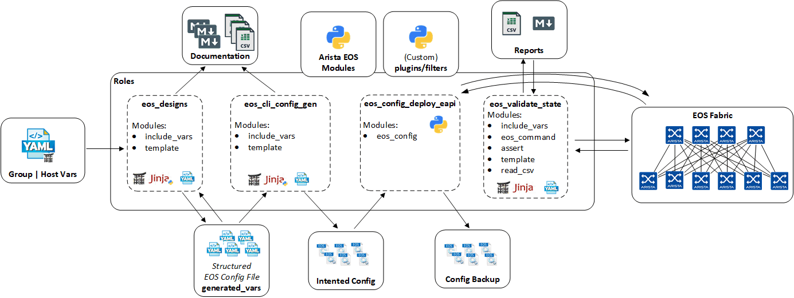

# Ansible Collection For Arista Validated Designs

<center></center>

**Table of Contents:**

- [Ansible Collection For Arista Validated Designs](#ansible-collection-for-arista-validated-designs)
  - [About](#about)
  - [Reference Designs](#reference-designs)
  - [Roles Overview](#roles-overview)
  - [Custom Plugins & Modules](#custom-plugins--modules)
  - [Installation](#installation)
    - [Requirements](#requirements)
    - [Installation from ansible-galaxy](#installation-from-ansible-galaxy)
  - [Example Playbooks](#example-playbooks)
  - [Contributing](#contributing)
  - [License](#license)

## About

[Arista Networks](https://www.arista.com/) supports Ansible for managing devices running the EOS operating system natively through eapi or [CloudVision Portal (CVP)](https://www.arista.com/en/products/eos/eos-cloudvision).
This collection includes a set of ansible roles and modules to help kick-start your automation with Arista. The various roles and templates provided are designed to be customized and extended to your needs!

Full documentation for the collection is available on read-the-docs:

- [Latest stable version](https://www.avd.sh/en/latest/)
- [Collection development version](https://www.avd.sh/en/devel/)

## Reference Designs

The arista.avd collection provides abstracted data models and framework to build, document, deploy and validate the following designs:

**L3LS EVPN:**

| Underlay | Overlay | Topology |
| -------- | ------- | ---------- |
| eBGP | eBGP | Multi-Stage + L2 Leafs |
| ISIS | eBGP | Multi-Stage + L2 Leafs  |
| ISIS | iBGP | Multi-Stage + L2 Leafs  |
| OSPF | eBGP | Multi-Stage + L2 Leafs |
| OSPF | iBGP | Multi-Stage + L2 Leafs  |
| RFC5549(eBGP) | eBGP | Multi-Stage + L2 Leafs |

<div style="text-align:center">
  
</div>

## Roles Overview

This repository provides roles for Ansible's collection __arista.avd__ with the following content:

- [__arista.avd.eos_designs__](roles/eos_designs/README.md) - Opinionated Data model to assist with the deployment of Arista Validated Designs.
- [__arista.avd.eos_cli_config_gen__](roles/eos_cli_config_gen/README.md) - Generate Arista EOS cli syntax and device documentation.
- [__arista.avd.eos_config_deploy_cvp__](roles/eos_config_deploy_cvp/README.md) - Deploys intended configuration via CloudVision.
- [__arista.avd.eos_config_deploy_eapi__](roles/eos_config_deploy_eapi/README.md) - Deploys intended configuration via eAPI.
- [__arista.avd.cvp_configlet_upload__](roles/cvp_configlet_upload/README.md) - Uploads configlets from a local folder to CloudVision Server.
- [__arista.avd.eos_validate_state__](roles/eos_validate_state/README.md) - Validate operational states of Arista EOS devices.
- [__arista.avd.eos_snapshot__](roles/eos_snapshot/README.md) - Collect commands on EOS devices and generate reports.
- [__arista.avd.dhcp_provisioner__](roles/dhcp_provisioner/README.md) - Configure an ISC-DHCP server to provide ZTP services and Cloudvision registration.



## Custom Plugins & Modules

This repository provides custom plugins for Ansible's collection __arista.avd__ :

- [Arista AVD Plugins](plugins/README.md)

## Installation

### Requirements

**Arista EOS:**

- EOS 4.21.8M or later
- Roles validated with eAPI transport -> `ansible_connection: httpapi`

**Python:**

- Python 3.8 or later

**Supported Ansible Versions:**

- ansible-core from __2.11.3__ to __2.12.x__

**Additional Python Libraries required:**

- netaddr
- Jinja2
- treelib
- cvprac
- paramiko
- jsonschema
- requests
- PyYAML
- md-toc

**Ansible + Additional Python Libraries Installation:**

```shell
$ pip3 install ansible-core>=2.11.3,<2.13.0

$ pip3 install -r requirements.txt
```

requirements.txt content:

```text
--8<-- "requirements.txt"
```

**Ansible Configuration INI file:**

- enable jinja2 extensions: loop controls and do
  - [Jinja2 Extensions Documentation](https://jinja.palletsprojects.com/extensions/)
- By default, Ansible will issue a warning when a duplicate dict key is encountered in YAML. We recommend to change to error instead and stop playbook execution when a duplicate key is detected.

```ini
jinja2_extensions=jinja2.ext.loopcontrols,jinja2.ext.do
duplicate_dict_key=error
```

### Installation from ansible-galaxy

Ansible galaxy hosts all stable version of this collection. Installation from ansible-galaxy is the most convenient approach for consuming `arista.avd` content

```shell
ansible-galaxy collection install arista.avd
```

## Example Playbooks

**An example playbook to deploy an Arista Validated Design via CloudVision:**


```yaml
# Play to build EOS configuration from EOS_DESIGNS
- hosts: DC1_FABRIC
  tasks:

    # BUILD EOS configuration
    - name: generate intended variables
      import_role:
         name: arista.avd.eos_designs
    - name: generate device intended config and documentation
      import_role:
         name: arista.avd.eos_cli_config_gen

# Play to configure Cloudvision
- hosts: CVP
  tasks:

  # Generate Cloudvision configuration & deployment
  - name: upload cvp configlets
    import_role:
        name: arista.avd.cvp_configlet_upload
    vars:
      configlet_directory: 'configlets/'
      file_extension: 'txt'
      configlets_cvp_prefix: 'DC1-AVD'
    - name: deploy configuration via CVP
      import_role:
         name: arista.avd.eos_config_deploy_cvp
```

Execute eos_state_validation playbook once change control has been approved and deployed to devices in CVP.
Note: To run this playbook, ansible_host **must** be configured in your inventory for every EOS device. eAPI access **must** be configured and allowed in your networks.

```yaml
# EOS eAPI state validation
- hosts: DC1_FABRIC
  tasks:
    - name: audit fabric state using EOS eAPI connection
      import_role:
         name: arista.avd.eos_validate_state
```

**An example playbook to deploy an Arista Validated Design via EOS eAPI:**



```yaml
# Play to build EOS configuration from EOS_DESIGNS + Deploy using eAPI
- hosts: DC1_FABRIC
  tasks:

    # BUILD EOS configuration
    - name: generate intended variables
      import_role:
         name: arista.avd.eos_designs
    - name: generate device intended config and documentation
      import_role:
         name: arista.avd.eos_cli_config_gen

    # EOS eAPI deploy
    - name: deploy configuration via eAPI
      import_role:
         name: arista.avd.eos_config_deploy_eapi

    # EOS eAPI state validation
    - name: audit fabric state using EOS eAPI connection
      import_role:
         name: arista.avd.eos_validate_state
```

**Full examples with variables and outputs, are located here:**

[Arista NetDevOps Examples](https://github.com/arista-netdevops-community)

## Contributing

Contributing pull requests are gladly welcomed for this repository. If you are planning a big change, please start a discussion first to make sure we'll be able to merge it.

You can also open an [issue](https://github.com/aristanetworks/ansible-avd/issues) to report any problem or to submit enhancement.

## License

Project is published under [Apache 2.0 License](LICENSE)
