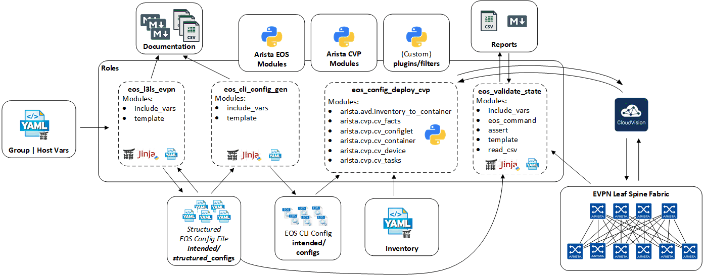
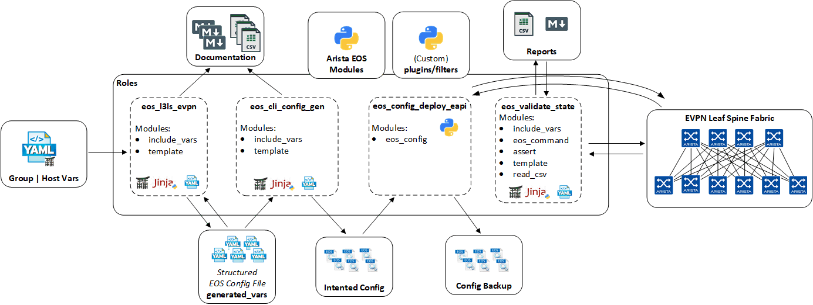

# Ansible Collection For Arista Validated Designs

<center></center>

**Table of Contents:**

- [Ansible Collection For Arista Validated Designs](#ansible-collection-for-arista-validated-designs)
  - [Roles Overview](#roles-overview)
  - [Custom Plugins](#custom-plugins)
  - [Installation](#installation)
    - [Requirements](#requirements)
    - [Installation from ansible-galaxy](#installation-from-ansible-galaxy)
  - [Example Playbooks](#example-playbooks)
  - [Contributing](#contributing)
  - [License](#license)

## Roles Overview

This repository provides roles for Ansible's collection __arista.avd__ with the following content:

- [__arista.avd.eos_l3ls_evpn__](roles/eos_l3ls_evpn/README.md) - Opinionated Data model for deployment of L3 Leaf and Spine Fabric with VXLAN data-plane with an EVPN Control plane.
- [__arista.avd.eos_cli_config_gen__](roles/eos_cli_config_gen/README.md) - Generate Arista EOS cli syntax and device documentation.
- [__arista.avd.eos_config_deploy_cvp__](roles/eos_config_deploy_cvp/README.md) - Deploys intended configuration via CloudVision.
- [__arista.avd.eos_config_deploy_eapi__](roles/eos_config_deploy_eapi/README.md) - Deploys intended configuration via eAPI.
- [__arista.avd.cvp_configlet_upload__](roles/cvp_configlet_upload/README.md) - Uploads configlets from a local folder to CloudVision Server.
- [__arista.avd.eos_validate_state__](roles/eos_validate_state/README.md) - Validate operational states of Arista EOS devices



## Custom Plugins

This repository provides custom plugins for Ansible's collection __arista.avd__ :

- [Arista AVD Plugins](plugins/README.md)

## Installation

### Requirements

**Arista EOS:**

- EOS 4.21.8M or later
- Roles validated with eAPI transport -> `ansible_connection: httpapi`

**Python:**

- Python 3.6.8 or later

**Supported Ansible Versions:**

- ansible 2.9.2 or later

**Additional Python Libraries required:**

- Jinja2  `2.10.3`
- netaddr `0.7.19`
- requests `2.22.0`
- treelib `1.5.5`
- cvprac `1.0.4`

**Ansible + Additional Python Libraries Installation:**

```shell
pip3 install -r requirements.txt
```

requirements.txt content:

```text
ansible==2.9.2
Jinja2==2.10.3
netaddr==0.7.19
requests==2.22.0
treelib==1.5.5
cvprac==1.0.4
```

**Ansible Configuration INI file:**

- enable jinja2 extensions: loop controls and do
  - [Jinja2 Extensions Documentation](https://svn.python.org/projects/external/Jinja-2.1.1/docs/_build/html/extensions.html)
- By default, Ansible will issue a warning when a duplicate dict key is encountered in YAML. We recommend to change to error instead and stop playbook execution when a duplicate key is detected.

```ini
jinja2_extensions=jinja2.ext.loopcontrols,jinja2.ext.do
duplicate_dict_key=error
```

### Installation from ansible-galaxy

Ansible galaxy hosts all stable version of this collection. Installation from ansible-galaxy is the most convenient approach for consuming `arista.avd` content

```shell
ansible-galaxy collection install arista.avd
```

## Example Playbooks

**An example playbook to deploy VXLAN/EVPN Fabric via CloudVision:**


```yml
- hosts: DC1_FABRIC
  tasks:
    - name: generate intended variables
      import_role:
         name: arista.avd.eos_l3ls_evpn
    - name: generate device intended config and documentation
      import_role:
         name: arista.avd.eos_cli_config_gen

- hosts: CVP
  tasks:
    - name: deploy configuration via CVP
      import_role:
         name: arista.avd.eos_config_deploy_cvp
```

Execute eos_state_validation playbook once change control has been approved and deployed to devices in CVP.
Note: To run this playbook, ansible_host **must** be configured in your inventory for every EOS device. eAPI access **must** be configured and allowed in your networks.

```yml
- hosts: DC1_FABRIC

  tasks:

    - name: audit fabric state using EOS eAPI connection
      import_role:
         name: arista.avd.eos_validate_state
```

**An example playbook to deploy VXLAN/EVPN Fabric via eAPI:**



```yml
- hosts: DC1_FABRIC

  tasks:

    - name: generate intended variables
      import_role:
         name: arista.avd.eos_l3ls_evpn

    - name: generate device intended config and documentation
      import_role:
         name: arista.avd.eos_cli_config_gen

    - name: deploy configuration via eAPI
      import_role:
         name: arista.avd.eos_config_deploy_eapi

    - name: audit fabric state using EOS eAPI connection
      import_role:
         name: arista.avd.eos_validate_state
```

**Full examples with variables and outputs, are located here:**

[Arista NetDevOps Examples](https://github.com/arista-netdevops-community)

## Contributing

Contributing pull requests are gladly welcomed for this repository. If you are planning a big change, please start a discussion first to make sure we'll be able to merge it.

You can also open an [issue](https://github.com/aristanetworks/ansible-avd/issues) to report any problem or to submit enhancement.

## License

Project is published under [Apache 2.0 License](LICENSE)
