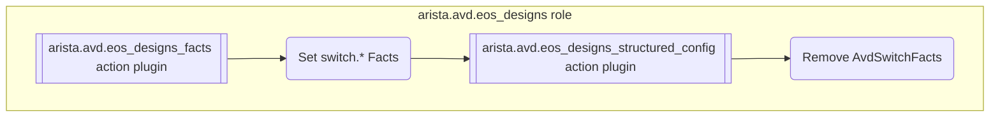
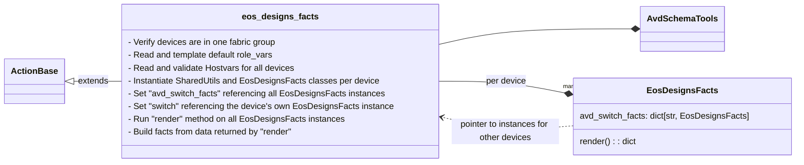
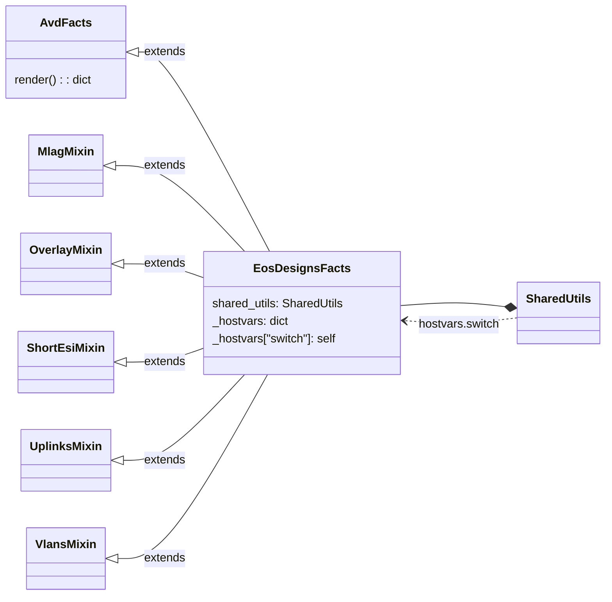
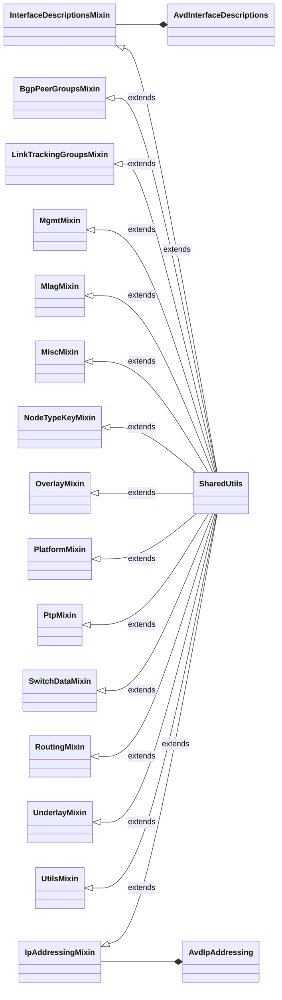
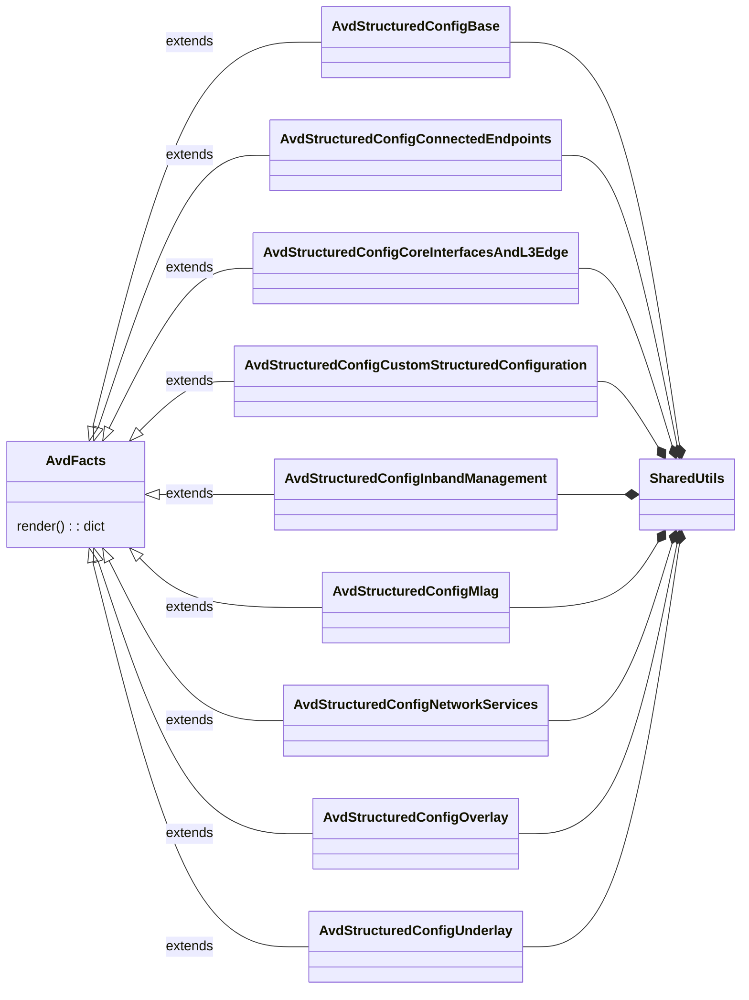

<!--
  ~ Copyright (c) 2023 Arista Networks, Inc.
  ~ Use of this source code is governed by the Apache License 2.0
  ~ that can be found in the LICENSE file.
  -->

# EOS Designs internal notes

!!! Warning

    Anything mentioned here is subject to change without notice. Use of `avd_switch_facts` or `switch.*` facts in custom templates is not supported and should be avoided.

## Overview



## Ansible Action Plugins

### `arista.avd.eos_designs_facts`

The `arista.avd.eos_designs_facts` module is an Ansible Action Plugin providing the following capabilities:

- Set `avd_switch_facts` fact containing `switch` facts per switch.
- Set `avd_topology_peers` fact containing a list of downlink switches per host. This list is built based on the `uplink_switches` from all other hosts.
- Set `avd_evpn_overlay_peers` fact containing a list of EVPN overlay peers per host. This list is built based on the `evpn_route_servers` and `mpls_route_reflectors` from all other hosts.
- Set `avd_evpn_overlay_peers` fact containing a list of EVPN or MPLS overlay peers per host. This list is built based on the `evpn_route_servers` and `mpls_route_reflectors` from all other hosts.

The plugin is designed to `run_once`. With this, Ansible will set the same facts on all devices, so all devices can lookup values of any other device without using the slower `hostvars`.

The facts can also be copied to the "root" `switch` variable in a task run per device (see example below).

The module is used in `arista.avd.eos_designs` to set facts for devices, which are then used by Python modules loaded in `arista.avd.eos_designs_structured_config` to generate the `structured_configuration`.

#### Arguments

```yaml
  template_output: <true | false | default -> false>
  conversion_mode: <"warning" | "info" | "debug" | "quiet" | "disabled" | default -> "debug">
  validation_mode: <"error" | "warning" | "info" | "debug" | "disabled" | default -> "warning">
  cprofile_file: <Filename for storing cprofile data used to debug performance issues>
```

See the full argument spec [here](../../plugins/modules/eos_designs_facts.py)

#### Output data model

```yaml
ansible_facts:
  avd_switch_facts:
    <switch_1>:
      switch:
        < switch.* facts used by eos_designs >
    <switch_2>:
      ...
  avd_topology_peers:
    <uplink_switch_1>:
      - <downlink_switch_1>
      - <downlink_switch_2>
      - <downlink_switch_3>
    <uplink_switch_1>:
      ...
  avd_overlay_peers:
    <route_server_1>:
      - <route_server_client_1>
      - <route_server_client_2>
      - <route_server_client_3>
    <route_server_2>:
      - <route_server_client_1>
      - <route_server_client_2>
      - <route_server_client_3>
```

The facts can be inspected in a file per device by running the `arista.avd.eos_designs` role with `--tags facts,debug`.

#### Internal structure



### `arista.avd.eos_designs_structured_config`

TODO

## Python packages

### AvdFacts

The `AvdFacts` class serve as a base class for `EosDesignsFacts` as well as the many `AvdStructuredConfig*` classes.

The purpose of `AvdFacts` subclasses is to return a dictionary when the `render` method is called.

The class is also partially emulating a `dict` type by exposing `keys()` and `get()` methods and exposing all public attributes
as `cached_property`. This allows for a class instance to be used as part of a deeper data model, where our utility tools
can traverse deeper data models using dot-notation. It also allows for partial rendering of data, since only the accessed
attributes/cached_properties will be rendered.

The base class has a few important methods:

- `keys()` return a list of attributes not beginning with an underscore and where the attribute is decorated with `cached_property`.
  These attributes represent the keys in the emulated dict.
- `render()` loop over every attribute returned by `keys()` and return a dict with all the returned `cached_properties`, except
  `cached_property` with a value of `None` which will be skipped.
- `get(key, default=None)` returns the value of the requested "key" (`cached_property`) if the "key" is in the list returned by `keys()`.
  Otherwise the default value is returned.

See the source code [here](../../plugins/plugin_utils/avdfacts.py)

### get_structured_config

TODO

### EosDesignsFacts

`EosDesignsFacts` is based on `AvdFacts`, so make sure to read the description there first.

The class is instantiated once per device. Methods may use references to other device instances using `hostvars.avd_switch_facts`,
which is a dict of `EosDesignsfacts` instances covering all devices.

See the source code [here](../../plugins/plugin_utils/eos_designs_facts/__init__.py)



### SharedUtils

See the source code [here](../../plugins/plugin_utils/eos_designs_shared_utils/__init__.py)



### AvdStructuredConfig*

`AvdStructuredConfig*` classes are based on `AvdFacts`, so make sure to read the description there first.

The generation of the final `structured_config` is split into multiple python modules which are subclasses of `AvdFacts`.
Each class is loaded in `get_structured_config` and rendered. All the results are deepmerged into the final `structured_config`.

The class is instantiated once per device. Methods may use references to other device instances using `hostvars.avd_switch_facts`,
which at the time where `eos_designs_structured_config` run, is a nested `dict`. It contains the output from `EosDesignsFacts`'s `render()` method.

Subclasses are typically using Mixin classes to split all the attributes/`cached_properties` into managable files.

Source code:

- [AvdStructuredConfigBase](../../roles/eos_designs/python_modules/base/__init__.py)
  (Unfortunate naming. Base here refers to base configurations. Not a Base class.)
- [AvdStructuredConfigConnectedEndpoints](../../roles/eos_designs/python_modules/connected_endpoints/__init__.py)
- [AvdStructuredConfigCoreInterfacesAndL3Edge](../../roles/eos_designs/python_modules/core_interfaces_and_l3_edge/__init__.py)
- [AvdStructuredConfigCustomStructuredConfiguration](../../roles/eos_designs/python_modules/custom_structured_configuration/__init__.py)
- [AvdStructuredConfigInbandManagement](../../roles/eos_designs/python_modules/inband_management/__init__.py)
- [AvdStructuredConfigMlag](../../roles/eos_designs/python_modules/mlag/__init__.py)
- [AvdStructuredConfigNetworkServices](../../roles/eos_designs/python_modules/network_services/__init__.py)
- [AvdStructuredConfigOverlay](../../roles/eos_designs/python_modules/overlay/__init__.py)
- [AvdStructuredConfigUnderlay](../../roles/eos_designs/python_modules/underlay/__init__.py)



## Facts set at runtime

### avd_switch_facts

The following model is set as `eos_designs_facts`. Most keys are optional depending on the
use case and configuration. The use of each key is tracked in the sections below.

```yaml
avd_switch_facts:
  <hostname>:
    switch:
      bgp_as: <str>
      dc_name: <str>
      endpoint_trunk_groups: <list>
      endpoint_vlans: <str>
      evpn_multicast: <bool>
      evpn_role: <str>
      evpn_route_servers: <list[str]>
      group: <str>
      id: <int>
      inband_mgmt_subnet: <str>
      inband_mgmt_vlan: <int>
      is_deployed: <bool>
      loopback_ipv4_pool: <str>
      local_endpoint_trunk_groups: <list[str]>
      max_parallel_uplinks: <int>
      max_uplink_switches: <int>
      mlag_interfaces: <list[str]>
      mlag_ip: <str>
      mlag_l3_ip: <str>
      mlag_peer: <str>
      mlag_port_channel_id: <int>
      mlag_switch_ids:
        primary: <int>
        secondary: <int>
      mgmt_interface: <str>
      mgmt_ip: <int>
      mpls_lsr: <bool>
      mpls_overlay_role: <str>
      mpls_route_reflectors: <list[str]>
      overlay:
        peering_address: <str>
        evpn_mpls: <bool>
      platform: <str>
      router_id: <str>
      serial_number: <str>
      type: <str>
      underlay_routing_protocol: <str>
      uplink_ipv4_pool: <str>
      uplink_peers: <list[str]>
      uplinks: <list[dict]>
      vlans: <str>
      vtep_ip: <str>
      vtep_loopback_ipv4_pool: <str>
```

#### avd_switch_facts leveraged in eos_designs python_modules

These variables are read for all or some devices as part of structured_config generation,
so they must be available in the `avd_switch_facts` object.

| Variable | Used in file |
| -------- | ------------ |
| switch.type | core_interfaces/utils.py |
| switch.type | l3_edge/utils.py |
| switch.inband_mgmt_subnet | inband_management/avdstructuredconfig.py |
| switch.inband_mgmt_vlan | inband_management/avdstructuredconfig.py |
| switch.vlans | network_services/utils_filtered_tenants.py |
| switch.vtep_ip | network_services/vxlan_interface.py |
| switch.vlans | network_services/vxlan_interface.py |
| switch.uplinks | underlay/utils.py |
| switch.type | underlay/utils.py |
| switch.is_deployed | underlay/utils.py |
| switch.bgp_as | underlay/utils.py |
| switch | overlay/utils.py |
| switch.evpn_route_servers | overlay/utils.py |
| switch.evpn_role | overlay/utils.py |
| switch.mpls_route_reflectors | overlay/utils.py |
| switch.bgp_as | overlay/utils.py |
| switch.overlay.peering_address | overlay/utils.py |
| switch.mpls_overlay_role | overlay/utils.py |
| switch.overlay.evpn_mpls | overlay/utils.py |

#### switch.* leveraged for Jinja2 templates

These variables are historically used in *builtin* jinja2 templates so they **should not** be removed without warning.
TODO: Only expose these in the Jinja2 templating environment used for custom templates. They would *not* be available
outside of that, so any inline Jinja2 could not use these values.

| Variable | Used in file |
| -------- | ------------ |
| switch.type | fabric-documentation.j2 |
| switch.uplink_ipv4_pool | fabric-documentation.j2 |
| switch.loopback_ipv4_pool | fabric-documentation.j2 |
| switch.vtep_loopback_ipv4_pool | fabric-documentation.j2 |
| switch.node | fabric-documentation.j2 |
| switch.mgmt_ip | fabric-documentation.j2 |
| switch.platform | fabric-documentation.j2 |
| switch.serial_number | fabric-documentation.j2 |
| switch.underlay_routing_protocol | fabric-documentation.j2 |
| switch.type | fabric-p2p-links.j2 |
| switch.type | fabric-topology.j2 |
| switch.mpls_overlay_role |interface_descriptions/loopback_interfaces/overlay-loopback.j2 |
| switch.mpls_lsr |interface_descriptions/loopback_interfaces/overlay-loopback.j2 |
| switch.mlag_peer | interface_descriptions/mlag/ethernet-interfaces.j2 |
| switch.mlag_interfaces | interface_descriptions/mlag/port-channel-interfaces.j2 |
| switch.mlag_peer | interface_descriptions/mlag/port-channel-interfaces.j2 |
| switch.mlag_port_channel_id | interface_descriptions/mlag/port-channel-interfaces.j2 |
| switch.uplink_ipv4_pool | ip_addressing/avd-v2-spine-p2p-uplinks-ip.j2 |
| switch.id | ip_addressing/avd-v2-spine-p2p-uplinks-ip.j2 |
| switch.max_parallel_uplinks | ip_addressing/avd-v2-spine-p2p-uplinks-ip.j2 |
| switch.max_uplink_switches | ip_addressing/avd-v2-spine-p2p-uplinks-ip.j2 |
| switch.uplink_ipv4_pool | ip_addressing/avd-v2-spine-p2p-uplinks-peer-ip.j2 |
| switch.id | ip_addressing/avd-v2-spine-p2p-uplinks-peer-ip.j2 |
| switch.max_parallel_uplinks | ip_addressing/avd-v2-spine-p2p-uplinks-peer-ip.j2 |
| switch.max_uplink_switches | ip_addressing/avd-v2-spine-p2p-uplinks-peer-ip.j2 |
| switch.mlag_switch_ids.primary | ip_addressing/mlag-ibgp-peering-ip-primary.j2 |
| switch.mlag_switch_ids.primary | ip_addressing/mlag-ibgp-peering-ip-secondary.j2 |
| switch.uplink_ipv4_pool | ip_addressing/p2p-uplinks-ip.j2 |
| switch.id | ip_addressing/p2p-uplinks-ip.j2 |
| switch.max_uplink_switches | ip_addressing/p2p-uplinks-ip.j2 |
| switch.max_parallel_uplinks | ip_addressing/p2p-uplinks-ip.j2 |
| switch.uplink_ipv4_pool | ip_addressing/p2p-uplinks-peer-ip.j2 |
| switch.id | ip_addressing/p2p-uplinks-peer-ip.j2 |
| switch.max_uplink_switches | ip_addressing/p2p-uplinks-peer-ip.j2 |
| switch.max_parallel_uplinks | ip_addressing/p2p-uplinks-peer-ip.j2 |

#### Other switch.* variables set in eos_designs_facts

| Variable | Reason |
| -------- | ------------ |
| switch.evpn_multicast | Since the code behind evpn_multicast has to check the mlag peer facts for 'overlay_rd_type_admin_subfield' we can either expose that field in facts, or perform the check inside eos_designs_facts. |
| switch.endpoint_trunk_groups | Complex calculations leveraging data from peers leading to compact output, so instead of repeating in multiple areas, we do it once and store the result. |
| switch.endpoint_vlans | Complex calculations leveraging data from peers leading to compact output, so instead of repeating in multiple areas, we do it once and store the result. |
| switch.local_endpoint_trunk_groups | Complex calculations leveraging data from peers leading to compact output, so instead of repeating in multiple areas, we do it once and store the result. |
| switch.mlag_ip | mlag_ip must be available to the mlag peer. |
| switch.mlag_l3_ip | mlag_l3_ip must be available to the mlag peer. |
| switch.mgmt_ip | mgmt_ip must be available to the mlag peer. |
| switch.uplink_peers | These are used to generate the "avd_topology_peers" fact covering downlinks for all devices in eos_designs_facts action plugin. |
| switch.dc_name | Used for underlay HER flood-list calculations when using scope dc_name
| switch.bgp_as | Known use of inline jinja in customer deployments |
| switch.group | Known use of inline jinja in customer deployments |
| switch.hostname | Known use of inline jinja in customer deployments |
| switch.id | Known use of inline jinja in customer deployments |
| switch.mgmt_interface | Known use of inline jinja in customer deployments |
| switch.mgmt_ip | Known use of inline jinja in customer deployments |
| switch.router_id | Known use of inline jinja in customer deployments |
