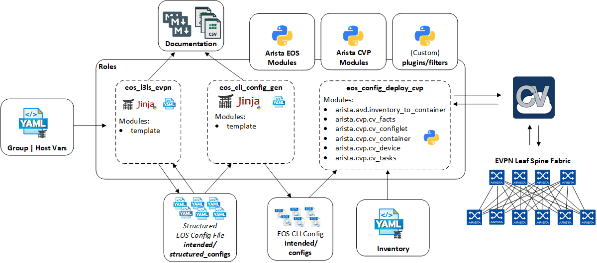
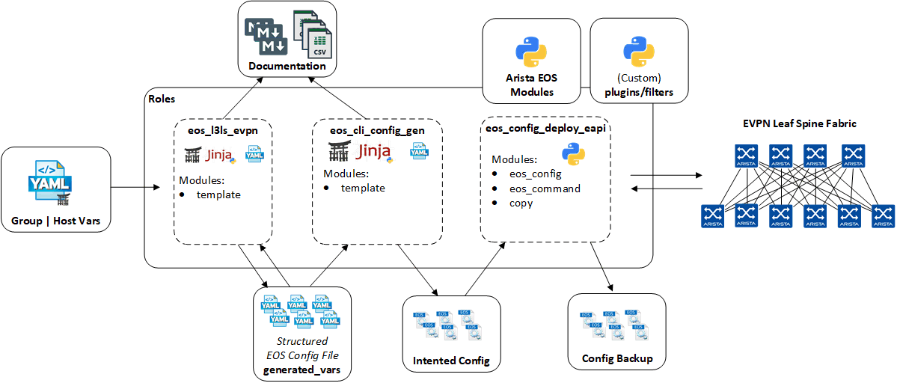

# Getting Started

## Install tools

```shell
# Install AVD environment
$ sh -c "$(curl -fsSL https://get.avd.sh)"

# Move to AVD directory
$ cd arista-ansible

# Spin up container for easy access
$ make dev-start
```

> Note: Docker & docker-compose must be installed on your laptop

A [demo repository](https://github.com/arista-netdevops-community/ansible-avd-cloudvision-demo) is also cloned on your laptop and you can leverage this one as part of your AVD journey. If you prefer to use your own project, follow next section.

## Create your personal folder

```shell
$ mkdir avd-project

$ cd avd-project

$ echo "[defaults]
host_key_checking = False
inventory = inventory/inventory.yml
gathering = explicit
retry_files_enabled = False
# filter_plugins = ansible-avd/plugins/filters
# roles_path = ansible-avd/roles
# library = ansible-avd/library
collections_paths = ../ansible-cvp:../ansible-avd:~/.ansible/collections:/usr/share/ansible/collections
# action_plugins = /usr/lib/python2.7/site-packages/napalm_ansible/plugins/action
jinja2_extensions =  jinja2.ext.loopcontrols,jinja2.ext.do,jinja2.ext.i18n
# enable the YAML callback plugin.
stdout_callback = yaml
# enable the stdout_callback when running ad-hoc commands.
bin_ansible_callbacks = True
command_warnings=False

[persistent_connection]
connect_timeout = 120
command_timeout = 120" > ${PWD}/ansible.cfg

$ mkdir group_vars/
$ mkdir host_vars/
$ mkdir roles/
$ mkdir inventory
```

## Describe fabric

Please refer to [`eos_l3ls_evpn` documentation](../roles/eos_l3ls_evpn/README.md)

## Example Playbooks

### An example playbook to deploy VXLAN/EVPN Fabric via CloudVision



```yml
- hosts: DC1_FABRIC

  tasks:

    - name: generate intended variables
      import_role:
         name: arista.avd.eos_l3ls_evpn

    - name: generate device intended config and documentation
      import_role:
         name: arista.avd.eos_cli_config_gen

    - name: deploy configuration via CVP
      import_role:
         name: arista.avd.eos_config_deploy_cvp
```

### An example playbook to deploy VXLAN/EVPN Fabric via eAPI



```yml
- hosts: DC1_FABRIC

  tasks:

    - name: generate intended variables
      import_role:
         name: arista.avd.eos_l3ls_evpn

    - name: generate device intended config and documentation
      import_role:
         name: arista.avd.eos_cli_config_gen

    - name: deploy configuration to device
      import_role:
         name: arista.avd.eos_config_deploy_eapi
```

!!! note
    - For complete and detailed lab description, you can refer to this [how-to](./how-to/first-project.md) document.
