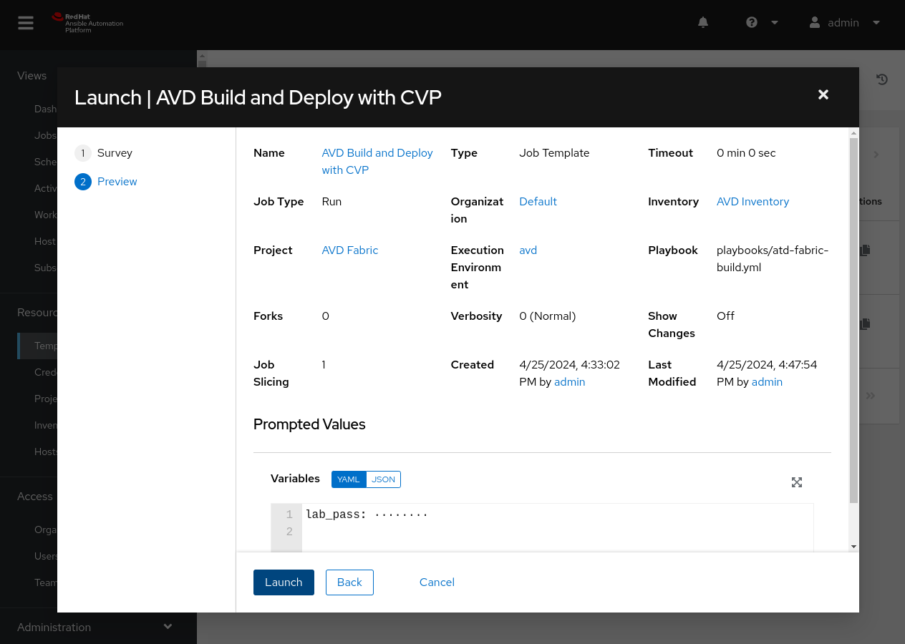
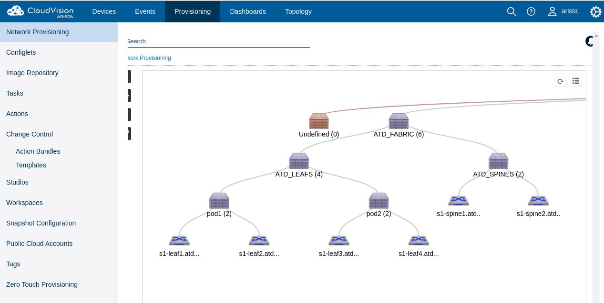
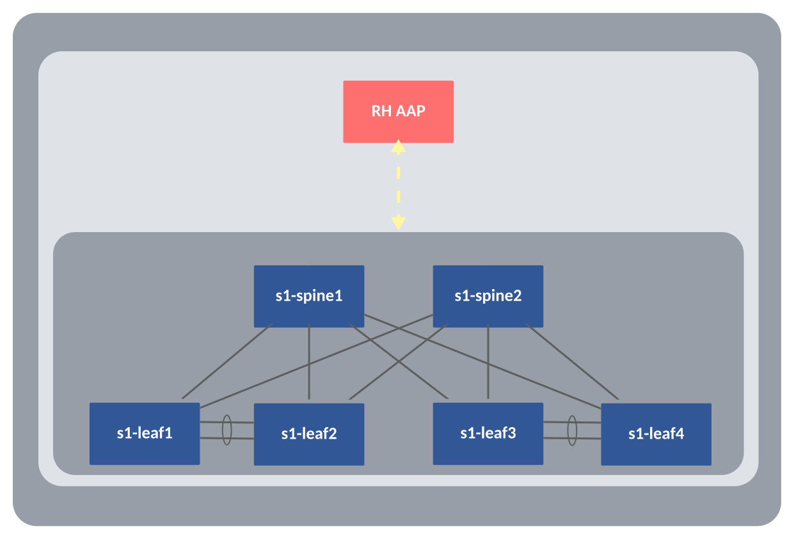

<!--
  ~ Copyright (c) 2023-2024 Arista Networks, Inc.
  ~ Use of this source code is governed by the Apache License 2.0
  ~ that can be found in the LICENSE file.
  -->

# AVD and Ansible Automation Platform

This guide will walk you through the steps required to get up and running with AVD and Red Hat's Ansible Automation Platform (AAP). AAP is Red Hat's solution to scale automation within an organization, whether by making automation more readily available to team members, adding security capabilities, or simplifying the speed of getting started with Ansible using execution environments.

## Requirements to get started

Please note, that this guide leverages AAP version 2.4. The workflows should be similar in newer versions; if there are any questions, please see the official [AAP documentation](https://access.redhat.com/documentation/en-us/red_hat_ansible_automation_platform/2.4).

- An accessible lab topology running Arista EOS.
- An AVD project or Git repository with playbooks and an inventory. To get started, you may also use any of our [example topologies](../../examples/single-dc-l3ls/README.md).
- A RHEL instance running AAP.
  - If you need access to a RHEL instance, you can join the [developer program](https://www.redhat.com/en/technologies/linux-platforms/enterprise-linux/developer-program) to get a copy.
  - To get started, you may also sign up for a 60-day [trial license](https://www.redhat.com/en/technologies/management/ansible/trial) for AAP.

## Topology

Our topology leverages two spines and four leaf nodes to create a layer three leaf spine topology. The topology is managed by Arista CloudVision Portal (CVP). There will also be an example of running any provisioning tasks directly on the EOS nodes. In our case, the EOS nodes are constantly streaming to CVP and gives us the ability to provision the nodes with CVP. AAP will act as our controller to communicate any updates to CVP, which can then push the updates to our topology.


## AAP Dashboard

The image below provides an excellent overview of the AAP dashboard. From one pane, we have quick links to hosts, inventories, and breakdowns of recent job executions. The left pane provides us access to anything we may need within AAP. This guide will go through setting up the following items:

- Execution environments
- Projects
- Inventories
- Job templates
- Surveys


## Execution environments

Execution environments (EEs) are Red Hat's solution for managing project dependencies. In the past, we used Python virtual environments. The Python virtual environments had pros and cons, but EEs leverage containers to wrap all dependencies within a container. EEs make environments more portable and quicker to replicate between AAP nodes and standalone projects.

This example will leverage the AVD all-in-one container to get us up and running with the required software. You may use this environment or create your own. To learn more about working with execution environments, please see the [official documentation](https://docs.ansible.com/ansible/latest/getting_started_ee/index.html).

=== "Click on EE"

    Scroll down on the left pane, and under `Administration`, click on `Execution Environments`.

    

=== "EE - Add"

    In the new pane, click on `Add`. You can also see the built-in EEs installed with AAP.

    

=== "EE - Save"

    Give the EE an appropriate `Name` and full `Image` location. For the `Pull` option, this will vary if the EE is in active development and frequent changes are expected. Since our EE is ready, we will set this to `Only pull image of not present`. We are leveraging the AVD all-in-one container image, but you may use any EE for your specific project or build your own.

    ```shell
    ghcr.io/arista-netdevops-community/avd-all-in-one-container/avd-all-in-one:avd4.6.0_cvp3.10.1
    ```

    

## Projects

Projects in AAP are vital in setting up additional options. For example, we can leverage our project when defining a new inventory or reference playbooks within the project to define job workflows in AAP.

=== "Click on Projects"

    Scroll up on the left pane, and under `Resources`, click on `Projects`.

    

=== "Projects - Add"

    In the new pane, click on `Add`.

    

=== "Projects - Save"

    Give the project an appropriate `Name`. Again, you may use any examples hosted within the [AVD repository](https://github.com/aristanetworks/avd/tree/devel/ansible_collections/arista/avd/examples) or any current project you have. This example will leverage a Git repository as the `Source Control Type`. We will also set the URL for our Git project and, optionally, an alternate branch. Finally, we also check `Update Revision on Launch` and set the `Cache Timeout` to zero. Setting it to zero will also ensure the project updates when running a job that references this project, which is helpful for any projects with active development.

    

## Inventories

AAP provides many ways to add an inventory. For example, we can use an inventory hosted within our project or constructed inventories made from multiple inventories. This example will leverage one inventory from our Git project.

=== "Click on Inventories"

    On the left pane, and under `Resources`, click on `Inventories`.

    

=== "Inventories - Add"

    In the new pane, click on `Add` and select `Add inventory`.

    

=== "Inventories - Save"

    Give the inventory an appropriate `Name` and click `Save`.

    

### Inventory Sources

At this point, we have an inventory with no hosts. This is where inventory sources come into play. Like most things, we have a series of options. We can leverage an inventory source from Cloud providers, virtualization platforms, or, in our case, directly from our project.

=== "Click on Sources"

    On the center pane, click on `Sources`.

    

=== "Sources - Add"

    - In the new pane, click on `Add`.
    - A new pane is shown but similar to before, fill in an appropriate `Name` and select `Source from a Project` under `source`.
    - Under `Source details` click on the search icon under `Project`
      - Select you newly created project
    - Under `Source details`, if the `Inventory file` drop down does not show your inventory, feel free to enter it manually.
    - Under `Update options` make sure `Update on launch` is checked.
    - Scroll down and click `Save`.

    

=== "Sources - Sync"

    In the new pane, click on `Sync` to update your inventory.

    

### View the Inventory

There are a few locations to view the inventory, but for simplicity, we can view it by clicking on `Hosts` on the left pane.

=== "Click on Sync Job"

    - On the left pane, click on `Jobs`.
      - You should see an inventory sync running or complete.
    - Click on the inventory sync job.

    

=== "Sync job output"

    Towards the bottom of the output, we see that AAP successfully parsed our inventory. In this case, we have loaded nine groups and seven hosts.

    

=== "Hosts"

    There are a few locations to view the inventory, but for simplicity, we can take a look by clicking on `Hosts` on the left pane.

    

## Job templates and workflow templates

One thing that may need some clarification is the naming of "job templates." These map to playbooks within our project. There is also an option to build workflow templates: a series of job templates with some control logic built-in. For this example, we will use a job template to build and deploy our node configurations with CVP.

=== "Click on Templates"

    On the left pane, click on `Templates`.

    

=== "Templates - Add"

    - On the center pane, select `Add`.
    - In the drop down select `Add job template`.

    

=== "Templates - Job"

    The job template is where we leverage the custom execution environment. Since our setup requires specific Ansible collections and Python packages installed, we would like to use a pre-packaged environment with that software. We can modify a decent number of settings, and they may look familiar from previous history with Ansible configurations. If you need a refresher on these options, please see the [official documentation](https://docs.ansible.com/automation-controller/latest/html/userguide/job_templates.html). Once you are happy with the settings, click `Save`.

    !!! warning
        The playbook is set to "Run," and the EOS instances in use will be changed. Please ensure you are leveraging nonproduction instances when testing.

    

### Surveys

With most jobs, we need a way to authenticate to our CVP instance or EOS nodes. AAP provides a multitude of ways to define credentials. Some options are credentials for Network devices, Container registries, HashiCorp Vault, etc. Feel free to explore any option you need for your environment. For this guide, we will leverage a survey secret. Surveys allow us to ask users for information we require for a job to execute correctly. We will leverage a survey with a default secret value (this is the credential used to connect to our nodes).

=== "Surveys"

    On the center pane, click on `Survey`.

    

=== "Surveys - Save"

    - On the center pane, select `Add`.
    - Set `Question` to an appropriate value.
    - Set `Answer variable name` to any valid variable name, here we use `lab_pass`.
    - `Answer type` is set to `Password` and the default value is set.
    - Click `Save` when done.

    

    The `lab_pass` variable or whichever name you would prefer can be used in your project by assigning the correct variable value to the `ansible_password` variable.

    ```yaml
    vars:
      ansible_user: arista
      ansible_password: "{{ lab_pass }}"
      ansible_network_os: arista.eos.eos
    ```

=== "Surveys - Enable"

    Click the `Surveys Disabled` radio button to ensure the survey is enabled.

    

### Running the Template with CVP

Below is an example of the playbook we are leveraging to build and deploy our configurations with CVP. The following section will have an alternate version that can be deployed directly to EOS nodes.

```yaml
---
- name: Manage Arista EOS EVPN/VXLAN Configuration
  hosts: ATD_FABRIC
  connection: local
  gather_facts: false
  collections:
    - arista.avd
  vars:
    fabric_dir_name: "{{ fabric_name }}"
  tasks:

    - name: Generate intended variables
      import_role:
        name: eos_designs

    - name: Generate device intended config and documentation
      import_role:
        name: eos_cli_config_gen

- name: Configuration deployment with CVP
  hosts: cv_servers
  connection: local
  gather_facts: false
  collections:
    - arista.avd
  tasks:
    - name: Provision CVP with AVD configuration
      import_role:
        name: eos_config_deploy_cvp
      vars:
        container_root: 'ATD_FABRIC'
        configlets_prefix: 'AVD'
        state: present
        execute_tasks: true
```

We have everything we need to run our job template now.

=== "Templates Run"

    - On the left pane, click on `Templates`.
    - Click on the `Launch Template` icon to run the job template.
    - In the new pane, click `Next`.
    - In the `Launch` pane, click `Launch`.

    
    

=== "Jobs"

    On the left pane, select `Jobs`. You may see a series of updates. For example, our source control is updating because our timeout is set to zero. The inventory has also been updating since we checked `Update on launch`. Last but not least, the job template will run.

    

=== "Job - Output"

    We can now click on the job run and see a successful execution.

    

=== "CVP View"

    From CVP's perspective, we can see a new container topology is created, and our change control workflow has been completed for us when leveraging the CVP Ansible collection.

    
    

### Running the Template directly to EOS nodes



The AVD collection provides a role to deploy updates directly to EOS nodes. Assuming AAP has direct connectivity to your topology, we could use the following playbook to build and deploy and updates directly to EOS nodes.

```yaml
---
- name: Manage Arista EOS EVPN/VXLAN Configuration
  hosts: ATD_FABRIC
  connection: local
  gather_facts: false
  collections:
    - arista.avd
  vars:
    fabric_dir_name: "{{ fabric_name }}"
  tasks:

    - name: Generate intended variables
      import_role:
        name: eos_designs

    - name: Generate device intended config and documentation
      import_role:
        name: eos_cli_config_gen

    - name: Deploy updates to EOS nodes
      import_role:
        name: eos_config_deploy_eapi

```
