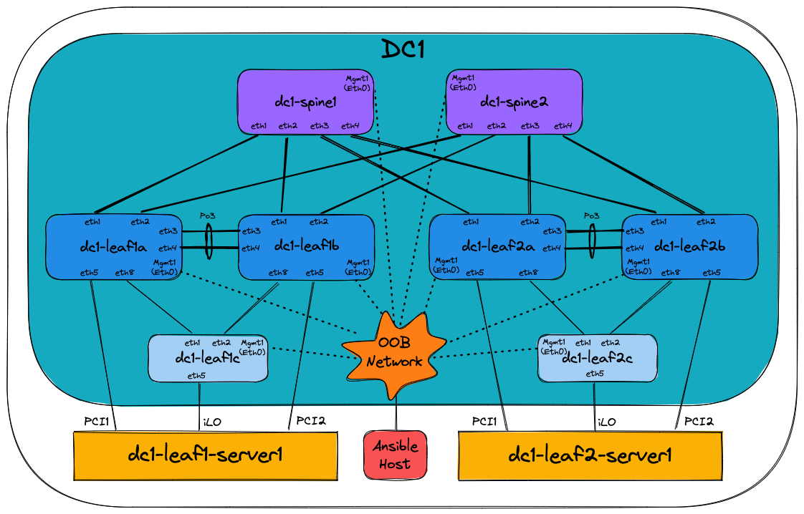
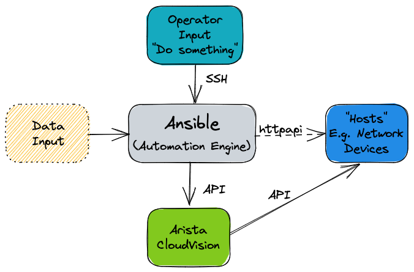
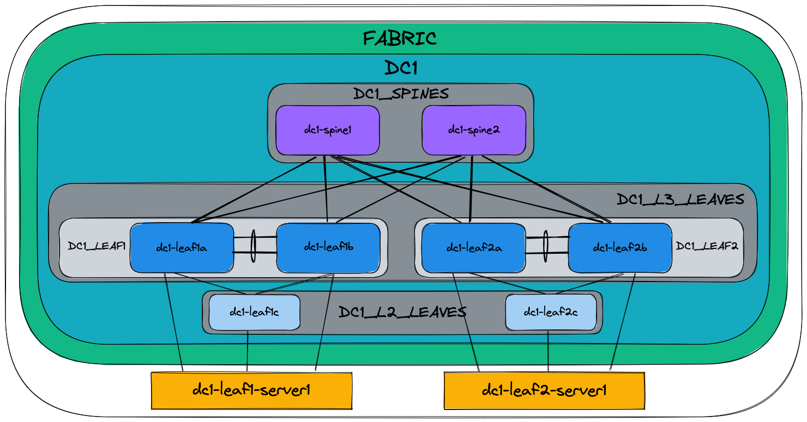
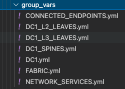

<!--
  ~ Copyright (c) 2023 Arista Networks, Inc.
  ~ Use of this source code is governed by the Apache License 2.0
  ~ that can be found in the LICENSE file.
  -->

# AVD and Ansible Overview

## Day 1 Operation (i.e. provisioning a network from scratch)

Imagine being asked to configure a **layer 3 leaf spine (L3LS)** network from scratch:



Traditionally one would configure the switches manually using a laptop, console cable, and USB key to load the correct EOS software
image and configuration. Of course, the configuration would be manually generated, using snippets from the relevant Arista design guides, or copying/pasting from existing devices. Configurations would have to be manually adapted to each and every device, which is time-consuming and prone to errors. Consider what would happen if a new pair of leaf switches or new VRFs/VLANs are added to the network - changes would need to be made to most of the devices.

Using Arista Validated Designs (AVD), this task is automated, greatly simplified, and made considerably faster. All the basic network configuration is guaranteed to be identical across the entire fabric from day one. No longer do you have to manually inspect each device for errors or differences. AVD will ensure the consistency and accuracy of your configuration not only for initial deployment but for all subsequent network changes.

AVD is also based on best practice from [Arista Design and Deployment Guides](https://www.arista.com/en/solutions/design-guides), meaning you get the full benefit of Arista's experience in deploying large scale leaf spine fabrics. AVD fully integrates with Arista CloudVision, which adds a change control workflow, continuous compliance check, and network topology overview as well as real-time streaming telemetry including flow-based data and more.

## What is Ansible?

The Red Hat® Ansible® Automation Platform is an open source tool, released in 2012 and acquired by Red Hat in 2015. Ansible
is an automation engine that can be used for many purposes including:

- Server software provisioning
- Configuration management
- Application deployment

It's easily extended through the use of Ansible Collections - essentially prepackaged groups of Ansible components such as playbooks, roles, modules and plugins - that are distributed through [Ansible Galaxy](https://galaxy.ansible.com/home).

Between the core Ansible software and third-party-contributed collections, we can use Ansible to carry out almost any
automated task on a network, server, or cloud platform in a consistent, secure, and distributed way.

Consistency of tasks carried out is assured through idempotency - that the outcome of an operation is only performed once and only if necessary, no matter how many times that process is carried out. A simple example of idempotency would be a pair of on/off buttons for a machine - no matter how many times you push 'on,' the device will only turn on once.

Unlike other tools, Ansible doesn't use a proprietary communications mechanism or agent on the device being managed. Instead, it leverages industry-standard protocols for device access, including SSH and REST APIs. This also means that Ansible doesn't require the setup of any unique infrastructure - it's entirely possible to automate tasks using nothing but your laptop or desktop computer (but a central deployment server is recommended).

Ansible describes tasks in a structured language called [YAML](https://yaml.org). Unlike other languages such as
JSON and XML, YAML was designed to be human-readable. YAML will be covered further later on in the section
[How does Ansible work](#how-does-ansible-work).

By now, you can probably appreciate that we can use Ansible to automate many things. This document will focus only on using Ansible to provision Arista EOS devices with or without Arista CloudVision.

## What are the requirements to run Ansible?

Ansible can run on almost anything, but in production scenarios, Ansible is typically deployed on a virtual Linux server, running on the customer's preferred hypervisor. This Ansible server then communicates directly with the Arista network devices via eAPI or Arista CloudVision Portal, which in turn communicates with the Arista network devices. Controlling what Ansible does is typically done using an SSH terminal session to the Ansible server from the Operator's computer.



## What is the arista.avd collection?

[Arista.avd](https://galaxy.ansible.com/arista/avd) is an Ansible collection for Arista Validated Designs. It's maintained by
Arista and accepts third-party contributions on GitHub at [aristanetworks/ansible-avd](https://github.com/aristanetworks/ansible-avd).

While Ansible is the core automation engine, AVD is an Ansible Collection described above. It provides roles, modules, and plugins
that allows the user to generate and deploy best-practice configurations to a layer three leaf-spine network.


The illustration above shows the AVD collection as a box with a red background on the right-hand side.

When designing an EVPN/VXLAN L3LS fabric, you don't need to spend hours reading through the [Arista Design and Deployment Guides](https://www.arista.com/en/solutions/design-guides). Instead, the AVD collection will implement those rules and guidelines.

AVD is an opinionated collection, meaning field experiences and best practices from actual deployments at Arista customers are included. With AVD, users get up and running quickly without inventing every part of the network configuration from scratch. This means the user must provide only the most basic information to get a new fabric up and running.

Parameters which need to be defined by the user include (but aren't limited to):

- Username/password for network devices and CloudVision
- OOB management IP range
- IP scope for link addresses
- IP scope for loopback interfaces
- VLAN and VNI ranges
- Device hostnames
- Autonomous System numbers
- Interface connections between devices
- Which devices are acting in each role, such as spine or leaf.

From the details above, AVD will generate complete EOS configuration files that we can deploy to the devices. AVD also uses the information provided to produce full documentation of the current intended state of the network.

## When and when not to use AVD

It's important to note when and perhaps more importantly, when not to use AVD.

AVD is designed to generate and deploy complete configuration files where the network device's running configuration is entirely replaced. As such, caution should be exercised when running AVD against an existing manually configured network. We can take various approaches under such circumstances:

- Compare AVD-generated configurations against device running configurations; make changes to the AVD input data and iterate until the configurations are functionally equivalent.
- Use AVD to generate partial configurations that we can be apply to devices in such a way that won't destroy existing manual configuration.
- Use AVD to generate configurations part-based on automation, part-based on manual configuration included into AVD using AVD's `structured_configuration`, `raw_eos_cli` or `custom_template` facilities.

Automating the provisioning of network infrastructure makes the most sense when the network is built from repeatable building blocks. These allow for code reuse and the abstraction of data. For example, point-to-point links are allocated IP subnets from a much larger pool in most leaf-spine networks. This is a tedious job for a human to design and configure but is an ideal candidate to be automated. However, automation may take longer to achieve in a network that has evolved rather than been designed from the ground up.

## Change your mindset and culture

Many network engineers prefer to use the CLI for all things networking, like troubleshooting, ad-hoc operational configuration changes, and full-blown greenfield provisioning tasks.

To harvest the full benefit of Ansible and Ansible AVD, you must learn to think differently and change your working methods.

Ansible should be your first choice when changing your network configuration, whether small or big. The CLI should only be used for troubleshooting, i.e., viewing the state of your network or those urgent scenarios at 2 AM where you need to change something particular on just one or two devices, followed by proper configuration cleanup later.

## How does Ansible work?

Before we can tell Ansible to do anything, Ansible needs to know about your network's devices (or hosts).

This is defined in the Ansible ***inventory***. Per the official Ansible documentation, the [inventory](https://docs.ansible.com/ansible/latest/user_guide/intro_inventory.html#inventory-basics-formats-hosts-and-groups) is a file type in either INI or YAML format, but other inventory sources can be used. In Ansible AVD, we use YAML format by default; hence the file is called inventory.yml, located in the Ansible AVD project folder (in this case, `single-dc-l3ls`):


Please note that the example above is taken from the Ansible AVD Examples repository, specifically the `Single-DC-L3LS`.

The exact name of the inventory file isn't important, but is provided to Ansible in the `ansible.cfg` file for the project or as `ansible-playbook -i ./inventory.yml` when later running Ansible.

### Inventories

An example of a snippet of the inventory.yml file is shown below (a subset of an actual file for clarity).

As stated earlier, this file is in [YAML](https://yaml.org) format.

The hostnames specified in the inventory must exist either in DNS or in the hosts file on your Ansible host to allow successful name lookup and be able to reach the switches directly. To test this, you must be able to successfully ping the host, for example, `ping dc1-spine1` from your Ansible host. Alternatively, if there is no DNS available, or if devices need to be reached using a fully qualified domain name (FQDN), define `ansible_host` to be an IP address or FQDN for each device - see dc1-spine1/2 below for an example:

```yaml
---
all:
  children:
    FABRIC:
      children:
        DC1:
          children:
            DC1_SPINES:
              hosts:
                dc1-spine1:
                  ansible_host: 172.16.1.11
                dc1-spine2:
                  ansible_host: 172.16.1.12
```

However, going forward, we expect that all hostnames specified are resolvable hence the entire inventory file looks as follows:

```yaml
---
all:
  children:
    FABRIC:
      children:
        DC1:
          children:
            DC1_SPINES:
              hosts:
                dc1-spine1:
                dc1-spine2:
            DC1_L3_LEAVES:
              hosts:
                dc1-leaf1a:
                dc1-leaf1b:
                dc1-leaf2a:
                dc1-leaf2b:
            DC1_L2_LEAVES:
              hosts:
                dc1-leaf1c:
                dc1-leaf2c:

        NETWORK_SERVICES:
          children:
            DC1_L3_LEAVES:
            DC1_L2_LEAVES:
        CONNECTED_ENDPOINTS:
          children:
            DC1_L3_LEAVES:
            DC1_L2_LEAVES:
```

Don't confuse ***hosts*** with servers or similar. A host can be anything that can be accessed via SSH or an API, to be managed by Ansible, including Arista switches.

The settings inside the inventory.yml file are defined in a tree-like structure using ***groups***. Groups can contain hosts or other groups - making it easier to apply a common configuration to a group of devices.

The ***all*** line at the top is a default group that contains all ***hosts***, i.e., all switches. So don't worry too much about that for now.

The ***children:*** keyword is used to define "groups of groups," i.e., just an internal keyword to differentiate between hosts and groups.

The figure below is just a visualization of the same text file, showing the different grouping and parent/child relationships:



The key takeaway is that configuration defined at a higher (parent) level will be inherited by the children, but if needed, this can be
overridden by specifying it again, i.e., most specific wins.

More information about Ansible inventories can be found [here](https://docs.ansible.com/ansible/latest/user_guide/intro_inventory.html#).

### Organizing host and group variables

AVD makes use of variables defined in the inventory to generate the EOS configuration files necessary to configure the devices. While these
variables can be stored in the main inventory file described earlier, it's highly recommended to use separate files for host and group
variables. Like the inventory.yml file, the host and group variables are also stored in dedicated folders named accordingly in YAML files.

### Group Variables

Group variables are defined in YAML files inside the `group_vars` folder:



Each file in the `group_vars` folder controls the variables for one of the groups defined in the `inventory.yml` file. So, for example, settings for the whole network can be specified in `DC1.yml` and later overridden in `DC1_SPINES.yml` for just the hosts inside that group (DC1 spine switches in this case).

A subset of DC1.yml is shown below:

```yaml
---
# Default gateway used for the management interface
mgmt_gateway: 172.16.1.1

# Spine switch group
spine:
  # Definition of default values that will be configured to all nodes defined in this group
  defaults:
    # Set the relevant platform as each platform has different default values in Ansible AVD
    platform: vEOS-lab
    # Pool of IPv4 addresses to configure interface Loopback0 used for BGP EVPN sessions
    loopback_ipv4_pool: 10.255.1.0/27
    # ASN to be used by BGP
    bgp_as: 65100
    # BGP configuration for fine tuning
    bgp_defaults:
      - distance bgp 20 200 200

  # Definition of nodes contained in this group.
  # Specific configuration of device must take place under the node definition. Each node inherites all values defined under 'defaults'
  nodes:
    # Name of the node to be defined (must be consistent with definition in inventory)
    dc1-spine1:
      # Device ID definition. An integer number used for internal calculations (ie. IPv4 address of the loopback_ipv4_pool among others)
      id: 1
      # Management IP to be assigned to the management interface
      mgmt_ip: 172.16.1.11/24

    dc1-spine2:
      id: 2
      mgmt_ip: 172.16.1.12/24
```

Below is a subset of the FABRIC.yml file:

```yaml
---
# Ansible connectivity definitions
# eAPI connectivity via HTTPS is specified (as opposed to CLI via SSH)
ansible_connection: ansible.netcommon.httpapi
# Specifies that we are indeed using Arista EOS
ansible_network_os: arista.eos.eos
# This user/password must exist on the switches to enable Ansible access
ansible_user: ansible
ansible_password: ansible
# User escalation (to enter enable mode)
ansible_become: true
ansible_become_method: enable
# Use SSL (HTTPS)
ansible_httpapi_use_ssl: true
# Do not try to validate certs
ansible_httpapi_validate_certs: false

# Common AVD group variables
fabric_name: FABRIC

# Local users
local_users:
  # Define a new user, which is called "ansible"
  ansible:
    privilege: 15
    role: network-admin
    # Password set to "ansible". Same string as the device generates when configuring a username.
    sha512_password: $6$7u4j1rkb3VELgcZE$EJt2Qff8kd/TapRoci0XaIZsL4tFzgq1YZBLD9c6f/knXzvcYY0NcMKndZeCv0T268knGKhOEwZAxqKjlMm920
  admin:
    privilege: 15
    role: network-admin
    no_password: true
```

The above snippet defines a number of defaults that apply to all children of FABRIC along with configuration specific to each leaf pair and finally each individual leaf switch.

We can override group variables by specifying host variables for specific devices. (see [DEFAULT_HASH_BEHAVIOUR](https://docs.ansible.com/ansible/latest/reference_appendices/config.html#default-hash-behaviour)). The order of precedence is (from lowest to highest):

- 'All' group (because it's the 'parent' of all other groups).
- Parent group
- Child group
- Host

You can read more about group and host variables [here](https://docs.ansible.com/ansible/latest/user_guide/intro_inventory.html#id14).

### Playbooks

Now that the Ansible inventory is defined, we can tell Ansible what to do on the switches. This is defined in one or more Ansible ***playbooks***.

Like an inventory file, a playbook is a text file written using YAML format containing one or more ***plays***.

Each play is configured to run on a particular host or group of hosts and contains one or more ***tasks***.

Each task calls an Ansible ***role*** or ***module***, such as ***ansible.avd.eos_cli_config_gen***. The tasks in conjunction with the roles or modules they're calling are responsible for performing a particular task or set of tasks.

A playbook runs in order from top to bottom. Within each play, tasks also run in order from top to bottom.

Playbooks with multiple plays can orchestrate multi-machine deployments, running one play on your Ansible development machine, another on your CloudVision instance, and another on each EOS device you look to configure.

At a minimum, each play defines two things:

1. The managed devices (***hosts***) to target, referenced from the ***inventory*** we defined earlier.
2. One or more ***tasks*** to execute on defined targets.

The hosts specified in a playbook typically reference groups defined in the inventory. You can select large or small groups of the inventory from a playbook, right down to individual hosts, to be as specific as possible with any configuration changes.

A simple example of a play defined in a playbook is shown below:

```yaml
---
- name: Run AVD
  hosts: FABRIC
  gather_facts: false
  tasks:
    - name: Generate intended variables
      ansible.builtin.import_role:
        name: arista.avd.eos_designs
    - name: Generate device intended config and documentation
      ansible.builtin.import_role:
        name: arista.avd.eos_cli_config_gen
```

At the top of the file, the ***hosts*** keyword references the inventory group ***FABRIC***.

Recall that the group variables are defined in the inventory.yml file and in the group_vars directory. Effectively this means that the ***hosts*** keyword establishes the scope of devices on which to execute the play.

Following the scope definition, the ***tasks*** are then defined.

In this example, the play executes two tasks:

1. Import a ***role*** called [***arista.avd.eos_designs***](../../roles/eos_designs/README.md).
2. Import a ***role*** called [***arista.avd.eos_cli_config_gen***](../../roles/eos_cli_config_gen/README.md).

The ***arista.avd.eos_designs*** role takes inputs from a number of [places](../../roles/eos_designs/README.md#role-inputs-and-outputs):

- role/defaults definitions
- group_vars
- host_vars

Based on some or all of these inputs, it generates the following output:

- A structured EOS configuration in YAML format.
- Fabric Documentation in Markdown format.
- Leaf and Spine Topology summary in CSV format.

The second role, ***arista.avd.eos_cli_config_gen*** uses the structured EOS configuration in YAML format as its [input](../../roles/eos_cli_config_gen/README.md#role-inputs-and-outputs)
(generated by arista.avd.eos_designs) and outputs the following:

- EOS configuration in CLI format.
- Device Documentation in Markdown format.

Running the play described above would result in several files containing the configuration and documentation for the devices in scope - in this case, DC1_FABRIC. Then, to apply the configuration to the actual devices, you would run additional roles such as:

- [eos_config_deploy_cvp](../../roles/eos_config_deploy_cvp/README.md), which deploys the EOS configuration via the CloudVision Management platform, including change control with RBAC and full rollback capability.
- [eos_config_deploy_eapi](../../roles/eos_config_deploy_eapi/README.md), which deploys the EOS configuration directly to Arista devices using config replace. This option provides no change control and no rollback capability.

While this play shows both the `eos_designs` and `eos_cli_config_gen` roles used together, it's entirely possible to make use of just `eos_cli_config_gen` by itself - this would allow (for example) generation of management configuration that could potentially be merged into an existing network as discussed earlier.

## Source of Truth

In a legacy network where configuration isn't administered centrally, you have very little control of the relationship between the configuration you *intend* to be applied to the network and the configuration *running* on the network. You might have centralized low-level design documents describing how the network should function in great detail, but you don't have much but the best intentions to ensure that your **entire** network is working as you intended. As a result, it takes only a single configuration mistake on a single device to create havoc.

Since operating many networking devices also typically results in having many networking engineers, there is even more room for error. Different people do things differently, and repetitive tasks aren't always executed in the same manner.

With AVD, you define not only the topology of your network centrally but also which services are used where in a central repository of text files. Furthermore, because this data is stored in text files, it's possible to apply version control (for example, using tools like git, subversion, or mercurial) to this source of truth, giving you visibility of when the intended configuration was changed and by who.

This source of truth means you have a complete overview of your entire designed network configuration without having to look at individual network devices. An additional benefit of AVD is that by design, you always have a backup of your network configuration. Including automated documentation in markdown format, you no longer have to remember to update documentation about which interface is connected to which device, etc., whenever you change something on a device. Instead, it's all done automatically based on the configuration built and applied to the network devices by Ansible every time you execute the playbooks.

Below you will find two examples of documentation automatically created by Ansible AVD:

- [Documentation for L3LS fabric](../../examples/single-dc-l3ls/documentation/fabric/FABRIC-documentation.md)
- [A single leaf inside the fabric above](../../examples/single-dc-l3ls/documentation/devices/dc1-leaf1a.md)

## How do I use AVD?

AVD comes with pre-built templates that you can either use as-is or adapt to your liking.

Once the templates reflect your desired network configuration, you deploy the configuration either directly to the Arista EOS devices or to
Configlets within CloudVision. This is typically executed from the CLI - for example, from your Ansible AVD Examples directory.

### Using Ansible AVD with direct eAPI connectivity to the switches

If you want to push to switches in the entire fabric using eAPI and your playbook looks as follows:

```yaml
---
- name: Run AVD
  hosts: FABRIC
  gather_facts: false
  tasks:
    - name: Generate intended variables
      ansible.builtin.import_role:
        name: arista.avd.eos_designs
    - name: Generate device intended config and documentation
      ansible.builtin.import_role:
        name: arista.avd.eos_cli_config_gen
    - name: Deploy configuration to device
      ansible.builtin.import_role:
         name: arista.avd.eos_config_deploy_eapi
```

You would execute it using the following command if your playbook is called `playbook.yml`:

```shell
ansible-playbook playbook.yml
```

This will:

- Create a text file containing the device's entire configuration.
- Create device-specific and fabric-wide documentation.
- Push the relevant configuration to each device using eAPI.

### Using Ansible AVD in conjunction with CloudVision

If you want to push to switches in the entire fabric using CloudVision and your playbook looks as follows:

```yaml
---
- name: Run AVD
  hosts: FABRIC
  gather_facts: false
  tasks:
    - name: Generate intended variables
      ansible.builtin.import_role:
        name: arista.avd.eos_designs
    - name: Generate device intended config and documentation
      ansible.builtin.import_role:
        name: arista.avd.eos_cli_config_gen
    - name: Deploy configuration to device
      ansible.builtin.import_role:
         name: arista.avd.eos_config_deploy_eapi

- name: Push to CVP
  hosts: CVP
  gather_facts: false
  connection: local

  tasks:
    - name: Run CVP provisioning
      ansible.builtin.import_role:
        name: arista.avd.eos_config_deploy_cvp
      vars:
        container_root: 'DC1'
        configlets_prefix: 'AVD'
        execute_tasks: false
        state: present
```

You would execute it using the same command:

```shell
ansible-playbook playbook.yml
```

This will:

- Create a CloudVision Configlet for each device in the inventory, containing the device's entire configuration.
- Build out containers within CloudVision that represent the hierarchy of groups in the inventory.
- Create tasks to apply the new configuration to each device within the inventory.

At this point, the changes can be reviewed, approved, and executed following existing company requirements through CloudVision.

Once the configuration has been deployed, automated validation of the designed configuration versus the running configuration can be executed using the included `eos_validate_state` role to ensure that:

- All links are operational and cabled as desired.
- BGP adjacencies are operational.
- There are no device hardware issues (for example, PSU or fan).
- That VTEPs can all reach each other using their loopback IPs.

This quickly identifies any issues that we could otherwise overlook. For example, a redundant link could sit non-operational for months unless cumbersome manual testing is executed per device throughout the fabric.

## Day 2 Operations

Day 2 operations describe most, if not all, network configuration changes that occur after the initial configuration.

These tasks, while relatively simple, can be time-consuming simply because they involve changes to multiple devices:

- Adding/removing new leaf switches.
- Adding/removing new VLANs.
- Creating/modifying/deleting port profiles.
- Configuring/modifying ports towards end systems.

Making these changes could involve many hours of planning to generate configuration snippets to apply during a change window.

Alternatively, we can easily apply a configuration change to the YAML inventory/group_vars files - for example, this change could
create a new VLAN and deploy this VLAN to a subset of switches.

Once the inventory files have been updated, we can rerun the playbooks to generate new configuration files that will replace the
configuration files running on the devices in the same way as the initial configuration.

### Day 2 Operations Example

Let's imagine that you want to create a new tenant in your existing fabric. This would require at least the following configuration:

- VRFs
- VLANs
- SVIs

You could create a YAML file, in this example called NETWORK_SERVICES.yml, describing the fabric-wide generic configuration for the tenant:

```yaml
---
tenants:
  # Definition of tenants. Additional level of abstraction to VRFs
  TENANT1:
    # Number used to generate the VNI of each VLAN by adding the VLAN number in this tenant.
    mac_vrf_vni_base: 10000
    vrfs:
      # VRF definitions inside the tenant.
      VRF1:
        # VRF VNI definition.
        vrf_vni: 1
        svis:
          # SVI definitions.
          "11":
            # SVI Description
            name: VRF1_VLAN11
            enabled: true
            # IP anycast gateway to be used in the SVI in every leaf.
            ip_address_virtual: 10.10.11.1/24
          "12":
            name: VRF1_VLAN12
            enabled: true
            ip_address_virtual: 10.10.12.1/24
      VRF2:
        vrf_vni: 2
        svis:
          "21":
            name: VRF2_VLAN21
            enabled: true
            ip_address_virtual: 10.10.21.1/24
          "22":
            name: VRF2_VLAN22
            enabled: true
            ip_address_virtual: 10.10.22.1/24

    l2vlans:
      # These are pure L2 vlans. They do not have a SVI defined in the l3leafs and they will be bridged inside the VXLAN fabric
      "3401":
        name: L2_VLAN3401
      "3402":
        name: L2_VLAN3402

```

You would then describe the scope for where these network services should exist in the inventory.yml file:

```yaml
NETWORK_SERVICES:
  children:
    DC1_L3_LEAVES:
    DC1_L2_LEAVES:
    DC2_L3_LEAVES:
    DC2_L2_LEAVES:
```

This specifies all switches in the fabric will be able to serve the new tenant.

For the sake of simplicity, let's say you defined just one pair of leaf switches that would serve this tenant.

After running the relevant playbook, their tenant-related configuration would end up looking like this:

```shell
vlan 11
   name VRF1_VLAN11
!
vlan 12
   name VRF1_VLAN12
!
vlan 21
   name VRF2_VLAN21
!
vlan 22
   name VRF2_VLAN22
!
<removed for brevity>
!
vlan 3401
   name L2_VLAN3401
!
vlan 3402
   name L2_VLAN3402
!
<removed for brevity>
!
vrf instance VRF1
!
vrf instance VRF2
!
<removed for brevity>
!
interface Vlan11
   description VRF1_VLAN11
   no shutdown
   vrf VRF1
   ip address virtual 10.10.11.1/24
!
interface Vlan12
   description VRF1_VLAN12
   no shutdown
   vrf VRF1
   ip address virtual 10.10.12.1/24
!
interface Vlan21
   description VRF2_VLAN21
   no shutdown
   vrf VRF2
   ip address virtual 10.10.21.1/24
!
interface Vlan22
   description VRF2_VLAN22
   no shutdown
   vrf VRF2
   ip address virtual 10.10.22.1/24
!
<removed for brevity>
!
interface Vxlan1
   description dc1-leaf1a_VTEP
   vxlan source-interface Loopback1
   vxlan virtual-router encapsulation mac-address mlag-system-id
   vxlan udp-port 4789
   vxlan vlan 11 vni 10011
   vxlan vlan 12 vni 10012
   vxlan vlan 21 vni 10021
   vxlan vlan 22 vni 10022
   vxlan vlan 3401 vni 13401
   vxlan vlan 3402 vni 13402
   vxlan vrf VRF1 vni 1
   vxlan vrf VRF2 vni 2
!
<removed for brevity>
!
ip routing vrf VRF1
ip routing vrf VRF2
!
<removed for brevity>
!
router bgp 65101
   !
   <removed for brevity>
   !
   vlan 11
      rd 10.255.1.33:10011
      route-target both 10011:10011
      redistribute learned
   !
   vlan 12
      rd 10.255.1.33:10012
      route-target both 10012:10012
      redistribute learned
   !
   vlan 21
      rd 10.255.1.33:10021
      route-target both 10021:10021
      redistribute learned
   !
   vlan 22
      rd 10.255.1.33:10022
      route-target both 10022:10022
      redistribute learned
   !
   vlan 3401
      rd 10.255.1.33:13401
      route-target both 13401:13401
      redistribute learned
   !
   vlan 3402
      rd 10.255.1.33:13402
      route-target both 13402:13402
      redistribute learned
   !
   <removed for brevity>
   !
   vrf VRF1
      rd 10.255.1.33:1
      route-target import evpn 1:1
      route-target export evpn 1:1
      router-id 10.255.1.33
      neighbor 10.255.1.97 peer group MLAG-IPv4-UNDERLAY-PEER
      redistribute connected
   !
   vrf VRF2
      rd 10.255.1.33:2
      route-target import evpn 2:2
      route-target export evpn 2:2
      router-id 10.255.1.33
      neighbor 10.255.1.97 peer group MLAG-IPv4-UNDERLAY-PEER
      redistribute connected
```

This takes place without manual intervention and with very little chance for human error.

## References

Below are a number of links to additional documentation about Ansible AVD and Ansible in general:

- [Role documentation for eos_design](../../roles/eos_designs/README.md)
- [Role documentation for eos_cli_config_gen](../../roles/eos_cli_config_gen/README.md)
- [RedHat Ansible Tower Documentation](https://docs.ansible.com/ansible/latest/reference_appendices/tower.html)
- [Role documentation for eos_config_deploy_cvp](../../roles/eos_config_deploy_cvp/README.md) / [eos_config_deploy_eapi](../../roles/eos_config_deploy_eapi/README.md)

## Next steps

If you want to try out a complete Ansible AVD example, complete with all group variable files, inventory, playbook etc., please look in the Examples section.
