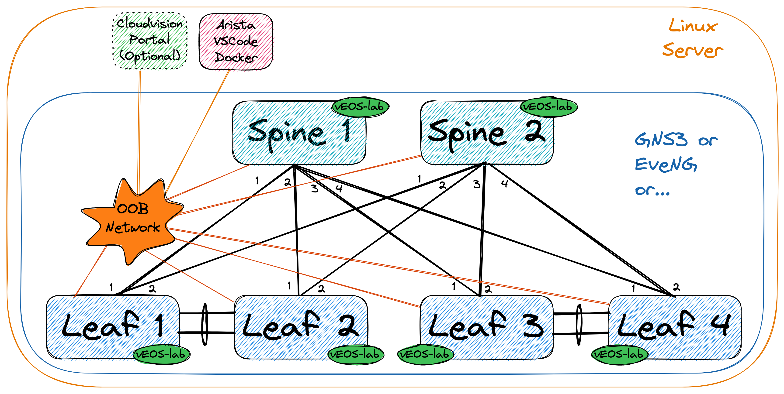
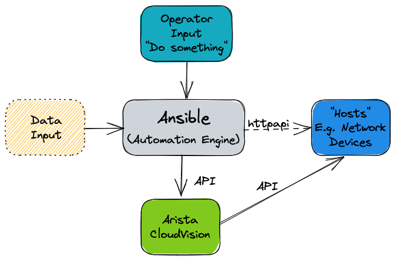
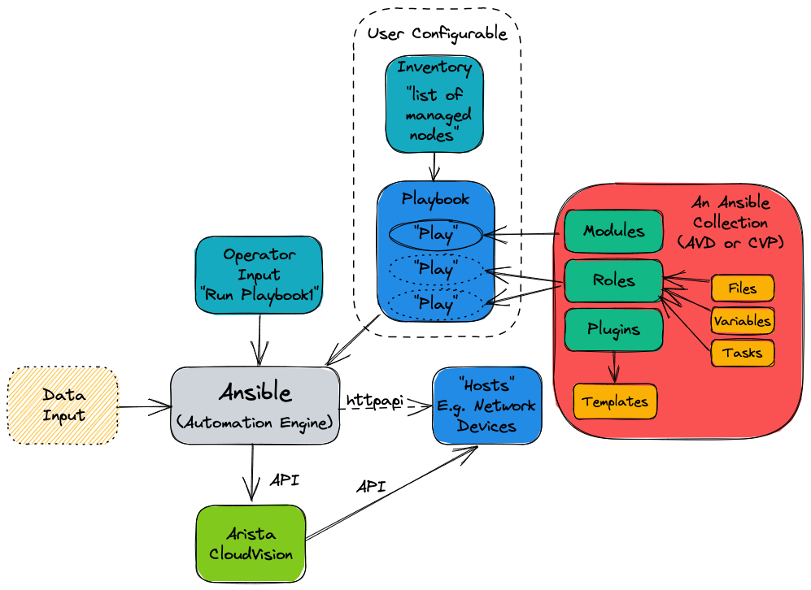
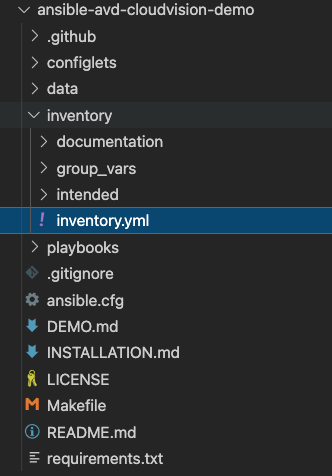
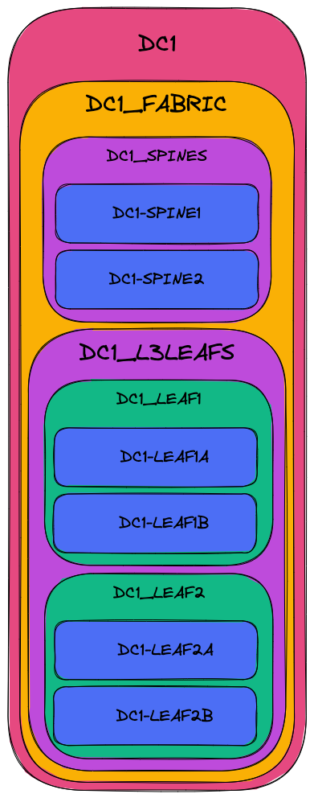
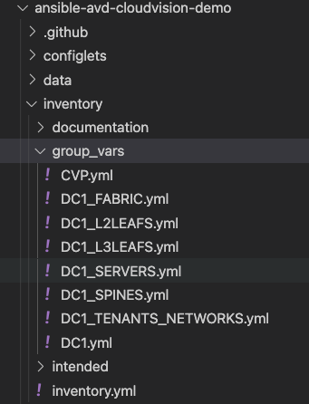

# Table of Contents <!-- omit in toc -->

- [AVD and Ansible Overview](#avd-and-ansible-overview)
  - [Day 1 Operation (i.e. provisioning a network from scratch)](#day-1-operation-ie-provisioning-a-network-from-scratch)
  - [What is Ansible?](#what-is-ansible)
  - [What are the requirements to run Ansible?](#what-are-the-requirements-to-run-ansible)
  - [What is the arista.avd collection?](#what-is-the-aristaavd-collection)
  - [When and when not to use AVD](#when-and-when-not-to-use-avd)
  - [Change your mindset and culture](#change-your-mindset-and-culture)
  - [How does Ansible work?](#how-does-ansible-work)
    - [Inventories](#inventories)
    - [Organizing host and group variables](#organizing-host-and-group-variables)
    - [Group Variables](#group-variables)
    - [Playbooks](#playbooks)
  - [Source of Truth](#source-of-truth)
  - [How do I use AVD?](#how-do-i-use-avd)
  - [Day 2 Operations](#day-2-operations)
    - [Day 2 Operations Example](#day-2-operations-example)
  - [References](#references)

# AVD and Ansible Overview

## Day 1 Operation (i.e. provisioning a network from scratch)

Imagine being asked to configure a layer 3 leaf spine (L3LS) network from scratch:



Traditionally one would configure the switches manually using a laptop, console cable and USB key to load the correct EOS software
image and configuration. Of course the configuration would be manually generated too, using snippets from the relevant Arista
design guides, or copying/pasting from existing devices. Configurations would have to be manually adapted to each and every device,
which is time-consuming and very likely to lead to errors. Also consider what would happen if a new pair of leaf switches or new
VRFs/VLANs are added to the network - changes would need to be made to most of the devices in the network.

Using Arista Validated Designs (AVD), this task is automated, greatly simplified and made considerably faster. All the basic
network configuration is guaranteed to be identical across the entire fabric from day one. No longer do you have to manually
inspect each and every device for errors or differences; AVD will ensure the consistency and accuracy of your configuration not
only for initial deployment, but for all subsequent network changes.

AVD is also based on best practice from
[Arista Design and Deployment Guides](https://www.arista.com/en/solutions/design-guides), meaning you get the full benefit of
Arista's experience in deploying large scale leaf spine fabrics. AVD also fully integrates with Arista CloudVision, which adds
a full change control workflow, continuous compliance check and network topology overview as well as real time streaming telemetry
including flow-based data and more.

## What is Ansible?

The Red Hat® Ansible® Automation Platform is an open source tool, released in 2012 and acquired by Red Hat in 2015. Ansible
is an automation engine that can be used for many purposes including:

- Server software provisioning
- Configuration management
- Application deployment

It is easily extended through the use of Ansible Collections - essentially prepackaged groups of Ansible components such as
playbooks,roles, modules and plugins - that are distributed through [Ansible Galaxy](https://galaxy.ansible.com/home).

Between the core Ansible software and third-party-contributed collections, Ansible can be used to carry out almost any
automated task on network, server or cloud platforms in a consistent, secure and and distributed way.

Consistency of tasks carried out is assured through the idea of idempotency - that the outcome of an operation is only
performed once and only if necessary, no matter how many times that operation is carried out. A very simple example of
idempotency would be a pair of on/off buttons for a machine - no matter how many times you push 'on', the machine will
only turn on once.

Unlike other tools, Ansible doesn't make use of a proprietary communications mechanism or agent on the device being managed.
Instead it leverages industry-standard protocols for device access including SSH and REST APIs. This also means that
Ansible doesn't require setup of any special infrastructure - it's entirely possible to automate tasks using nothing but
your laptop or desktop computer (but a central deployment server is recommended).

Tasks in Ansible are described in a structured language known as [YAML](https://yaml.org). Unlike other languages such as
JSON and XML, YAML was designed to be human-readable. YAML will be covered further later on in the section
[How does Ansible work](#how-does-ansible-work).

By now you can probably appreciate that Ansible can be used to automate many things. In this document, we will only focus
on using Ansible to provision Arista EOS devices either with or without Arista CloudVision.

## What are the requirements to run Ansible?

Ansible can run on almost anything, but in production scenarios Ansible is typically deployed on a virtual Linux server,
running on the customer's preferred hypervisor. This Ansible server then communicates either directly with the
Arista network devices via eAPI or with Arista CloudVision Portal, which in turn communicates with the Arista network devices.
Controlling what Ansible does is typically done using an SSH terminal session to the Ansible server from the Operator's computer.



## What is the arista.avd collection?

[Arista.avd](https://galaxy.ansible.com/arista/avd) is an Ansible collection for Arista Validated Designs. It is maintained by
Arista and accepts third-party contributions on GitHub at [aristanetworks/ansible-avd](https://github.com/aristanetworks/ansible-avd).

While Ansible is the core automation engine, AVD is an Ansible Collection as described above. It provides roles, modules and plugins
that allow the user to generate and deploy best-practice configurations to a layer 3 leaf spine network.



In the illustration above, the AVD collection is shown as the box with the red background on the right hand side.

When designing an EVPN/VXLAN layer 3 leaf spine (L3LS) fabric you don't need to spend hours reading through the
[Arista Design and Deployment Guides](https://www.arista.com/en/solutions/design-guides). All those rules and guidelines are
implemented as part of the AVD collection.

AVD is an opinionated collection, meaning that field experiences and best practices from actual deployments at Arista customers
are included. With AVD, users get up and running quickly without having to invent every part of the network configuration
from scratch. This means only the most basic information must be provided by the user to get a new fabric up and running.

Parameters which need to be defined by the user include (but are not limited to):

- Username/password for network devices and CloudVision
- OOB management IP range
- IP scope for link addresses
- IP scope for loopback interfaces
- VLAN and VNI ranges
- Device hostnames
- Autonomous System numbers
- Interface connections between devices
- Which devices are acting in each role, such as spine or leaf.

From the details provided above, AVD will generate complete EOS configuration files that can be deployed to the devices.
AVD also uses the information provided to produce complete documentation of the current intended state of the network.

## When and when not to use AVD

It's important to note when and perhaps more importantly when not to use AVD.

AVD is designed to generate and deploy complete configuration files in a manner where the network device's running-configuration is
completely replaced. As such, caution should be exercised when running AVD against an existing manually-configured network. Various
approaches can be taken under such circumstances:

- Compare AVD-generated configurations against device running-configurations; make changes to the AVD input data and iterate
  until the configurations are functionally equivalent.
- Use AVD to generate partial configurations that can be applied to devices in such a way that they will not destroy existing
  manual configuration.
- Use AVD to generate configurations part-based on automation, part-based on manual configuration included into AVD using AVD's
  `structured_configuration`, `raw_eos_cli` or `custom_template` facilities.

Automating provisioning of network infrastructure makes most sense when the network is built from repeatable building blocks.
These allow for code reuse and abstraction of data. For example in most leaf spine networks, point-to-point links are
allocated IP subnets from a much larger pool. This is a tedious job for a human to design and configure, but is an ideal
candidate to be automated. However in a network that has evolved rather than been designed from the ground up, automation
may take longer to achieve.

## Change your mindset and culture

Many network engineers prefer to use the CLI for all things networking, like troubleshooting, ad-hoc operational configuration changes
and full blown greenfield provisioning tasks.

To harvest the full benefit of Ansible and Ansible AVD,
you must learn to think differently and change your ways of working.

Ansible should be your first choice when changing your network configuration,
be it small or big. The CLI should only be used for troubleshooting i.e. viewing the state of your network,
or those urgent scenarios at 2am where you need to change something very specific on just one or two devices
followed by proper configuration cleanup later.

## How does Ansible work?

Before we can tell Ansible to do anything, Ansible needs to know about the devices (or as Ansible calls them, hosts) in your network.

This is defined in the Ansible ***inventory***. Per the official Ansible documentation the [inventory](https://docs.ansible.com/ansible/latest/user_guide/intro_inventory.html#inventory-basics-formats-hosts-and-groups)
is a file typically in either INI or YAML format, but other inventory sources can be used. In Ansible AVD we use YAML format by default,
hence the file is called inventory.yml, located in a folder that is also called inventory:



Please note that the example above is taken from the [ansible-avd-cloudvision-demo](https://github.com/arista-netdevops-community/ansible-avd-cloudvision-demo) repository.

The exact name of the inventory file is not important, but is provided to Ansible in the `ansible.cfg` file for the project
or as `ansible-playbook -i ./inventory.yml` when later running Ansible.

### Inventories

An example of a snippet of the inventory.yml file is shown below (subset of an actual file for clarity).

As stated earlier this file is in [YAML](https://yaml.org) format.

Also note that the IP addresses shown below are only an example of the management IP addresses for the different devices.
These can of course be adapted to fit any topology.

```yaml
all:
  children:
    # DC1_Fabric - EVPN Fabric
    DC1:
      children:
        DC1_FABRIC:
          children:
            DC1_SPINES:
              hosts:
                DC1-SPINE1:
                  ansible_host: 10.255.0.11
                DC1-SPINE2:
                  ansible_host: 10.255.0.12
            DC1_L3LEAFS:
              children:
                DC1_LEAF1:
                  hosts:
                    DC1-LEAF1A:
                      ansible_host: 10.255.0.13
                    DC1-LEAF1B:
                      ansible_host: 10.255.0.14
                DC1_LEAF2:
                  hosts:
                    DC1-LEAF2A:
                      ansible_host: 10.255.0.15
                    DC1-LEAF2B:
                      ansible_host: 10.255.0.16
```

Don't confuse ***hosts*** with servers or similar. A host can be anything that can be accessed via SSH or an API, to be managed by Ansible,
including Arista switches.

The settings inside the inventory.yml file are defined in a tree-like structure using ***groups***. Groups can contain hosts or other groups -
making it easier to apply common configuration to a group of devices.

The ***all*** line at the top is a default group that contains all ***hosts*** i.e. all switches. Don't worry too much about that for now.

The ***children:*** keyword is used to define "groups of groups" i.e. just an internal keyword to differentiate between hosts and groups.

The multi-colored figure below is just a visualization of the same text file, showing the different grouping and parent/child relationships:



The key takeaway is that configuration defined at a higher (parent) level will be inherited by the children, but if needed, this can be
overridden by specifying it again, i.e. most specific wins.

More information about Ansible inventories can be found [here](https://docs.ansible.com/ansible/latest/user_guide/intro_inventory.html#).

### Organizing host and group variables

AVD makes use of variables defined in the inventory to generate the EOS configuration files necessary to configure the devices. While these
variables can be stored in the main inventory file described earlier, it is highly recommended to use separate files for host and group
variables. Like the inventory.yml file, the host and group variables are also stored in YAML files in dedicated folders named accordingly.

### Group Variables

Group variables are defined in YAML files inside the `group_vars` folder:



Please note that the example above is taken from the [ansible-avd-cloudvision-demo](https://github.com/arista-netdevops-community/ansible-avd-cloudvision-demo) repository.

Each file in the `group_vars` folder controls the variables for one of the groups defined in the `inventory.yml` file,
so settings for the whole network can be specified in `DC1.yml`, and later overridden in `DC1_SPINES.yml` for just the hosts
inside that group (DC1 spine switches in this case).

A subset of DC1.yml is shown below:

```yaml
# local users
local_users:
  admin:
    privilege: 15
    role: network-admin
    sha512_password: "<password-hash>"

  cvpadmin:
    privilege: 15
    role: network-admin
    sha512_password: "<password-hash>"

  ansible:
    privilege: 15
    role: network-admin
    sha512_password: "<password-hash>"

# Cloud Vision server information
cvp_instance_ip: <CVP IP address>
cvp_ingestauth_key: '<key>'

# OOB Management network default gateway.
mgmt_gateway: <IP of default gateway>

# dns servers.
name_servers:
  - <IP of name server #1>
  - <IP of name server #2>
```

Below is a subset of the DC1_FABRIC file:

```yaml
l3leaf:
  defaults:
    # virtual router mac for VNIs assigned to Leaf switches
    # format: xx:xx:xx:xx:xx:xx
    virtual_router_mac_address: 00:1c:73:00:dc:01
    platform: vEOS-LAB
    bgp_as: 65100
    spines: [DC1-SPINE1, DC1-SPINE2]
    uplink_to_spine_interfaces: [Ethernet1, Ethernet2]
    mlag_interfaces: [Ethernet3, Ethernet4]
    spanning_tree_priority: 409
    spanning_tree_mode: mstp
  node_groups:
    DC1_LEAF1:
      bgp_as: 65101
      nodes:
        DC1-LEAF1A:
          id: 1
          mgmt_ip: 10.255.0.13/24
          spine_interfaces: [Ethernet1, Ethernet1]
        DC1-LEAF1B:
          id: 2
          mgmt_ip: 10.255.0.14/24
          spine_interfaces: [Ethernet2, Ethernet2]
    DC1_LEAF2:
      bgp_as: 65102
      nodes:
        DC1-LEAF2A:
          id: 3
          mgmt_ip: 10.255.0.15/24
          spine_interfaces: [Ethernet3, Ethernet3]
        DC1-LEAF2B:
          id: 4
          mgmt_ip: 10.255.0.16/24
          spine_interfaces: [Ethernet4, Ethernet4]
```

The above snippet defines a number of defaults that apply to all children of DC1_FABRIC along with configuration specific to
each leaf pair and finally each individual leaf switch.

Group variables can be overridden by specifying host variables for specific devices.
(See [DEFAULT_HASH_BEHAVIOUR](https://docs.ansible.com/ansible/latest/reference_appendices/config.html#default-hash-behaviour)).
The order of precedence is (from lowest to highest):

- 'All' group (because it is the 'parent' of all other groups)
- Parent group
- Child group
- Host

You can read more about group and host variables [here](https://docs.ansible.com/ansible/latest/user_guide/intro_inventory.html#id14).

### Playbooks

Now that the Ansible inventory is defined, we can tell Ansible what to do on the switches.
This is defined in one or more Ansible ***playbooks***.

A playbook, like an inventory file, is a text file written using YAML format and it contains one or more ***plays***.

Each play is configured to run on a particular host or group of hosts and contains one or more ***tasks***.

Each task calls an Ansible ***role*** or ***module***, such as ***ansible.avd.eos_cli_config_gen***. The tasks in
conjunction with the roles or modules they are calling are responsible for performing a particular task or set of tasks.

A playbook runs in order from top to bottom. Within each play, tasks also run in order from top to bottom.

Playbooks with multiple plays can orchestrate multi-machine deployments, running one play on your Ansible development machine,
another on your CloudVision instance, and another on each EOS device you look to configure.

At a minimum, each play defines two things:
1. The managed devices (***hosts***) to target, referenced from the ***inventory*** we defined earlier
2. One or more ***tasks*** to execute on the targets defined

The hosts specified in a playbook typically reference groups defined in the inventory. From a playbook you can select
large or small groups of the inventory, right down to individual hosts to be as specific as possible with any configuration changes.

A simple example of a play defined in a playbook is shown below:

```yaml
# Play to build EOS configuration from EOS_DESIGNS
- hosts: DC1_FABRIC
  tasks:
    # BUILD EOS configuration
    - name: generate intended variables
      import_role:
         name: arista.avd.eos_designs
    - name: generate device intended config and documentation
      import_role:
         name: arista.avd.eos_cli_config_gen
```

At the top of the file, the ***hosts*** keyword references the inventory group ***DC1_FABRIC***.

Recall that the group variables are defined in the inventory.yml file and further in the group_vars directory.
Effectively this means that the ***hosts*** keyword defines the scope of devices on which to execute the play.

Following the scope definition, the ***tasks*** are then defined.

In this example the play executes two tasks:
1. Import a ***role*** called [***arista.avd.eos_designs***](https://avd.sh/en/latest/roles/eos_designs/index.html)
2. Import a ***role*** called [***arista.avd.eos_cli_config_gen***](https://avd.sh/en/latest/roles/eos_cli_config_gen/index.html)

The ***arista.avd.eos_designs*** role takes inputs from a number of [places](https://avd.sh/en/latest/roles/eos_designs/index.html#role-inputs-and-outputs):
- role/defaults definitions
- group_vars
- host_vars

Based on some or all of these inputs, it generates the following output:
- A structured EOS configuration in YAML format
- Fabric Documentation in Markdown format
- Leaf and Spine Topology summary in CSV format

The second role, ***arista.avd.eos_cli_config_gen*** uses the structured EOS configuration in YAML format as its [input](https://avd.sh/en/latest/roles/eos_cli_config_gen/index.html#role-inputs-and-outputs)
(generated by arista.avd.eos_designs) and outputs the following:
- EOS configuration in CLI format
- Device Documentation in Markdown format

Running the play described above would result in a number of files containing the configuration and documentation for the devices in scope - in this case DC1_FABRIC.
To apply the configuration to the actual devices, you would run additional roles such as:
- [eos_config_deploy_cvp](https://avd.sh/en/latest/roles/eos_config_deploy_cvp/index.html) which deploys the EOS configuration via the
  CloudVision Management platform, including change control with RBAC and full rollback capability.
- [eos_config_deploy_eapi](https://avd.sh/en/latest/roles/eos_config_deploy_eapi/index.html) which deploys the EOS configuration directly
  to Arista devices using config replace. This option provides no change control and no rollback capability.

While this play shows both the `eos_designs` and `eos_cli_config_gen` roles used together, it is entirely possible to make use of just
`eos_cli_config_gen` by itself - this would allow (for example) generation of management configuration that could potentially be merged
into an existing network as discussed earlier.

## Source of Truth

In a legacy network where configuration is not administered centrally, you have very little control of the relationship between the configuration
you *intend* to be applied to the network, and the configuration actually *running* on the network. You might have centralized low level design
documents describing in great detail how exactly the network should function, but you don't have much but best intentions to ensure that your
**entire** network is working as you intended. It takes only a single configuration mistake on a single device to create havoc.

Since operating many networking devices also typically result in having many networking engineers, there is even more room for error.
Different people do things differently and repetitive tasks are not always executed in the exact same manner.

With AVD, you define not only the topology of your network centrally, but also which services are used where in a central repository
of text files. Because this data is stored in text files, it is possible to apply version control (for example using tools like git, subversion
or mercurial) to this source of truth, giving you visibility of when the intended configuration was changed and by who.

This source of truth means you have a full overview of your entire designed network configuration without having to look at individual network devices.
An additional benefit of AVD is that by design you always have a backup of your network configuration including automated documentation in markdown format,
No longer do you have to remember to update documentation about which interface is connected to which device etc.,
whenever you change something on a device. It's all done automatically based on the configuration built and applied to the network devices by Ansible,
every time you execute the playbooks.

Below you will find two examples of documentation automatically created by Ansible AVD:

- [5 stage CLOS fabric across two Data Centers](../../molecule/eos_designs-twodc-5stage-clos/documentation/fabric/TWODC_5STAGE_CLOS-documentation.md)
- [A single leaf inside the fabric above](../../molecule/eos_designs-twodc-5stage-clos/documentation/devices/DC1-POD1-L2LEAF1A.md)

## How do I use AVD?

AVD comes with pre-built templates that you can either use as-is or adapt to your liking. For example
[ansible-avd-cloudvision-demo](https://github.com/arista-netdevops-community/ansible-avd-cloudvision-demo) is a 3-stage leaf spine fabric
that can be deployed CloudVision.

Once the templates reflect your desired network configuration, you deploy the configuration either directly to the Arista EOS devices or to
Configlets within CloudVision. This is typically executed from the CLI - for example:

```shell
ansible-playbook playbooks/dc1-fabric-deploy-cvp.yml --tags build
```

This will execute the playbook `playbooks/dc1-fabric-deploy-cvp.yml` with the tag `build`. This instructs Ansible to only run the tasks tagged 'build'
in the playbook - which in this case will result in configuration files being generated but not deployed to devices.

To push the configuration to devices using CloudVision:

```shell
ansible-playbook playbooks/dc1-fabric-deploy-cvp.yml --tags provision
```

This will:
- Create a CloudVision Configlet for each device in the inventory, containing the device's entire configuration.
- Build out containers within CloudVision that represent the hierarchy of groups represented in the inventory.
- Create tasks to apply the new configuration to each device within the inventory.

At this point the changes can be reviewed, approved and executed in accordance with existing company requirements through CloudVision.

The equivalent workflow is also possible with eAPI - albeit without the review and approval stages provided through CloudVision.

Once the configuration has been deployed, an automated validation of the designed configuration versus the running configuration can be executed using the included `eos_validate_state` role, to ensure that:

- All links are operational and cabled as desired
- BGP adjacencies are operational
- That there are no device hardware issues (for example PSU or fan issues)
- That VTEPs can all reach each other using their loopback IPs.

This quickly identifies any issues that could otherwise be overlooked and a redundant link could sit non-operational for months unless cumbersome manual testing is executed again per-device throughout the fabric.

## Day 2 Operations

The term day 2 operations describes most, if not all network configuration changes that occur after the initial configuration.

These tasks, while relatively simple, can be time consuming simply because they involve changes to many device:

- Adding/removing new leaf switches
- Adding/removing new VLANs
- Creating/modifying/deleting port profiles
- Configuring/modifying ports towards end systems

Making these changes could involve many hours of planning to generate configuration snippets to apply during a change window.

Alternatively a configuration change can easily be applied to the YAML inventory/group_vars files - for example this change could
create a new VLAN and deploy this VLAN to a subset of switches.

Once the inventory files have been updated, the playbooks can be run again to generate new configuration files that will replace the
configuration files running on the devices in exactly the same way as the initial configuration.

### Day 2 Operations Example

Let's imagine that you want to create a new tenant in your existing fabric.
This would require at least the following configuration:

- VRF(s)
- VLAN(s)
- SVI(s)

You could create a YAML file, in this example called DC1_TENANTS_NETWORKS.yml, describing the fabric-wide generic configuration for the tenant:

```yaml
# DC1 Tenants Networks
# Documentation of Tenant specific information - Vlans/VRFs
tenants:
  # Tenant A Specific Information - VRFs / VLANs
  Tenant_A:
    mac_vrf_vni_base: 10000
    vrfs:
      Tenant_A_OP_Zone:
        vrf_vni: 10
        vtep_diagnostic:
          loopback: 100
          loopback_ip_range: 10.255.1.0/24
        svis:
          110:
            name: Tenant_A_OP_Zone_1
            tags: [opzone]
            enabled: true
            ip_address_virtual: 10.1.10.1/24
          111:
            vni_override: 50111
            name: Tenant_A_OP_Zone_2
            tags: [opzone]
            enabled: true
            ip_address_virtual: 10.1.11.1/24
          112:
            vni_override: 50112
            name: Tenant_A_OP_Zone_3
            tags: [opzone]
            enabled: true
            ip_address_virtual: 10.1.12.254/24
```

You would then describe the scope for where this new tenant should exist in the inventory.yml file:

```yaml
  node_groups:
    DC1-P101-L2LS1:
      filter:
        tenants: [ Tenant_A ]
        tags: [ opzone ]
```

This specifies that switch DC1-P101-L2LS1 will only be configured with VLANs/SVIs in Tenant_A that are tagged with 'opzone'.

For sake of simplicity, let's say you defined just one pair of leaf switches that would serve this tenant.

After running the relevant playbook, their tenant-related configuration would end up looking like this:

```eos
vlan 110
   name Tenant_A_OP_Zone_1
!
vlan 111
   name Tenant_A_OP_Zone_2
!
vlan 112
   name Tenant_A_OP_Zone_3
!
vrf instance Tenant_A_OP_Zone
!
interface Loopback100
   description Tenant_A_OP_Zone_VTEP_DIAGNOSTICS
   no shutdown
   vrf Tenant_A_OP_Zone
   ip address 10.255.1.3/32
!
interface Vlan110
   description Tenant_A_OP_Zone_1
   no shutdown
   vrf Tenant_A_OP_Zone
   ip address virtual 10.1.10.1/24
!
interface Vlan111
   description Tenant_A_OP_Zone_2
   no shutdown
   vrf Tenant_A_OP_Zone
   ip address virtual 10.1.11.1/24
!
interface Vlan112
   description Tenant_A_OP_Zone_3
   no shutdown
   vrf Tenant_A_OP_Zone
   ip address virtual 10.1.12.254/24
!
interface Vxlan1
   vxlan vlan 110 vni 10110
   vxlan vlan 111 vni 50111
   vxlan vlan 112 vni 50112
   vxlan vrf Tenant_A_OP_Zone vni 10
```

If at a later date this tenant needs to be made available on other devices in the network simply expanding the scope of the devices where Tenant_A exists.
This would result in similar configuration being generated for those devices as well.

This all takes place without any manual intervention and with very little chance for human error.

## References

Below are a number of links to additional documentation about Ansible AVD and Ansible in general:

- With [eos_design](../../roles/eos_cli_config_gen)
- With [eos_cli_config_gen](../../roles/eos_cli_config_gen)
- With [Ansible Tower](https://docs.ansible.com/ansible/2.3/tower.html)
- With CI/CD
- With [eos_config_deploy_cvp](../../roles/eos_config_deploy_cvp) / [eos_config_deploy_eapi](../../roles/eos_config_deploy_eapi)
