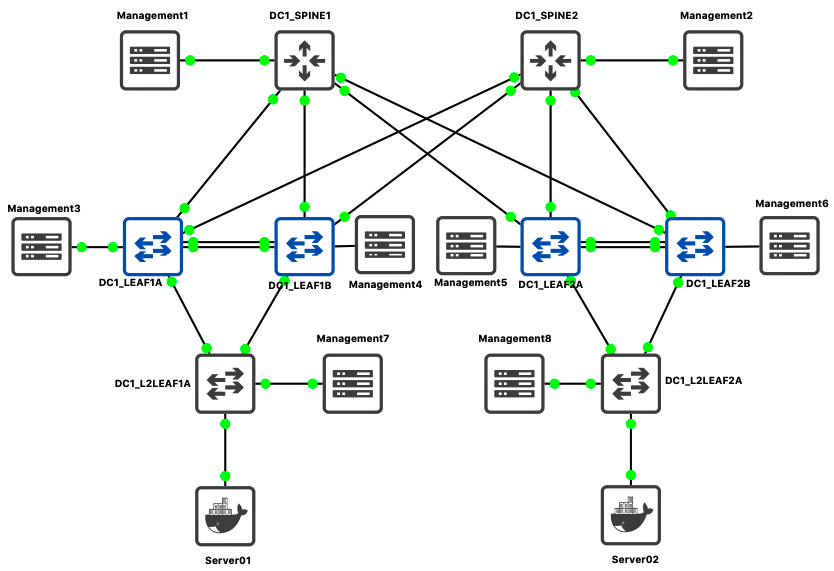
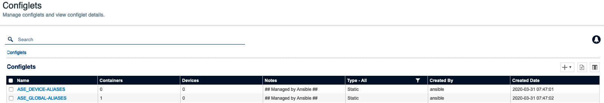
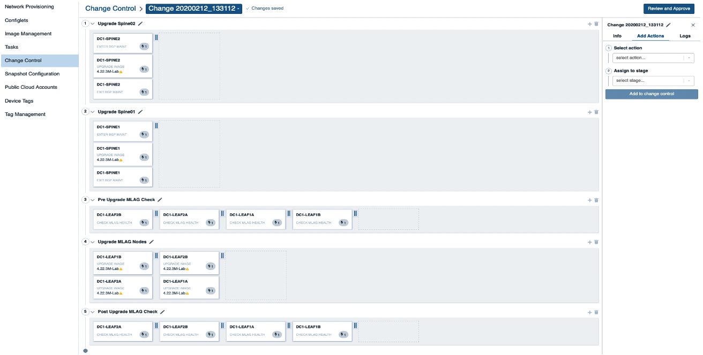

This document explain how to customize demo information and how to setup this environment. A complete git repository is available and can be used as a support to this how-to document.

__Demo repository:__ [arista-netdevops-community/ansible-avd-cloudvision-demo](https://github.com/arista-netdevops-community/ansible-avd-cloudvision-demo)

## Installation Process

### Demonstration requirements

#### Components

- A cloudVision server running version `>= 2018.2.5`
- A network topology:
    - Demo is based on a 2 spines / 4 leafs running on GNS3 but should also be configured on EVE-NG platform.
    - Any physical or virtual topology with oob connected to CVP should work.
- A python environmentwith CloudVision access.



#### IP Address management

- ___CloudVision IP address___:
    - Cluster interface: eth0 / Should use your own IP address
    - Device interface: eth1 / `10.255.0.1/24`
- ___Management Network___: `10.255.0.0/24`
    - _DC1-SPINE1_: `10.255.0.11/24`
    - _DC1-SPINE2_: `10.255.0.12/24`
    - _DC1-LEAF1A_: `10.255.0.13/24`
    - _DC1-LEAF1B_: `10.255.0.14/24`
    - _DC1-LEAF2A_: `10.255.0.15/24`
    - _DC1-LEAF2B_: `10.255.0.16/24`
    - _DC1-L2LEAF1A_: `10.255.0.17/24`
    - _DC1-L2LEAF2B_: `10.255.0.18/24`
- ___Default Username & Password___:
    - admin / arista123
    - cvpdamin / arista123
    - ansible / ansible
- ___Servers configuration___:
    - Server 01: eth0 / `10.1.10.11/24`
    - Server 02: eth0 / `10.1.10.12/24`

This management IP addresses are used in a private virtual-network between CloudVision and Arista EOS devices.

### Configure Python environment

Please refer to [__installation page__](../installation/setup-environement.md) to configure AVD and CVP collection.

### Configure DHCP server on CloudVision

In this scenario, we use CloudVision (CV) as ZTP server to provision devices and register them onto CV.

Once you get mac-address of your switches, edit file `/etc/dhcp/dhcpd.conf` in CloudVision. In this scenario, CV use following address to connect to devices: `10.255.0.1`

If CVP has not been configured to activate ZTP services, it is higly recommended to follow [these steps](https://www.arista.com/en/cg-cv/cv-dhcp-service-for-zero-touch-provisioning-ztp-setup)

#### Ansible playbook approach

An ansible playbook is available to configure CloudVision to act as a DHCP server for your lab:

- Edit variables in __`inventory/group_vars/CVP.yml`__

```yaml
vars:
ztp:
  default:
    registration: 'http://10.255.0.1/ztp/bootstrap'
    gateway: 10.255.0.3
    nameservers:
      - '10.255.0.3'
  general:
    subnets:
      - network: 10.255.0.0
        netmask: 255.255.255.0
        gateway: 10.255.0.3
        nameservers:
          - '10.255.0.3'
        start: 10.255.0.200
        end: 10.255.0.250
        lease_time: 300
  clients:
    - name: DC1-SPINE1
      mac: "0c:1d:c0:1d:62:01"
      ip4: 10.255.0.11
```

> Please ensure to use quote to define your mac-address. Otherwise in some cases, ansible might consider them as HEX string.

- Edit information related to ztp host in __`inventory/inventory.yml`__

```yaml
all:
  children:
    CVP:
      hosts:
        ztp:
          ansible_host: 10.83.28.164
          ansible_user: root
          ansible_password: ansible
        cvp:
          ansible_httpapi_host: 10.83.28.164
          ansible_host: 10.83.28.164
          ansible_user: ansible
          ansible_password: ansible
[...]
          ansible_httpapi_port: 443
          # Configuration to get Virtual Env information
          ansible_python_interpreter: $(which python)
```

- Run playbook:

```shell
$ ansible-playbook playbooks/dc1-ztp-configuration.yml

PLAY [Configure ZTP service on CloudVision] *****************

TASK [ztp-setup : Generate DHCPd configuration file] ********
ok: [ztp]

TASK [ztp-setup : Check & activate DHCP service on ztp] *****
ok: [ztp]

TASK [ztp-setup : Restart DHCP service on ztp] **************
changed: [ztp]

PLAY RECAP **************************************************
ztp                        : ok=3    changed=1    unreachable=0    failed=0    skipped=0    rescued=0    ignored=0
```

#### Manual approach

On your DHCP server, create configuration for all your devices. Below is an example for isc-dhcpd server.

```shell
$ vi /etc/dhcp/dhcpd.conf

subnet 10.255.0.0 netmask 255.255.255.0 {
    range 10.255.0.200 10.255.0.250;
    option routers 10.255.0.1;
    option domain-name-servers 10.83.28.52, 10.83.29.222;
    option bootfile-name "http://10.255.0.1/ztp/bootstrap";
}

host DC1-SPINE1 {
    option host-name "DC1-SPINE1";
    hardware ethernet 0c:1d:c0:1d:62:01;
    fixed-address 10.255.0.11;
    option bootfile-name "http://10.255.0.1/ztp/bootstrap";
}

[...]

```

> Be sure to update ethernet address to match MAC addresses configured on your switches.

Then, restart your DHCP server:

```shell
$ service dhcpd restart
```

From here, you can start your devices and let CVP register them into `undefined` container.

### Update Inventory

In the __`inventory/inventory.yml`__, update CloudVision information to target your own setup:

```yaml
# inventory.yml
all:
  children:
    CVP:
      hosts:
        ztp:
          ansible_host: 10.83.28.164
          ansible_user: root
          ansible_password: ansible
        cvp:
          ansible_httpapi_host: 10.83.28.164
          ansible_host: 10.83.28.164
          ansible_user: ansible
          ansible_password: ansible
[...]
          ansible_httpapi_port: 443
          # Configuration to get Virtual Env information
          ansible_python_interpreter: $(which python)
```

Because Ansible will never connect to devices, there is no reason to configure IP address for EOS devices in inventory file.

### Update Fabric information

> If you do not change IP addresses described above, this section is optional.

__Edit `DC1_FABRIC.yml`__

- Add / Remove devices in the list.
- Management IP of every device.

In this example, we only use `spine` and `l3leafs` devices. Below is an example for `l3leafs`:

```yaml
  node_groups:
    DC1_LEAF1:
      bgp_as: 65101
      nodes:
        DC1-LEAF1A:
          id: 1
          mgmt_ip: 10.255.0.13/24
          spine_interfaces: [ Ethernet1, Ethernet1 ]
        DC1-LEAF1B:
          id: 2
          mgmt_ip: 10.255.0.14/24
          spine_interfaces: [ Ethernet2, Ethernet2 ]
```

You can also configure additional configlets available on Cloudvision to deploy additional configuration not generated by AVD project. These configlets **MUST** already be configured on CV side prior to run playbook.

```yaml
# List of additional CVP configlets to bind to devices and containers
# Configlets MUST be configured on CVP before running AVD playbooks.
cv_configlets:
  containers:
    DC1_L3LEAFS:
      - ASE_GLOBAL-ALIASES
  devices:
    DC1-L2LEAF1A:
      - ASE_DEVICE-ALIASES.conf
```

__Edit `DC1.yml`__

- Manage your username. Configured username and password are:
  - admin / arista123
  - cvpdamin / arista123
  - ansible / ansible

```yaml
# local users
local_users:
  admin:
    privilege: 15
    role: network-admin
    sha512_password: "$6$Df86..."
```

You must use same user on CVP and EOS for the demo.

- Update Ingest key. Default setup is none.
- Update CVP IP address.

```yaml
# Cloud Vision server information
cvp_instance_ip: 10.255.0.1
cvp_ingestauth_key: ''
```

## Demo script

### Power up devices

Power up your devices what ever the solution is. You will see them in the __`undefined`__ container


#### Check there is no container


#### Check Configlets are not present


> CloudVision might have some configlets, but none with AVD related content.

### Upload custom configlets to Cloudvision.

These configlets are managed outside of AVD project and can provide additional elements not generated by Arista Validated Design. In this example, we upload a configlet with a list of useful aliases.

```shell
$ ansible-playbook playbooks/dc1-upload-configlets.yml
...
```



### Run Ansible playbook to rollout EVPN Fabric

A set of tags are available, but it is recommended to execute playbook in a row:

#### Playbook overview

Playbook: [`playbooks/dc1-fabric-deploy-cvp.yml`](https://github.com/arista-netdevops-community/ansible-avd-cloudvision-demo/blob/master/playbooks/dc1-fabric-deploy-cvp.yml)

Playbook manage following actions:

- Generate Variables for CVP structure:
  - List of configlets
  - Containers topology
  - List of devices.
- Collect CloudVision Facts
- Deploy Configlets to CloudVision
- Build Containers Topology
- Configure devices with correct configlet and container.
- Execute created tasks (wait 5 minutes while devices reboot)

This playbook supports 2 tags to run demo step by step:

- __build__: Generate configuration.
- __provision__: Push content to CloudVision.

#### Run Playbook

##### Generate EOS Configuration

Use tag `build` to only generate

- [EOS structured configuration(YAML)](https://github.com/arista-netdevops-community/ansible-avd-cloudvision-demo/tree/master/inventory/intended/structured_configs)
- [EOS configuration](https://github.com/arista-netdevops-community/ansible-avd-cloudvision-demo/tree/master/inventory/intended/configs)
- [EOS Documentation](https://github.com/arista-netdevops-community/ansible-avd-cloudvision-demo/tree/master/inventory/documentation/)
- [CloudVision parameters](https://github.com/arista-netdevops-community/ansible-avd-cloudvision-demo/tree/master/inventory/intended/structured_configs/cvp/cv_server.yml)

```shell
# Deploy EVPN/VXLAN Fabric
$ ansible-playbook playbooks/dc1-fabric-deploy-cvp.yml --tags build

TASK [eos_l3ls_evpn : Include device structured configuration, that was previously generated.]
ok: [DC1-SPINE1 -> localhost]
ok: [DC1-SPINE2 -> localhost]
ok: [DC1-LEAF1A -> localhost]
ok: [DC1-LEAF1B -> localhost]
ok: [DC1-LEAF2A -> localhost]
ok: [DC1-LEAF2B -> localhost]

TASK [eos_l3ls_evpn : Generate EVPN fabric documentation in Markdown Format.]
changed: [DC1-SPINE1 -> localhost]

TASK [eos_l3ls_evpn : Generate Leaf and Spine Point-To-Point Links summary in csv format.]
changed: [DC1-SPINE1 -> localhost]

TASK [eos_l3ls_evpn : Generate Fabric Topology in csv format.]
changed: [DC1-SPINE1 -> localhost]

TASK [eos_cli_config_gen : include device intended structure configuration variables]
ok: [DC1-SPINE1 -> localhost]
ok: [DC1-SPINE2 -> localhost]
ok: [DC1-LEAF1A -> localhost]
ok: [DC1-LEAF1B -> localhost]
ok: [DC1-LEAF2A -> localhost]
ok: [DC1-LEAF2B -> localhost]

TASK [eos_cli_config_gen : Generate eos intended configuration]
ok: [DC1-LEAF2A -> localhost]
ok: [DC1-SPINE1 -> localhost]
ok: [DC1-LEAF1A -> localhost]
ok: [DC1-LEAF2B -> localhost]
ok: [DC1-SPINE2 -> localhost]
ok: [DC1-LEAF1B -> localhost]

TASK [eos_cli_config_gen : Generate device documentation]
changed: [DC1-SPINE1 -> localhost]
changed: [DC1-LEAF1A -> localhost]
changed: [DC1-LEAF2A -> localhost]
changed: [DC1-SPINE2 -> localhost]
changed: [DC1-LEAF1B -> localhost]
changed: [DC1-LEAF2B -> localhost]

PLAY [Configuration deployment with CVP]

TASK [eos_config_deploy_cvp : generate intented variables]
ok: [cv_server]

TASK [eos_config_deploy_cvp : Build DEVICES and CONTAINER definition for cv_server]
changed: [cv_server -> localhost]

TASK [eos_config_deploy_cvp : Load CVP device information for cv_server]
ok: [cv_server]

PLAY RECAP
DC1-LEAF1A                 : ok=5    changed=1    unreachable=0    failed=0 ...
DC1-LEAF1B                 : ok=5    changed=1    unreachable=0    failed=0 ...
DC1-LEAF2A                 : ok=5    changed=1    unreachable=0    failed=0 ...
DC1-LEAF2B                 : ok=5    changed=1    unreachable=0    failed=0 ...
DC1-SPINE1                 : ok=8    changed=4    unreachable=0    failed=0 ...
DC1-SPINE2                 : ok=5    changed=1    unreachable=0    failed=0 ...
cv_server                  : ok=3    changed=1    unreachable=0    failed=0 ...
```

All outputs are part of following folders:

- Intended YAML configuration: __`inventory/intended/structured_configs`__
- Intended EOS configuration files: __`inventory/intended/configs`__
- Documentation: __`inventory/documentation`__

##### Provision CloudVision Server

Use tag `provision` to deploy configuration to CloudVision and prepare devices to be updated:

- Create configlets on CloudVision servers
- Create containers on CloudVision using inventory structure
- Move devices to containers
- Attach configlets to devices.

This tag does not execute any pending tasks. It is a manual action that can be done with a Change Control.
If you want to automatically deploy, just use `execute_tasks: True` in `eos_config_deploy_cvp` role.

```shell
# Deploy EVPN/VXLAN Fabric
$ ansible-playbook playbooks/dc1-fabric-deploy-cvp.yml --tags provision
```

##### Execute Pending tasks using a change control

Go to _Provisioning > Change Control_ to create a new change control



This change control is an example and you are free to build structure you want. In this scenario, all tasks can be run in parallel as we just rollout an EVPN/VXLAN fabric.

## Analyze result

Once devices rebooted, you can review fabric status on devices themselfs or on on CloudVision as well.

#### Topology Update

Topology has been updated accordingly


#### Configlet list

A set of new configlets have been configured on CloudVision and attached to devices


#### Check device status

To validate deployment, connect to devices and issue some commands:

#### BGP Status

```shell
DC1-LEAF1B#show bgp evpn summary
BGP summary information for VRF default
Router identifier 192.168.255.4, local AS number 65101
Neighbor         V  AS           MsgRcvd   MsgSent  InQ OutQ  Up/Down State   PfxRcd PfxAcc
  192.168.255.1    4  65001             56        66    0    0 00:00:36 Estab   86     86
  192.168.255.2    4  65001             55        39    0    0 00:00:44 Estab   86     86
```

#### VXLAN address table

```shell
DC1-LEAF1B#show vxlan  address-table
          Vxlan Mac Address Table
----------------------------------------------------------------------

VLAN  Mac Address     Type     Prt  VTEP             Moves   Last Move
----  -----------     ----     ---  ----             -----   ---------
1191  0e1d.c07f.d96c  EVPN     Vx1  192.168.254.5    1       0:00:04 ago
1192  0e1d.c07f.d96c  EVPN     Vx1  192.168.254.5    1       0:00:02 ago
1193  0e1d.c07f.d96c  EVPN     Vx1  192.168.254.5    1       0:00:04 ago
1194  0e1d.c07f.d96c  EVPN     Vx1  192.168.254.5    1       0:00:02 ago
1195  0e1d.c07f.d96c  EVPN     Vx1  192.168.254.5    1       0:00:02 ago
1196  0e1d.c07f.d96c  EVPN     Vx1  192.168.254.5    1       0:00:02 ago
1197  0e1d.c07f.d96c  EVPN     Vx1  192.168.254.5    1       0:00:04 ago
1198  0e1d.c07f.d96c  EVPN     Vx1  192.168.254.5    1       0:00:04 ago
1199  0e1d.c07f.d96c  EVPN     Vx1  192.168.254.5    1       0:00:02 ago
Total Remote Mac Addresses for this criterion: 9
```

#### Check device connectivity

Connect on server 01 and issue a ping to server 02.

```shell
root@Server01:~# ping 10.1.10.12 -c 5
PING 10.1.10.12 (10.1.10.12) 56(84) bytes of ../_media.
64 bytes from 10.1.10.12: icmp_seq=1 ttl=64 time=0.033 ms
64 bytes from 10.1.10.12: icmp_seq=2 ttl=64 time=0.026 ms
64 bytes from 10.1.10.12: icmp_seq=3 ttl=64 time=0.021 ms
64 bytes from 10.1.10.12: icmp_seq=4 ttl=64 time=0.026 ms
64 bytes from 10.1.10.12: icmp_seq=5 ttl=64 time=0.034 ms

--- 10.1.10.12 ping statistics ---
5 packets transmitted, 5 received, 0% packet loss, time 3998ms
rtt min/avg/max/mdev = 0.021/0.028/0.034/0.004 ms
```

### Revert topology

Once demo is over, you can revert to previous stage:

- Reset devices to ZTP mode (Only devices part of the demo)
- Remove configlet deployed previously
- Remove dedicated container topology
- Reboot devices

Playbook: [`dc1-fabric-reset-cvp.yml`](https://github.com/arista-netdevops-community/ansible-avd-cloudvision-demo/blob/master/playbooks/dc1-fabric-reset-cvp.yml)

```shell
# Reset EVPN/VXLAN Fabric tp ZTP
$ ansible-playbook playbooks/dc1-fabric-reset-cvp.yml
```

> Revert will reset all devices to Factory default and ZTP mode !
