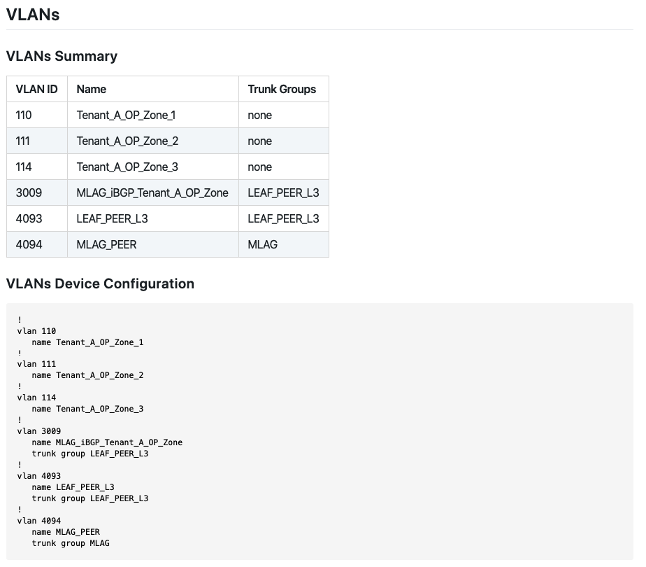

# How-To build your first AVD project

## Abstract

This page explains how to build your first Ansible project leveraging ansible-avd collection. In this tutorial, we will configure an EVPN fabric using Arista eAPI method.


In this post, we will go through all configuration steps to generate [EVPN/VXLAN configuration](https://www.arista.com/custom_data/downloads/?f=/support/download/DesignGuides/EVPN_Deployment_Guide.pdf) for EOS devices.

You can organize your work in many different ways, but a structure we find useful is something like this:

- A folder for all your inventories with one sub-folder per inventory. An inventory folder contains all your variables for a given environment like `host_vars`, `group_vars`, `inventory.yml`
- A folder to store all playbooks. So it is easy to reuse playbooks whatever the inventory is (if you use a coherent syntax)
- ansible.cfg at the root of this repository

```shell
$ tree -L 3 -d
.
├── inventories
│   └── eapi-example
│       ├── group_vars
│       ├── host_vars
│       └── inventory.yml
└── playbooks
```

## Requirements

- Ansible runner configured as described in [this section](../installation/collection-installation.md)
- A set of devices configured with their respective management IP address and username.
- Access to eAPI service for all devices.

## Topology

Here is a high-level overview of the topology


## Configure Variables

### Inventory file

Let's list our devices in the inventory:

- `AVD_FABRIC` represents complete fabric topology that we are going to configure with AVD.
- `AVD_SPINES` is a group where all spine devices belong to.
- `AVD_L3LEAFS`: is a group to locate all VTEP devices (LEAFs running EVPN/VXLAN). As part of this group, we create one sub-group for every LEAF (single or MLAG) as highlighted below.
  - `AVD_LEAF1` represent LEAF for POD01 and it is for an MLAG pair.
  - `AVD_LEAF3` represent a single LEAF outside of MLAG.
- `AVD_L2LEAFS` represent the Aggregation layer in our current design. This layer is optional, but in our design, it is in place. It works like `AVD_L3LEAFS` group but for all layer2 leafs.
- `AVD_TENANTS_NETWORKS` is a special group hosting 2 groups already configured: `AVD_L{2|3}LEAFS`. This group will configure VNI/VLAN across the fabric, so we want to make leafs part of the configuration.
- `AVD_SERVERS` has similar behavior to the previous group. Its goal is to configure downlinks to compute nodes.

```yaml
# vim inventories/eapi-example/inventory.yml
---
AVD:
  children:
    AVD_FABRIC:
      children:
        AVD_SPINES:
          hosts:
            AVD-SPINE1:
              ansible_host: 10.73.254.1
[... output truncated ...]
        AVD_L3LEAFS:
          children:
            AVD_LEAF1:
              hosts:
                AVD-LEAF1A:
                  ansible_host: 10.73.254.11
                AVD-LEAF1B:
                  ansible_host: 10.73.254.12
            AVD_LEAF3:
              hosts:
                AVD-LEAF3A:
                  ansible_host: 10.73.254.17
[... output truncated ...]
        AVD_L2LEAFS:
          children:
            AVD_L2LEAF1:
              hosts:
                AVD-AGG01:
                  ansible_host: 10.73.254.21
[... output truncated ...]
    AVD_TENANTS_NETWORKS:
      children:
        AVD_L3LEAFS:
        AVD_L2LEAFS:
    AVD_SERVERS:
      children:
        AVD_L3LEAFS:
        AVD_L2LEAFS:
```

The management address of all devices can be defined in the inventory.yml file with the knob `ansible_host` as shown above. This is completely optional unless if we wanted to make an ssh connection to these hosts from our local device or a Jump-host. In this lab, as we are going to use eAPI to configure the hosts, the ansible_host must be defined.

Because a Jump-host will be used in this lab, we will need to configure the `ansible_port` variable to set the port number for eAPI connection. To establish ssh connection from Jump-host to all switches we need to set the ssh login credentials by setting `ansible_user` and `ansible_ssh_pass`. The Ansible learns the Network platform of the hosts through `ansible_network_os`.

Because of the Ansible's flexibility, there are a number of ways to define the connection parameters of the hosts. One of the simplest and recommended method is shown below:

```yaml
---
AVD:
  children:
    AVD_FABRIC:
[... output truncated ...]
  vars:
    ansible_user: < your username >
    ansible_ssh_pass: < password >
    ansible_network_os: eos
    # Configure privilege escalation
    ansible_become: true
    ansible_become_method: enable
    # HTTPAPI configuration
    ansible_connection: httpapi
    ansible_httpapi_port: 443
    ansible_httpapi_use_ssl: true
    ansible_httpapi_validate_certs: false
```

### AVD Variables

Based on the inventory we created in the previous section, it is time to create `group_vars`.

#### Generic Fabric Information

All the documentation is available here, but below is a short example. All this configuration will be configured on all devices.

```yaml
# vim inventories/eapi-example/group_vars/AVD.yml
---
# local users
local_users:
  # Username with no password configured
  admin:
    privilege: 15
    role: network-admin
    no_password: true

  # Username with a password
  demo:
    privilege: 15
    role: network-admin
    sha512_password: "< Provide SHA512 HASH for password >"

# OOB Management network default gateway.
mgmt_interface: Management1
mgmt_gateway: 10.73.254.253
mgmt_destination_networks:
  - 10.255.2.0/24
  - 10.255.3.0/24
  - 0.0.0.0/0

# dns servers.
name_servers:
  - 1.1.1.1
  - 8.8.8.8

# NTP Servers IP or DNS name, first NTP server will be preferred, and sourced from Management VRF
ntp:
  servers:
  - name: uk.pool.ntp.org
    preferred: true
    vrf: MGMT
  - name: fr.pool.ntp.org
    vrf: MGMT
```

#### Configure Fabric topology

Fabric topology is configured under `inventories/eapi-example/group_vars/AVD_FABRIC.yml`, which is a file that covers `AVD_FABRIC` group we defined in the [inventory](#inventory-file). This file contains all the base information to create the initial configuration:

You can also refer to the [__Arista Validated Design__ documentation](https://github.com/aristanetworks/ansible-avd/blob/devel/ansible_collections/arista/avd/roles/eos_designs/README.md#fabric-topology-variables) to get a description of every single option available.

Then, you have to describe devices for each role. Don't forget to set management IP here.

- Spine devices

```yaml
# Spine Switches
spine:
  defaults:
    platform: VEOS-LAB
    bgp_as: 65001
    # Overlay loopback IP and same pool can be assigned to both spine and l3leaf switches
    # If same loopback pool is defined for both spine and l3leaf,
    # < loopback_ipv4_offset > must be set in either one of the node_types
    loopback_ipv4_pool: 192.168.255.0/24
    # Recommended for vEOS
    bgp_defaults:
      - 'no bgp default ipv4-unicast'
      - 'distance bgp 20 200 200'
      - 'graceful-restart restart-time 300'
      - 'graceful-restart'
  nodes:
    AVD-SPINE1:
      id: 1
      mgmt_ip: 10.255.0.11/24
    AVD-SPINE2:
      id: 2
      mgmt_ip: 10.255.0.12/24
```

- VTEP or L3LEAF devices

```yaml
l3leaf:
  defaults:
    platform: VEOS-LAB
    virtual_router_mac_address: 00:1c:73:00:dc:01
    # VTEP VXLAN Tunnel source loopback IP for leaf switches, assigned in /32s
    # Assign range larger than total leaf switches
    vtep_loopback_ipv4_pool: 192.168.254.0/24
    loopback_ipv4_pool: 192.168.255.0/24
    # Offset must be >= number of spines
    loopback_ipv4_offset: 2
    # Point to Point Network Summary range, assigned as /31 for each
    # uplink interfaces
    # Assign range larger than total [spines * total potential leafs * 2]
    uplink_ipv4_pool: 172.31.255.0/24
    uplink_switches: [AVD-SPINE1, AVD-SPINE2]
    uplink_interfaces: [Ethernet1, Ethernet2]
    mlag_interfaces: [Ethernet3, Ethernet4]
    # mlag pair IP assignment - assign blocks - Assign range larger than
    # total spines + total leafs switches
    mlag_peer_ipv4_pool: 10.255.252.0/24
    mlag_peer_l3_ipv4_pool: 10.255.251.0/24
[... output truncated ...]
  node_groups:
    AVD_LEAF1:
      bgp_as: 65101
      nodes:
        AVD-LEAF1A:
          id: 1
          mgmt_ip: 10.255.0.13/24
          # Interface configured on SPINES to connect to this leaf
          uplink_switch_interfaces: [Ethernet1, Ethernet1]
        AVD-LEAF1B:
          id: 2
          mgmt_ip: 10.255.0.14/24
          # Interface configured on SPINES to connect to this leaf
          uplink_switch_interfaces: [Ethernet2, Ethernet2]
[... output truncated ...]
```

Complete documentation of all available variables is available in the [__Arista Validated Design documentation__](../../roles/eos_designs/README.md). You can also look at the [variables part of the demo repo](https://github.com/arista-netdevops-community/ansible-avd-cloudvision-demo/blob/master/inventory/group_vars/DC1_FABRIC.yml).

#### Configure device type

In each variable file, related to a type of device, we have to instruct AVD what is the role of that device(s).

```yaml
---
type: spine     # Must be either spine | l3leaf | l2leaf
```

### Configure VNI/VLAN across the Fabric

AVD supports a mechanism to create VLANs and VNIs and enable traffic forwarding in your overlay. In the current version, only the following designs are supported:

- L2 VLANs
- Symmetric IRB model

The model defines a set of tenants (user-defined) where you can configure VRF or `l2vlans` or a mix of them. Let's take a look at how we configure such services.

All these configurations shall be configured in a file `AVD_TENANTS_NETWORKS.yml`

#### L2 Services

Configure a pure L2 service using `EVPN route type 2` only:

```yaml
---
tenants:
  # Tenant B Specific Information - Pure L2 tenant
  Tenant_B:
    mac_vrf_vni_base: 20000
    l2vlans:
      201:
        name: 'B-ELAN-201'
        tags: [DC1]
```

Tag option allows to configure VLAN only on a subset of the fabric: all devices with this tag will be configured with this VLAN. To configure device `TAGS` and `TENANTS` options, go to [__Arista Validated Design__ documentation](../../roles/eos_designs/README.md#fabric-topology-variables)

In this configuration, VLAN will be created with a tag of `201` and its attached VNI will be configured with `20201`

```eos
AVD-LEAF1A#show vlan 201
VLAN  Name                             Status    Ports
----- -------------------------------- --------- -------------------------------
201   B-ELAN-201                       active    Po3, Po5, Vx1


AVD-LEAF1A#show bgp evpn vni 20201
BGP routing table information for VRF default
Router identifier 192.168.255.3, local AS number 65101
Route status codes: s - suppressed, * - valid, > - active, # - not installed, E - ECMP head, e - ECMP
                    S - Stale, c - Contributing to ECMP, b - backup
                    % - Pending BGP convergence
Origin codes: i - IGP, e - EGP, ? - incomplete
AS Path Attributes: Or-ID - Originator ID, C-LST - Cluster List, LL Nexthop - Link Local Nexthop

         Network                Next Hop              Metric  LocPref Weight  Path
 * >     RD: 192.168.255.3:20201 mac-ip 20201 5001.0011.0000
                                -                     -       -       0       i
 * >     RD: 192.168.255.3:20201 imet 20201 192.168.254.3
                                -                     -       -       0       i
 * >Ec   RD: 192.168.255.5:20201 imet 20201 192.168.254.5
                                192.168.254.5         -       100     0       65001 65102 i
[... output truncated ...]
```

#### Symmetric IRB model

To configure symmetric IRB model, use the following structure:

```yaml
tenants:
  # Tenant A Specific Information - VRFs / VLANs
  Tenant_A:
    mac_vrf_vni_base: 10000
    vrfs:
      TENANT_A_PROJECT01:
        vrf_vni: 11
        svis:
          110:
            name: 'PR01-DMZ'
            tags: [DC1]
            enabled: true
            ip_address_virtual: 10.1.10.254/24
          111:
            name: 'PR01-TRUST'
            tags: [POD02]
            enabled: true
            ip_address_virtual: 10.1.11.254/24
      TENANT_A_PROJECT02:
        vrf_vni: 12
        vtep_diagnostic:
          loopback: 100
          loopback_ip_range: 10.1.255.0/24
        svis:
          112:
            name: 'PR02-DMZ-GREEN'
            tags: [POD01]
            enabled: true
            ip_address_virtual: 10.1.12.254/24
```

The above example will create 2 VRFs :

- `TENANT_A_PROJECT01`
- `TENANT_A_PROJECT02`

In `TENANT_A_PROJECT01`, 2 subnets are created and deployed on devices matching TAGS `DC1` or `POD02`:

- `10.1.10.0/24` with vlan `110` and vni `10110`
- `10.1.11.0/24` with vlan `111` and vni `10111`

In case you deployed this VRF on an MLAG VTEP, an additional VLAN is created to allow L3 synchronization within VRF. This VLAN is automatically generated with this algorithm:

```jinja2
{{ mlag_ibgp_peering_vrfs.base_vlan + (tenants[tenant].vrfs[vrf].vrf_vni - 1) }}
```

In addition to that, each EOS device will allocate a dynamic VLAN per VRF to support __L3 VNI__

```eos
AVD-LEAF1A#show vlan
VLAN  Name                             Status    Ports
----- -------------------------------- --------- -------------------------------
1     default                          active    Et6, Et7, Et8, PEt6, PEt7, PEt8
110   PR01-DMZ                         active    Cpu, Po3, Po5, Vx1
112   PR02-DMZ-ORANGE                  active    Cpu, Po3, Vx1
201   B-ELAN-201                       active    Po3, Po5, Vx1
1008* VLAN1008                         active    Cpu, Po3, Vx1
1009* VLAN1009                         active    Cpu, Po3, Vx1
3010  MLAG_iBGP_TENANT_A_PROJECT01     active    Cpu, Po3
3011  MLAG_iBGP_TENANT_A_PROJECT02     active    Cpu, Po3
4093  LEAF_PEER_L3                     active    Cpu, Po3
4094  MLAG_PEER                        active    Cpu, Po3

* indicates a Dynamic VLAN


AVD-LEAF1A#show vxlan vni
VNI to VLAN Mapping for Vxlan1
VNI         VLAN        Source       Interface           802.1Q Tag
----------- ----------- ------------ ------------------- ----------
11          1008*       evpn         Vxlan1              1008
12          1009*       evpn         Vxlan1              1009
10110       110         static       Port-Channel5       110
                                     Vxlan1              110
10112       112         static       Vxlan1              112
20201       201         static       Port-Channel5       201
                                     Vxlan1              201
```

In `TENANT_A_PROJECT02`, we can also see an optional feature named __`vtep_diagnostic`__. This option allows you to create a loopback in this VRF and do some connectivity tests.

#### Configure downlinks

As we have configured L3LS fabric, EVPN/VXLAN overlay, services, it is now time to configure ports to connect servers. Ports should be configured in `AVD_SERVERS.yml`.

You first have to configure a port profile. it is basically a description of how the port will be configured (`access` or `trunk`) and which set of vlan(s) will be configured

```yaml
---
port_profiles:
  TENANT_A_B:
    mode: trunk
    vlans: "110-111,201"
  A-PR01-DMZ:
    mode: access
    vlans: "110"
```

> This section uses vlan-id so all of these entries must be configured in the _TENANTS_ file

Then, create port mapping on a per server.

##### Single homed server

If the server is connected to only one leaf of the fabric, the following template can be used

```yaml
servers:
  A-PR01-DMZ-POD01:                 # Server name
    rack: POD01                     # Informational RACK
    adapters:
      - type: nic
        endpoint_ports: [Eth0]      # Port on server/endpoint
        switch_ports: [Ethernet3]   # Port on switch connected to the server/endpoint port
        switches: [DC1-AGG01]       # Switch connected to the server/endpoint
        profile: A-PR01-DMZ         # Port profile to apply
```

Whereas most of the information is purely optional, the below entries are required:

- `endpoint_ports`: Used in the switch_port description.
- `switch_ports`: Will be used to configure the correct port on the switch.
- `switches`: Must be switch name defined in your inventory.
- `profile`: Profile created previously.

##### Server connected to MLAG

In the case of an MLAG connection, the data structure is the same and the only difference is we need to add information about Port-Channel to be configured.

```yaml
servers:
  DCI_RTR01:
    rack: DCI
    adapters:
      - endpoint_ports: [Eth1, Eth2]
        switch_ports: [Ethernet5, Ethernet5]
        switches: [SITE01-BL01A, SITE01-BL01B]
        profile: A-PR01-DMZ
        port_channel:
          state: present
          description: PortChannel5
          mode: active
```

## Create your AVD Playbook

### Create directory structure

AVD comes with a role to [generate your folder structure](https://github.com/aristanetworks/ansible-avd/tree/devel/ansible_collections/arista/avd/roles/build_output_folders).

```yaml
tasks:
    - name: build local folders
      tags: [build]
      import_role:
        name: arista.avd.build_output_folders
      vars:
        fabric_dir_name: '{{ fabric_name }}'
```

### Transform EVPN data model to device data model

AVD provides the [__`eos_designs`__](https://github.com/aristanetworks/ansible-avd/blob/devel/ansible_collections/arista/avd/roles/eos_designs/README.md) role to generate intended YAML device configuration:

```yaml
  tasks:
    - name: generate intended variables
      tags: [build]
      import_role:
        name: arista.avd.eos_designs
```

### Generate device configuration and documentation

After device data have been generated, AVD can build EOS configuration as well as documentation in markdown format.

```yaml
  tasks:
    - name: generate device intended config and documentation
      tags: [build]
      import_role:
        name: arista.avd.eos_cli_config_gen
```

The topology and device documentation can be accessed under `documentation` in the inventory folder.



### Deploy your configuration to EOS devices

Once your configuration files have been generated, you can use [`arista.avd.eos_config_deploy_eapi`](../../roles/eos_config_deploy_eapi/README.md) to deploy your configuration in replace mode. Because we want to make this deployment explicit, we position tags `deploy` and `never` meaning you __must__ set this tag in your CLI

```yaml
  tasks:
    - name: deploy configuration to device
      tags: [deploy, never]
      import_role:
         name: arista.avd.eos_config_deploy_eapi
```

### Complete AVD eAPI playbook

The overall playbook is given for information below and you can update it to create your own workflow

```yaml
---
- name: Build Switch configuration
  hosts: all
  tasks:
    - name: generate intended variables
      tags: [build]
      import_role:
        name: arista.avd.eos_designs
    - name: generate device intended config and documentation
      tags: [build]
      import_role:
        name: arista.avd.eos_cli_config_gen
    - name: deploy configuration to device
      tags: [deploy, never]
      import_role:
         name: arista.avd.eos_config_deploy_eapi
```
