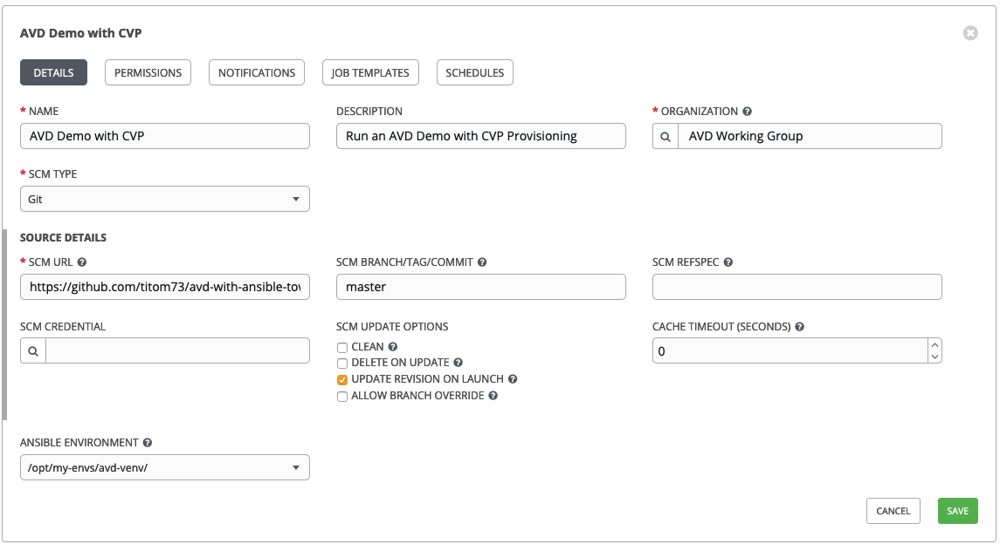
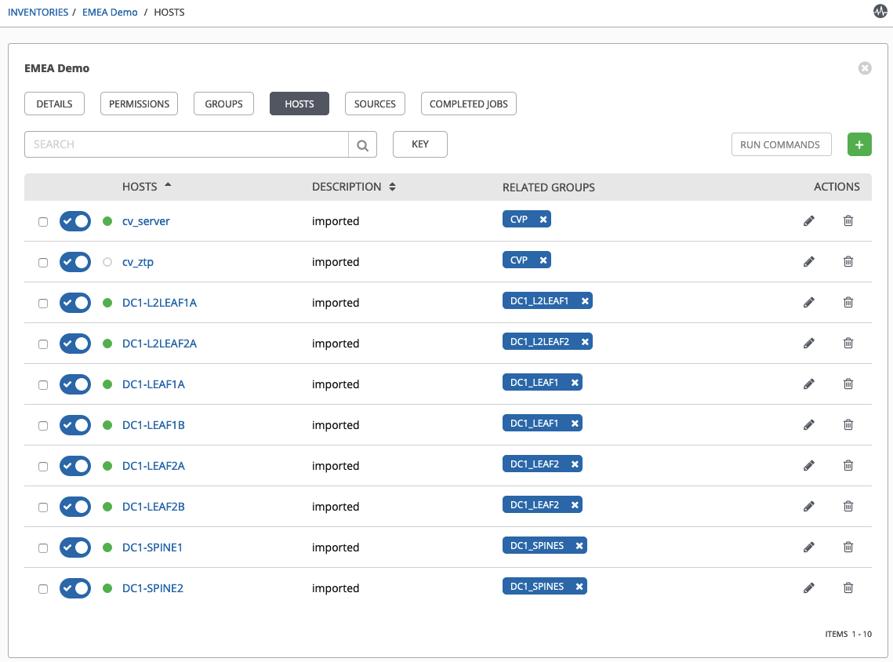
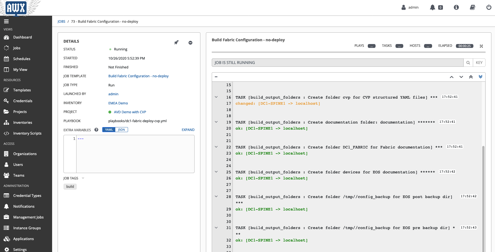

# AVD & CVP Playbooks integration in AWX/Tower

## About

This example shows how to deploy basic __EVPN/VXLAN Fabric__ based on __[Arista Validated Design roles](https://github.com/aristanetworks/ansible-avd)__ using Ansible Tower/AWX. This repository will be used as project on AWX and we will describe how to configure Tower for the following topics:

- Create a project
- Create inventory
- Install collections
- Install python requirements

All these elements are part of a dedicated demo repository available at [arista-netdevops-community/avd-with-ansible-tower-awx](https://github.com/arista-netdevops-community/avd-with-ansible-tower-awx)

If you want to see how to build your inventory and all related variables, it is recommended to read following documentation:

- [How to start](https://www.avd.sh/docs/how-to/first-project/)
- [L3LS EVPN Abstraction role](https://www.avd.sh/roles/eos_l3ls_evpn/)

## Requirements

To play with this repsoitory, you need:

- An AWX setup running on either Docker Compose or Kubernetes. All the commands for Python configuration will be done on docker-compose, but you can adapt for kubernetes.
- Understanding of how to configure AVD in a pure Ansible CLI way.

## Install Python requirements

Ansible CVP collection comes with a needs of [additional libraries](hhttps://github.com/arista-netdevops-community/avd-with-ansible-tower-awx/blob/master/requirements.txt) not part of a standard Python setup:

```shell
ansible==2.9.6
netaddr==0.7.19
Jinja2==2.10.3
requests==2.22.0
treelib==1.5.5
cvprac==1.0.4
paramiko==2.7.1
jsonschema==3.2.0
```

### Create virtual-environment

It is required to create [virtual-env](https://medium.com/@mehdirashidi/setting-up-venv-in-awx-31c4f9952a46) to not impact other workflow already deployed on your Tower setup.

```shell
# Docker status
tom@kube-tool:~$ docker ps
CONTAINER ID        IMAGE                COMMAND                  CREATED             STATUS              PORTS                  NAMES
4a4627b21f93        ansible/awx:15.0.0   "/usr/bin/tini -- /u…"   8 days ago          Up 8 days           8052/tcp               awx_task
6ef41f162226        ansible/awx:15.0.0   "/usr/bin/tini -- /b…"   8 days ago          Up 8 days           0.0.0.0:80->8052/tcp   awx_web
a2fd85d0cc86        postgres:10          "docker-entrypoint.s…"   8 days ago          Up 8 days           5432/tcp               awx_postgres
573d03e33c44        redis                "docker-entrypoint.s…"   8 days ago          Up 8 days           6379/tcp               awx_redis

# Run shell in docker
tom@kube-tool:~$ docker exec -it awx_task bash

$ sudo pip3 install virtualenv
WARNING: Running pip install with root privileges is generally not a good idea. Try `pip3 install --user` instead.
Requirement already satisfied: virtualenv in /usr/local/lib/python3.6/site-packages

$ mkdir /opt/my-envs

$ chmod 0755 /opt/my-envs

$ cd /opt/my-envs/

$ python3 -m venv avd-venv
```

> This configuration [__MUST__](https://github.com/ansible/awx/issues/4140) be replicated on both container `awx_task` and `awx_web`

Instruct AWX to register our new Virtual Environment folder:

```shell
$ curl -X PATCH 'http://admin:password@<IP-of-AWX-INSTANCE>/api/v2/settings/system/' \
    -d '{"CUSTOM_VENV_PATHS": ["/opt/my-envs/"]}' -H 'Content-Type:application/json'

{
    "ACTIVITY_STREAM_ENABLED": true,
    "ACTIVITY_STREAM_ENABLED_FOR_INVENTORY_SYNC": false,
    "ORG_ADMINS_CAN_SEE_ALL_USERS": true,
    "MANAGE_ORGANIZATION_AUTH": true,
    "TOWER_URL_BASE": "http://10.83.28.163",
    "REMOTE_HOST_HEADERS": [
        "REMOTE_ADDR",
        "REMOTE_HOST"
    ],
    "PROXY_IP_ALLOWED_LIST": [],
    "LICENSE": {},
    "REDHAT_USERNAME": "",
    "REDHAT_PASSWORD": "",
    "AUTOMATION_ANALYTICS_URL": "https://example.com",
    "INSTALL_UUID": "f8a54d56-b1f3-4fdf-aa5b-9d6977d00eaa",
    "CUSTOM_VENV_PATHS": [
        "/opt/my-envs"
    ],
    "INSIGHTS_TRACKING_STATE": false,
    "AUTOMATION_ANALYTICS_LAST_GATHER": null,
    "AUTOMATION_ANALYTICS_GATHER_INTERVAL": 14400
}
```

### Provision virtual-environment

Before running playbook in a virtual-env, we have to install required libraries:

```shell
tom@kube-tool:~$ docker exec -it awx_task bash

# Activate virtual-env
$ cd /opt/my-envs/avd-venv
$ source bin/activate

# Install ansible AWX base lib
$ pip3 install psutil

# Install project requirements
$ curl -fsSL https://raw.githubusercontent.com/aristanetworks/ansible-avd/devel/development/requirements.txt -o requirements.txt
$ pip3 install -r requirements.txt
```

From here, you have a clean python environment with all the expected requirements installed on your AWX runner.

## Create AVD project on AWX

### Create a project resource

First go to __Resources > Projects__ and create a new one using:

- SCM Type: `Git`
- SCM Branch: `master`
- Ansible Environment: `/your/path/to/venv`
- SCM URL: `https://github.com/arista-netdevops-community/avd-with-ansible-tower-awx.git`



This project will be used for 2 things:

- Get our inventory and all attached variables.
- Get our playbooks to run in AWX.

### Create Inventory resource

Next action is to create an inventory in AWX. It is a 2 step actions:

#### Create Inventory

Go to __Resources > Inventory__


Once ready, you need to add a source to your inventory

#### Add source

In your inventory, select __Sources__


Then add a source using your existing project


In our example, our inventory file is part of a subdirectory. So we had to type the path manually as it was not part of the suggestion list. Also, don't forget to specificy virtual-env to use with this inventory.

Onc you click on `Save` button, select __SYNC-ALL__ button to get all hosts part of your inventory:


You should get all your devices in __Resources > Inventory > Your inventory Name__



Now we can focus on playbook itself.

### Create Playbook resource

Go to __Resources > Templates__.

In this section you have to provide at least:

- Name of your Template: _Build Fabric Configuration -- no-deploy_
- Which inventory to use: _EMEA Demo_
- Which project to use to get playbook: _AVD Demo with CVP_
- Which playbook to use: [`playbooks/dc1-fabric-deploy-cvp.yml`](https://github.com/arista-netdevops-community/avd-with-ansible-tower-awx/blob/master/playbooks/dc1-fabric-deploy-cvp.yml)
- Virtual Environment to use when running the playbook

As AVD implements Ansible `TAGS`, we have specified `build` only, but you can adapt to your own setup.


You can configure more than just one playbook, but we will focus on playbook definition as it is not an AWX user's guide.

## Update AVD playbook

### How to install collection within project

Since AVD and CVP collection are not installed by default in AWX, you need to consider how to install them. You have 2 option: system wise or per project. Let's consider per project as it is easier to upgrade

- Create a folder named `collections` in your git project
- Create a YAML file named [`requirements.yml`](https://github.com/arista-netdevops-community/avd-with-ansible-tower-awx/blob/master/README.md) with the following structure:

```yaml
---
collections:
  - name: arista.avd
    version: 1.1.0
  - name: arista.cvp
    version: 2.1.0
```


### What to change to work with AVD and AWX

Ansible has a default variable that point to inventory file used in playbook and named `{{ inventory_file }}`. Since AWX/Tower is using a database, this variable is not available anymore and [inventory file does not exist in such environment](https://github.com/ansible/awx/issues/5926).

AVD use this variable to read inventory and to build container topology on Cloudvision. So to mitigate this behavior, a small warkaround is to add a task that download your inventory from your git repository and define `{{ inventory_file }}`:

- Define variable:

```yaml
#group_vars/all.yml
---
inventory_file: '/tmp/inventory.yml'
```

- Update playbook

```yaml
- name: Configuration deployment with CVP
  hosts: cv_server
  connection: local
  gather_facts: false
  collections:
    - arista.avd
    - arista.cvp
  tasks:

    - name: Download Inventory file
      tags: [ build ]
      get_url:
        url: 'https://raw.githubusercontent.com/titom73/avd-with-ansible-tower-awx/master/inventory/inventory.yml'
        dest: '{{ inventory_file }}'
        mode: '0755'
      delegate_to: 127.0.0.1

    - name: run CVP provisioning
      import_role:
        name: arista.avd.eos_config_deploy_cvp
      vars:
        container_root: 'DC1_FABRIC'
        configlets_prefix: 'DC1-AVD'
        device_filter: 'DC1'
        state: present
```

## Run your playbook

Under __Resources > Templates__ click on the rocket icon to start playbook execution


