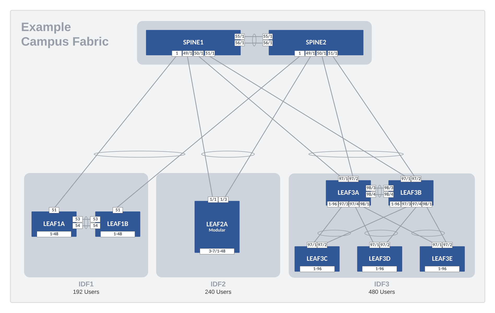
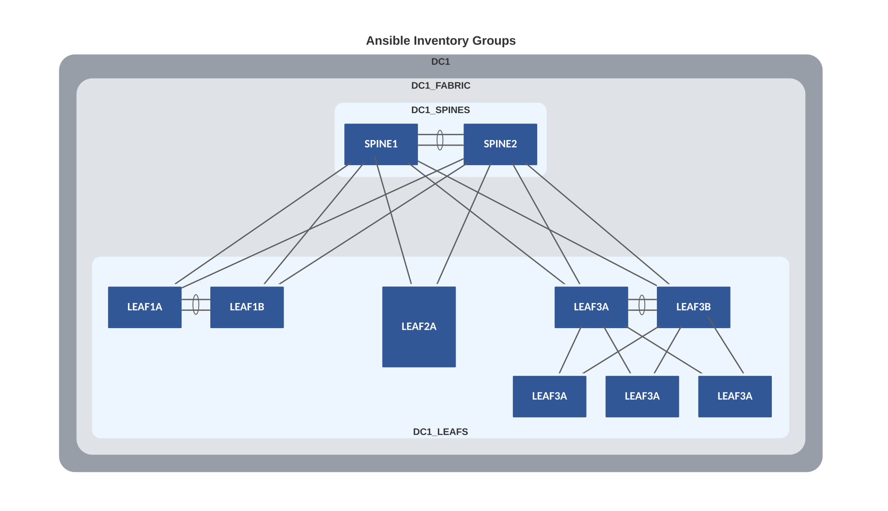
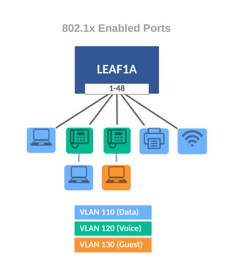

---
# This title is used for search results
title: Example for Campus Fabric
---
<!--
  ~ Copyright (c) 2023 Arista Networks, Inc.
  ~ Use of this source code is governed by the Apache License 2.0
  ~ that can be found in the LICENSE file.
  -->

# Example for Campus Fabric

## Introduction

This example describes and includes all the AVD files used to build a Campus Fabric by building upon the previous [L2LS Fabric](../../examples/campus-fabric/README.md) example. The spine nodes provide L3 routing of SVIs, and the L2 leaf nodes support 802.1x Network Access Control (NAC) with port ranges.

## Installation & Requirements

1. Install AVD - Installation guide found [here](../../docs/installation/collection-installation.md).
2. Install Ansible module requirements - Instructions found [here](../../docs/installation/collection-installation.md).
3. Run the following playbook to copy the Getting Started examples to your working directory.

``` bash
# current working directory: ~/ansible-avd-examples
ansible-playbook arista.avd.install_examples
```

The output will show something similar to the following. If not, please ensure that AVD and all requirements are correctly installed.

``` shell
 ~/ansible-avd-examples# ansible-playbook arista.avd.install_examples

PLAY [Install Examples]***************************************************************************************************************************************************************************************************************************************************************

TASK [Copy all examples to ~/ansible-avd-examples]*****************************************************************************************************************************************************
changed: [localhost]

PLAY RECAP
****************************************************************************************************************************************************************************************************************************************************************************
localhost                  : ok=1    changed=1    unreachable=0    failed=0    skipped=0    rescued=0    ignored=0
```

After the playbook has run successfully, the following directory structure will be created.

``` shell
ansible-avd-examples/     (directory where playbook was run)
  ├── campus-fabric/
    ├── documentation/
    ├── group_vars/
    ├── images/
    ├── intended/
    ├── switch-basic-configurations/
    ├── ansible.cfg
    ├── build.yml
    ├── deploy.yml
    ├── inventory.yml
    └── README.md (this document)
```

???+ info

    If the content of any file in the example is ***modified*** and the playbook is run again, the file ***will not*** be overwritten. However, if any file in the example is ***deleted*** and the playbook is run again, the file will be re-created.

## Design Overview

### Physical Campus Fabric Topology

In a Campus network, it is common to refer to the location of the switches as **MDF** (Main Distribution Frame) and **IDFs** (Independent Distribution Frame). Throughout this example, we refer to the spine nodes as the MDF and the leaf nodes as the IDFs. This example shows various switch types and common ways of cabling the IDF to the MDF.

- MDF
  - Two Spine nodes
- IDFs
  - IDF1 supporting 96 users with two leafs (1RU - 48 ports each)
  - IDF2 supporting 240 users with a Modular five slot chassis (48 ports per module)
  - IDF3 supporting 480 users with five leafs (2RU - 96 ports each)

The drawing below shows the physical topology used in this example. The interface assignment shown here are referenced across the entire example, so keep that in mind if this example must be adapted to a different topology.



## Basic EOS Switch Configuration

Basic connectivity between the Ansible controller host and the switches must be established before Ansible can be used to deploy configurations. The following should be configured on all switches:

- Switch Hostname
- IP enabled interface
- Username and Password defined
- Management eAPI enabled

???+ info

    The management interfaces used by cEOS and vEOS, are `Management0` and `Management1`, respectively. When using actual hardware switches, `Management1` is used. The included basic switch configurations may need to be adjusted for your environment.

Below is the basic configuration file for SPINE1:

``` shell
--8<--
examples/campus-fabric/switch-basic-configurations/SPINE1.cfg
--8<--
```

## Ansible Inventory

Now that we understand the physical L2LS topology, we must create the Ansible inventory that represents this topology. The following is a textual and graphical representation of the Ansible inventory group variables and naming scheme used in this example:

``` text
- DC1
  - DC1_FABRIC
    - DC1_SPINES
    - DC1_LEAFS
  - DC1_NETWORK_SERVICES
    - DC1_SPINES
    - DC1_LEAFS
  - DC1_NETWORK_PORTS
    - DC1_SPINES
    - DC1_LEAFS
```

DC1 represents the highest level within the hierarchy. Ansible variables defined at this level will be applied to all nodes in the fabric. Ansible groups have parent-and-child relationships. For example, both DC1_SPINES and DC1_LEAFS are children of DC1_FABRIC. Groups of Groups are possible and allow variables to be shared at any level within the hierarchy. For example, DC1_NETWORK_SERVICES is a group with two other groups defined as children: DC1_SPINES and DC1_LEAFS. The same applies to the group named DC1_NETWORK_PORTS. You will see these groups listed at the bottom of the inventory file.

This naming convention makes it possible to extend anything quickly and can be changed based on your preferences. The names of all groups and hosts must be unique.



### inventory.yml

The below inventory file represents two spines and ten leafs. The nodes are defined under the groups DC1_SPINES and DC1_LEAFS, respectively. We apply group variables (group_vars) to these groups to define their functionality and configurations.

The hostnames specified in the inventory must exist either in DNS or in the hosts file on your Ansible host to allow successful name lookup and be able to reach the switches directly. A successful ping from the Ansible host to each inventory host verifies name resolution (e.g., ping SPINE1).

If DNS is unavailable, define the variable ansible_host as an IP address for each device.

``` yaml
--8<--
examples/campus-fabric/inventory.yml
--8<--
```

## Management Network

This example configures a dedicated management network on port Management0 (vrf: MGMT) and an in-band management network using SVI Vlan10 (vrf: default). In-band management is easily configured with two variables under the leaf defaults key in `DC1_FABRIC.yml`. First, it auto-generates an SVI and default route on each leaf node. Then, on the Spine nodes, it will build a matching SVI for Vlan 10 and create a Virtual-IP (10.10.10.1) for the defined subnet.

``` yaml
leaf:
  defaults:
    inband_mgmt_subnet: 10.10.10.0/24
    inband_mgmt_vlan: 10
```

Details on this feature can be found [here](../../roles/eos_designs/docs/input-variables.md#node-type-inband-management).

| Node   | Management0     | Vlan10    |
| ------ | --------------- | --------- |
| SPINE1 | 172.100.100.101 | 10.10.10.2  |
| SPINE2 | 172.100.100.102 | 10.10.10.3  |
| LEAF1A | 172.100.100.103 | 10.10.10.6  |
| LEAF1B | 172.100.100.104 | 10.10.10.7  |
| LEAF2A | 172.100.100.105 | 10.10.10.8  |
| LEAF3A | 172.100.100.106 | 10.10.10.9  |
| LEAF3B | 172.100.100.107 | 10.10.10.10 |
| LEAF3C | 172.100.100.108 | 10.10.10.11 |
| LEAF3D | 172.100.100.109 | 10.10.10.12 |
| LEAF3E | 172.100.100.110 | 10.10.10.13 |

In Campus Networks, having a dedicated out-of-band management network in each IDF is uncommon. Therefore, you can easily disable configuring the Management0 interface and the management VRF by adding these variables to the `DC1_LEAFS.yml` group_vars.

``` yaml
mgmt_gateway: null
mgmt_interface: null
mgmt_interface_vrf: default
```

???+ note

    If you switch to using in-band management only, update other variables referencing vrf MGMT to use the vrf default.

## Build Fabric Topology

AVD Fabric Input Variables

To apply AVD input variables to the nodes in the fabric, we make use of Ansible group_vars. How and where you define the variables is your choice. The group_vars table below is one example of AVD fabric variables.

| group_vars/              | Description                                   |
| ------------------------ | --------------------------------------------- |
| DC1.yml                  | Global settings for all devices               |
| DC1_FABRIC.yml           | Fabric, Topology, and Device settings         |
| DC1_SPINES.yml           | Device type for Spines                        |
| DC1_LEAFS.yml            | Device type for Leafs                         |
| DC1_NETWORK_SERVICES.yml | VLANs/SVIs                                    |
| DC1_NETWORK_PORTS.yml    | Port Profiles and Network Port Ranges         |

The tabs below show the Ansible **group_vars** used in this example.

=== "DC1"
    At the top level (DC1), the following variables are defined in the **group_vars/DC1.yml** file. These Ansible variables apply to all nodes in the fabric and is a common place to set AAA, users, NTP, and management interface settings. Update local_users and passwords for your environment.

    You can create a sha512_password by creating a username and password on a switch and copy/paste it within double quotes here.

    ``` yaml
    --8<--
    examples/campus-fabric/group_vars/DC1.yml
    --8<--
    ```

=== "DC1_FABRIC"
    At the Fabric level (DC1_FABRIC), the following variables are defined in the **group_vars/DC1_FABRIC.yml** file. The fabric name, design type (l2ls), spine and leaf defaults, ansible authentication, and interface links are defined at this level. Other variables you must supply include spanning-tree mode, priority, and an MLAG IP pool. Typically, an IDF has a unique set of VLANs. You may use the `filter.tags` variable to constrain which VLANs are built on an IDF node.

    Variables applied under the node key type (spine/leaf) defaults section are inherited by nodes under each type. These variables may be overwritten under the node itself.

    The spine interface used by a particular leaf is defined from the leaf's perspective with a variable called `uplink_switch_interfaces`. For example, LEAF2A has a unique variable `uplink_switch_interfaces: [Ethernet49/1, Ethernet49/1]` defined. This means that LEAF2A is connected to SPINE1's Ethernet49/1 and SPINE2's Ethernet49/1, respectively.

    ``` yaml
    --8<--
    examples/campus-fabric/group_vars/DC1_FABRIC.yml
    --8<--
    ```

=== "DC1_SPINES"
    In an L2LS Campus design, there are two types of spine nodes: `spine` and `l3spine`. For a spine node to provide routing of SVIs, we set the type to `l3spine`.

    ``` yaml
    --8<--
    examples/campus-fabric/group_vars/DC1_SPINES.yml
    --8<--
    ```

=== "DC1_LEAFS"
    In an L2LS Campus design, we have one type of leaf node: `leaf`.

    ``` yaml
    --8<--
    examples/campus-fabric/group_vars/DC1_LEAFS.yml
    --8<--
    ```

=== "DC1_NETWORK_SERVICES"
    You add VLANs and SVIs to the Fabric by updating the **group_vars/DC1_NETWORK_SERVICES.yml** file. Each VLAN will be given a name and a list of tags. The tags filter the VLAN to specific Leaf Pairs. These variables are applied to the spine and leaf nodes since they are a part of this group.

    ``` yaml
    --8<--
    examples/campus-fabric/group_vars/DC1_NETWORK_SERVICES.yml
    --8<--
    ```

=== "DC1_NETWORK_PORTS"
    Our fabric would not be complete without connecting some devices to it. Therefore, we define port profiles and network port ranges in the  **group_vars/DC1_NETWORKS_PORTS.yml** file. A single port_profile may be used across several switches and port ranges. In our example, we create a port profile called `PP-DOT1X` to define generic 802.1x (NAC) settings we wish to apply to a range of ports. The `network_ports` data model defines which switches and ports to apply the port profile. This data model allows a single regex statement to define a list of switches. In addition, the variable `switch_ports` expands into a range of ports. You can view more details of the `range_expand` filter [here](../../docs/plugins/Filter%20plugins/range_expand.md). These variables are applied to the spine and leaf nodes since they are a part of this inventory group.

    ``` yaml
    --8<--
    examples/campus-fabric/group_vars/DC1_NETWORK_PORTS.yml
    --8<--
    ```

## Network Services

The Network Services data model is stored in the **DC1_NETWORK_SERVICES** group_var tab above. Each IDF will have three unique VLANs to support Data, Voice, and Guest networks. The spine nodes will provide routing for these VLANs via locally assigned SVIs.

### VLAN/IP Subnet Assignment

| IDF  | Data                 | Voice                 | Guest                 |
| ---- | -------------------- | --------------------- | --------------------- |
| IDF1 | 110 - (10.1.10.0/23) | 120 - (10.1.20.0/23)  | 130 - (10.1.30.0/23)  |
| IDF2 | 210 - (10.2.10.0/23) | 220 - (10.2.20.0/23)  | 230 - (10.2.30.0/23)  |
| IDF3 | 310 - (10.3.10.0/23) | 320 - (10.3.20.0/23)  | 330 - (10.3.30.0/23)  |

## Port Profiles and Network Ports

AVD provides a way to standardize and reuse port profiles through a compact data model you can utilize across the network. The Network Ports data model is stored in the **DC1_NETWORK_PORTS** group_vars tab above. Each port is configured to support NAC and dynamically assigns the proper VLAN based on 802.1x authentication. Multiple device types (IP Phones, Workstations, Printers, Access Points, etc.) can share the same port configuration below.



The above sample port configuration is easily produced with `port_profiles` and `network_ports` data models. Each port has similar configuration items defined in `port_profiles`, while `network_ports` defines which switches and port ranges are to be applied. The `network_ports` data model allows regex to match switches and an `expand_range` filter to cover a range of ports. For details, see the documentation for [`port_profiles`](../../roles/eos_designs/docs/input-variables.md#port-profiles-settings) and [`network_ports`](../../roles/eos_designs/docs/input-variables.md#network-ports-settings).

## WAN/Core Edge

Lastly, we need to provide a way for traffic to exit the Campus Fabric via the WAN/Core Edge. This is easily accomplished using `underlay_routing_protocol` and `core_interfaces` to create point-to-point IP links to the WAN/Core and enable a routing protocol such as OSPF. This simple data model below is located at the bottom of the **group_vars/DC1_FABRIC.yml** file.

``` yaml
# Underlay Routing Protocol
underlay_routing_protocol: ospf

#### WAN/Core Edge Links ####
core_interfaces:
  p2p_links:
    - ip: [ 10.0.0.3/31, 10.0.0.2/31 ]
      nodes: [ SPINE1, WAN ]
      interfaces: [ Ethernet52/1, Ethernet1/1 ]
      include_in_underlay_protocol: true
    - ip: [ 10.0.0.5/31, 10.0.0.4/31 ]
      nodes: [ SPINE2, WAN ]
      interfaces: [ Ethernet52/1, Ethernet1/1 ]
      include_in_underlay_protocol: true
```

## Deploy Fabric

### The Playbooks

Now that we have defined all of our Ansible variables (AVD inputs), it is time to generate some configurations. To make things simple, we provide two playbooks. One playbook will allow you to build and view EOS CLI intended configurations per device. The second playbook has an additional task to deploy the configurations to your switches. The playbooks are provided in the tabs below. The playbook is straightforward as it imports two AVD roles: `eos_designs` and `eos_cli_config_gen`, which do all the heavy lifting. Combining these two roles produces recommended configurations that follow Arista Design Guides.

=== "build.yml"

    ``` yaml
    --8<--
    examples/campus-fabric/build.yml
    --8<--
    ```

=== "deploy.yml"

    ``` yaml
    --8<--
    examples/campus-fabric/deploy.yml
    --8<--
    ```

### Playbook Run

To build the configuration files, run the playbook called `build.yml`.

``` bash
### Build configurations
ansible-playbook build.yml
```

After the playbook run finishes, EOS CLI intended configuration files were written to `intended/configs`.

To build and deploy the configurations to your switches, run the playbook called `deploy.yml`. This assumes that your Ansible host has access and authentication rights to the switches. In this example, we defined the authentication variables in the `DC1_FABRIC.yml` file.

``` bash
### Build configurations & Push Configs to switches
ansible-playbook deploy.yml
```

### EOS Intended Configurations

Your configuration files should be similar to these.

=== "SPINE1"

    ``` shell
    --8<--
    examples/campus-fabric/intended/configs/SPINE1.cfg
    --8<--
    ```

=== "SPINE2"

    ``` shell
    --8<--
    examples/campus-fabric/intended/configs/SPINE2.cfg
    --8<--
    ```

=== "LEAF1A"

    ``` shell
    --8<--
    examples/campus-fabric/intended/configs/LEAF1A.cfg
    --8<--
    ```

=== "LEAF1B"

    ``` shell
    --8<--
    examples/campus-fabric/intended/configs/LEAF1B.cfg
    --8<--
    ```

=== "LEAF2A"

    ``` shell
    --8<--
    examples/campus-fabric/intended/configs/LEAF2A.cfg
    --8<--
    ```

=== "LEAF3A"

    ``` shell
    --8<--
    examples/campus-fabric/intended/configs/LEAF3A.cfg
    --8<--
    ```

=== "LEAF3B"

    ``` shell
    --8<--
    examples/campus-fabric/intended/configs/LEAF3B.cfg
    --8<--
    ```

=== "LEAF3C"

    ``` shell
    --8<--
    examples/campus-fabric/intended/configs/LEAF3C.cfg
    --8<--
    ```

=== "LEAF3D"

    ``` shell
    --8<--
    examples/campus-fabric/intended/configs/LEAF3D.cfg
    --8<--
    ```

=== "LEAF3E"

    ``` shell
    --8<--
    examples/campus-fabric/intended/configs/LEAF3E.cfg
    --8<--
    ```

## Next steps

Modify this example and expand the features to match your Campus topology.
