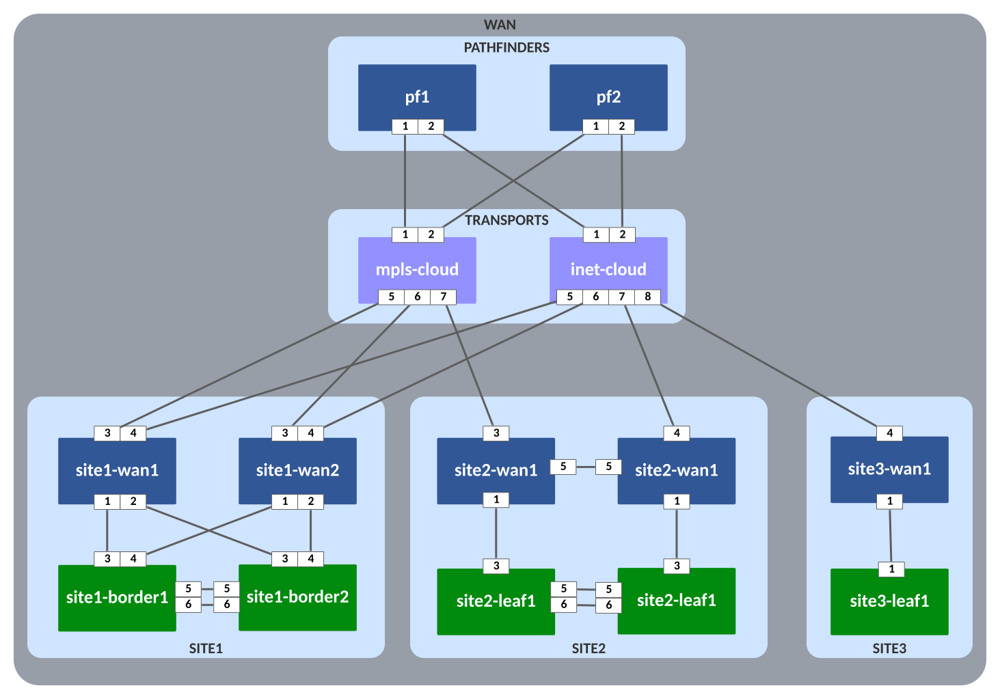
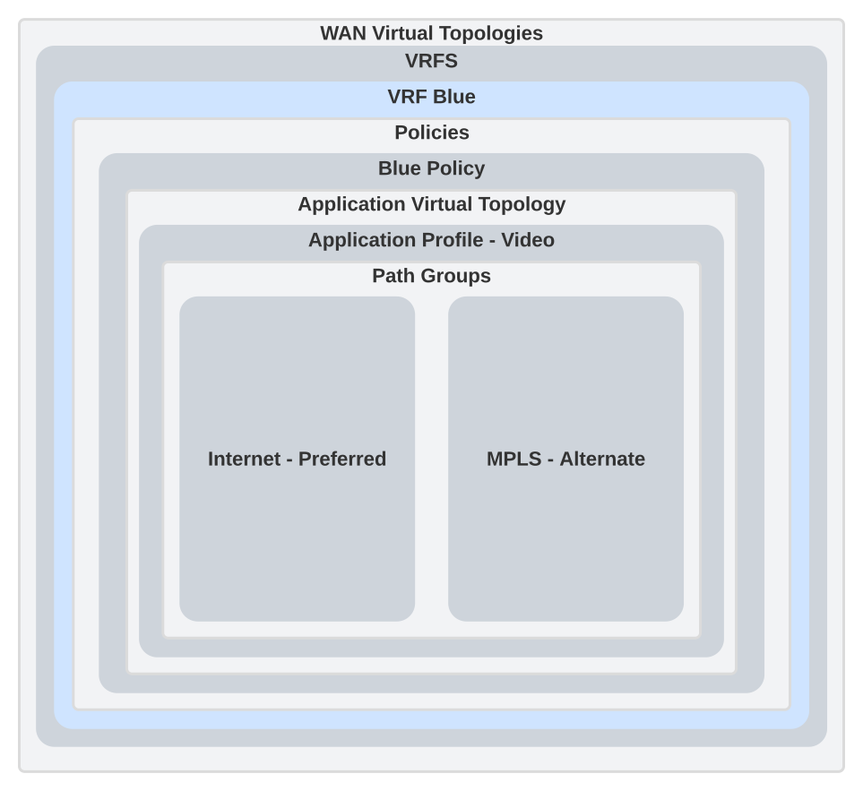
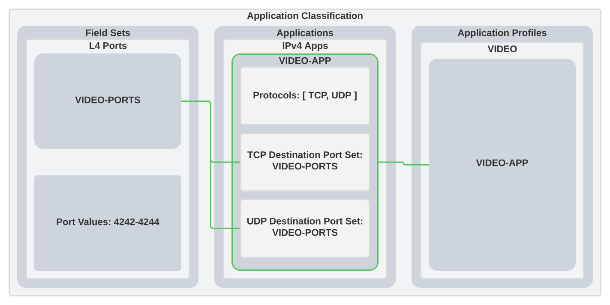
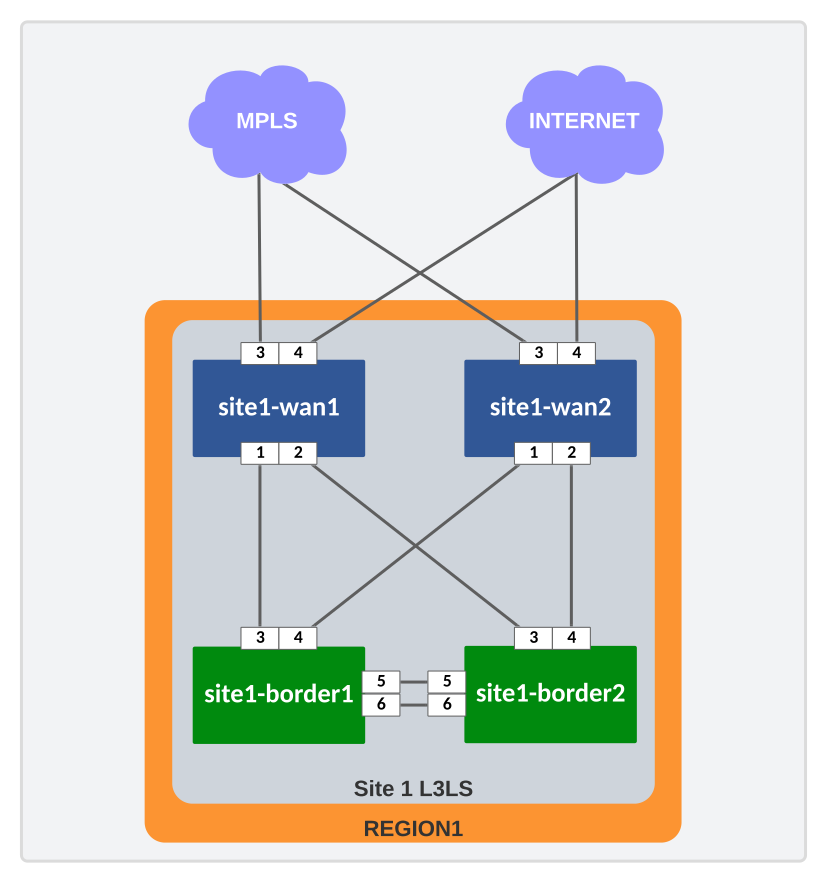
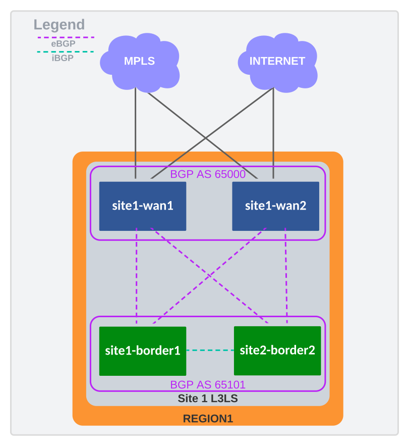
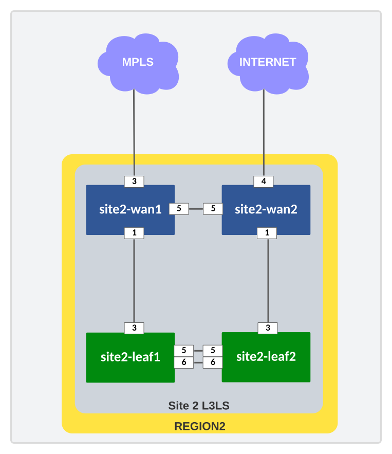
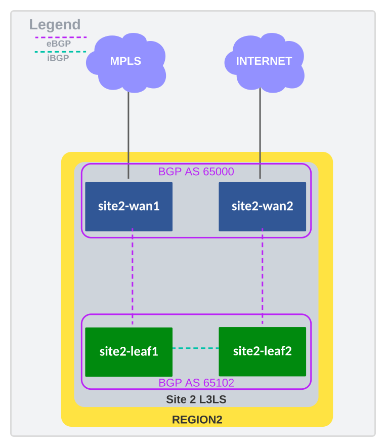
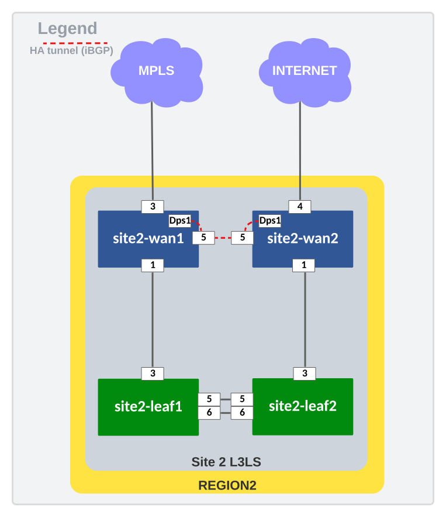
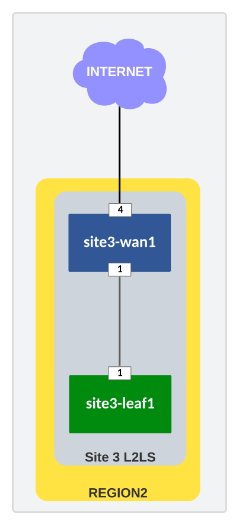
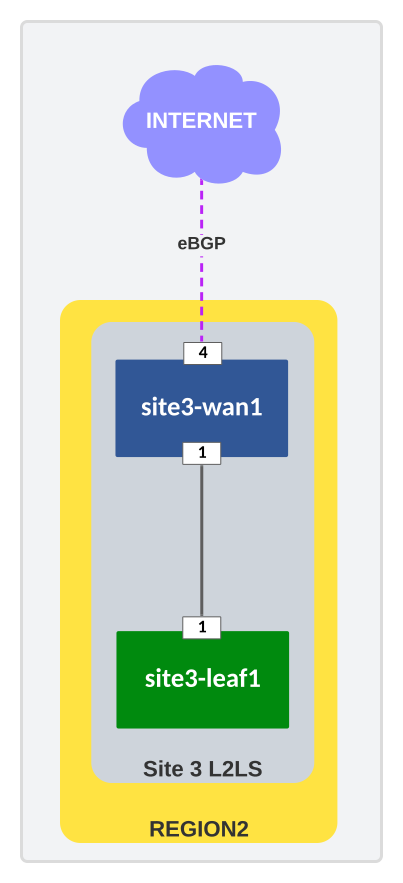

---
# This title is used for search results
title: AVD example for CV Pathfinder
---
<!--
  ~ Copyright (c) 2023-2024 Arista Networks, Inc.
  ~ Use of this source code is governed by the Apache License 2.0
  ~ that can be found in the LICENSE file.
  -->

# AVD example for CV Pathfinder

## Introduction

!!! important
    - CVaaS is required to run this example. Without it, only configuration generation is possible.
    - Minimum EOS version 4.32.2F is required.
    - The devices must be able to reach CVaaS via their Management Interface.
    - Proper licenses are required for all nodes  (IPSec and throughput).

This example aims to present the basic configuration blocks required to deploy CV Pathfinder using AVD but does not cover all CV Pathfinder features. In particular, it does not cover:

- Internet Exits
- WAN routers behind NAT
- Multiple inventories

The [WAN how-to](../../roles/eos_designs/docs/how-to/wan.md) document provides more information on how these features are supported in AVD.

This example will go over the following:

- Build the intended configurations and documentation
- Deploy the configuration via CloudVision as a Service (CVaaS)

## Installation

--8<--
examples/common/installation.md
--8<--

```shell
ansible-avd-examples/ (or wherever the playbook was run)
  ├── cv-pathfinder
    ├── ansible.cfg
    ├── build.yml
    ├── deploy.yml
    ├── documentation
    ├── group_vars
    ├── host_vars
    ├── images
    ├── intended
    ├── inventory.yml
    ├── README.md
    └── switch-basic-configurations
```

## Overall design overview

### Physical topology

The target topology comprises two Pathfinder nodes and three sites distributed in two regions.

The drawing below shows the physical topology used in this example.


- The example considers two path groups: `MPLS` and `INTERNET`
- Pathfinders `pf1` and `pf2` are connected to both to the `INTERNET` and the `MPLS` path groups.
- `inet-cloud` and `mpls-cloud` are used to mimic Service Providers.

The following table describes the characteristics of each site:

| Site Name | Region | Role (Transit/Edge) | Number of routers | Path groups | HA configuration | LAN configuration |
| --------- | ------ | ------------------- | ----------------- | ----------- | ---------------- | ----------------- |
| Site 1 | Region 1 | Transt | 2 routers | `INTERNET` and `MPLS` on both routers | Via the LAN | eBGP |
| Site 2 | Region 2 | Transit | 2 routers | `MPLS` on router 1 and `INTERNET` on router 2 | Direct HA | eBGP |
| Site 3 | Region 2 | Edge | 1 router | `INTERNET` | - | Subinterfaces facing L2Leaf |

### IP ranges used

### Out-of-band management IP allocation

Subnet: `192.168.17.0/24`

| Description      | IP Address    |
| ---------------- | ------------- |
| Default gateway  | 192.168.17.1  |
| **Pathfinders**  |               |
| pf1              | 192.168.17.10 |
| pf2              | 192.168.17.11 |
| **Site 1**       |               |
| site1-wan1       | 192.168.17.12 |
| site1-wan2       | 192.168.17.13 |
| site1-border1    | 192.168.17.14 |
| site1-border2    | 192.168.17.15 |
| **Site 2**       |               |
| site2-wan1       | 192.168.17.16 |
| site2-wan2       | 192.168.17.17 |
| site2-leaf1      | 192.168.17.18 |
| site2-leaf2      | 192.168.17.19 |
| **Site 3**       |               |
| site3-wan1       | 192.168.17.20 |
| site3-leaf1      | 192.168.17.21 |
| **Clouds**       |               |
| mpls-cloud       | 192.168.17.30 |
| inet-cloud       | 192.168.17.31 |

### Other subnet IP allocations

|  Description                                | Subnet            |
|---------------------------------------------|-------------------|
| **Loopback 0 interfaces**                   | 192.168.255.0/24  |
| **DPS/VTEP interfaces**                     | 192.168.42.0/24   |
| **MLAG peer-link (interface VLAN 4094)**    | 10.255.252.0/24   |
| **MLAG iBGP peering (interface VLAN 4093)** | 10.255.251.0/24   |
| **Site1 uplink between WANs and border**    | 10.0.1.0/24       |
| **Site2 uplink between WANs and leafs**     | 10.0.2.0/24       |
| **pf1 to mpls-cloud**                       | 172.18.100.0/24   |
| **pf1 to inet-cloud**                       | 100.64.100.0/24   |
| **pf2 to mpls-cloud**                       | 172.18.200.0/24   |
| **pf2 to inet-cloud**                       | 100.64.200.0/24   |
| **site1-wan1 to mpls-cloud**                | 172.18.10.0/24    |
| **site1-wan1 to inet-cloud**                | 172.18.10.0/24    |
| **site1-wan2 to mpls-cloud**                | 172.18.11.0/24    |
| **site1-wan2 to inet-cloud**                | 172.18.11.0/24    |
| **site2-wan1 to mpls-cloud**                | 172.18.20.0/24    |
| **site2-wan2 to inet-cloud**                | 172.18.21.0/24    |
| **site3-wan1 to inet-cloud**                | 172.18.30.0/24    |

For every connection to `inet-cloud` or `mpls-cloud`, the cloud router is allocated `.1` and the site / pf router is allocated `.2`.

### VRFs/SVIs used on border routers and leafs for testing

| Site | Router | VRF | IP address |
| ---- | ------ | --- | ---------- |
| Site 1 | site1-border1 | BLUE | 10.66.10.1/24 |
| Site 1 | site1-border1 | RED | 10.42.10.1/24 |
| Site 1 | site1-border2 | BLUE | 10.66.11.1/24 |
| Site 1 | site1-border2 | RED | 10.42.11.1/24 |
| Site 2 | site1-leaf1 | BLUE | 10.66.20.1/24 |
| Site 2 | site1-leaf1 | RED | 10.42.20.1/24 |
| Site 2 | site1-leaf2 | BLUE | 10.66.21.1/24 |
| Site 2 | site1-leaf2 | RED | 10.42.21.1/24 |
| Site 3 | site1-wan3 | BLUE | 10.66.30.1/24 |
| Site 3 | site1-wan3 | RED | 10.42.30.1/24 |

!!! note
    For site 3, the IP addresses are configured on the WAN router as site3-leaf1 is an l2leaf.

## Ansible inventory, group vars, and naming scheme

The following drawing shows a graphic overview of the Ansible inventory, group variables, and naming scheme used in this example:



The following pattern is used:

- Group names use uppercase and underscore
- All hostnames use lowercase and dashes

The drawing also shows the relationships between groups and their children. Be aware that all declarations on a higher level are inherited by children automatically.

### Content of the inventory.yml file

This section describes the entire `ansible-avd-examples/cv-pathfinder/inventory.yml` file used to represent the above topology.

In this example, we consider that no DNS entry is available to reach the devices and define the IPs the Ansible host has to reach per device.

!!! Info  "CVaaS configuration"
    - The example is targeting cv-staging. Please adjust to the correct CVaaS region as described in the `cv_deploy` role [documentation](../../roles/cv_deploy/README.md#overview)
    - Additionally follow the [guide](../../roles/cv_deploy/README.md#steps-to-create-service-accounts-on-cloudvision) to create the `cv_token`
    - the `cv_token` should then be loaded as an ENV variable `CV_TOKEN` using `export CV_TOKEN=<token>` for the `deploy.yml` playbook to work toward CVaaS.

```yaml title="inventory.yml"
--8<--
examples/cv-pathfinder/inventory.yml
--8<--
```

This example demonstrates the use of Ansible Vault to keep variables secure.
`ansible.cfg` is configured to use a given file (`.vault`) as the vault password
when required to decrypt files or inline variables.

```yaml title="ansible.cfg"
--8<--
examples/cv-pathfinder/ansible.cfg
--8<--
```

!!! danger
    The `.vault` file is included in the example in order to be able to run it.
    It **must** never be pushed to any public repository as it allows anyone
    with read access to decrypt all the secrets.

## Basic EOS config

As discussed in the single DC example, basic connectivity between the Ansible host and the switches must be established before Ansible can be used to push configurations. Remember, you must configure the following on all switches:

- A hostname configured purely for ease of understanding.
- An IP enabled interface - in this example, the dedicated out-of-band management interface is used.
- A username and password with the proper access privileges.

```eos title="site1-border1-basic-configuration.txt"
--8<--
examples/cv-pathfinder/switch-basic-configurations/site1-border1-basic-configuration.txt
--8<--
```

!!! note
    The folder `cv-pathfinder/switch-basic-configurations/` contains a file per device for the initial configurations.

## Defining device types

To define device types, required by AVD, this example leverages the `default_node_types` key:

```yaml title="groups_vars/all.yml"
--8<--
examples/cv-pathfinder/group_vars/all.yml:19:
--8<--
```

1. Using node type `spine` for transport routers.

Pathfinder nodes use the node_type `wan_rr`, and all WAN routers (edge and transit) use the node_type `wan_router`.

## Global settings for WAN

The following table lists the `eos_designs` top-level keys used for WAN and how they should be set:

| Key | Must be the same for all the WAN routers | Comment |
| --- | ---------------------------------------- | ------- |
| `wan_mode` | ✅ | Two possible modes, `autovpn` and `cv-pathfinder` (default). |
| `cv_pathfinder_regions` | ✅ | Defines the Region/Zone/Site hierarchy, not required for AutoVPN. |
| `wan_route_servers` | ✘ | Indicate to which WAN route servers the WAN router should connect to. This key is also used to tell every WAN Route Reflectors with which other RRs it should peer with. |
| `wan_ipsec_profiles` | ✅ | Defines the shared key for the Control Plane and Data Plane IPSec profiles. |
| `wan_stun_dtls_disable` | ✅ | Disable dTLS for STUN, for instance, for the lab. (**NOT** recommended in production). |
| `wan_carriers` | ✅ | Defines the list of carriers in the network; each carrier is assigned to a path-group. |
| `wan_path_groups` | ✅ | Defines the list of path-groups in the network. |
| `wan_virtual_topologies` | ✅ | Defines the Policies and the VRF to policy mappings. |
| `tenants` | ✅ | The default tenant key from `network_services` or any other key for tenant that would hold some WAN VRF information. |
| `application_classification` | ✅ | Defines the specific traffic classification required for the WAN, if any. |
| `ipv4_acls` | ✘ | List of IPv4 access-lists to be assigned to WAN interfaces. |
| `bgp_peer_groups.wan_overlay_peers.listen_range_prefixes` | ✘ | Must be set for the pathfinders for the connectivity to work. Sets the ranges of IP addresses from which to expect BGP peerings for the WAN. Include the VTEP ranges for all WAN routers connecting to this pathfinder. |

In this example, the settings are set under the group `WAN`. To help logically separate the variables in meaningful categories, the group variables for `WAN` are created in several YAML files under `ansible-avd-examples/cv-pathfinder/group_vars/WAN/`:

```shell
cv-pathfinder/group_vars/WAN
├── cv_pathfinder_settings.yml
├── l3_interface_profiles.yml
├── management.yml
└── tenants.yml
```

### Management

The `management.yml` file contains the configuration for:

- The management gateway
- NTP
- Terminattr to configure the connection to CVaaS.
- Local users (ansible/ansible, arista/arista and cvpadmin/cvpadmin)
- `ipv4_acls`: a list of ACLs used for Internet-facing WAN interfaces
- DNS
- AAA
- Disabling LLDP on management interface - Only needed for lab environments.

```yaml title="group_vars/WAN/management.yml"
--8<--
examples/cv-pathfinder/group_vars/WAN//management.yml
--8<--
```

### CV Pathinfder settings

The `ansible-avd-examples/cv-pathfinder/group_vars/WAN/cv_pathfinder_settings.yml` file defines the global WAN settings for all the hosts of the `WAN` group in the inventory.

```yaml title="group_vars/WAN/cv_pathfinder_settings.yml"
--8<--
examples/cv-pathfinder/group_vars/WAN//cv_pathfinder_settings.yml
--8<--
```

1. `cv_pathfinder_regions` is used to declare the Regions, Sites, and their location in the WAN network
2. `cv_pathfinder_global_sites` is used to add location for "Global" Pathfinders.
3. `wan_route_servers` defines the Pathfinders each router should connect to. This variable can also be used to have per-region pathfinders, for instance, at a group level.
4. `wan_ipsec_profiles` is used to control IP Security configuration; these
   settings are required.
5. For lab purposes, Flow tracking is enabled on uplinks and downlinks. Make sure
   to verify the scalability of CloudVision depending on your network in
   Production.
6. `bgp_peer_groups` uses listen range to establish sessions between WAN routers and the Pathfinders. `wan_rr_overlay_peers` controls the connection between Pathfinders, which is a full mesh.
7. When a carrier is not trusted (like the Internet ones), AVD requires an
   ingress ACL on the WAN interfaces. Each carrier is tied to a path-group.
8. More on virtual topologies after the snippet.
9. Application classification is used to configure `application_profiles` that match traffic categories in the policies and apply them to a virtual topology.
10. When policies are defined but no path exists (in this case MPLS for site 3) the path groups configuration will not be included in the final rendering.

#### Virtual topologies

The cornerstone of the CV Pathfinder solution is the Virtual Topologies.
The Virtual Topologies are grouped into Policies. A policy is a list of match
statements, each matching a specific `application profile` and applying a
`profile` (the Virtual Topology) to this traffic. A policy may or may not have
any default match. If no default match is configured, unmatched traffic is
dropped.

A profile is used to apply a load balancing policy and potentially an
internet-exit policy (not in this example). The load balancing policy defines
which path-groups can be used for the traffic.

As explained above, the `wan_virtual_topologies` variable must be global. AVD
decides how to configure the policies for each device based on the locally present
path groups. For example, if some traffic being matched is configured to only be sent over
the `MPLS` path group but there is no local WAN interface connected to `MPLS`, then
the match statement, profile, and load-balance policy are not generated by AVD on the
device.

For this example, we define two policies, one for each VRF BLUE and RED. The figure below is a graphical representation of a policy for video-based applications. Within our application virtual topologies, we specify a video application profile. This application profile can utilize two path groups. In this case, the internet provider is the preferred path, with MPLS acting as our alternative.



#### Applications

The figure below shows a graphical view of how we define applications. We have a high-level field set that allows us to define our application's attributes. These can be either IPs or ports. In this case, we use the port range of `4242-4244`.

We can leverage field set definitions within our application definitions. For this example, we have an application called `VIDEO-APP` with additional attributes like the protocol type in use and the destination ports. Please note that we are leveraging the `VIDEO-PORTS` definition from our field sets.

We can then define our application profiles. The application profiles can be a list of applications if they share the same policies. In this example, we have a fairly one-to-one mapping of applications and policies, but that is not a requirement. Within our `VIDEO` application profile, we leverage the `VIDEO-APP` application definition that was created previously.



### L3 interfaces and L3 interface profiles

In AVD, an L3 interface configured under a node is considered a WAN interface
when the `wan_carrier` setting is set. The `wan_carrier` allows AVD to know
which path-group to use for the interface based on the Carrier to Path-Group mapping
in the top level `wan_carriers` key.

```yaml title="AVD WAN interfaces example"
wan_router:
  node_groups:
    - group: SITE1
      cv_pathfinder_region: REGION1
      cv_pathfinder_site: SITE1
      # Making this site a transit site
      cv_pathfinder_transit_mode: region
      wan_ha:
        enabled: true
      nodes:
        - name: site1-wan1
          id: 3
          l3_interfaces:
            - name: Ethernet3  # (1)!
              profile: MPLS-WAN-INTERFACE
              peer_interface: Ethernet5
              peer_ip: 172.18.10.1
              ip_address: 172.18.10.2/24
              wan_carrier: ACME-MPLS-INC
              wan_circuit_id: mpls-site1-wan1
            - name: Ethernet42 # (2)!
              ip_address: 100.64.10.2/24
```

1. Ethernet3 is a WAN interface because `wan_carrier` is defined
2. Ethernet42 is *not* a WAN interface because `wan_carrier` is not defined

L3 interface profiles are defined globally and reused on the site WAN routers to
apply common configurations.

```yaml title="group_vars/WAN/l3_interface_profiles.yml"
--8<--
examples/cv-pathfinder/group_vars/WAN//l3_interface_profiles.yml
--8<--
```

### Tenants

The tenants are defined globally. In this example, we create SVIs in the BLUE and
RED VRFs for testing purposes.

Notice that the `vrf_vni` is configured for the BLUE and RED VRFs. This
potentially differs from the `wan_vni` configured under
`wan_virtual_topologies.vrfs`. The former is used for EVPN, while the latter is
used for DPS.

```yaml title="group_vars/WAN/tenants.yml"
--8<--
examples/cv-pathfinder/group_vars/WAN//tenants.yml
--8<--
```

## Setting pathfinders specific configuration parameters

The pathfinder configuration can be found in `group_vars/PATHFINDERS.yml`:

```yaml title="group_vars/PATHFINDERS.yml"
--8<--
examples/cv-pathfinder/group_vars/PATHFINDERS.yml
--8<--
```

## Setting site specific configuration parameters

!!! Note
    For convenience in the example, both the WAN routers and the LAN devices
    (borders, leaf, etc.) are defined in the same group_vars file. It would be
    possible to separate them.

As general principles:

- WAN routers should configure the LAN devices as `uplink_switches`.
- Each WAN router is assigned to a site. When two routers are part of a node_group, HA will be configured.

### Site 1

The following diagrams describe the connectivity of Site 1's physical, LAN, and HA tunnels.

=== "Physical"

    {: style="height:700px"}

=== "LAN"

    Site 1 borders are using BGP AS 65101

    {: style="height:700px"}

=== "HA Tunnels"

    By default, AVD uses all uplink interfaces for the LAN_HA path groups. EOS then establishes an IPsec tunnel between all pairs of local and remote connections. In this scenario, four tunnels are created for the LAN_HA path group.

    {: style="height:700px"}

```yaml title="group_vars/SITE1.yml"
--8<--
examples/cv-pathfinder/group_vars/SITE1.yml
--8<--
```

1. The uplink type `p2p-vrfs` is used to connect to the LAN switches.
2. `cv_pathfinder_transit_mode` defaults to `none` and the site is considered an `edge` site. To use it as transit, the variable must be set to `region` as it is the case here.

### Site 2

The following diagrams describe the Site2 physical, LAN and HA tunnels connectivity.

=== "Physical"

    {: style="height:700px"}

=== "LAN"

    Site 2 borders are using BGP AS 65101

    {: style="height:700px"}

=== "HA Tunnels"

    {: style="height:700px"}

```yaml title="group_vars/SITE2.yml"
--8<--
examples/cv-pathfinder/group_vars/SITE2.yml
--8<--
```

### Site 3

The following diagrams describe the Site3 physical and LAN connectivity.

=== "Physical"

    {: style="height:700px"}

=== "LAN"

    {: style="height:700px"}

```yaml title="group_vars/SITE3.yml"
--8<--
examples/cv-pathfinder/group_vars/SITE3.yml
--8<--
```

## The playbooks

The playbook is also the same, as the actions to execute in the fabric are the same. It is important to validate the `hosts` variable in the playbook to include all Ansible groups.

### Testing AVD output without a lab

Example of using this playbook without devices (local tasks):

=== "build.yml"

    ```yaml
    --8<--
    examples/cv-pathfinder/build.yml
    --8<--
    ```

Please look through the folders and files described above to learn more about the output generated by AVD.

### The metadata section in the structured_config

The CV Pathfinder visualization in CloudVision relies on the inputs of a hidden metadata studio to work.
When using AVD to generate the CV Pathfinder configurations, AVD also generates
a `metadata` section with all the information required to be pushed to CVaaS to
populate the studio.

The `arista.avd.cv_deploy` role will then pick up the metadata section and
populate the metadata studio as part of the same workspace, thus keeping the
configurations and metadata in sync.

### Playbook Run

To build and deploy the configurations to CVaaS, run first the `build.yml` playbook and then the `deploy.yml` playbook.

!!! Note
    In this example, the `deploy.yml` playbook is configured to auto approve and
    execute the Change Control created by the Workspace using `cv_run_change_control: true`.

=== "deploy.yml"

    ```yaml
    --8<--
    examples/cv-pathfinder/deploy.yml
    --8<--
    ```

``` bash
### Build the configurations
ansible-playbook playbooks/build.yml

### Deploy Configurations to CVaaS
ansible-playbook playbooks/deploy.yml
```

```shell
user@ubuntu:~/cv-pathfinder$ ansible-playbook build.yml

PLAY [Build Configs] ***************************************************************************

TASK [arista.avd.eos_designs : Verify Requirements] ********************************************
AVD version 5.0.0
ok: [pf1 -> localhost]

TASK [arista.avd.eos_designs : Create required output directories if not present] **************
ok: [pf1 -> localhost] => (item=//home/user/Documents/git_projects/ansible-avd-examples/cv-pathfinder/intended/structured_configs)
ok: [pf1 -> localhost] => (item=/home/user/Documents/git_projects/ansible-avd-examples/cv-pathfinder/documentation/fabric)
(...)
```

## Troubleshooting

For any question reach out to AVD maintainer over [Github discussions](https://github.com/aristanetworks/avd/discussions). Please share the relevant logs as well as the following information:

- AVD version
- Python version
- EOS version in your lab (if relevant)
- Whether you are using CVaaS or CV on-premises (and, in this case, the version)
