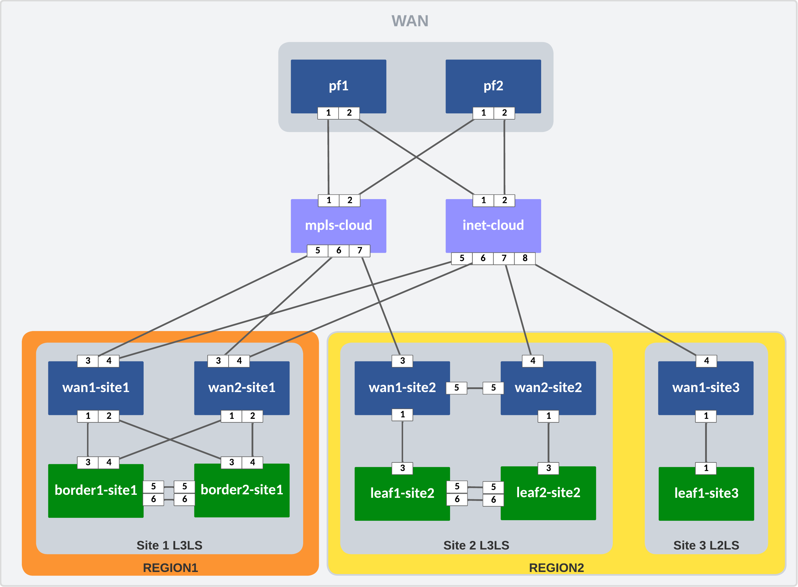

---
# This title is used for search results
title: AVD example for CV Pathfinder
---
<!--
  ~ Copyright (c) 2023-2024 Arista Networks, Inc.
  ~ Use of this source code is governed by the Apache License 2.0
  ~ that can be found in the LICENSE file.
  -->

# AVD example for CV Pathfinder

## Introduction

This example is meant to show how to use the CV Pathfinder models in AVD in a basic way.

!!! important
    CVaaS is required to run this example.
    EOS version superior or equal to 4.32.2F is required to run this example.

The goal is to present the basic configuration blocks required to deploy CV Pathfinder and so does not cover all CV Pathfinder supports.  In particular, it does not cover:

- Internet Exits
- WAN routers behind NAT
- decentralized inventory

More information on how these features are supported in AVD can be found in the WAN how-to document (TODO: add link).

This example will show how to

- Building the intended configurations and documentation
- Deploying the configuration via CVaaS

## Installation

Requirements to use this example:

- Follow the installation guide for AVD found [here](../../docs/installation/collection-installation.md).
- Run the following playbook to copy the AVD **examples** to your current working directory, for example `ansible-avd-examples`:

`ansible-playbook arista.avd.install_examples`

This will show the following:

```shell
 ~/ansible-avd-examples# ansible-playbook arista.avd.install_examples

PLAY [Install Examples]**********************************************************************************************

TASK [Copy all examples to ~/ansible-avd-examples]*******************************************************************
changed: [localhost]

PLAY RECAP
*********************************************************************************************************************
localhost                  : ok=1    changed=1    unreachable=0    failed=0    skipped=0    rescued=0    ignored=0
```

After the playbook has run successfully, the directory structure will look as shown below, the contents of which will be covered in later sections:

```shell
ansible-avd-examples/ (or wherever the playbook was run)
  cv-pathfinder
  ├── README.md
  ├── ansible.cfg
  ├── build.yml
  ├── deploy.yml
  ├── documentation
  ├── group_vars
  ├── host_vars
  ├── images
  ├── intended
  └── inventory.yml
```

!!! info
    If the content of any file is ***modified*** and the playbook is rerun, the file ***will not*** be overwritten. However, if any file in the example is ***deleted*** and the playbook is rerun, Ansible will re-create the file.

## Overall design overview

### Physical topology

The drawing below shows the physical topology used in this example. The target topology is composed of two Pathfinder nodes and 3 sites distributed in two regions.



- The example considers two path groups: `MPLS` and `INTERNET`
- Pathfinders `pf1` and `pf2` are connected to both to the `INTERNET` and the `MPLS` path groups.
    network.
- Site 1 is a transit site in region 1. It has two routers, each connected to the `INTERNET` and the `MPLS` pathgroups. HA is done via the LAN. The LAN routing protocol is eBGP.
- Site 2 is a transit site in region 2. It has two routers, `wan1-site2` is connected to `MPLS` only and `wan2-site2` is connected to `INTERNET` only. The site use direct HA. The LAN routing protocol is eBGP.
- Site 3 is an edge site in region 3. It has one routers, connected to `INTERNET` only. The LAN is L2.
- `inet-cloud` and `mpls-cloud` are used to mimic Service Providers.

### IP ranges used

| Out-of-band management IP allocation        | 192.168.17.0/24   |
|---------------------------------------------|-------------------|
| Default gateway                             | 192.168.17.1      |
| ** Pathfinders **                           |                   |
| pf1                                         | 192.168.17.10     |
| pf2                                         | 192.168.17.11     |
| ** Site 1 **                                |                   |
| wan1-site1                                  | 192.168.17.12     |
| wan2-site1                                  | 192.168.17.13     |
| border1-site1                               | 192.168.17.14     |
| border2-site1                               | 192.168.17.15     |
| ** Site 2 **                                |                   |
| wan1-site2                                  | 192.168.17.16     |
| wan2-site2                                  | 192.168.17.17     |
| leaf1-site2                                 | 192.168.17.18     |
| leaf2-site2                                 | 192.168.17.19     |
| ** Site 3 **                                |                   |
| wan1-site3                                  | 192.168.17.20     |
| leaf1-site3                                 | 192.168.17.21     |
| ** Clouds **                                |                   |
| mpls-cloud                                  | 192.168.17.30     |
| inet-cloud                                  | 192.168.17.31     |

|  Other subnets IP allocation                |                   |
|---------------------------------------------|-------------------|
| **Loopback 0 interfaces**                   | 192.168.255.0/24  |
| **DPS/VTEP interfaces**                     | 192.168.42.0/24   |
| **MLAG peer-link (interface VLAN 4094)**    | 10.255.252.0/24   |
| **MLAG iBGP peering (interface VLAN 4093)** | 10.255.251.0/24   |
| **Site1 uplink between WANs and border**    | 10.0.1.0/24       |
| **Site2 uplink between WANs and leafs**     | 10.0.2.0/24       |
| **pf1 to mpls-cloud**                       | 172.18.100.0/24   |
| **pf1 to inet-cloud**                       | 100.64.100.0/24   |
| **pf2 to mpls-cloud**                       | 172.18.200.0/24   |
| **pf2 to inet-cloud**                       | 100.64.200.0/24   |
| **wan1-site1 to mpls-cloud**                | 172.18.10.0/24    |
| **wan1-site1 to inet-cloud**                | 172.18.10.0/24    |
| **wan2-site1 to mpls-cloud**                | 172.18.11.0/24    |
| **wan2-site1 to inet-cloud**                | 172.18.11.0/24    |
| **wan1-site2 to mpls-cloud**                | 172.18.20.0/24    |
| **wan2-site2 to inet-cloud**                | 172.18.21.0/24    |
| **wan1-site3 to inet-cloud**                | 172.18.30.0/24    |

For every connection to `inet-cloud` or `mpls-cloud`, the cloud router is allocated `.1` and the site / pf router is allocated `.2`.

### WAN variables

### Basic EOS config

As discussed in the single DC example, basic connectivity between the Ansible host and the switches must be established before Ansible can be used to push configurations. Remember, you must configure the following on all switches:

- A hostname configured purely for ease of understanding.
- An IP enabled interface - in this example, the dedicated out-of-band management interface is used.
- A username and password with the proper access privileges.

!!! warning
    TODO - see if we need this

!!! note
    The folder `dual-dc-l3ls/switch-basic-configurations/` contains a file per device for the initial configurations.

## Ansible inventory, group vars, and naming scheme

The following drawing shows a graphic overview of the Ansible inventory, group variables, and naming scheme used in this example:

TODO: update diagram


The following pattern is used:

- Group names use uppercase and underscore
- All hostnames use lowercase and dashes

The drawing also shows the relationships between groups and their children. Be aware that all declarations on a higher level are inherited by children automatically.

### Content of the inventory.yml file

This section describes the entire `ansible-avd-examples/cv-pathfinder/inventory.yml` file used to represent the above topology.

In this example, we consider that no DNS entry is available to reach the devices and define the IPs the Ansible host has to reach per device.

=== "inventory.yml"

    ```yaml
    --8<--
    examples/cv-pathfinder/inventory.yml
    --8<--
    ```

!!! warning
    TODO: explain vault

## Defining device types

To define device type, this example leverage the `default_node_types` key:

```yaml title="groups_vars/all.yml"
# define default node types based on hostnames
default_node_types:
  - node_type: wan_rr
    match_hostnames:
      - pf.*
  - node_type: wan_router
    match_hostnames:
      - wan.*-site.*
  - node_type: l2leaf
    match_hostnames:
      - leaf.*-site3
  - node_type: l3leaf
    match_hostnames:
      - leaf.*-site.*
      - border.*-site.*
  # Transport routers # (1)!
  - node_type: spine
    match_hostnames:
      - .*-cloud
```

1. Using node type `spine` for transport routers.

## Global settings

The following settings must be the same for every WAN device participating in the WAN network.

The following table list the `eos_designs` top level keys used for WAN and how they should be set:

| Key | Must be the same for all the WAN routers | Comment |
| --- | ---------------------------------------- | ------- |
| `wan_mode` | ✅ | Two possible modes, `autovpn` and `cv-pathfinder` (default). |
| `cv_pathfinder_regions` | ✅ | to define the Region/Zone/Site hierarchy, not required for AutoVPN. |
| `wan_route_servers` | ✘| Indicate to which WAN route servers the WAN router should connect to. This key is also used to tell every WAN Route Reflectors with which other RRs it should peer with. |
| `wan_ipsec_profiles` | ✅ | to define the shared key for the Control Plane and Data Plane IPSec profiles. |
| `wan_stun_dtls_disable` | ✅ | disable dTLS for STUN for instance for lab. (**NOT** recommended in production). |
| `wan_carriers` | ✅ | to define the list of carriers in the network, each carrier is assigned to a path-group. |
| `wan_path_groups` | ✅ | to define the list of path-groups in the network. |
| `wan_virtual_topologies` | ✅ | to define the Policies and the VRF to policy mappings. |
| `tenants` | ✅ | the default tenant key from `network_services` or any other key for tenant that would hold some WAN VRF information. |
| `application_classification` | ✅ | to define the specific traffic classification required for the WAN if any. |
| `ipv4_acls` | ✘| List of IPv4 access-lists to be assigned to WAN interfaces. |

Additionally, following keys must be set for the WAN route servers for the connectivity to work:

- `bgp_peer_groups.wan_overlay_peers.listen_range_prefixes`: To set the ranges of IP address from which to expect BGP peerings for the WAN. Include the VTEP ranges for all routers connecting to this patfinder.

In this example, the settings are set under the group `WAN`. To help logically separating the variables in meaningful categories, the group variables for `WAN` are created in several YAML files under `ansible-avd-examples/cv-pathfinder/group_vars/WAN/`:

```shell
cv-pathfinder/group_vars/WAN
├── cv_pathfinder_settings.yml
├── l3_interface_profiles.yml
├── management.yml
└── tenants.yml
```

### Management

```yaml title="group_vars/WAN/management.yml"
--8<--
examples/cv-pathfinder/group_vars/WAN//management.yml
--<8--
```

### CV Pathinfder settings

The `ansible-avd-examples/cv-pathfinder/group_vars/WAN/cv_pathfinder_settings.yml` file defines the global WAN settings for all the host of the `WAN` group in the inventory.

```yaml title="group_vars/WAN/cv_pathfinder_settings.yml"
--8<--
examples/cv-pathfinder/group_vars/WAN//cv_pathfinder_settings.yml
--<8--
```

### L3 interface profile

```yaml title="group_vars/WAN/l3_interface_profiles.yml"
--8<--
examples/cv-pathfinder/group_vars/WAN//l3_interface_profiles.yml
--<8--
```

### Tenants

```yaml title="group_vars/WAN/tenants.yml"
--8<--
examples/cv-pathfinder/group_vars/WAN//tenants.yml
--<8--
```

This file is identical to the one provided in the previous example. VRFs and VLANs are configured on all devices since no `tags` or `filter` are being used.

It is important to consider adding the new leaves to the Inventory as described in the [Inventory](#content-of-the-inventoryyml-file) section, so they will rely on this file to configure the network services.

```yaml title="NETWORK_SERVICES.yml"
--8<--
examples/dual-dc-l3ls/group_vars/NETWORK_SERVICES.yml
--8<--
```

## Setting pathfinders specific configuration parameters

## Setting site specific configuration parameters

For each site a file is used to define the site specific information

### Site 1

!!! warning
    TODO add diagram

```yaml title="group_vars/SITE1.yml"
--8<--
examples/cv-pathfinder/group_vars/SITE1.yml
--<8--
```

### Site 2

!!! warning
    TODO add diagram

```yaml title="group_vars/SITE2.yml"
--8<--
examples/cv-pathfinder/group_vars/SITE2.yml
--<8--
```

### Site 3

!!! warning
    TODO add diagram

```yaml title="group_vars/SITE3.yml"
--8<--
examples/cv-pathfinder/group_vars/SITE3.yml
--<8--
```

## The playbooks

The playbook is also the same, as the actions to execute in the fabric are the same. It is important to validate the `hosts` variable in the playbook to include all Ansible groups.

### Testing AVD output without a lab

Example of using this playbook without devices (local tasks):

=== "build.yml"

    ```yaml
    --8<--
    examples/cv-pathfinder/build.yml
    --8<--
    ```

Please look through the folders and files described above to learn more about the output generated by AVD.

### Playbook Run

To build and deploy the configurations to CVaaS, run first the `build.yml` playbook and then the `deploy.yml` playbook.

=== "deploy.yml"

    ```yaml
    --8<--
    examples/cv-pathfinder/build.yml
    --8<--
    ```

``` bash
ansible-playbook playbooks/build.yml
### Deploy Configurations to CVaaS
ansible-playbook playbooks/deploy.yml
```

Then you need to connect to CVaaS and apply the change control

!!! warning
    TODO: add  playbook output pictures

## Troubleshooting

For any question reach out to AVD maintainer over [Github discussions](https://github.com/aristanetworks/avd/discussions). Please share the relevant logs as well as the following information:

- AVD version
- Python version
- EOS version in your lab (if relevant)
- whether you are using CVaaS or CV on prem (and in this case the version)
