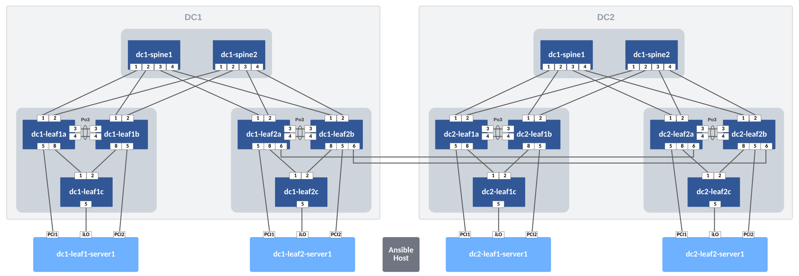
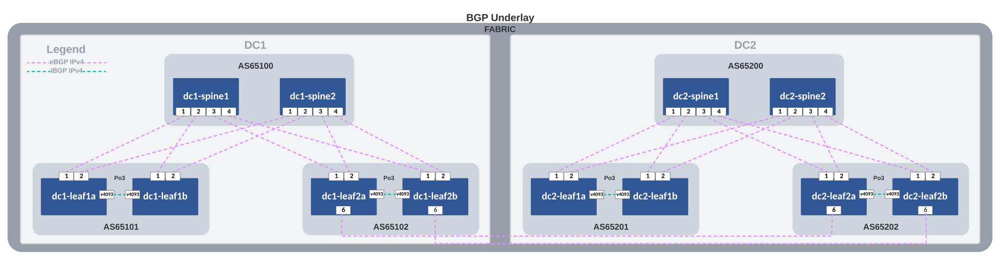
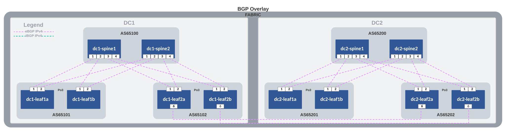
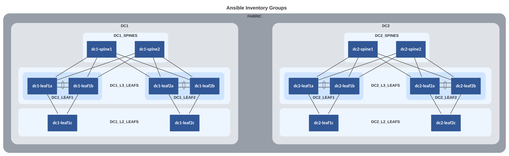

# AVD example for a dual data center using L3LS

## Introduction

This example is meant to be used as the logical evolution in AVD to new users. Therefore, this document follows the single data center structure and assumes the reader could deploy the scenario described in the section [AVD example for a single data center using L3LS](../single-dc-l3ls/README.md).

The main goal of this example is to provide a base scenario to enable the new users to grow in the number of DCs (Data Centers) and configure the interconnection between different DCs.

The example includes and describes all the AVD files and their content used to build an L3LS EVPN/VXLAN Symmetric IRB network covering two twin DCs. This design will use the EVPN DC GW feature to avoid unnecessary BGP overlay convergence. This feature rewrites EVPN routes on a set of devices (called EVPN Gateways) and shows the Gateways as the next hop for advertisements outside the EVPN domain using a DCI (DC Interconnect).

### DC1

- Two (virtual) spine switches.
- Two sets of (virtual) leaf switches, serving endpoints such as servers.
- Two (virtual) layer2-only switches often used for management connectivity to the servers.

### DC2

- Two (virtual) spine switches.
- Two sets of (virtual) leaf switches, serving endpoints such as servers.
- Two (virtual) layer2-only switches often used for management connectivity to the servers.

In order to follow the principle of network design using patterns, both DCs have the same layout to keep a repetitive pattern using the Leaf and Spine architecture.

There is, however, no hard requirement to have the exact same number of devices. For example, one DC could use 2 spines while the other could use 4 spines to comply with redundancy and bandwidth requirements.

Integration with CloudVision is not included in this example to keep everything as simple as possible. In this case, the Ansible host will communicate directly with the switches using eAPI.

## Installation

Requirements to use this example:

- Follow the installation guide for AVD found [here](../../docs/installation/collection-installation.md).
- Run the following playbook to copy the examples to your current working directory, for example `ansible-avd-examples`:

`ansible-playbook arista.avd.install_examples`

This will show the following:

```shell
 ~/ansible-avd-examples# ansible-playbook arista.avd.install_examples

PLAY [Install Examples]***************************************************************************************************************************************************************************************************************************************************************

TASK [Copy all examples to ~/ansible-avd-examples]*****************************************************************************************************************************************************
changed: [localhost]

PLAY RECAP
****************************************************************************************************************************************************************************************************************************************************************************
localhost                  : ok=1    changed=1    unreachable=0    failed=0    skipped=0    rescued=0    ignored=0
```

After the playbook has run successfully, the directory structure will look as shown below, the contents of which will be covered in later sections:

```shell
ansible-avd-examples/ (or wherever the playbook was run)
  |── dual-dc-l3ls
    ├── ansible.cfg
    ├── documentation
    ├── group_vars
    ├── images
    ├── intended
    ├── inventory.yml
    ├── playbook.yml
    ├── README.md
    └── switch-basic-configurations
```

!!! info
    If the content of any file is ***modified*** and the playbook is rerun, the file ***will not*** be overwritten. However, if any file in the example is ***deleted*** and the playbook is rerun, Ansible will re-create the file.

## Overall design overview

### Physical topology

The drawing below shows the physical topology used in this example. The interface assignment is identical to the single DC example. The only change introduced in this topology is the DCI links, which are connected to port Ethernet 6 in dc1-leaf2a/b to dc2-leaf2a/b:



### IP ranges used

| Out-of-band management IP allocation for DC1        | 172.16.1.0/24               |
|-----------------------------------------------------|-----------------------------|
| Default gateway                                     | 172.16.1.1                  |
| dc1-spine1                                          | 172.16.1.11                 |
| dc1-spine2                                          | 172.16.1.12                 |
| dc1-leaf1a                                          | 172.16.1.101                |
| dc1-leaf1b                                          | 172.16.1.102                |
| dc1-leaf2a                                          | 172.16.1.103                |
| dc1-leaf2b                                          | 172.16.1.104                |
| dc1-leaf1c                                          | 172.16.1.151                |
| dc1-leaf2c                                          | 172.16.1.152                |
| dc2-spine1                                          | 172.16.2.21                 |
| dc2-spine2                                          | 172.16.2.22                 |
| dc2-leaf1a                                          | 172.16.2.111                |
| dc2-leaf1b                                          | 172.16.2.112                |
| dc2-leaf2a                                          | 172.16.2.113                |
| dc2-leaf2b                                          | 172.16.2.114                |
| dc2-leaf1c                                          | 172.16.2.161                |
| dc2-leaf2c                                          | 172.16.2.162                |
| **Point-to-point links between leaf and spine**     | **(Underlay)**              |
| DC1                                                 | 10.255.255.0/26             |
| DC2                                                 | 10.255.255.64/26            |
| **Loopback0 interfaces used for EVPN peering**      |                             |
| DC1                                                 | 10.255.0.0/27               |
| DC2                                                 | 10.255.128.0/27             |
| **Loopback1 interfaces used for VTEP**              | **(Leaf switches)**         |
| DC1                                                 | 10.255.1.0/27               |
| DC2                                                 | 10.255.129.0/27             |
| **VTEP Loopbacks used for diagnostics**             | **(Leaf switches)**         |
| VRF10 - Common for both DCs                         | 10.255.10.0/27              |
| VRF11 - Common for both DCs                         | 10.255.11.0/27              |
| **SVIs (interface vlan...)**                        | **10.10.`<VLAN-ID>`.0/24**  |
| For example `interface VLAN11` has the IP address:  | 10.10.11.1                  |
| **MLAG Peer-link (interface vlan 4094)**            | **(Leaf switches)**         |
| DC1                                                 | 10.255.1.64/27              |
| DC2                                                 | 10.255.129.64/27            |
| **MLAG iBGP Peering (interface vlan 4093)**         | **(Leaf switches)**         |
| DC1                                                 | 10.255.1.96/27              |
| DC2                                                 | 10.255.129.96/27            |

### BGP design

New BGP connections are established from `dc1-leaf2a` and `dc1-leaf2b` to `dc2-leaf2a` and `dc2-leaf2b` respectively. In addition, all BGP learned routes are redistributed into the underlay. This allows for an easier troubleshooting, as all router IDs (Loopback0 IP addresses) and VTEPs (Loopback1 IP addresses) are reachable at a fabric level.

From the overlay perspective, each new leaf sees its peer in the twin DC as a new Route Server and will advertise all EVPN learned routes as they were directly connected to itself, making all changes inside its DC transparent to the twin DC.

=== "Underlay"

    

=== "Overlay"

    

### Basic EOS config

As discussed in the single DC example, basic connectivity between the Ansible host and the switches must be established before Ansible can be used to push configurations. Remember, you must configure the following on all switches:

- A hostname configured purely for ease of understanding.
- An IP enabled interface - in this example the dedicated out-of-band management interface is used.
- A username and password with the proper access privileges.

!!! note
    The folder `dual-dc-l3ls/switch-basic-configurations/` contains a file per device for the initial configurations.

## Ansible inventory, group vars and naming scheme

The following drawing shows a graphic overview of the Ansible inventory, group variables, and naming scheme used in this example:



!!! note
    The two servers on DC1 (`dc1-leaf1-server1` and `dc1-leaf2-server1`) and the two servers on DC2 (`dc2-leaf1-server1` and `dc2-leaf2-server1`) at the bottom are **not** configured by AVD, but the switch ports used to connect to the servers are. For this reason, the diagram shows them outside of the `FABRIC` definition.

The same pattern used in the single DC example is followed:

- Group names use uppercase and underscore
- All hostnames use lowercase and dashes

The drawing also shows the relationships between groups and their children. Be aware that all declarations on a higher level are inherited by chidren automatically.

### Content of the inventory.yml file

This section describes the entire `ansible-avd-examples/dual-dc-l3ls/inventory.yml` file used to represent the above topology.

In this example, we will consider that no DNS is available and define the IPs that the Ansible host has to reach per device.

=== "inventory.yml"

    ```yaml
    --8<--
    examples/dual-dc-l3ls/inventory.yml
    --8<--
    ```

## Defining device types

As discussed in the single DC scenario, all device types must be explicitly defined. The device types are specified in the group variable files with the following names and content:

=== "DC1_SPINES.yml"

    ```yaml
    --8<--
    examples/dual-dc-l3ls/group_vars/DC1_SPINES.yml
    --8<--
    ```

=== "DC1_L3_LEAVES.yml"

    ```yaml
    --8<--
    examples/dual-dc-l3ls/group_vars/DC1_L3_LEAVES.yml
    --8<--
    ```

=== "DC1_L2_LEAVES.yml"

    ```yaml
    --8<--
    examples/dual-dc-l3ls/group_vars/DC1_L2_LEAVES.yml
    --8<--
    ```

=== "DC2_SPINES.yml"

    ```yaml
    --8<--
    examples/dual-dc-l3ls/group_vars/DC2_SPINES.yml
    --8<--
    ```

=== "DC2_L3_LEAVES.yml"

    ```yaml
    --8<--
    examples/dual-dc-l3ls/group_vars/DC2_L3_LEAVES.yml
    --8<--
    ```

=== "DC2_L2_LEAVES.yml"

    ```yaml
    --8<--
    examples/dual-dc-l3ls/group_vars/DC2_L2_LEAVES.yml
    --8<--
    ```

## Setting fabric-wide configuration parameters

The `ansible-avd-examples/dual-dc-l3ls/group_vars/FABRIC.yml` file defines generic settings that apply to all children of the `FABRIC` group as specified in the inventory described earlier.

In this section, only additions to the previous example will be discussed. The only added change that must be inherited by both DCs is the L3 links between the L3 leaves, and it is represented at a fabric level using the following structure:

```yaml title="FABRIC.yml"
    --8<--
    examples/dual-dc-l3ls/group_vars/FABRIC.yml:54:73
    --8<--
```

1. Define a new IP Pool, with the name "DCI_IP_pool" which will use the prefix "172.100.100.0/24" to assign IP addresses.
2. Define a new link profile, called "DCI_profile" which will use the previously created IP pool, the ASN will be "65102" for left devices and "65202" for right devices. And interfaces will be included in the underlay routing protocol.
3. Define a new link, with the left and right node hostname defined in AVD, along with the interface and finally assign a profile containing all required information to configure the link.

## Setting device specific configuration parameters

Both `ansible-avd-examples/dual-dc-l3ls/group_vars/DC1.yml` and `ansible-avd-examples/dual-dc-l3ls/group_vars/DC2.yml` files define settings that apply to all children of `DC1` and `DC2` groups as specified in the inventory described earlier.

In this section, we will discuss `DC2` device definitions. From `DC1` only the changes will be discussed, as definitions are the same as in the single DC L3LS example. The only change, the one used to include the EVPN DC GW, will be discussed later.

By changing only `DC2.yml` file, the defined settings are limited to DC2. In this example, DC2 follows the same configuration as DC1, but it could be totally different, keeping the DC1 definition intact while DC2 can be adjusted to meet different requirements.

```yaml title="DC2.yml"
---
mgmt_gateway: 172.16.2.1 # (1)!

spine:
  defaults:
    platform: vEOS-lab # (2)!
    loopback_ipv4_pool: 10.255.128.0/27 # (3)!
    bgp_as: 65200 # (4)!
    bgp_defaults: # (5)!
      - distance bgp 20 200 200
      - graceful-restart restart-time 300
      - graceful-restart

  nodes: # (6)!
    dc2-spine1:
      id: 11 # (7)!
      mgmt_ip: 172.16.2.21/24 # (8)!

    dc2-spine2:
      id: 12
      mgmt_ip: 172.16.2.22/24
```

1. The default gateway for the management interface of all devices in DC2 is defined.
2. `platform` references default settings defined in AVD specific to certain switch platforms.
3. `loopback_ipv4_pool` defines the IP scope from which AVD assigns IPv4 addresses for Loopback0.
4. `bgp_as` defines the BGP AS number.
5. `bgp_defaults` defines generic BGP settings.
6. `nodes` defines the actual spine switches, using the hostnames defined in the inventory.
7. `id` is used to calculate the various IP addresses, for example, the IPv4 address for the Loopback0 interface. In this case, dc2-spine1 will get the IPv4 address 10.255.128.11/27 assigned to the Loopback0 interface.
8. `mgmt_ip` defines the IPv4 address of the management interface. As stated earlier, Ansible will perform name lookups using the hostnames specified in the inventory unless using the `ansible_host` option. However, there is no automatic mechanism to grab the result of the name lookup and use that to generate the management interface configuration.

The following section covers the L3 leaf switches. Significantly more settings need to be set compared to the spine switches:

```yaml title="DC2.yml"
l3leaf:
  defaults:
    platform: vEOS-lab # (1)!
    loopback_ipv4_pool: 10.255.128.0/27 # (2)!
    loopback_ipv4_offset: 2 # (3)!
    vtep_loopback_ipv4_pool: 10.255.129.0/27 # (4)!
    uplink_interfaces: ['Ethernet1', 'Ethernet2'] # (5)!
    uplink_switches: ['dc2-spine1', 'dc2-spine2'] # (6)!
    uplink_ipv4_pool: 10.255.255.64/26 # (7)!
    mlag_interfaces: ['Ethernet3', 'Ethernet4'] # (8)!
    mlag_peer_ipv4_pool: 10.255.129.64/27 # (9)!
    mlag_peer_l3_ipv4_pool: 10.255.129.96/27 # (10)!
    bgp_defaults:
      - distance bgp 20 200 200
      - graceful-restart restart-time 300
      - graceful-restart
    virtual_router_mac_address: 00:1c:73:00:00:99 # (11)!
    spanning_tree_priority: 4096 # (12)!
    spanning_tree_mode: mstp # (13)!

  node_groups: # (14)!
    DC2_L3_LEAF1:
      bgp_as: 65201 # (15)!
      nodes:
        dc2-leaf1a:
          id: 11
          mgmt_ip: 172.16.2.201/24
          uplink_switch_interfaces: # (16)!
            - Ethernet1
            - Ethernet1
        dc2-leaf1b:
          id: 12
          mgmt_ip: 172.16.2.202/24
          uplink_switch_interfaces:
            - Ethernet2
            - Ethernet2

    DC2_L3_LEAF2:
      bgp_as: 65202
      evpn_gateway: # (17)!
        evpn_l2:
          enabled: true
        evpn_l3:
          enabled: true
          inter_domain: true
      nodes:
        dc2-leaf2a:
          id: 13
          mgmt_ip: 172.16.2.203/24
          uplink_switch_interfaces:
            - Ethernet3
            - Ethernet3
          evpn_gateway:
            remote_peers: # (18)!
              - hostname: dc1-leaf2a
        dc2-leaf2b:
          id: 14
          mgmt_ip: 172.16.2.204/24
          uplink_switch_interfaces:
            - Ethernet4
            - Ethernet4
          evpn_gateway:
            remote_peers:
              - hostname: dc1-leaf2b
```

1. `platform` references default settings defined in AVD specific to certain switch platforms.
2. `loopback_ipv4_pool` defines the IP scope from which AVD assigns IPv4 addresses for Loopback0. This IP pool is identical to the one used for the spine switches in this example. To avoid setting the same IP addresses for several devices, we define the option `loopback_ipv4_offset`.
3. `loopback_ipv4_offset` offsets all assigned loopback IP addresses counting from the beginning of the IP scope. This is required when the same IP pool is used for two different node_types (like spine and l3leaf in this example) to avoid overlapping IPs. For example, the offset is "2" in this case because each spine switch uses one loopback address.
4. `vtep_loopback_ipv4_pool` defines the IP scope from which AVD assigns IPv4 addresses for the VTEP (Loopback1).
5. `uplink_interfaces` defines the interfaces used locally on the leaf switches.
6. `uplink_switches` defines the uplink switches, which are dc2-spine1 and dc2-spine2. Note that the `uplink_interfaces` and `uplink_switches` are paired vertically.
7. `uplink_ipv4_pool` defines the IP scope from which AVD assigns IPv4 addresses for the uplink interfaces that were just defined.
8. `mlag_interfaces` defines the MLAG interfaces used on each leaf switch, in this case, Ethernet3 and Ethernet4. These two interfaces will form PortChannel3 used for the MLAG peer link. Note that PortChannel3 is selected since the first interface is Ethernet3.
9. `mlag_peer_ipv4_pool` defines the IP scope from which AVD assigns IPv4 addresses for the MLAG peer link interface VLAN4094.
10. `mlag_peer_l3_ipv4_pool` defines the IP scope from which AVD assigns IPv4 addresses for the iBGP peering established between the two leaf switches via the SVI/IRB interface VLAN4093.
11. `virtual_router_mac_address` defines the MAC address used for the anycast gateway on the various subnets. This is the MAC address connected endpoints will learn when ARPing for their default gateway.
12. `spanning_tree_priority` sets the spanning tree priority. Since spanning tree in an L3LS network is effectively only running locally on the switch, the same priority across all L3 leaf switches can be re-used.
13. `spanning_tree_mode` defines the spanning tree mode. In this case, we are using MSTP, which is the default. However, other modes are supported should they be required, for example, for connectivity to legacy or third-party vendor environments.
14. `node_groups` defines settings common to more than one node. For example, for leaf switches, when exactly two nodes are part of a node group, AVD will, by default, automatically generate MLAG configuration.
15. `bgp_as` is defined once since an MLAG pair shares a single BGP AS number.
16. `uplink_switch_interfaces` defines the interfaces used on the uplink switches (Ethernet1 on dc2-spine1 and dc2-spine2 in this example). Defining which spine interfaces the leaf is connected to under the leaf switch settings makes adding and removing leaf switches much easier. There is no need to add/remove any settings under the spine switch section; AVD takes care of that for you. This child device/parent device hierarchy also applies to L2 and L3 leaves.
17. `evpn_gateway` configures the EVPN DC GW features that will be inherited by the children of this group, in this case dc2-leaf2a and dc2-leaf2b. `evpn_l2` configures EVPN DC GW for EVPN type 2 routes (MAC-IP) while `evpn_l3` configures the GW for EVPN type 5 routes (IP-PREFIX).
18. `remote_peers` defines the RS for EVPN DC GW that will be configured on the device. This is a unique definition per device, and using the hostname, AVD can get all the information from the device in order to generate the configuration: Router ID to peer and BGP AS.

Since we are adding the EVPN DC GW functionality in DC2, we need to also add it in DC1. This is a snipped part of `ansible-avd-examples/dual-dc-l3ls/group_vars/DC1.yml` file where the changes need to occur:

!!! important
    The following is a snipped part of `DC1.yml` reflecting the changes needed compared to single DC L3LS example. The goal is to configure EVPN DC GW functionality.

```yaml title="DC1.yml"
    --8<--
    examples/dual-dc-l3ls/group_vars/DC1.yml:100:129
    --8<--
```

Finally, the definition in DC2 for the L2 leaf switches:

```yaml title="DC2.yml"
    --8<--
    examples/dual-dc-l3ls/group_vars/DC2.yml:132:157
    --8<--
```

## Specifying network services (VRFs and VLANs) in the EVPN/VXLAN fabric

This file is identical to the one provided in the previous example. VRFs and VLANs are configured on all devices since no `tags` or `filter` are being used.

It is important to consider adding the new leaves to the Inventory as described in the [Inventory](#content-of-the-inventoryyml-file) section, so they will rely on this file to configure the network services.

```yaml title="NETWORK_SERVICES.yml"
--8<--
examples/dual-dc-l3ls/group_vars/NETWORK_SERVICES.yml
--8<--
```

## Specifying endpoint connectivity in the EVPN/VXLAN fabric

After the previous section, all VRFs and VLANs across the fabric are now defined on each leaf node. The `ansible-avd-examples/dual-dc-l3ls/group_vars/CONNECTED_ENDPOINTS.yml` file specifies the connectivity for all endpoints in the fabric (typically servers):

```yaml title="CONNECTED_ENDPOINTS.yml"
--8<--
examples/dual-dc-l3ls/group_vars/CONNECTED_ENDPOINTS.yml
--8<--
```

The configuration of the endpoints in DC2 is identical to the ones in DC1. The only change resides in the name of the leaves used and their ports.

## The playbook

The playbook is also the same, as the actions to execute in the fabric are the same. It is important to validate the `hosts` variable in the playbook to include all Ansible groups.

### Testing AVD output without a lab

Example of using this playbook without devices (local tasks):

=== "playbook.yml"

    ```yaml
    --8<--
    examples/dual-dc-l3ls/playbook.yml
    --8<--
    ```

By simply commenting out (or deleting) the last task definition, the playbook will generate all of the output (variables, configurations, documentation), but will not attempt to communicate with any devices.

Please look through the folders and files described above to learn more about the output generated by AVD.

### Executing the playbook

The execution of the playbook should produce the following output:

```shell
user@ubuntu:~/Documents/git_projects/ansible-avd-examples/dual-dc-l3ls$ ansible-playbook playbook.yml

PLAY [Run AVD] *****************************************************************************************************************************************************************************

TASK [arista.avd.eos_designs : Collection arista.avd version 3.5.0 loaded from /home/user/.ansible/collections/ansible_collections] ******************************************************
ok: [dc1-leaf1a]

TASK [arista.avd.eos_designs : Create required output directories if not present] **********************************************************************************************************
ok: [dc1-leaf1a -> localhost] => (item=/home/user/Documents/git_projects/ansible-avd-examples/dual-dc-l3ls/intended/structured_configs)
ok: [dc1-leaf1a -> localhost] => (item=/home/user/Documents/git_projects/ansible-avd-examples/dual-dc-l3ls/documentation/fabric)
(...)
```

If similar output is not shown, make sure:

1. The documented [requirements](../../docs/installation/collection-installation.md) are met.
2. The latest `arista.avd` collection is installed.

## Troubleshooting

### EVPN not working

If after doing the following steps:

1. Manually copy/paste the switch-basic-configuration to the devices.
2. Run the playbook and push the generated configuration to the fabric.
3. Login to a leaf device, for example, dc1-leaf1a and run the command `show bgp evpn summary` to view EVPN routes.

The following error message is shown:

```eos
dc1-leaf1a#show bgp evpn summ
% Not supported
dc1-leaf1a#
```

This is caused by AVD pushing the configuration line `service routing protocols model multi-agent`, which enables the multi-agent routing process supporting EVPN. This change *requires* a reboot of the device.
