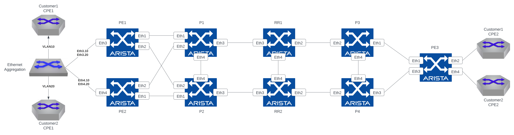
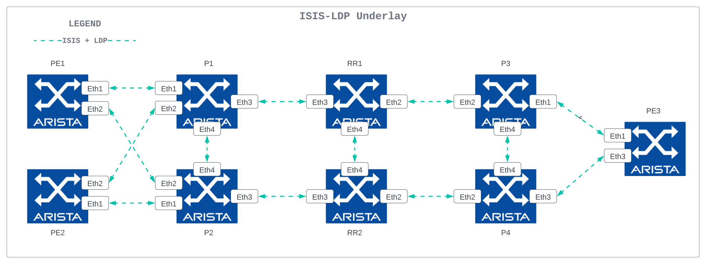
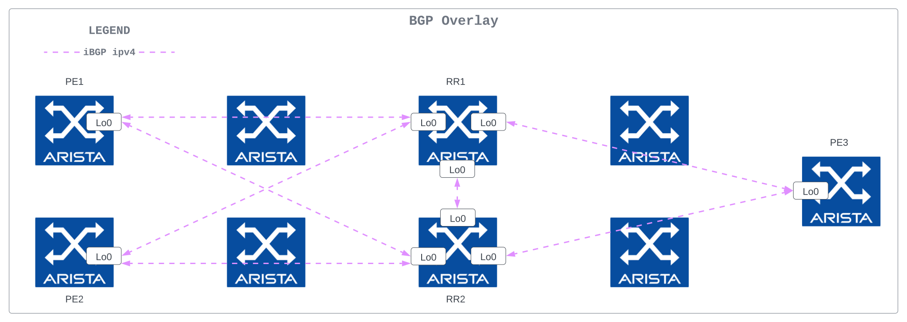
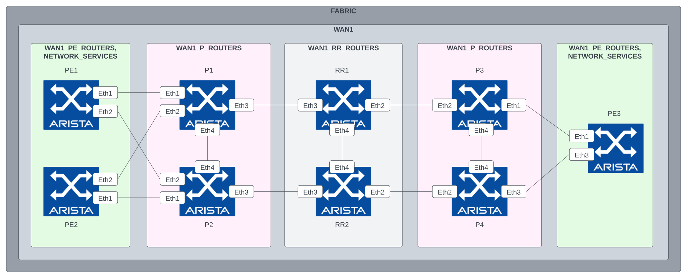

---
# This title is used for search results
title: AVD example for a MPLS-VPN based WAN Network
---
<!--
  ~ Copyright (c) 2023 Arista Networks, Inc.
  ~ Use of this source code is governed by the Apache License 2.0
  ~ that can be found in the LICENSE file.
  -->

# AVD example for a MPLS-VPN based WAN Network

## Introduction

This example is the logical second step in introducing AVD to new users, following the [Introduction to Ansible and AVD](../../docs/getting-started/intro-to-ansible-and-avd.md) section. New users with access to virtual routers (using Arista vEOS-lab or cEOS) can learn how to generate configuration and documentation for a complete fabric environment. Users with access to physical routers will have to adapt a few settings. This is all documented inline in the comments included in the YAML files. If a lab with virtual or physical routers is not accessible, this example can also be used to only generate the output from AVD if desired.

The example includes and describes all the AVD files and their content used to build a MPLS-VPN WAN network covering two sites using the following:

- Four (virtual) p routers.
- Three (virtual) pe routers serving aggregation devices and CPEs.
- Two (virtual) route reflectors act as route servers for the WAN.

This example does not include Integration with CloudVision to keep everything as simple as possible. In this case, the Ansible host will communicate directly with the routers using eAPI.

## Installation

Requirements to use this example:

- Follow the installation guide for AVD found [here](../../docs/installation/collection-installation.md).
- Run the following playbook to copy the examples to your current working directory, for example `ansible-avd-examples`:

`ansible-playbook arista.avd.install_examples`

This will show the following:

```shell
 ~/ansible-avd-examples# ansible-playbook arista.avd.install_examples

PLAY [Install Examples]***************************************************************************************************************************************************************************************************************************************************************

TASK [Copy all examples to ~/ansible-avd-examples]*****************************************************************************************************************************************************
changed: [localhost]

PLAY RECAP
****************************************************************************************************************************************************************************************************************************************************************************
localhost                  : ok=1    changed=1    unreachable=0    failed=0    skipped=0    rescued=0    ignored=0
```

After the playbook has run successfully, the directory structure will look as shown below, the contents of which will be covered in later sections:

```shell
ansible-avd-examples/ (or wherever the playbook was run)
  |── isis-ldp-ipvpn
    ├── ansible.cfg
    ├── build.yml
    ├── deploy.yml
    ├── documentation
    ├── group_vars
    ├── images
    ├── intended
    ├── inventory.yml
    ├── README.md
    └── switch-basic-configurations
```

!!! info
    If the content of any file is ***modified*** and the playbook is rerun, the file ***will not*** be overwritten. However, if any file in the example is ***deleted*** and the playbook is rerun, Ansible will re-create the file.

## Overall design overview

### Physical topology

The drawing below shows the physical topology used in this example. The interface assignment shown here is referenced across the entire example, so keep that in mind if this example must be adapted to a different topology. Finally, the Ansible host is connected to the dedicated out-of-band management port (Management1 when using vEOS-lab):



### IP ranges used

| Out-of-band management IP allocation for WAN1        | 172.16.1.0/24               |
|-----------------------------------------------------|-----------------------------|
| Default gateway                                     | 172.16.1.1                  |
| p1                                                  | 172.16.1.11                 |
| p2                                                  | 172.16.1.12                 |
| p3                                                  | 172.16.1.13                 |
| p4                                                  | 172.16.1.14                 |
| pe1                                                 | 172.16.1.101                |
| pe2                                                 | 172.16.1.102                |
| pe3                                                 | 172.16.1.103                |
| rr1                                                 | 172.16.1.151                |
| rr2                                                 | 172.16.1.152                |
| **Point-to-point links between network nodes**      | **(Underlay)**              |
| WAN1                                                | 100.64.48.0/24              |
| **Loopback0 interfaces for router ID (p)**          | 10.255.0.0/27               |
| **Loopback0 interfaces for overlay peering (pe)**   | 10.255.1.0/27               |
| **Loopback0 interfaces for overlay peering (rr)**   | 10.255.2.0/27               |
| **L3 Interfaces**                                   | **10.0-1.1.0/24**           |
| For example pe1 `Ethernet3.10` has the IP address:  | 10.0.1.1                    |
| For example pe3 `Ethernet4` has the IP address:     | 10.1.1.9                    |

### ISIS-LDP design

=== "Underlay"

    

### BGP design

=== "Overlay"

    

### Basic EOS config

Basic connectivity between the Ansible host and the routers must be established before Ansible can be used to push configurations. You must configure the following on all routers:

- A hostname configured purely for ease of understanding.
- An IP enabled interface - in this example, the dedicated out-of-band management interface is used.
- A username and password with the proper access privileges.

Below is the basic configuration file for `p1`:

```eos title="p1-basic-configuration.txt"
--8<--
examples/isis-ldp-ipvpn/switch-basic-configurations/p1-basic-configuration.txt
--8<--
```

!!! note
    The folder `isis-ldp-ipvpn/switch-basic-configurations/` contains a file per device for the initial configurations.

## Ansible inventory, group vars, and naming scheme

The following drawing shows a graphic overview of the Ansible inventory, group variables, and naming scheme used in this example:



!!! note
    The CPE's and aggregation nodes are **not** configured by AVD, but the ports used to connect to them are.

Group names use uppercase and underscore syntax:

- FABRIC
- WAN1
- WAN1_P_ROUTERS
- WAN1_PE_ROUTERS
- WAN1_RR_ROUTERS

All hostnames use lowercase, for example:

- p4
- pe1
- rr2

The drawing also shows the relationships between groups and their children:

- For example, `p1`, `p2`, `p3`, and `p4` are all children of the group called `WAN1_P_ROUTERS`.

Additionally, groups themselves can be children of another group, for example:

- `WAN1_P_ROUTERS` is a child of the group `WAN1`.
- `WAN1_PE_ROUTERS` is a child of both `WAN1` and `NETWORK_SERVICES`.

This naming convention makes it possible to extend anything easily, but as always, this can be changed based on your preferences. Just ensure that the names of all groups and hosts are unique.

### Content of the inventory.yml file

This section describes the entire `ansible-avd-examples/isis-ldp-ipvpn/inventory.yml` file used to represent the above topology.

The hostnames specified in the inventory must exist either in DNS or in the hosts file on your Ansible host to allow successful name lookup and be able to reach the routers directly. A successful ping from the Ansible host to each inventory host verifies name resolution(e.g., `ping p1`).

Alternatively, if there is no DNS available, or if devices need to be reached using a fully qualified domain name (FQDN), define `ansible_host` to be an IP address or FQDN for each device - see below for an example:

```yaml title="inventory.yml"
---
all:
  children:
    FABRIC:
      children:
        WAN1:
          children:
            WAN1_P_ROUTERS:
              hosts:
                p1:
                  ansible_host: 172.16.1.11
                p2:
                  ansible_host: 172.16.1.12
                p3:
                  ansible_host: 172.16.1.13
                p4:
                  ansible_host: 172.16.1.14
            WAN1_PE_ROUTERS:
              hosts:
                pe1:
                  ansible_host: 172.16.1.101
                pe2:
                  ansible_host: 172.16.1.102
                pe3:
                  ansible_host: 172.16.1.103
            WAN1_RR_ROUTERS:
              hosts:
                rr1:
                  ansible_host: 172.16.1.151
                rr2:
                  ansible_host: 172.16.1.152

        NETWORK_SERVICES:
          children:
            WAN1_PE_ROUTERS:
```

The above is included in this example, *purely* to make it as simple as possible. However, in the future, please do not carry over this practice to a production environment, where an inventory file for an identical topology should look as follows when using DNS:

```yaml title="inventory.yml"
---
all:
  children:
    FABRIC:
      children:
        WAN1:
          children:
            WAN1_P_ROUTERS:
              hosts:
                p1:
                p2:
                p3:
                p4:
            WAN1_PE_ROUTERS:
              hosts:
                pe1:
                pe2:
                pe3:
            WAN1_RR_ROUTERS:
              hosts:
                rr1:
                rr2:

        NETWORK_SERVICES:
          children:
            WAN1_PE_ROUTERS:
```

1. `NETWORK_SERVICES`

    - Creates a group named `NETWORK_SERVICES`. Ansible variable resolution resolves this group name to the identically named group_vars file (`ansible-avd-examples/isis-ldp-ipvpn/group_vars/NETWORK_SERVICES.yml`).

    - The file's contents are specifications of tenant VRFs and their associated routed interfaces, BGP peers, and OSPF interfaces, then applied to the group's children. In this case, the group `WAN1_PE_ROUTERS`.

## Defining device types

Since this example covers building a MPLS WAN network, AVD must know about the device types, for example, p, pe, rr routers, etc. The devices are already grouped in the inventory, so the device types are specified in the group variable files with the following names and content:

=== "WAN1_P_ROUTERS.yml"

    ```yaml
    --8<--
    examples/isis-ldp-ipvpn/group_vars/WAN1_P_ROUTERS.yml
    --8<--
    ```

=== "WAN1_PE_ROUTERS.yml"

    ```yaml
    --8<--
    examples/isis-ldp-ipvpn/group_vars/WAN1_PE_ROUTERS.yml
    --8<--
    ```

=== "WAN1_RR_ROUTERS.yml"

    ```yaml
    --8<--
    examples/isis-ldp-ipvpn/group_vars/WAN1_RR_ROUTERS.yml
    --8<--
    ```

For example, all routers that are children of the WAN1_P_ROUTERS group defined in the inventory will be of type `p`.

## Setting fabric-wide configuration parameters

The `ansible-avd-examples/isis-ldp-ipvpn/group_vars/FABRIC.yml` file defines generic settings that apply to all children of the `FABRIC` group as specified in the inventory described earlier.

The first section defines how the Ansible host connects to the devices:

```yaml title="FABRIC.yml"
ansible_connection: ansible.netcommon.httpapi # (1)!
ansible_network_os: arista.eos.eos # (2)!
ansible_user: ansible # (3)!
ansible_password: ansible
ansible_become: true
ansible_become_method: enable # (4)!
ansible_httpapi_use_ssl: true # (5)!
ansible_httpapi_validate_certs: false # (6)!
```

1. The Ansible host must use eAPI
2. Network OS which in this case is Arista EOS
3. The username/password combo
4. How to escalate privileges for write access
5. Use SSL
6. Do not validate SSL certificates

The following section specifies variables that generate configuration to be applied to all devices in the fabric:

```yaml title="FABRIC.yml"
fabric_name: FABRIC # (1)!

underlay_routing_protocol: isis-ldp
overlay_routing_protocol: ibgp

local_users: # (2)!
  - name: ansible
    privilege: 15
    role: network-admin
    sha512_password: $6$QJUtFkyu9yoecsq.$ysGzlb2YXaIMvezqGEna7RE8CMALJHnv7Q1i.27VygyKUtSeX.n2xRTyOtCR8eOAl.4imBLyhXFc4o97P5n071
  - name: admin
    privilege: 15
    role: network-admin
    no_password: true

bgp_peer_groups: # (3)!
  mpls_overlay_peers:
    password: Q4fqtbqcZ7oQuKfuWtNGRQ==

p2p_uplinks_mtu: 1500 # (4)!
```

1. The name of the fabric for internal AVD use. This name *must* match the name of an Ansible Group (and therefore a corresponding group_vars file) covering all network devices.
2. Local users/passwords and their privilege levels. In this case, the `ansible` user is set with the password `ansible`, and an `admin` user is set with no password.
3. BGP peer groups and their passwords (all passwords are "arista").
4. Point-to-point interface MTU, in this case, is set to 1500 since the example uses vEOS, but when using hardware, this should be set to 9214 instead.

## Setting device-specific configuration parameters

The `ansible-avd-examples/isis-ldp-ipvpn/group_vars/WAN1.yml` file defines settings that apply to all children of the `WAN1` group as specified in the inventory described earlier. However, this time the settings defined are no longer fabric-wide but are limited to WAN1. This example is of limited benefit with only a single data center. Still, it allows us to scale the configuration to a scenario with multiple data centers in the future.

```yaml title="WAN1.yml"
---
mgmt_gateway: 172.16.1.1 # (1)!

p:
  defaults:
    platform: vEOS-lab # (2)!
    loopback_ipv4_pool: 10.255.0.0/27 # (3)!

  nodes: # (4)!
    - name: p1
      id: 1 # (5)!
      mgmt_ip: 172.16.1.11/24 # (6)!

    - name: p2
      id: 2
      mgmt_ip: 172.16.1.12/24
```

1. The default gateway for the management interface of all devices in WAN1 is defined.
2. `platform` references default settings defined in AVD specific to certain switch platforms.
3. `loopback_ipv4_pool` defines the IP scope from which AVD assigns IPv4 addresses for Loopback0.
4. `nodes` defines the actual p routers, using the hostnames defined in the inventory.
5. `id` is used to calculate the various IP addresses, for example, the IPv4 address for the Loopback0 interface. In this case, p1 will get the IPv4 address 10.255.0.1/27 assigned to the Loopback0 interface.
6. `mgmt_ip` defines the IPv4 address of the management interface. As stated earlier, Ansible will perform name lookups using the hostnames specified in the inventory unless using the `ansible_host` option. However, there is no automatic mechanism to grab the result of the name lookup and use that to generate the management interface configuration.

The following section covers the pe routers. Significantly more settings need to be set compared to the p routers:

```yaml title="WAN1.yml"
# PE router group
pe:
  defaults:
    platform: vEOS-lab # (1)!
    loopback_ipv4_pool: 10.255.1.0/27 # (2)!
    virtual_router_mac_address: 00:1c:73:00:dc:00 # (3)!
    mpls_route_reflectors: [ rr1, rr2 ] # (4)!
    isis_system_id_prefix: '0000.0001' # (5)!
    spanning_tree_mode: none # (6)!

  node_groups: # (7)!
    - group: WAN1-PE1-2
      nodes:
        - name: pe1
          id: 1
          mgmt_ip: 172.16.1.101/24
        - name: pe2
          id: 2
          mgmt_ip: 172.16.1.102/24

    - group: WAN1-PE3
      nodes:
        - name: pe3
          id: 3
          mgmt_ip: 172.16.1.103/24
```

1. `platform` references default settings defined in AVD specific to certain switch platforms.
2. `loopback_ipv4_pool` defines the IP scope from which AVD assigns IPv4 addresses for Loopback0. Please note that this IP pool differs from the one used for the p routers in this example. If you want to reuse the same IP pool for multiple node types to avoid setting the same IP addresses for several devices, we can define the option `loopback_ipv4_offset`.
3. `virtual_router_mac_address` defines the MAC address used for the anycast gateway on the various subnets. This is the MAC address connected endpoints will learn when ARPing for their default gateway. It is irrelevant for the vpn-ipv4/6 services used in this example but is still mandatory to set.
4. `mpls_route_reflectors` defines which route reflectors the pe nodes peer with for overlay route distribution.
5. `isis_system_id_prefix` is mandatory to set when using ISIS for the underlay routing protocol. It is used to calculate the ISIS NET ID.
6. `spanning_tree_mode` defines the spanning tree mode. In this case, we are not using spanning tree since we have only routed interfaces on our pe routers.
7. `node_groups` defines settings common to more than one node. In the l3ls-evpn design this has more utility than here, which is used to define MLAG pairs. In the MPLS design, it is mainly used to logically group devices for organizational purposes.

Finally, more of the same, but this time for the rr routers:

```yaml title="WAN1.yml"
rr:
  defaults:
    platform: vEOS-lab
    loopback_ipv4_pool: 10.255.2.0/27
    mpls_route_reflectors: [ rr1, rr2 ] # (1)!
    isis_system_id_prefix: '0000.0002'
    spanning_tree_mode: none

  node_groups:
    - group: WAN1_RR1-2
      nodes:
        - name: rr1
          id: 1
          mgmt_ip: 172.16.1.151/24
        - name: rr2
          id: 2
          mgmt_ip: 172.16.1.152/24
```

1. `mpls_route_reflectors` is used here to make the rr nodes peer with each other.

## Defining underlay connectivity between network nodes

A free-standing list of `core_interfaces` dictionaries and their associated profiles and ip pools defines the underlay connectivity between nodes.

```yaml title="WAN1.yml"

core_interfaces:
  p2p_links_ip_pools:
    - name: core_pool # (1)!
      ipv4_pool: 100.64.48.0/24

  p2p_links_profiles:
    - name: core_profile # (2)!
      mtu: 1500
      isis_metric: 50
      ip_pool: core_pool
      isis_circuit_type: level-2
      isis_authentication_mode: md5
      isis_authentication_key: $1c$sTNAlR6rKSw=

  p2p_links: # (3)!
    - nodes: [ pe1, p1 ] # (4)!
      interfaces: [ Ethernet1, Ethernet1 ]
      profile: core_profile # (5)!
      id: 1 # (6)!

    - nodes: [ pe1, p2 ]
      interfaces: [ Ethernet2, Ethernet2 ]
      profile: core_profile
      id: 2
```

1. The IP pool `name` is used to assign a name to the IP pool, this is later called in the profile to associate the pool to the profile.
2. The profile `name` is used to assign a name to the link profile, which is later called under the p2p link definitions to inherit settings from the profile.
3. Each list item in `p2p_links` is a dictionary that defines one routed point-to-point underlay link and its associated parameters.
4. `nodes` is used to identify which nodes are connecting.
5. `profile` is used here to inherit common settings for the link from the profile.
6. `id` is used to extract a single /31 subnet for the link from the IP pool mentioned by the profile. Each link that shares an IP pool must have a unique ID to prevent overlapping IP addressing.

## Specifying network services (VRFs and routed interfaces) and endpoint connectivity in the VPN-IPv4 fabric

```yaml title="NETWORK_SERVICES.yml"
--8<--
examples/isis-ldp-ipvpn/group_vars/NETWORK_SERVICES.yml
--8<--
```

All tenant VRFs and routed interfaces for endpoint connectivity in the network are defined here.

Two tenants called `CUSTOMER1` and `CUSTOMER2` are specified. Each of these tenants has a single VRF defined, and under those VRFs, we define the routed interfaces, tenant (PE-CE) routing protocols and address families in use:

```yaml title="NETWORK_SERVICES.yml"
      - name: C1_VRF1
        vrf_id: 10
        address_families:
          - vpn-ipv4
        ospf:
          enabled: true
          nodes:
            - pe1
            - pe2
            - pe3
        l3_interfaces:
          - interfaces: [ Ethernet3.10, Ethernet4.10, Ethernet2 ]
            nodes: [ pe1, pe2, pe3 ]
            description: C1_L3_SERVICE
            enabled: true
            ip_addresses: [ 10.0.1.1/29, 10.0.1.2/29, 10.0.1.9/30 ]
            ospf:
              enabled: true
```

This defines `C1_VRF1`, with a VRF ID of `10`, enables OSPF routing for PE-CE connections inside the VRF on selected pe routers and defines routed interfaces that are used to connect to the CE devices/aggregation nodes. Each interface has an IP address assigned, a description, and has OSPF routing enabled.

The lists of interfaces, nodes, and ip_addresses used in the above definition of the l3 interface are read by the ansible logic as follows: interface `Ethernet3.10` belongs to the node `pe1` and has the IP address of `10.0.1.1/29`. In other words, the list indices are used to form the basic parameters for one interface.

## The playbook

In this example, the deploy playbook looks like the following:

```yaml title="deploy.yml"
--8<--
examples/isis-ldp-ipvpn/deploy.yml
--8<--
```

1. At the highest level, the name and scope of the playbook are set, which in this example is the entire fabric. For instance, `FABRIC` is a group name defined in the inventory. If the playbook should only apply to a subset of devices, it can be changed here.
2. This task uses the role `arista.avd.eos_designs`, which generates structured configuration for each device. This structured configuration can be found in the `ansible-avd-examples/isis-ldp-ipvpn/intended/structured_configs` folder.
3. This task uses the role `arista.avd.eos_cli_config_gen`, which generates the actual Arista EOS CLI configurations found in the `ansible-avd-examples/isis-ldp-ipvpn/intended/configs` folder, along with the device-specific and fabric wide documentation found in the `ansible-avd-examples/isis-ldp-ipvpn/documentation/` folder. In addition, it relies on the structured configuration generated by `arista.avd.eos_designs`.
4. This task uses the role `arista.avd.eos_config_deploy_eapi` that pushes the generated configuration to the devices in scope.

### Testing AVD output without a lab

Example of using the build playbook without devices (local tasks):

```yaml title="build.yml"
--8<--
examples/isis-ldp-ipvpn/build.yml
--8<--
```

The build playbook will generate all of the output (variables, configurations, documentation) but will not attempt to communicate with any devices.

Please look through the folders and files described above to learn more about the output generated by AVD.

### Executing the playbook

The execution of the playbook should produce the following output:

```shell
user@ubuntu:~/isis-ldp-ipvpn$ ansible-playbook deploy.yml

PLAY [Run AVD] *****************************************************************************************************************************************************************************

TASK [arista.avd.eos_designs : Collection arista.avd version 3.5.0 loaded from /home/user/.ansible/collections/ansible_collections] ******************************************************
ok: [p1]

TASK [arista.avd.eos_designs : Create required output directories if not present] **********************************************************************************************************
ok: [p1 -> localhost] => (item=/home/user/Documents/git_projects/ansible-avd-examples/isis-ldp-ipvpn/intended/structured_configs)
ok: [p1 -> localhost] => (item=/home/user/Documents/git_projects/ansible-avd-examples/isis-ldp-ipvpn/documentation/fabric)
(...)
```

If similar output is not shown, make sure:

1. The documented [requirements](../../docs/installation/collection-installation.md) are met.
2. The latest `arista.avd` collection is installed.

## Troubleshooting

### VPN-IPv4 Overlay not working

If after doing the following steps:

1. Manually copy/paste the switch-basic-configuration to the devices.
2. Run the playbook and push the generated configuration to the fabric.
3. Login to a pe or rr device, for example, pe1 and run the command `show bgp vpn-ipv4 summary` to view VPN routes.

The following error message is shown:

```eos
pe1#show bgp vpn-ipv4 summary
% Not supported
pe1#
```

This is caused by AVD pushing the configuration line `service routing protocols model multi-agent`, which enables the multi-agent routing process supporting VPN-IPv4 and EVPN. This change *requires* a reboot of the device.

### VPN-IPv4 Overlay in Arista Cloud Test (ACT)

Suppose you are running this lab in the Arista Cloud Test service, and the overlay services are not working (no connectivity from CPE to CPE) after performing the abovementioned steps. In that case, you may need to change the default forwarding engine of the vEOS nodes.

Add the following line to the starting configurations for each node:

```eos
platform tfa personality arfa
```

Currently, this command **must** be manually entered into the device configurations **before** trying to push the command with AVD. After you have entered it manually on each node, add the following YAML to group_vars/WAN1.yml and run the deployment playbook:

```yaml
eos_cli: |
  platform tfa personality arfa
```

Retest the services. They should now work, provided the CPEs and aggregation node are correctly configured.
