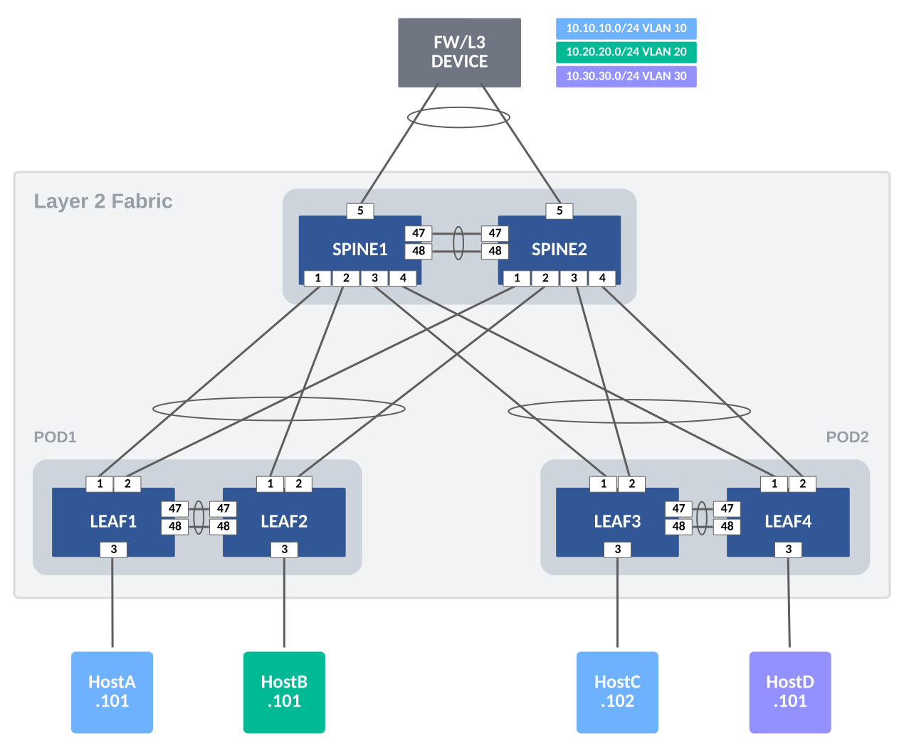
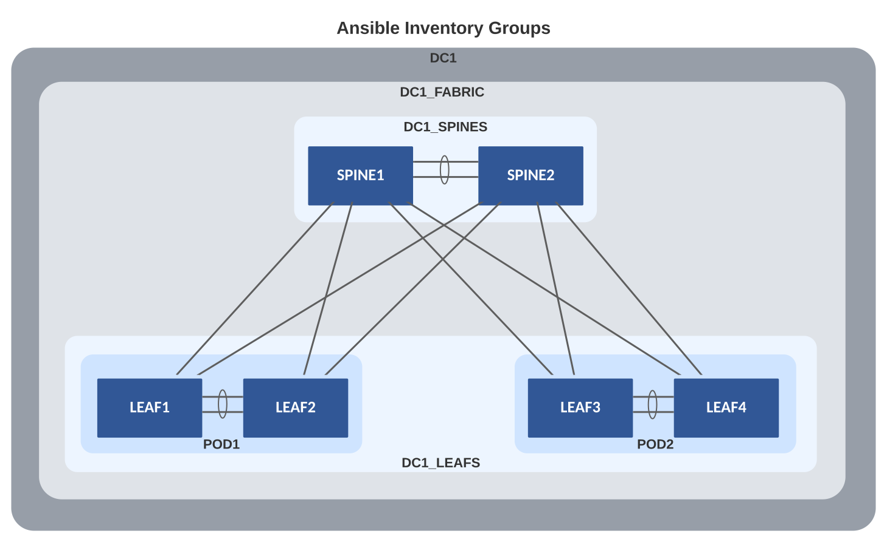

# Example for L2LS Fabric

## Introduction

The example includes and describes all the AVD files used to build a Layer 2 Leaf Spine (L2LS) Fabric, with the following nodes:

- 2 Spine switches (SPINE1 & 2)
- 4 Leaf switches (LEAF1 & 2 and LEAF3 & 4)

This L2LS Fabric is purely Layer 2.  Routing is handled by an external Firewall/L3 Device.  Later in the example, we will move routing to the Spines.  For now, we will focus on defining the fabric variables to build out this L2LS Topology.  Before we get started, we need to ensure that we have installed AVD with necessary requirements.  These are covered next in the Installation section.

The example is meant as a basic starting point. You may build more advanced examples which are based on this design. To keep things simple, the Arista eAPI will be used to communicate with the switches.  The configurations may also be applied with CloudVision with a minor change to the playbook.

## Installation & Requirements

Requirements to use this example:

1. Install AVD - Installation guide found [here](../../docs/installation/collection-installation.md).
2. Install Ansible module requirements - Instructions found [here](../../docs/installation/requirements.md).
3. Run the following playbook to copy the examples to your current working directory, for example `ansible-avd-examples`:

```bash
ansible-playbook arista.avd.install_examples
```

This will show the following:

```shell
 ~/ansible-avd-examples# ansible-playbook arista.avd.install_examples

PLAY [Install Examples]***************************************************************************************************************************************************************************************************************************************************************

TASK [Copy all examples to ~/ansible-avd-examples]*****************************************************************************************************************************************************
changed: [localhost]

PLAY RECAP
****************************************************************************************************************************************************************************************************************************************************************************
localhost                  : ok=1    changed=1    unreachable=0    failed=0    skipped=0    rescued=0    ignored=0
```

After the playbook has run successfully, the directory structure will look as shown below, the contents of which will be covered in later sections:

```shell
ansible-avd-examples/     (directory where playbook was run)
  ├── l2ls-fabric/
    ├── documentation/
    ├── group_vars/
    ├── images/
    ├── intended/
    ├── switch-basic-configurations/
    ├── ansible.cfg
    ├── inventory.yml
    ├── playbook.yml
    └── README.md (this document)
```

???+ info

    If the content of any file in the example is ***modified*** and the playbook is run again, the file ***will not*** be overwritten. However, if any file in the example is ***deleted*** and the playbook is run again, the file will be re-created.

## Design Overview

### Physical L2LS Topology

The drawing below shows the physical topology used in this example. The interface assignment shown here are referenced across the entire example, so keep that in mind if this example must be adapted to a different topology.



???+ info

    The FW/L3 Device and individual hosts in this example are not managed by AVD.

## Basic EOS Switch Configuration

Basic connectivity between the Ansible host and the switches must be established manually before Ansible can be used to push configuration. The following must be configured on all switches:

- A hostname configured purely for ease of understanding.
- An IP enabled interface - in this example the dedicated out-of-band management interface is used.
- A username and password with the proper access privileges
- eAPI Enabled

???+ info

    When using vEOS/cEOS virtual switches, `Management0` is used.  When using actual hardware switches, `Management1` is used.  The included basic config files may need to be updated for your environment.

Below is the basic configuration file for SPINE1:

```shell
--8<--
examples/l2ls-fabric/switch-basic-configurations/SPINE1.cfg
--8<--
```

## Ansible Inventory

The following is a graphical representation of the Ansible inventory group variables and naming scheme used in this example:



Group names use uppercase and underscores.

- DC1
  - DC1_FABRIC
    - DC1_SPINES
    - DC1_LEAFS
      - POD1
      - POD2

The groups are hierarchical where parent and child relationships exist. For example, both DC1_SPINES and DC1_LEAFS are children of DC1_FABRIC.  Groups of Groups are possible and allows variables to be shared at any level within the hierarchy.

This naming convention makes it possible to easily extend anything, but as always, this can be changed based on your preferences. Just ensure that the names of all groups and hosts are unique.

### inventory.yml

This sample inventory represents the 2 Spines and 2 Leaf Pairs (POD1 & POD2) and adds them to groups DC1_SPINES and DC1_LEAFS.  We apply group_vars variables to these groups to define their functionality and configurations.  Also note, the Leaf nodes belong to subgroups POD1 and POD2.  Leaf nodes defined as a pair in this manner will have MLAG configured between them. In addition, you can filter the VLANs that are applied to the POD.

It is important that the hostnames specified in the inventory exist either in DNS or in the hosts file on your Ansible host to allow successful name lookup and be able to reach the switches directly. A successful ping from the Ansible host to each inventory host allows to verify name resolution (e.g. ping SPINE1).

Alternatively, if there is no DNS available, or if devices need to be reached using a fully-qualified domain-name (FQDN), define ansible_host to be an IP address or FQDN for each device - see below for an example:

```yaml
--8<--
examples/l2ls-fabric/inventory.yml
--8<--
```

## AVD Fabric Variables

To apply AVD variables to the nodes in the fabric, we make use of Ansible group_vars. How and where you define the variables is your choice.  The below table of group_vars is one example of how to layout the fabric variables.

| Group Variable                      | Description                                   |
| ----------------------------------- | --------------------------------------------- |
| group_vars/DC1.yml                  | Global settings for all devices               |
| group_vars/DC1_FABRIC.yml           | Fabric, Topology and Device settings          |
| group_vars/DC1_SPINES.yml           | Device type for Spines                        |
| group_vars/DC1_LEAFS.yml            | Device type for Leafs                         |
| group_vars/DC1_NETWORK_SERVICES.yml | VLANs                                         |
| group_vars/DC1_NETWORK_PORTS.yml    | Port Profiles and Connected Endpoint settings |

Ansible **groups_vars** used in this example

=== "DC1"
    At the top level (DC1), the following variables are defined in **group_vars/DC1.yml**.  These variables apply to all nodes in the fabric and is a common place to set AAA, users, NTP, and management interface.  Update the user names and passwords for your environment.
    ``` yaml
    --8<--
    examples/l2ls-fabric/group_vars/DC1.yml
    --8<--
    ```

=== "DC1_FABRIC"
    At the Fabric level (DC1_FABRIC), the following variables are defined in **group_vars/DC1_FABRIC.yml**.  At this level, you define fabric name, design type (l2ls), spine and leaf defaults and provide topology interface links.  Other variables you must supply include: spanning-tree mode and priority along with an mlag IP pool.

    Variables applied under the defaults section apply to all the nodes and the same variable may be overwritten under the node itself.  Each leaf will have **uplink_switch_interfaces** variable defined.  This variable defines what interface on the uplink switch (in the case Spine1/2) the leaf is connected to. The default leaf variables `uplink_switches: [SPINE1, SPINE2]` and `uplink_interfaces: [Ethernet1, Ethernet2]` define the uplink switches and local interfaces are used on the each Leaf. LEAF2 has unique variable `uplink_switch_interfaces: [Ethernet2, Ethernet2]` defined.  This means that LEAF2 is connected to SPINE1's Ethernet2 and SPINE2's Ethernet2, respectively.
    ``` yaml
    --8<--
    examples/l2ls-fabric/group_vars/DC1_FABRIC.yml
    --8<--
    ```

=== "DC1_SPINES"
    In an L2LS design, we have 2 types of spine nodes: `spine` and `l3spine`. In AVD. the node type defines the functionality and the EOS Cli configuration to be generated.  For an L2LS design, we will use node type: spine. Later we can add L3 functionality to the Spines by changing the node type to l3spine.
    ``` yaml
    --8<--
    examples/l2ls-fabric/group_vars/DC1_SPINES.yml
    --8<--
    ```

=== "DC1_LEAFS"
    In an L2LS design, we have 1 type of leaf node: `leaf`.
    ``` yaml
    --8<--
    examples/l2ls-fabric/group_vars/DC1_LEAFS.yml
    --8<--
    ```

=== "DC1_NETWORK_SERVICES"
    Add VLANs to the Fabric by updating the **group_vars/DC1_NETWORK_SERVICES.yml**.  Each VLAN will be given a name and tag ID.  The Tag can be used to filter the VLAN to specific Leaf Pairs (PODs).  These variables are applied to spine and leaf nodes since they are a part of this inventory group.
    ``` yaml
    --8<--
    examples/l2ls-fabric/group_vars/DC1_NETWORK_SERVICES.yml
    --8<--
    ```

=== "DC1_NETWORK_PORTS"
    Our fabric would not be complete without connecting some devices to it. We define connected endpoints and port profiles in **group_vars/DC1_NETWORKS_PORTS.yml**.  Each endpoint's adapter defines which switch port(s) and port profile to use.  In our example, we have servers/hosts and a firewall connected to the fabric.  The connected endpoints keys are used for logical separation and apply to interface descriptions.  These variables are applied to spine and leaf nodes since they are a part of this inventory group.
    ``` yaml
    --8<--
    examples/l2ls-fabric/group_vars/DC1_NETWORK_PORTS.yml
    --8<--
    ```

## The Playbook

The below playbook is all that is needed to run AVD and push configurations to your switches.

```yaml
### playbook.yml
---
- name: Build Switch configuration
  hosts: DC1_FABRIC
  tasks:

    - name: Generate Structured Variables per Device
      import_role:
        name: arista.avd.eos_designs

    - name: Generate Intended Config and Documentation
      import_role:
        name: arista.avd.eos_cli_config_gen

    - name: Deploy Configuration to Device
      tags: [deploy]
      import_role:
         name: arista.avd.eos_config_deploy_eapi
```

### Playbook Run

To build the configurations files, run the following playbook called `build.yml`.

```bash
### Build configurations
ansible-playbook playbooks/build.yml
```

After the playbook run finishes, EOS CLI intended configuration files are written to `intended/configs`.

To build and push the configurations to your switches, run the following playbook called `deploy.yml`.

```bash
### Build configurations & Push Configs to switches
ansible-playbook playbooks/deploy.yml
```

### Generated Configurations

=== "SPINE1"

    ```shell
    --8<--
    examples/l2ls-fabric/intended/configs/SPINE1.cfg
    --8<--
    ```

=== "SPINE2"

    ```shell
    --8<--
    examples/l2ls-fabric/intended/configs/SPINE2.cfg
    --8<--
    ```

=== "LEAF1"

    ```shell
    --8<--
    examples/l2ls-fabric/intended/configs/LEAF1.cfg
    --8<--
    ```

=== "LEAF2"

    ```shell
    --8<--
    examples/l2ls-fabric/intended/configs/LEAF2.cfg
    --8<--
    ```

=== "LEAF3"

    ```shell
    --8<--
    examples/l2ls-fabric/intended/configs/LEAF3.cfg
    --8<--
    ```

=== "LEAF4"

    ```shell
    --8<--
    examples/l2ls-fabric/intended/configs/LEAF4.cfg
    --8<--
    ```

## Add Routing to Spines

In our example, we used an external L3/FW Device to route between subnets.  This is very typical in a layer 2 only environment.  If we want to route those subnets on our spines there are a few updates we need to make to our existing group_vars.

Update the DC1_SPINES.yml to use `l3spine`.

``` yaml
---
### group_vars/DC1_SPINES.yml

type: l3spine
```

Update DC1_NETWORK_SERVICES to use L3 SVIs.

???+ Note

    To create L3 SVIs on the spines, we need to utilize an L3 VRF.  In our case, we will use the default VRF.  `TENANT_1` is simply a name to organize VRFs and SVIs.  You may change it to your liking.

``` yaml
---
tenants:
  TENANT_1:
    vrfs:
      default:
        svis:
          10:
            name: 'BLUE-NET'
            tags: [bluezone]
            enabled: true
            ip_virtual_router_addresses:
              - 10.10.10.1
            nodes:
              SPINE1:
                ip_address: 10.10.10.2/24
              SPINE2:
                ip_address: 10.10.10.3/24
          20:
            name: 'GREEN-NET'
            tags: [greenzone]
            enabled: true
            ip_virtual_router_addresses:
              - 10.20.20.1
            nodes:
              SPINE1:
                ip_address: 10.20.20.2/24
              SPINE2:
                ip_address: 10.20.20.3/24
          30:
            name: 'ORANGE-NET'
            tags: [orangezone]
            enabled: true
            ip_virtual_router_addresses:
              - 10.30.30.1
            nodes:
              SPINE1:
                ip_address: 10.30.30.2/24
              SPINE2:
                ip_address: 10.30.30.3/24
```

Now re-run your playbook and push the new configs.  The intended/configs for the spines will have been updated with L3 SVIs.

```bash
ansible-playbook playbooks/deploy.yml
```

## Next steps

Try building your own topology and define the variables to support your own network.

## Reference Links
