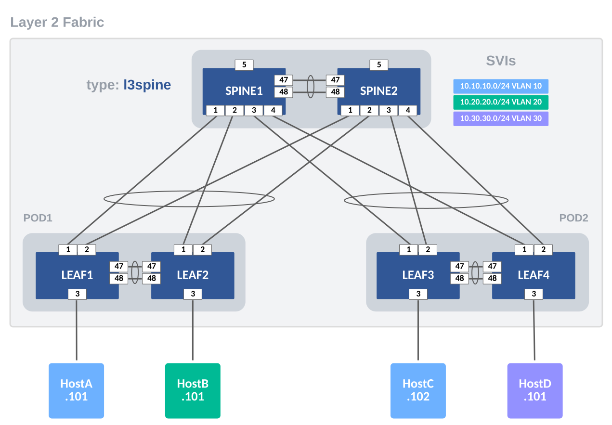

# Example for L2LS Fabric

## Introduction

This example includes and describes all the AVD files used to build a Layer 2 Leaf Spine (L2LS) Fabric, with the following nodes:

- 2 Spine nodes
- 4 Leaf nodes

The network fabric in this example is layer 2; an external firewall (FW) or layer 3 (L3) device will handle routing. Later, in this example, we will discuss adding L3 routing to the Spines. First, we will focus on defining the fabric variables to build this L2LS Topology. Before we get started, we need to ensure that we have installed AVD with the requirements covered in the Installation & Requirements section.

The example is meant as a starting foundation. You may build more advanced fabrics based on this design. To keep things simple, the Arista eAPI will be used to communicate with the switches.

???+ info

    The configurations may also be applied with CloudVision with a few updates to your playbook and Ansible variables.

## Installation & Requirements

1. Install AVD - Installation guide found [here](../../docs/installation/collection-installation.md).
2. Install Ansible module requirements - Instructions found [here](../../docs/installation/requirements.md).
3. Run the following playbook which will copy Getting Started examples to your current working directory.

```bash
# current working directory: ~/ansible-avd-examples
ansible-playbook arista.avd.install_examples
```

The output will show something similar to the following. If not, please ensure that AVD and all requirements are correctly installed.

```shell
 ~/ansible-avd-examples# ansible-playbook arista.avd.install_examples

PLAY [Install Examples]***************************************************************************************************************************************************************************************************************************************************************

TASK [Copy all examples to ~/ansible-avd-examples]*****************************************************************************************************************************************************
changed: [localhost]

PLAY RECAP
****************************************************************************************************************************************************************************************************************************************************************************
localhost                  : ok=1    changed=1    unreachable=0    failed=0    skipped=0    rescued=0    ignored=0
```

After the playbook has run successfully, the following directory structure will be created.

```shell
ansible-avd-examples/     (directory where playbook was run)
  ├── l2ls-fabric/
    ├── documentation/
    ├── group_vars/
    ├── images/
    ├── intended/
    ├── switch-basic-configurations/
    ├── ansible.cfg
    ├── inventory.yml
    ├── playbook.yml
    └── README.md (this document)
```

???+ info

    If the content of any file in the example is ***modified*** and the playbook is run again, the file ***will not*** be overwritten. However, if any file in the example is ***deleted*** and the playbook is run again, the file will be re-created.

## Design Overview

### Physical L2LS Topology

The drawing below shows the physical topology used in this example. The interface assignment shown here are referenced across the entire example, so keep that in mind if this example must be adapted to a different topology.


???+ note

    The FW/L3 Device and individual hosts (A-D) in this example are not managed by AVD, but the switch ports connecting to these devices are.

## Basic EOS Switch Configuration

Basic connectivity between the Ansible controller host and the switches must be established before Ansible can be used to deploy configurations. The following should be configured on all switches:

- Switch Hostname
- IP enabled interface
- Username and Password defined
- Management eAPI Enabled

???+ info

    When using vEOS/cEOS virtual switches, `Management0` is used. When using actual hardware switches, `Management1` is used. The included basic switch configurations may need to be adjusted for your environment.

Below is the basic configuration file for SPINE1:

```shell
--8<--
examples/l2ls-fabric/switch-basic-configurations/SPINE1.cfg
--8<--
```

## Ansible Inventory

Now that we understand the L2LS topology being used, we need to create the Ansible inventory that respresents this topology. The following is a textual and graphical representation of the Ansible inventory group variables and naming scheme used in this example:

``` text
- DC1
  - DC1_FABRIC
    - DC1_SPINES
    - DC1_LEAFS
      - POD1
      - POD2
```

DC1 represents the highest level within the hierarchical grouping. Ansible variables defined at this level will be applied to all nodes in the fabric. Ansible groups have parent and child relationships. For example, both DC1_SPINES and DC1_LEAFS are children of DC1_FABRIC. Groups of Groups are possible and allows variables to be shared at any level within the hierarchy. DC1_NETWORK_SERVICES is a group that has 2 other groups defined as children: DC1_SPINES and DC1_LEAFS. The same applies to group named DC1_NETWORK_PORTS. You will see these groups listed at the bottom of the inventory file.

This naming convention makes it possible to easily extend anything, but as always, this can be changed based on your preferences. Just ensure that the names of all groups and hosts are unique.


### inventory.yml

The below inventory file represents 2 Spines and 2 Leaf Pairs (POD1 & POD2). The nodes are defined under the groups DC1_SPINES and DC1_LEAFS, respectively. We apply group variables (group_vars) to these groups to define their functionality and configurations.

???+ note

    The Leaf nodes belong to subgroups POD1 and POD2. Leaf nodes defined as a pair in this manner will have MLAG configured between them. In addition, you can filter the VLANs that are applied to the POD.

It is important that the hostnames specified in the inventory exist either in DNS or in the hosts file on your Ansible host to allow successful name lookup and be able to reach the switches directly. A successful ping from the Ansible host to each inventory host allows to verify name resolution (e.g. ping SPINE1).

Alternatively, if there is no DNS available, or if devices need to be reached using a fully-qualified domain-name (FQDN), define variable ansible_host to be an IP address for each device.

```yaml
--8<--
examples/l2ls-fabric/inventory.yml
--8<--
```

## AVD Fabric Variables

To apply AVD variables to the nodes in the fabric, we make use of Ansible group_vars. How and where you define the variables is your choice. The below table of group_vars is one example of how to layout the fabric variables.

| group_vars/              | Description                                   |
| ------------------------ | --------------------------------------------- |
| DC1.yml                  | Global settings for all devices               |
| DC1_FABRIC.yml           | Fabric, Topology and Device settings          |
| DC1_SPINES.yml           | Device type for Spines                        |
| DC1_LEAFS.yml            | Device type for Leafs                         |
| DC1_NETWORK_SERVICES.yml | VLANs                                         |
| DC1_NETWORK_PORTS.yml    | Port Profiles and Connected Endpoint settings |

Here are the Ansible **group_vars** used in this example.

=== "DC1"
    At the top level (DC1), the following variables are defined in **group_vars/DC1.yml**. These Ansible variables apply to all nodes in the fabric and is a common place to set AAA, users, NTP, and management interface. Update local_users and passwords for your environment.

    You can create a sha512_password by creating a username and password on a switch and copy/paste it within double quotes here.

    ``` yaml
    --8<--
    examples/l2ls-fabric/group_vars/DC1.yml
    --8<--
    ```

=== "DC1_FABRIC"
    At the Fabric level (DC1_FABRIC), the following variables are defined in **group_vars/DC1_FABRIC.yml**. At this level, you define fabric name, design type (l2ls), spine and leaf defaults, ansible authentication, and interface links. Other variables you must supply include: spanning-tree mode and priority along with an mlag IP pool.

    Variables applied under the node key type (spine/leaf) defaults section are inherited to nodes under each type. These variables may be overwritten under the node itself.

    The spine interface used by a particular leaf is defined from the leaf's perspective with a variable called `uplink_switch_interfaces`. For example, LEAF2 has unique variable `uplink_switch_interfaces: [Ethernet2, Ethernet2]` defined. This means that LEAF2 is connected to SPINE1's Ethernet2 and SPINE2's Ethernet2, respectively.

    ``` yaml
    --8<--
    examples/l2ls-fabric/group_vars/DC1_FABRIC.yml
    --8<--
    ```

=== "DC1_SPINES"
    In an L2LS design, we have 2 types of spine nodes: `spine` and `l3spine`. In AVD. the node type defines the functionality and the EOS Cli configuration to be generated. For an L2LS design, we will use node type: spine. Later, we will add routing to the Spines by changing the node type to l3spine.

    ``` yaml
    --8<--
    examples/l2ls-fabric/group_vars/DC1_SPINES.yml
    --8<--
    ```

=== "DC1_LEAFS"
    In an L2LS design, we have 1 type of leaf node: `leaf`.

    ``` yaml
    --8<--
    examples/l2ls-fabric/group_vars/DC1_LEAFS.yml
    --8<--
    ```

=== "DC1_NETWORK_SERVICES"
    You add VLANs to the Fabric by updating the **group_vars/DC1_NETWORK_SERVICES.yml**. Each VLAN will be given a name and a list of tags. The Tags can be used to filter the VLAN to specific Leaf Pairs (PODs). These variables are applied to spine and leaf nodes since they are a part of this inventory group of groups.

    ``` yaml
    --8<--
    examples/l2ls-fabric/group_vars/DC1_NETWORK_SERVICES.yml
    --8<--
    ```

=== "DC1_NETWORK_PORTS"
    Our fabric would not be complete without connecting some devices to it. We define connected endpoints and port profiles in **group_vars/DC1_NETWORKS_PORTS.yml**. Each endpoint's adapter defines which switch port(s) and port profile to use. In our example, we have servers/hosts and a firewall connected to the fabric. The connected endpoints keys are used for logical separation and apply to interface descriptions. These variables are applied to spine and leaf nodes since they are a part of this inventory group.
    ``` yaml
    --8<--
    examples/l2ls-fabric/group_vars/DC1_NETWORK_PORTS.yml
    --8<--
    ```

## The Playbooks

Now that we have all of our Ansible variables (AVD inputs) defined, it is time to generate some configs. To make things simple, we provide 2 playbooks. One playbook will allow you to just build and view EOS Cli intended configurations per device. The second playbook has an additional task to also deploy the configurations to your switches. The playbooks are provided in the tabs below. The playbook is very simple as it imports 2 AVD roles: eos_designs and eos_cli_config_gen that do all the heavy lifting. The combination of these 2 roles produce recommended configurations that are part of Arista's Design Guides.

=== "build.yml"
    ```yaml
    --8<--
    examples/l2ls-fabric/build.yml
    --8<--
    ```

=== "deploy.yml"
    ```yaml
    --8<--
    examples/l2ls-fabric/deploy.yml
    --8<--
    ```

### Playbook Run

To build the configurations files, run the playbook called `build.yml`.

```bash
### Build configurations
ansible-playbook playbooks/build.yml
```

After the playbook run finishes, EOS CLI intended configuration files were written to `intended/configs`. Take a look.

To build and deploy the configurations to your switches, run the playbook called `deploy.yml`. This assumes that your Ansible host has access and authentication rights to the switches. Those auth variables were defined in DC1_FABRIC.yml.

```bash
### Build configurations & Push Configs to switches
ansible-playbook playbooks/deploy.yml
```

### EOS Intended Configurations

You configuration files should be similar to these.

=== "SPINE1"

    ```shell
    --8<--
    examples/l2ls-fabric/intended/configs/SPINE1.cfg
    --8<--
    ```

=== "SPINE2"

    ```shell
    --8<--
    examples/l2ls-fabric/intended/configs/SPINE2.cfg
    --8<--
    ```

=== "LEAF1"

    ```shell
    --8<--
    examples/l2ls-fabric/intended/configs/LEAF1.cfg
    --8<--
    ```

=== "LEAF2"

    ```shell
    --8<--
    examples/l2ls-fabric/intended/configs/LEAF2.cfg
    --8<--
    ```

=== "LEAF3"

    ```shell
    --8<--
    examples/l2ls-fabric/intended/configs/LEAF3.cfg
    --8<--
    ```

=== "LEAF4"

    ```shell
    --8<--
    examples/l2ls-fabric/intended/configs/LEAF4.cfg
    --8<--
    ```

## Add Routing to Spines

In our example, we used an external L3/FW Device to route between subnets. This is very typical in a Layer 2 only environment. To route on the spines, we remove the L3/FW device from the topology and shift the SVIs to the Spines.



The following group_vars need updated to enable L3 routing on the Spines.

- DC1_SPINES.yml
- DC1_FABRIC.yml
- DC1_NETWORK_SERVICES.yml

The updates changes are noted in the tabs below.

=== "DC1_SPINES.yml"

    Update type to `l3spine`. This makes it a routing device.

    ``` yaml
    ---
    ### group_vars/DC1_SPINES.yml

    type: l3spine
    ```

=== "DC1_FABRIC.yml"

    Update with the following changes and additions.

    - Change the node key **spine** to **l3spine** to match the node type set previously in DC1_SPINES.yml.
    - Add **loopback_ipv4_pool**
    - Add **mlag_peer_l3_ipv4_pool**
    - Add **virtual_router_mac_address**

    Here are needed updates to DC1_FABRIC.yml. Use your own IP pools.

    ``` yaml
    # Node Key must be l3spine
    l3spine:
      defaults:
        platform: cEOS-LAB
        spanning_tree_mode: mstp
        spanning_tree_priority: 4096
        # Loopback is used to generate a router-id
        loopback_ipv4_pool: 1.1.1.0/24
        mlag_peer_ipv4_pool: 192.168.0.0/24
        # Needed for L3 peering across the MLAG Trunk
        mlag_peer_l3_ipv4_pool: 10.1.1.0/24
        # Used for SVI  Virual MAC address
        virtual_router_mac_address: 00:1c:73:00:dc:01
        mlag_interfaces: [Ethernet47, Ethernet48]
    ```

=== "DC1_NETWORK_SERVICES.yml"

    Update Network Services to use L3 SVIs.

    ???+ Note

        To create L3 SVIs on the spines, we need to utilize an L3 VRF. In our case, we will use the default VRF. `VLANS` is simply a name to organize VRFs and SVIs. You may change it to your liking.

    ``` yaml
    ---
    tenants:
      VLANS:
        vrfs:
          default:
            svis:
              10:
                name: 'BLUE-NET'
                tags: [bluezone]
                enabled: true
                ip_virtual_router_addresses:
                  - 10.10.10.1
                nodes:
                  SPINE1:
                    ip_address: 10.10.10.2/24
                  SPINE2:
                    ip_address: 10.10.10.3/24
              20:
                name: 'GREEN-NET'
                tags: [greenzone]
                enabled: true
                ip_virtual_router_addresses:
                  - 10.20.20.1
                nodes:
                  SPINE1:
                    ip_address: 10.20.20.2/24
                  SPINE2:
                    ip_address: 10.20.20.3/24
              30:
                name: 'ORANGE-NET'
                tags: [orangezone]
                enabled: true
                ip_virtual_router_addresses:
                  - 10.30.30.1
                nodes:
                  SPINE1:
                    ip_address: 10.30.30.2/24
                  SPINE2:
                    ip_address: 10.30.30.3/24
    ```

Now re-run your playbook and build the new configs. The intended/configs for the spines will have been updated with L3 SVIs.

```bash
ansible-playbook playbooks/build.yml
```

If you wish to deploy these changes, then simply run the deploy playbook.

```bash
ansible-playbook playbooks/deploy.yml
```

## Next steps

Try building your own topology and define the variables to support your own networks.
