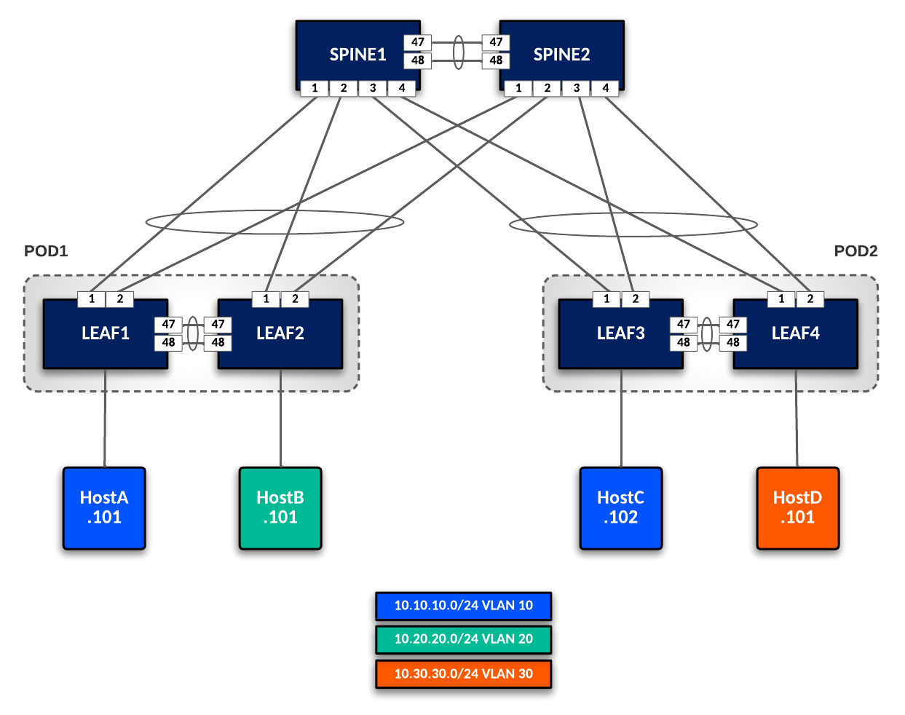

# Example for L2LS Fabric

## Introduction

This example is meant to explore using AVD with an L2LS (Layer 2 Leaf Spine) Topology. The example topology shown below contains 2 Spines and 2 Leaf Pairs. The L2LS Fabric is purely Layer 2 with no routing of SVIs in the Fabric.  In a later example, L3 routing functionality will be introduced on the Spines.



## AVD Setup

- Define Ansible Inventory (Hierarchical Groupings)
- Define AVD Fabric input variables (group_vars/host_vars)

### Sample Ansible Inventory

```yaml
DC1:
  children:
    DC1_FABRIC:
      children:
        DC1_SPINES:
          hosts:
            SPINE1:
              ansible_host: 172.100.100.101
            SPINE2:
              ansible_host: 172.100.100.102
        DC1_LEAFS:
          children:
            POD1:
              hosts:
                LEAF1:
                  ansible_host: 172.100.100.105
                LEAF2:
                  ansible_host: 172.100.100.106
            POD2:
              hosts:
                LEAF3:
                  ansible_host: 172.100.100.107
                LEAF4:
                  ansible_host: 172.100.100.108
    DC1_NETWORK_SERVICES:
      children:
        DC1_LEAFS:
        DC1_SPINES:
    DC1_NETWORK_PORTS:
      children:
        DC1_LEAFS:
        DC1_SPINES:
```
### Sample AVD group_vars/host_vars

In the ansible variables, you need to set the following required variables:

- fabric_name = name of the fabric, must match a group name in your ansible inventory (ie. DC1_FABRIC)
- design.type = l2ls
- spine node type keys
- leaf node type keys

```yaml
### DC1_FABRIC.yml
fabric_name: DC1_FABRIC

# Set Design Type to l2ls
design:
  type: "l2ls"

# L2 Only Spine Switches
spine:
  defaults:
    platform: cEOS-LAB
    spanning_tree_mode: mstp
    spanning_tree_priority: 4096
    mlag_peer_ipv4_pool: 192.168.0.0/24
    mlag_interfaces: [Ethernet47, Ethernet48]
  node_groups:
    SPINES:
      nodes:
        SPINE1:
          id: 1
          mgmt_ip: 172.100.100.101/24
        SPINE2:
          id: 2
          mgmt_ip: 172.100.100.102/24

# Leaf Switches
leaf:
  defaults:
    platform: cEOS-LAB
    mlag_peer_ipv4_pool: 192.168.0.0/24
    uplink_switches: [SPINE1, SPINE2]
    uplink_interfaces: [Ethernet1, Ethernet2]
    mlag_interfaces: [Ethernet47, Ethernet48]
    spanning_tree_mode: mstp
    spanning_tree_priority: 16384

  node_groups:
    POD1:
      mlag: true
      nodes:
        LEAF1:
          id: 1
          mgmt_ip: 172.100.100.105/24
          uplink_switch_interfaces: [Ethernet1, Ethernet1]
        LEAF2:
          id: 2
          mgmt_ip: 172.100.100.106/24
          uplink_switch_interfaces: [Ethernet2, Ethernet2]
    POD2:
      mlag: true
      nodes:
        LEAF3:
          id: 3
          mgmt_ip: 172.100.100.107/24
          uplink_switch_interfaces: [Ethernet3, Ethernet3]
        LEAF4:
          id: 4
          mgmt_ip: 172.100.100.108/24
          uplink_switch_interfaces: [Ethernet4, Ethernet4]
```