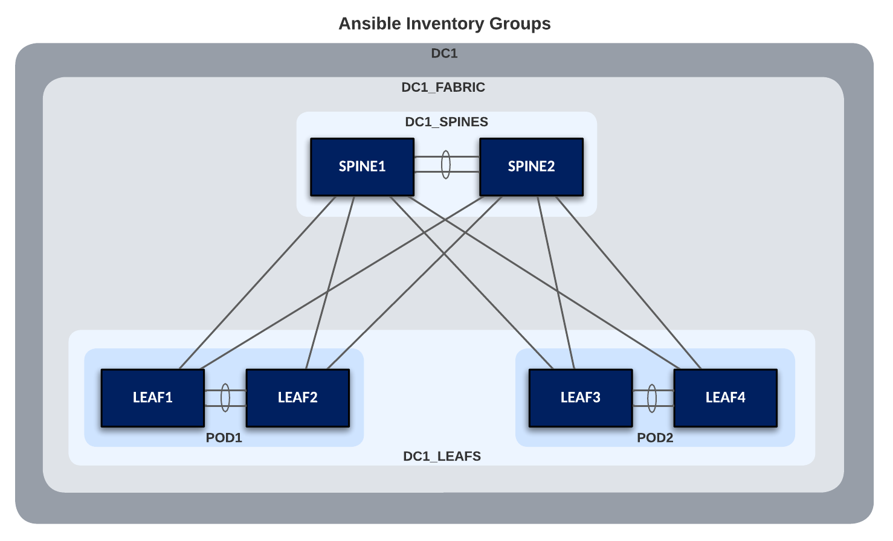

# Example for L2LS Fabric

## Introduction

The example includes and describes all the AVD files used to build a Layer 2 Leaf Spine (L2LS) Fabric, with the following nodes:

- 2 Spine switches (SPINE1 & 2)
- 4 Leaf switches (LEAF1 & 2 and LEAF3 & 4)

This L2LS Fabric is purely Layer 2.  Routing is handled by an external Firewall/L3 Device.  Later in the example, we will move routing to the Spines.  For now, we will focus on defining the fabric variables to build out this L2LS Topology.  Before we get started, we need to ensure that we have installed AVD with necessary requirements.  These are covered next in the Installation section.

The example is meant as a basic starting point. You may build advanced examples which are based this design. To keep things simple, the Arista eAPI will be used to communicate with the switches.  The configurations may also be applied with CloudVision with a minor change to the playbook.

## Installation & Requirements

Requirements to use this example:

1. Install AVD - Installation guide found [here](../../docs/installation/collection-installation.md).
2. Install Ansible module requirements - Instructions found [here](../../docs/installation/requirements.md).
3. Run the following playbook to copy the examples to your current working directory, for example `ansible-avd-examples`:

```bash
ansible-playbook arista.avd.install_examples
```

This will show the following:

```shell
 ~/ansible-avd-examples# ansible-playbook arista.avd.install_examples

PLAY [Install Examples]***************************************************************************************************************************************************************************************************************************************************************

TASK [Copy all examples to ~/ansible-avd-examples]*****************************************************************************************************************************************************
changed: [localhost]

PLAY RECAP
****************************************************************************************************************************************************************************************************************************************************************************
localhost                  : ok=1    changed=1    unreachable=0    failed=0    skipped=0    rescued=0    ignored=0
```

After the playbook has run successfully, the directory structure will look as shown below, the contents of which will be covered in later sections:

!!! info inline end

    If the content of any file in the example is ***modified*** and the playbook is run again, the file ***will not*** be overwritten. However, if any file in the example is ***deleted*** and the playbook is run again, the file will be re-created.

```shell
ansible-avd-examples/     (directory where playbook was run)
  ├── l2ls-fabric/
    ├── documentation/
    ├── group_vars/
    ├── images/
    ├── intended/
    ├── switch-basic-configurations/
    ├── ansible.cfg
    ├── inventory.yml
    ├── playbook.yml
    └── README.md (this document)
```

## Design Overview

### Physical L2LS Topology

The drawing below shows the physical topology used in this example. The interface assignment shown here are referenced across the entire example, so keep that in mind if this example must be adapted to a different topology.


???+ info

    The FW/L3 Device and individual hosts in this example are not managed by AVD.

## Basic EOS Switch Configuration

Basic connectivity between the Ansible host and the switches must be established manually before Ansible can be used to push configuration. The following must be configured on all switches:

- A hostname configured purely for ease of understanding.
- An IP enabled interface - in this example the dedicated out-of-band management interface is used.
- A username and password with the proper access privileges
- eAPI Enabled

Below is the basic configuration file for SPINE1:

```shell
! switch-basic-configurations/SPINE1.cfg
! Basic EOS config
!
username admin privilege 15 role network-admin secret sha512 $6$eucN5ngreuExDgwS$xnD7T8jO..GBDX0DUlp.hn.W7yW94xTjSanqgaQGBzPIhDAsyAl9N4oScHvOMvf07uVBFI4mKMxwdVEUVKgY/.
!
!
hostname SPINE1
!
vrf instance MGMT
!
! Enables eAPI for vrf MGMT
management api http-commands
   no shutdown
   !
   vrf MGMT
      no shutdown
!
interface Management0
   vrf MGMT
   ip address 172.100.100.101/24
!
no ip routing
no ip routing vrf MGMT
!
ip route vrf MGMT 0.0.0.0/0 172.100.100.1
!
management ssh
   vrf MGMT
      no shutdown
!
```

## Ansible Inventory

The following is a graphical representation of the Ansible inventory, group variables and naming scheme used in this example:



Group names use uppercase and underscores.

- DC1
  - DC1_FABRIC
    - DC1_SPINES
    - DC1_LEAFS
      - POD1
      - POD2

The groups are hierarchical where parent and child relationships exist. For example, both DC1_SPINES and DC1_LEAFS are children of DC1_FABRIC.  Groups of Groups are possible and allows variables to be shared at any level within the hierarchy.

This naming convention makes it possible to easily extend anything, but as always, this can be changed based on your preferences. Just ensure that the names of all groups and hosts are unique.

### inventory.yml

This sample inventory represents the 2 Spines and 2 Leaf Pairs (POD1 & POD2) and adds them to groups DC1_SPINES and DC1_LEAFS.  We apply group_vars variables to these groups to define their functionality and configurations.  Also note, the Leaf nodes belong to subgroups POD1 and POD2.  Leaf nodes defined as a pair in this manner will have MLAG configured between them. In addition, you can filter the VLANs that are applied to the POD.

It is important that the hostnames specified in the inventory exist either in DNS or in the hosts file on your Ansible host to allow successful name lookup and be able to reach the switches directly. A successful ping from the Ansible host to each inventory host allows to verify name resolution (e.g. ping SPINE1).

Alternatively, if there is no DNS available, or if devices need to be reached using a fully-qualified domain-name (FQDN), define ansible_host to be an IP address or FQDN for each device - see below for an example:

```yaml
DC1:
  children:
    DC1_FABRIC:
      children:
        DC1_SPINES:
          hosts:
            SPINE1:
              ansible_host: 172.100.100.101
            SPINE2:
              ansible_host: 172.100.100.102
        DC1_LEAFS:
          children:
            POD1:
              hosts:
                LEAF1:
                  ansible_host: 172.100.100.105
                LEAF2:
                  ansible_host: 172.100.100.106
            POD2:
              hosts:
                LEAF3:
                  ansible_host: 172.100.100.107
                LEAF4:
                  ansible_host: 172.100.100.108
    DC1_NETWORK_SERVICES:
      children:
        DC1_LEAFS:
        DC1_SPINES:
    DC1_NETWORK_PORTS:
      children:
        DC1_LEAFS:
        DC1_SPINES:
```

## AVD Fabric Variables

To apply AVD variables to the nodes in the fabric, we make use of Ansible group_vars. How and where you define the variables is your choice.  The below table of group_vars is one example of how to layout the fabric variables.

| Group Variable                      | Description                                   |
| ----------------------------------- | --------------------------------------------- |
| group_vars/DC1.yml                  | Global settings for all devices               |
| group_vars/DC1_FABRIC.yml           | Fabric, Topology and Device settings          |
| group_vars/DC1_SPINES.yml           | Device type for Spines                        |
| group_vars/DC1_LEAFS.yml            | Device type for Leafs                         |
| group_vars/DC1_NETWORK_SERVICES.yml | VLANs                                         |
| group_vars/DC1_NETWORK_PORTS.yml    | Port Profiles and Connected Endpoint settings |

### DC1.yml

At the top level (DC1), the following variables are defined in **group_vars/DC1.yml**.  These variables apply to all nodes in the fabric and is a common place to set AAA, users, NTP, and management interface.  Update the user names and passwords for your environment.

### DC1_FABRIC.yml

At the Fabric level (DC1_FABRIC), the following variables are defined in **group_vars/DC1_FABRIC.yml**.  At this level, you define fabric name, design type (l2ls), spine and leaf defaults and provide topology interface links.  Other variables you must supply include: spanning-tree mode and priority along with an mlag IP pool.

Variables applied under the defaults section apply to all the nodes and the same variable may be overwritten under the node itself.  Each leaf will have **uplink_switch_interfaces** variable defined.  This variable defines what interface on the uplink switch (in the case Spine1/2) the leaf is connected to. The default leaf variables `uplink_switches: [SPINE1, SPINE2]` and `uplink_interfaces: [Ethernet1, Ethernet2]` define the uplink switches and local interfaces are used on the each Leaf. LEAF2 has unique variable `uplink_switch_interfaces: [Ethernet2, Ethernet2]` defined.  This means that LEAF2 is connected to SPINE1's Ethernet2 and SPINE2's Ethernet2, respectively.

### DC1_SPINES.yml

In an L2LS design, we have 2 types of spine nodes: `spine` and `l3spine`. In AVD. the node type defines the functionality and the EOS Cli configuration to be generated.  For an L2LS design, we will use node type: spine. Later we can add L3 functionality to the Spines by changing the node type to l3spine.

### DC1_LEAFS.yml

In an L2LS design, we have 1 type of leaf node: `leaf`.

### DC1_NETWORK_SERVICES.yml

Add VLANs to the Fabric by updating the **group_vars/DC1_NETWORK_SERVICES.yml**.  Each VLAN will be given a name and tag ID.  The Tag can be used to filter the VLAN to specific Leaf Pairs (PODs).  These variables are applied to spine and leaf nodes since they are a part of this inventory group.

### DC1_NETWORK_PORTS.yml

Our fabric would not be complete without connecting some devices to it. We define connected endpoints and port profiles in **group_vars/DC1_NETWORKS_PORTS.yml**.  Each endpoint's adapter defines which switch port(s) and port profile to use.  In our example, we have servers/hosts and a firewall connected to the fabric.  The connected endpoints keys are used for logical separation and apply to interface descriptions.  These variables are applied to spine and leaf nodes since they are a part of this inventory group.

Ansible **groups_vars** used in this example

=== "DC1"

    ``` yaml
    ### group_vars/DC1.yml

    aaa_authentication:
      policies:
        local:
          allow_nopassword: true

    # local users
    local_users:
      # Username with no password configured
      arista:
        privilege: 15
        role: network-admin
        no_password: true

      # Username with a password
      admin:
        privilege: 15
        role: network-admin
        sha512_password: "$6$eucN5ngreuExDgwS$xnD7T8jO..GBDX0DUlp.hn.W7yW94xTjSanqgaQGBzPIhDAsyAl9N4oScHvOMvf07uVBFI4mKMxwdVEUVKgY/."

    # OOB Management network default gateway.
    mgmt_gateway: 172.100.100.1
    mgmt_interface: Management0

    # dns servers.
    name_servers:
      - 8.8.4.4
      - 8.8.8.8

    # NTP Servers IP or DNS name, first NTP server will be prefered, and sourced from Managment VRF
    ntp:
      servers:
      - name: time.google.com
        preferred: true
        vrf: MGMT
      - name: pool.ntp.org
        vrf: MGMT

    aaa_authorization:
      exec:
        default: local
    ```

=== "DC1_FABRIC"

    ``` yaml
    ### group_vars/DC1_FABRIC.yml

    fabric_name: DC1_FABRIC

    # Set Design Type to l2ls
    design:
      type: l2ls

    # L2 Only Spine Switches
    spine:
      defaults:
        platform: cEOS-LAB
        spanning_tree_mode: mstp
        spanning_tree_priority: 4096
        mlag_peer_ipv4_pool: 192.168.0.0/24
        mlag_interfaces: [Ethernet47, Ethernet48]
      node_groups:
        SPINES:
          nodes:
            SPINE1:
              id: 1
              mgmt_ip: 172.100.100.101/24
            SPINE2:
              id: 2
              mgmt_ip: 172.100.100.102/24

    # Leaf Switches
    leaf:
      defaults:
        platform: cEOS-LAB
        mlag_peer_ipv4_pool: 192.168.0.0/24
        uplink_switches: [SPINE1, SPINE2]
        uplink_interfaces: [Ethernet1, Ethernet2]
        mlag_interfaces: [Ethernet47, Ethernet48]
        spanning_tree_mode: mstp
        spanning_tree_priority: 16384

      node_groups:
        POD1:
          mlag: true
          nodes:
            LEAF1:
              id: 1
              mgmt_ip: 172.100.100.105/24
              uplink_switch_interfaces: [Ethernet1, Ethernet1]
            LEAF2:
              id: 2
              mgmt_ip: 172.100.100.106/24
              uplink_switch_interfaces: [Ethernet2, Ethernet2]
        POD2:
          mlag: true
          nodes:
            LEAF3:
              id: 3
              mgmt_ip: 172.100.100.107/24
              uplink_switch_interfaces: [Ethernet3, Ethernet3]
            LEAF4:
              id: 4
              mgmt_ip: 172.100.100.108/24
              uplink_switch_interfaces: [Ethernet4, Ethernet4]
    ```

=== "DC1_SPINES"

    ``` yaml
    ### group_vars/DC1_SPINES.yml

    type: spine    # Must be either < spine | l3spine >
    ```

=== "DC1_LEAFS"

    ``` yaml
    ### group_vars/DC1_LEAFS.yml

    type: leaf     # Must be < leaf >
    ```

=== "DC1_NETWORK_SERVICES"

    ``` yaml
    ### group_vars/DC1_NETWORK_SERVICES.yml

    tenants:
      VLANS:
        l2vlans:
          10:
            name: 'BLUE-NET'
            tags: [bluezone]
          20:
            name: 'GREEN-NET'
            tags: [greenzone]
          30:
            name: 'ORANGE-NET'
            tags: [orangezone]
    ```

=== "DC1_NETWORK_PORTS"

    ``` yaml
    ### group_vars/DC1_NETWORK_PORTS.yml

    connected_endpoints_keys:
      servers:
        type: server
      firewalls:
        type: firewall
      routers:
        type: router

    port_profiles:
      PP-DEFAULTS:
        spanning_tree_portfast: edge
      PP-BLUE:
        mode: access
        vlans: "10"
        parent_profile: PP-DEFAULTS
      PP-GREEN:
        mode: access
        vlans: "20"
        parent_profile: PP-DEFAULTS
      PP-ORANGE:
        mode: access
        vlans: "30"
        parent_profile: PP-DEFAULTS
      PP-FIREWALL:
        mode: trunk
        vlans: "10,20,30"

    servers:

      HostA:
        rack: POD1
        adapters:
          - endpoint_ports: [Eth1]
            switch_ports: [Ethernet3]
            switches: [LEAF1]
            profile: PP-BLUE
      HostB:
        rack: POD1
        adapters:
          - endpoint_ports: [Eth1]
            switch_ports: [Ethernet3]
            switches: [LEAF2]
            profile: PP-GREEN
      HostC:
        rack: POD2
        adapters:
          - endpoint_ports: [Eth1]
            switch_ports: [Ethernet3]
            switches: [LEAF3]
            profile: PP-BLUE
      Host2:
        rack: POD2
        adapters:
          - endpoint_ports: [Eth1]
            switch_ports: [Ethernet3]
            switches: [LEAF4]
            profile: PP-ORANGE

    firewalls:

      FIREWALL:
        adapters:
          - endpoint_ports: [Eth1, Eth2]
            switch_ports: [Ethernet5, Ethernet5]
            switches: [SPINE1, SPINE2]
            profile: PP-FIREWALL
            port_channel:
              mode: active
    ```

## The Playbook

The below playbook is all that is needed to run AVD and push configurations to your switches.

```yaml
### playbook.yml
---
- name: Build Switch configuration
  hosts: DC1_FABRIC
  tasks:

    - name: Generate Structured Variables per Device
      import_role:
        name: arista.avd.eos_designs

    - name: Generate Intended Config and Documentation
      import_role:
        name: arista.avd.eos_cli_config_gen

    - name: Deploy Configuration to Device
      tags: [deploy]
      import_role:
         name: arista.avd.eos_config_deploy_eapi
```

### Playbook Run

```bash
### Build configurations
ansible-playbook playbooks/run_avd.yml -i inventory.yml --tags build
```

If you wish to build and deploy the configurations to your hardware or virtual network, add the `deploy` tag.  You will also need to supply connectivity parameters in your **group_vars/DC1_FABRIC.yml** to communicate with devices.

Add in the following section and update vars as needed.

```yaml
# Add this section to your group_vars/DC1_FABRIC.yml
# eAPI connectivity via HTTPS is specified (as opposed to CLI via SSH)
ansible_connection: ansible.netcommon.httpapi
# Specifies that we are indeed using Arista EOS
ansible_network_os: arista.eos.eos
# This user/password must exist on the switches to enable Ansible access
ansible_user: admin
ansible_password: admin
# User escalation (to enter enable mode)
ansible_become: true
ansible_become_method: enable
# Use SSL (HTTPS)
ansible_httpapi_use_ssl: true
# Do not try to validate certs
ansible_httpapi_validate_certs: false
```

Then you can build and deploy configurations to your network.

```bash
### Build and Deploy configurations
ansible-playbook playbooks/run_avd.yml -i inventory.yml --tags build,deploy
```
