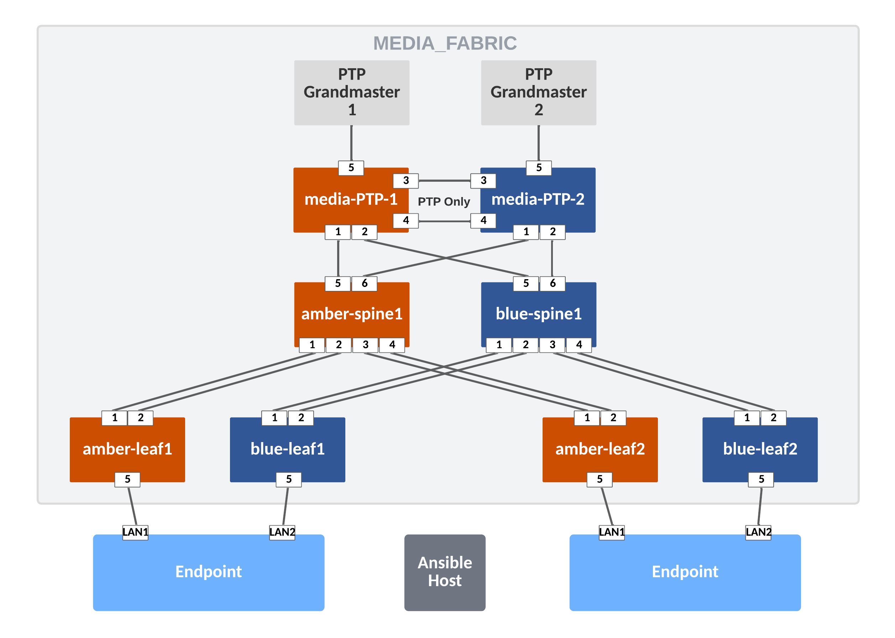
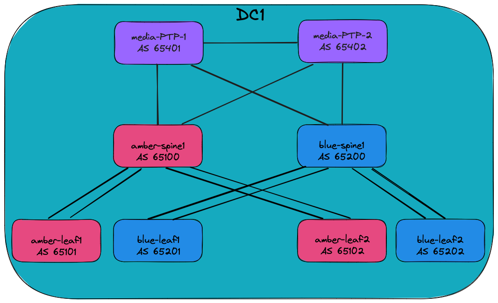
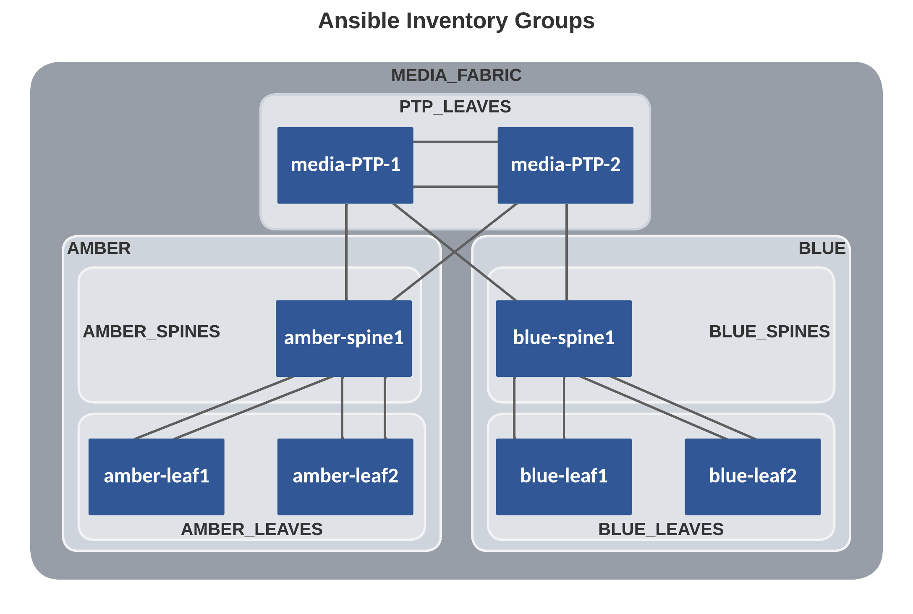

<!--
  ~ Copyright (c) 2023 Arista Networks, Inc.
  ~ Use of this source code is governed by the Apache License 2.0
  ~ that can be found in the LICENSE file.
  -->

# AVD example for Media & Entertainment customers using L3LS

## Introduction

This example is meant to be used as the logical second step in introducing AVD to new users, directly following the [Introduction to Ansible and AVD](../../docs/getting-started/intro-to-ansible-and-avd.md) section. The idea is that new users with access to virtual switches (using Arista vEOS-lab or cEOS) can learn how to generate configuration and documentation for a complete fabric environment. Users with access to physical switches will have to adapt a few settings. This is all documented inline in the comments included in the YAML files. If a lab with virtual or physical switches is not accessible, this example can also be used to only generate the output from AVD if required.

The example includes and describes all the AVD files and their content used, to build a pure Layer 3 Leaf-Spine (L3LS) network covering a single network fabric. No EVPN/VXLAN overlay is used.

It is aimed at users in the broadcasting industry interested in building a network capable of Seamless Protection Switching (SMPTE 2022-7) using the following:

- Two (virtual) spine switches, one for Amber and one for Blue
- Four (virtual) leaf switches, two for Amber and two for Blue, all serving endpoints such as cameras, microphones, multiviewers etc.
- Two (virtual) leaf switches, used for PTP connectivity to/from the redundant PTP Grandmasters.

Ansible playbooks are included to show the following:

- Building the intended configuration and documentation
- Deploying the configuration directly to the switches using eAPI
- Deploying the configuration via CloudVision to the switches, thereby including a full change-based workflow with rollback capability etc.

## Installation

Requirements to use this example:

- Follow the installation guide for AVD found [here](../../docs/installation/collection-installation.md).
- Run the following playbook to copy the AVD **examples** to your current working directory, for example `ansible-avd-examples`:

`ansible-playbook arista.avd.install_examples`

This will show the following:

```shell
 ~/ansible-avd-examples# ansible-playbook arista.avd.install_examples

PLAY [Install Examples]***************************************************************************************************************************************************************************************************************************************************************

TASK [Copy all examples to ~/ansible-avd-examples]*****************************************************************************************************************************************************
changed: [localhost]

PLAY RECAP
****************************************************************************************************************************************************************************************************************************************************************************
localhost                  : ok=1    changed=1    unreachable=0    failed=0    skipped=0    rescued=0    ignored=0
```

After the playbook has run successfully, the directory structure will look as shown below, the contents of which will be covered in later sections:

```shell
ansible-avd-examples/ (or wherever the playbook was run)
  |── media
    ├── ansible.cfg
    ├── documentation
    ├── group_vars
    ├── images
    ├── intended
    ├── switch-basic-configurations
    ├── build.yml
    ├── cvaas.token
    ├── deploy-cvp.yml
    ├── deploy.yml
    ├── inventory.yml
    ├── README.md
    └── validate.yml
```

!!! info
    If the content of any file is ***modified*** and the playbook is rerun, the file ***will not*** be overwritten. However, if any file in the example is ***deleted*** and the playbook is rerun, Ansible will re-create the file.

## Overall design overview

### Physical topology

The drawing below shows the physical topology used in this example. The interface assignment shown here are referenced across the entire example, so keep that in mind if this example must be adapted to a different topology.


### IP ranges used

| Out-of-band management IP allocation for MEDIA_FABRIC | 172.16.1.0/24               |
|-------------------------------------------------------|-----------------------------|
| Default gateway                                       | 172.16.1.1                  |
| amber-spine1                                          | 172.16.1.11                 |
| amber-leaf1                                           | 172.16.1.111                |
| amber-leaf2                                           | 172.16.1.112                |
| blue-spine1                                           | 172.16.1.21                 |
| blue-leaf1                                            | 172.16.1.211                |
| blue-leaf2                                            | 172.16.1.212                |
| media-PTP-1                                           | 172.16.1.131                |
| media-PTP-2                                           | 172.16.1.132                |
| **Point-to-point links between leaf and spine**       | **(Underlay)**              |
| PTP_LEAVES                                            | 10.255.253.0/26             |
| AMBER_LEAVE                                           | 10.255.254.0/26             |
| BLUE_LEAVES                                           | 10.255.255.0/26             |
| **Loopback0 interfaces - AMBER**                      | 10.255.1.0/27               |
| **Loopback0 interfaces - BLUE**                       | 10.255.2.0/27               |
| **Loopback0 interfaces - PURPLE**                     | 10.255.3.0/27               |
| **SVIs (interface vlan...)**                          | **10.10.`<VLAN-ID>`.0/24**  |
| For example `interface VLAN111` has the IP address:   | 10.10.111.1                 |
| **CloudVision Portal**                                |                             |
| cvp                                                   | 192.168.1.12                |

### BGP design

=== "Underlay"

    

### Basic EOS config

Basic connectivity between the Ansible host and the switches must be established before Ansible can be used to push configurations. You must configure the following on all switches:

- A hostname configured purely for ease of understanding.
- An IP enabled interface - in this example the dedicated out-of-band management interface is used.
- A username and password with the proper access privileges.

Below is an overview of the basic configuration files included with the example:

=== "amber-spine1"

    ```yaml
    --8<--
    examples/media/switch-basic-configurations/amber-spine1-basic-configuration.txt
    --8<--
    ```

=== "amber-leaf1"

    ```yaml
    --8<--
    examples/media/switch-basic-configurations/amber-leaf1-basic-configuration.txt
    --8<--
    ```

=== "amber-leaf2"

    ```yaml
    --8<--
    examples/media/switch-basic-configurations/amber-leaf2-basic-configuration.txt
    --8<--
    ```

=== "blue-spine1"

    ```yaml
    --8<--
    examples/media/switch-basic-configurations/blue-spine1-basic-configuration.txt
    --8<--
    ```

=== "blue-leaf1"

    ```yaml
    --8<--
    examples/media/switch-basic-configurations/blue-leaf1-basic-configuration.txt
    --8<--
    ```

=== "blue-leaf2"

    ```yaml
    --8<--
    examples/media/switch-basic-configurations/blue-leaf2-basic-configuration.txt
    --8<--
    ```

=== "media-PTP-1"

    ```yaml
    --8<--
    examples/media/switch-basic-configurations/media-PTP-1-basic-configuration.txt
    --8<--
    ```

=== "media-PTP-2"

    ```yaml
    --8<--
    examples/media/switch-basic-configurations/media-PTP-2-basic-configuration.txt
    --8<--
    ```

!!! note
    The folder `media/switch-basic-configurations/` contains a file per device for the initial configurations.

## Ansible inventory, group vars and naming scheme

The following drawing shows a graphic overview of the Ansible inventory, group variables, and naming scheme used in this example:



Group names use uppercase and underscore syntax:

- MEDIA_FABRIC
- PTP_LEAVES
- AMBER
- AMBER_SPINES
- AMBER_LEAVES
- BLUE
- BLUE_SPINES
- BLUE_LEAVES

All hostnames use lowercase and dashes, for example `amber-spine1`

The drawing also shows the relationships between groups and their children:

- For example, `amber-leaf1` and `amber-leaf2` are both children of the group called `AMBER_LEAVES`.

Additionally, groups themselves can be children of another group, for example:

- `AMBER` is a group consisting of the groups `AMBER_SPINES` and `AMBER_LEAVES`

This naming convention makes it possible to extend anything easily, but as always, this can be changed based on your preferences. Just ensure that the names of all groups and hosts are unique.

### Content of the inventory.yml file

This section describes the entire `ansible-avd-examples/media/inventory.yml` file used to represent the above topology.

It is important that the hostnames specified in the inventory exist either in DNS or in the hosts file on your Ansible host to allow successful name lookup and be able to reach the switches directly. A successful ping from the Ansible host to each inventory host verifies name resolution(e.g., `ping amber-spine1`).

Alternatively, if there is no DNS available, or if devices need to be reached using a fully qualified domain name (FQDN), define `ansible_host` to be an IP address or FQDN for each device - see below for an example:

```yaml title="inventory.yml"
---
all:
  children:
    CLOUDVISION:
      hosts:
        cvp:
          # Ansible variables used by the ansible_avd and ansible_cvp roles to push configuration to devices via CVP
          ansible_host: 192.168.1.12
          ansible_user: ansible
          ansible_password: ansible
          ansible_connection: httpapi
          ansible_httpapi_use_ssl: true
          ansible_httpapi_validate_certs: false
          ansible_network_os: eos
    MEDIA_FABRIC:
      children:
        AMBER:
          children:
            AMBER_SPINES:
              hosts:
                amber-spine1:
                  ansible_host: 172.16.1.11
            AMBER_LEAVES:
              hosts:
                amber-leaf1:
                  ansible_host: 172.16.1.111
                amber-leaf2:
                  ansible_host: 172.16.1.112
        BLUE:
          children:
            BLUE_SPINES:
              hosts:
                blue-spine1:
                  ansible_host: 172.16.1.21
            BLUE_LEAVES:
              hosts:
                blue-leaf1:
                  ansible_host: 172.16.1.211
                blue-leaf2:
                  ansible_host: 172.16.1.212
        PTP_LEAVES:
          hosts:
            media-PTP-1:
              ansible_host: 172.16.1.131
            media-PTP-2:
              ansible_host: 172.16.1.132
    NETWORK_SERVICES:
      children:
        AMBER_LEAVES:
        BLUE_LEAVES:
        PTP_LEAVES:
    CONNECTED_ENDPOINTS:
      children:
        AMBER_LEAVES:
        BLUE_LEAVES:
        PTP_LEAVES:
```

The above is what is included in this example, *purely* to make it as simple as possible to get started. However, in the future, please do not carry over this practice to a production environment, where an inventory file for an identical topology should look as follows when using DNS:

```yaml title="inventory.yml"
---
all:
  children:
    CLOUDVISION: # (1)!
      hosts:
        cvp:
          # Ansible variables used by the ansible_avd and ansible_cvp roles to push configuration to devices via CVP
          ansible_httpapi_host: cvp
          ansible_host: cvp
          ansible_user: ansible
          ansible_password: ansible
          ansible_connection: httpapi
          ansible_httpapi_use_ssl: true
          ansible_httpapi_validate_certs: false
          ansible_network_os: eos
    MEDIA_FABRIC:
      children:
        AMBER:
          children:
            AMBER_SPINES:
              hosts:
                amber-spine1:
            AMBER_LEAVES:
              hosts:
                amber-leaf1:
                amber-leaf2:
        BLUE:
          children:
            BLUE_SPINES:
              hosts:
                blue-spine1:
            BLUE_LEAVES:
              hosts:
                blue-leaf1:
                blue-leaf2:
        PTP_LEAVES:
          hosts:
            media-PTP-1:
            media-PTP-2:
    NETWORK_SERVICES: # (2)!
      children:
        AMBER_LEAVES:
        BLUE_LEAVES:
        PTP_LEAVES:
    CONNECTED_ENDPOINTS: # (3)!
      children:
        AMBER_LEAVES:
        BLUE_LEAVES:
        PTP_LEAVES:
```

1. `CLOUDVISION`

   - Defines the relevant values required to enable communication with CloudVision.

   - Specifically the hostname (`cvp`) of the CloudVision Portal server used, the username (`ansible`) and password (`ansible`), connection method (`httpapi`), SSL and certificate settings.

   - Please note that the username (`ansible`) and password (`ansible`) defined here must exist in CloudVision.

   - More information is available [here](https://avd.sh/en/stable/roles/eos_config_deploy_cvp/index.html?h=is_deployed#inputs)

2. `NETWORK_SERVICES`

    - Creates a group named `NETWORK_SERVICES`. Ansible variable resolution resolves this group name to the identically named group_vars file (`ansible-avd-examples/media/group_vars/NETWORK_SERVICES.yml`).

    - The file's contents, which in this case are specifications of VRFs and VLANs, are then applied to the group's children. In this case, the three groups `AMBER_LEAVES`, `BLUE_LEAVES` and `PTP_LEAVES`.

3. `CONNECTED_ENDPOINTS`

    - Creates a group named `CONNECTED_ENDPOINTS`. Ansible variable resolution resolves this group name to the identically named group_vars file (`ansible-avd-examples/media/group_vars/CONNECTED_ENDPOINTS.yml`).

    - The file's contents, which in this case are specifications of connected endpoints (typically servers), are then applied to the children of the group, in this case, the three groups `AMBER_LEAVES`, `BLUE_LEAVES` and `PTP_LEAVES`.

## Defining device types

Since this example covers building an L3LS network, AVD must know about the device types, for example, spines, L3 leaves, L2 leaves, etc. The devices are already grouped in the inventory, so the device types are specified in the group variable files with the following names and content:

=== "AMBER_SPINES.yml"

    ```yaml
    --8<--
    examples/media/group_vars/AMBER_SPINES.yml
    --8<--
    ```

=== "AMBER_LEAVES.yml"

    ```yaml
    --8<--
    examples/media/group_vars/AMBER_LEAVES.yml
    --8<--
    ```

=== "BLUE_SPINES.yml"

    ```yaml
    --8<--
    examples/media/group_vars/BLUE_SPINES.yml
    --8<--
    ```

=== "BLUE_LEAVES.yml"

    ```yaml
    --8<--
    examples/media/group_vars/BLUE_LEAVES.yml
    --8<--
    ```

=== "PTP_LEAVES.yml"

    ```yaml
    --8<--
    examples/media/group_vars/PTP_LEAVES.yml
    --8<--
    ```

For example, all switches that are children of the AMBER_SPINES group defined in the inventory will be of type `media_spine`.

## Setting fabric-wide configuration parameters

The `ansible-avd-examples/media/group_vars/MEDIA_FABRIC.yml` file defines generic settings that apply to all children of the `MEDIA_FABRIC` group as specified in the inventory described earlier.

The first section defines how the Ansible host connects to the devices:

```yaml title="FABRIC.yml"
ansible_connection: ansible.netcommon.httpapi # (1)!
ansible_network_os: arista.eos.eos # (2)!
ansible_user: ansible # (3)!
ansible_password: ansible
ansible_become: true
ansible_become_method: enable # (4)!
ansible_httpapi_use_ssl: true # (5)!
ansible_httpapi_validate_certs: false # (6)!
```

1. The Ansible host must use eAPI
2. Network OS which in this case is Arista EOS
3. The username/password combo
4. How to escalate privileges to get write access
5. Use SSL
6. Do not validate SSL certificates

The following section specifies variables that generate configuration to be applied to all devices in the fabric:

```yaml title="MEDIA_FABRIC.yml"
fabric_name: MEDIA_FABRIC # (1)!

node_type_keys: # (2)!
  ptp_leaf:
    type: ptp_leaf
    default_overlay_routing_protocol: none
    connected_endpoints: true
    network_services:
      l2: true
      l3: true
    default_ptp_priority1: 10
  media_spine:
    type: media_spine
    default_overlay_routing_protocol: none
    connected_endpoints: true
    network_services:
      l2: true
      l3: true
    default_ptp_priority1: 20
  media_leaf:
    type: media_leaf
    default_overlay_routing_protocol: none
    connected_endpoints: true
    network_services:
      l2: true
      l3: true
    default_ptp_priority1: 30

local_users: # (3)!
  ansible:
    privilege: 15
    role: network-admin
    sha512_password: $6$7u4j1rkb3VELgcZE$EJt2Qff8kd/TapRoci0XaIZsL4tFzgq1YZBLD9c6f/knXzvcYY0NcMKndZeCv0T268knGKhOEwZAxqKjlMm920
  admin:
    privilege: 15
    role: network-admin
    no_password: true

bgp_peer_groups: # (4)!
  ipv4_underlay_peers:
    password: 7x4B4rnJhZB438m9+BrBfQ==

p2p_uplinks_mtu: 1500 # (5)!

default_interfaces: # (6)!
  - types: [ media_spine ]
    platforms: [ default ]
    uplink_interfaces: [ Ethernet1-2 ]
    downlink_interfaces: [ Ethernet1-8 ]
  - types: [ media_leaf ]
    platforms: [ default ]
    uplink_interfaces: [ Ethernet1-4 ]
  - types: [ ptp_leaf ]
    platforms: [ default ]
    uplink_interfaces: [ Ethernet1-2 ]

daemon_terminattr: # (7)!
  cvaddrs:
    - 192.168.1.12:9910
  cvauth:
    method: token
    token_file: /tmp/token
  cvvrf: MGMT
  disable_aaa: true
  smashexcludes: ale,flexCounter,hardware,kni,pulse,strata
  ingestexclude: /Sysdb/cell/1/agent,/Sysdb/cell/2/agent
  taillogs:

ptp: # (8)!
  enabled: true

underlay_multicast: true # (9)!

aaa_authentication: # (10)!
  login:
    default: local
aaa_authorization:
  exec:
    default: local

mgmt_interface: Ethernet0 # (11)!
mgmt_gateway: 172.16.1.1
mgmt_destination_networks:
  - 0.0.0.0/0

name_servers: # (12)!
  - 192.168.1.1

ntp: # (13)!
  local_interface:
    name: Management1
    vrf: MGMT
  servers:
    - name: 0.pool.ntp.org
      vrf: MGMT

core_interfaces: # (14)!
  p2p_links:
    - id: 1
      nodes: [ media-PTP-1, media-PTP-2 ]
      interfaces: [ Ethernet3, Ethernet3 ]
      ptp:
        enabled: true
      include_in_underlay_protocol: false
    - id: 2
      nodes: [ media-PTP-1, media-PTP-2 ]
      interfaces: [ Ethernet4, Ethernet4 ]
      ptp:
        enabled: true
      include_in_underlay_protocol: false


eos_validate_state_validation_mode_loose: true # (15)!
root_dir: '{{ inventory_dir }}'
eos_validate_state_name: 'reports'
eos_validate_state_dir: '{{ root_dir }}/{{ eos_validate_state_name }}'
eos_validate_state_md_report_path: '{{ eos_validate_state_dir }}/{{ fabric_name }}-state.md'
eos_validate_state_csv_report_path: '{{ eos_validate_state_dir }}/{{ fabric_name }}-state.csv'
validate_state_markdown_flavor: "default"
accepted_xcvr_manufacturers: "{{ validation_role.xcvr_own_manufacturers | arista.avd.default(['Arastra, Inc.', 'Arista Networks']) }}"
accepted_pwr_supply_states: "{{ validation_role.pwr_supply_states | arista.avd.default(['ok']) }}"
accepted_fan_states: "{{ validation_role.fan_states | arista.avd.default(['ok']) }}"
validation_report_md: "{{ validation_role.validation_report_md | arista.avd.default(true) }}"
```

1. The name of the fabric for internal AVD use. This name *must* match the name of an Ansible Group (and therefore a corresponding group_vars file) covering all network devices.
2. Defines the node type characteristics of the various nodes used in the media fabric.
3. Local users/passwords and their privilege levels. In this case, the `ansible` user is set with the password `ansible` and an `admin` user is set with no password.
4. BGP peer groups and their passwords (all passwords are "arista").
5. Point-to-point interface MTU, in this case, is set to 1500 since the example uses vEOS, but when using hardware, this should be set to 9214 instead.
6. Defines which interfaces to use for uplinks and downlinks. In this example they are specified per node type.
   1. `uplink_interfaces` specify which local interfaces connect to an upstream device.
   2. `downlink_interfaces` specify which local interfaces connect to a downstream device.
7. Relevant settings for the `TerminAttr` software agent on EOS, responsible for streaming telemetry back to CloudVision Portal.
8. Enables PTP for all leaf-spine links as well as anywhere else where it's configured in the fabric, including a number of auto-generated PTP-related device settings.
9. Enables SSM Multicast.
10. Defines that authentication and authorization uses local usernames and passwords.
11. Settings for the management interface on devices. Since the example uses vEOS, it's `Ethernet0`, but when using hardware this should be `Management1` instead.
12. DNS Server specification. Used in this example primarily to resolve the IP address of the NTP server.
13. NTP server settings. Correct and synchronized time on EOS is required for proper connectivity to CloudVision Portal. Please note the management interface must be updated if using hardware and not vEOS.
14. Specification of the links between the two PTP leaves, dedicated for PTP traffic.
15. Specifications for the state validation of the actual running network compared to the designed configurations created by Ansible.

## Setting device specific configuration parameters

The `ansible-avd-examples/media/group_vars/AMBER_LEAVES.yml` file defines settings that apply to all children of the `ANBER_LEAVES` group as specified in the inventory described earlier, in this case the two leaves `amber-leaf1` and `amber-leaf2`.

```yaml title="AMBER_LEAVES.yml"
---
type: media_leaf

media_leaf:
  defaults:
    platform: vEOS-lab # (1)!
    loopback_ipv4_pool: 10.255.1.0/27 # (2)!
    loopback_ipv4_offset: 2 # (3)!
    uplink_switches: [ 'amber-spine1','amber-spine1' ] # (4)!
    max_parallel_uplinks: 2 # (5)!
    uplink_ipv4_pool: 10.255.254.0/26 # (6)!
    spanning_tree_priority: 4096
    spanning_tree_mode: mstp # (7)!
    filter: # (8)!
      tenants: [ amber ]
    ptp: # (9)!
      priority2: 1

  nodes: # (10)!
    amber-leaf1:
      id: 1 # (11)!
      bgp_as: 65101 # (12)!
      mgmt_ip: 172.16.1.111/24 # (13)!
      filter:
        tags: [ amber-leaf1 ]

    amber-leaf2:
      id: 2
      bgp_as: 65102
      mgmt_ip: 172.16.1.112/24
      filter:
        tags: [ amber-leaf2 ]
```

1. `platform` references default settings defined in AVD specific to certain switch platforms.
2. `loopback_ipv4_pool` defines the IP scope from which AVD assigns IPv4 addresses for Loopback0.
3. `loopback_ipv4_offset` offsets all assigned loopback IP addresses counting from the beginning of the IP scope. This is required when the same IP pool is used for two different node_types (like media_spine and media_leaf in this example) to avoid overlapping IPs. The offset is "1" in this case because each spine switch uses one loopback address. In a production scenario it is recommended to consider future scale and it might be worth it to increase the offset to account for two or more spine switches. If this is done at a later stage, the loopback addresses would be reassigned, which might not be what you want.
4. `uplink_switches` defines the uplink switches, which are `amber-spine1` and `blue-spine1`.
5. `max_parallel_uplinks` defines how many parallel uplinks are created between each leaf and spine.
6. `uplink_ipv4_pool` defines the IP scope from which AVD assigns IPv4 addresses for the uplink interfaces that were just defined.
7. `spanning_tree_mode` defines the spanning tree mode. In this case, MSTP is used, which is the default. However, other modes are supported should they be required, for example, for connectivity to legacy or third-party vendor environments.
8. `filter` defines which settings from NETWORK_SERVICES to be applied to this device.
9. This sets PTP Priority 2 to 1 since it's the amber leaf switches, which are preferred over the blue leaf switches.
10. `nodes` defines the actual spine switches, using the hostnames defined in the inventory.
11. `id` is used to calculate the various IP addresses, for example, the IPv4 address for the Loopback0 interface. In this case, dc1-spine1 will get the IPv4 address 10.255.0.1/27 assigned to the Loopback0 interface.
12. `bgp_as` defines the BGP AS number for this particular device.
13. `mgmt_ip` defines the IPv4 address of the management interface. As stated earlier, Ansible will perform name lookups using the hostnames specified in the inventory unless using the `ansible_host` option. However, there is no automatic mechanism to grab the result of the name lookup and use that to generate the management interface configuration.

## Specifying network services (VRFs and VLANs) in the EVPN/VXLAN fabric

The `ansible-avd-examples/media/group_vars/NETWORK_SERVICES.yml` file defines All VRF and VLANs. This means that regardless of where a given VRF or VLAN must exist, its existence is defined in this file, but it does not indicate ***where*** in the fabric it exists. That was done at the bottom of the inventory file previously described in the [Inventory](#content-of-the-inventoryyml-file) section.

```yaml title="NETWORK_SERVICES.yml"
---
tenants: # (1)!
  amber:
    vrfs: # (2)!
      default:
        svis: # (3)!
          111:
            name: VLAN111 # (4)!
            enabled: true
            tags: [ amber-leaf1 ] # (5)!
            nodes:
              - node: amber-leaf1
                ip_address: 10.10.111.1/24 # (6)!
            ip_helpers:
              10.252.4.253:

          112:
            name: VLAN112
            enabled: true
            tags: [ amber-leaf2 ]
            nodes:
              - node: amber-leaf2
                ip_address: 10.10.112.1/24
            ip_helpers:
              10.252.4.253:
  blue:
    vrfs:
      default:
        svis:
          211:
            name: VLAN211
            enabled: true
            tags: [ blue-leaf1 ]
            nodes:
              - node: blue-leaf1
                ip_address: 10.10.211.1/24
          212:
            name: VLAN212
            enabled: true
            tags: [ blue-leaf2 ]
            nodes:
              - node: blue-leaf2
                ip_address: 10.10.212.1/24
  ptp:
    vrfs:
      default:
        svis:
          131:
            name: VLAN131
            enabled: true
            tags: [ media-PTP-1 ]
            nodes:
              - node: media-PTP-1
                ip_address: 10.10.131.1/24
          132:
            name: VLAN132
            enabled: true
            tags: [ media-PTP-2 ]
            nodes:
              - node: media-PTP-2
                ip_address: 10.10.132.1/24

```

1. Definition of tenants. Additional level of abstraction in addition to VRFs. In this example just one tenant named `TENANT1` is specified.
2. VRF definitions inside the tenant.
3. SVI Definitions for all SVIs within this tenant.
4. SVI Description.
5. Tags specified here are used to control the scope of this VLAN throughout the fabric, effectively specifying on which leaf switches this VLAN is configured. These tags are also described in the [Device Configuration](#setting-device-specific-configuration-parameters) section.
6. IP gateway to be used in the SVI on this particular leaf.

## Specifying endpoint connectivity in the L3LS fabric

After the previous section, all VRFs and VLANs across the fabric are now defined. The `ansible-avd-examples/media/group_vars/CONNECTED_ENDPOINTS.yml` file specifies the connectivity for all endpoints in the fabric:

```yaml title="CONNECTED_ENDPOINTS.yml"
--8<--
examples/media/group_vars/CONNECTED_ENDPOINTS.yml
--8<--
```

This defines the settings for the relevant switch ports to which the endpoints connect.

As an example, here is the configuration for `PTP Grandmaster 2`:

```yaml title="CONNECTED_ENDPOINTS.yml"
network_ports:
  - switches: # (1)!
      - media-PTP-2
    switch_ports: # (2)!
      - Ethernet5
    enabled: true
    description: PTP Grandmaster 2
    speed: forced 1000full
    mode: access # (3)!
    vlans: 132 # (4)!
    ptp:
      enabled: true
      endpoint_role: bmca # (5)!
```

1. `switches` defines the switches used, in this case `media-PTP-2`.
2. `switch_ports` defines the interfaces used in the switches. In this example the server is connected to Ethernet5.
3. `mode` is set to access.
4. `endpoint_role: bmca` defines that this switchport will be part of the PTP Best Master Clock Algorithm (BMCA), since the endpoint is a PTP Grandmaster.

## The playbooks

In this example, three playbooks are included, whereof two must be used:

1. The first playbook `build.yml` is mandatory and is used to build the structured configuration, documentation and finally the actual EOS CLI configuration.
2. The second playbook is a choice between:
   1. `deploy.yml` to deploy the configurations generated by `build.yml` directly to the Arista switches using eAPI.
   2. `deploy-cvp.yml` to deploy the configurations generated by `build.yml` to the Arista switches using CloudVision.

The `build.yml` playbook looks like the following:

```yaml title="build.yml"
--8<--
examples/media/build.yml
--8<--
```

1. At the highest level, the name and scope of the playbook is set, which in this example is the entire fabric. For instance, `MEDIA_FABRIC` is a group name defined in the inventory. If the playbook should only apply to a subset of devices, it can be changed here.
2. This task uses the role `arista.avd.eos_designs`, which generates structured configuration for each device. This structured configuration can be found in the `ansible-avd-examples/media/intended/structured_configs` folder.
3. This task uses the role `arista.avd.eos_cli_config_gen`, which generates the actual Arista EOS CLI configurations found in the `ansible-avd-examples/media/intended/configs` folder, along with the device-specific and fabric wide documentation found in the `ansible-avd-examples/media/documentation/` folder. It relies on the structured configuration generated by `arista.avd.eos_designs`.

The `deploy.yml` playbook looks like the following:

```yaml title="deploy.yml"
--8<--
examples/media/deploy.yml
--8<--
```

1. At the highest level, the name and scope of the playbook is set, which in this example is the entire fabric. For instance, `MEWDIA_FABRIC` is a group name defined in the inventory. If the playbook should only apply to a subset of devices, it can be changed here.
2. This task uses the role `arista.avd.eos_config_deploy_eapi` to do the following:
   1. Read the AVD inventory and use this to build the containers topology in CloudVision.
   2. Looks for configuration previously generated by arista.avd.eos_cli_config_gen and build configlets list, one per device.
   3. Looks for additional configlets to attach to either devices or containers.
   4. Build CloudVision configuration using the `arista.cvp` Ansible collection:
      1. Build configlets on CV
      2. Create containers topology
      3. Move devices to container
      4. Bind configlet to device
   5. Deploy Fabric configuration by running all pending tasks (optional, if execute_tasks == true)

The `deploy-cvp.yml` playbook looks like the following:

```yaml title="deploy-cvp.yml"
--8<--
examples/media/deploy-cvp.yml
--8<--
```

1. At the highest level, the name and scope of the playbook is set, which in this example is the CloudVision server named `CLOUDVISION`.
2. This task uses the role `arista.avd.eos_config_deploy_cvp` that pushes the generated configuration to the devices in scope.
3. Specifies to use v3 of the collection.

### Testing AVD output without a lab

It is possible to use the `build.yml` playbook without any actual devices. The playbook will generate all of the output (variables, configurations, documentation), but will not attempt to communicate with any devices.

Please look through the folders and files described above to learn more about the output generated by AVD.

### Playbook Run

To build the configurations files, run the playbook called `build.yml`.

``` bash
### Build Configurations and Documentation
ansible-playbook playbooks/build.yml
```

After the playbook run finishes, EOS CLI intended configuration files were written to `intended/configs`.

To build and deploy the configurations to your switches directly, using eAPI, run the playbook called `deploy.yml`. This assumes that your Ansible host has access and authentication rights to the switches. Those auth variables are defined in FABRIC.yml.

``` bash
### Deploy Configurations to Devices using eAPI
ansible-playbook playbooks/deploy.yml
```

To build and deploy the configurations to your switches using CloudVision Portal, run the playbook called `deploy-cvp.yml`. This assumes that your CloudVision Portal server has access and authentication rights to the switches. Those auth variables are defined in FABRIC.yml.

``` bash
### Deploy Configurations to Devices Using CloudVision Portal
ansible-playbook playbooks/deploy-cvp.yml
```

### EOS Intended Configurations

Your configuration files should be similar to these.

=== "amber-spine1"

    ``` shell
    --8<--
    examples/media/intended/configs/amber-spine1.cfg
    --8<--
    ```

=== "amber-leaf1"

    ``` shell
    --8<--
    examples/media/intended/configs/amber-leaf1.cfg
    --8<--
    ```

=== "amber-leaf2"

    ``` shell
    --8<--
    examples/media/intended/configs/amber-leaf2.cfg
    --8<--
    ```

=== "blue-spine1"

    ``` shell
    --8<--
    examples/media/intended/configs/blue-spine1.cfg
    --8<--
    ```

=== "blue-leaf1"

    ``` shell
    --8<--
    examples/media/intended/configs/blue-leaf1.cfg
    --8<--
    ```

=== "blue-leaf2"

    ``` shell
    --8<--
    examples/media/intended/configs/blue-leaf2.cfg
    --8<--
    ```

=== "media-PTP-1"

    ``` shell
    --8<--
    examples/media/intended/configs/media-PTP-1.cfg
    --8<--
    ```

=== "media-PTP-2"

    ``` shell
    --8<--
    examples/media/intended/configs/media-PTP-2.cfg
    --8<--
    ```

The execution of the playbook should produce the following output:

```shell
user@ubuntu:~/Documents/git_projects/ansible-avd-examples/media$ ansible-playbook build.yml

PLAY [Run AVD] *****************************************************************************************************************************************************************************

TASK [arista.avd.eos_designs : Collection arista.avd version 4.1.0 loaded from /home/user/.ansible/collections/ansible_collections] ******************************************************
ok: [amber-spine1]

TASK [arista.avd.eos_designs : Create required output directories if not present] **********************************************************************************************************
ok: [amber-spine1 -> localhost] => (item=/home/user/Documents/git_projects/ansible-avd-examples/media/intended/structured_configs)
ok: [amber-spine1 -> localhost] => (item=/home/user/Documents/git_projects/ansible-avd-examples/media/documentation/fabric)
(...)
```

If similar output is not shown, make sure:

1. The documented [requirements](../../docs/installation/collection-installation.md) are met.
2. The latest `arista.avd` collection is installed.
