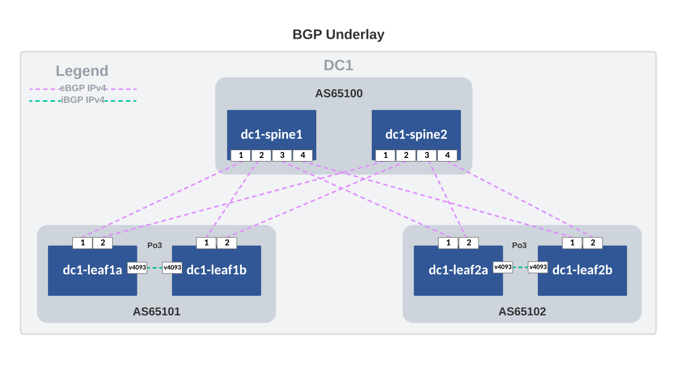

---
# This title is used for search results
title: AVD example for a single data center using L3LS
---
<!--
  ~ Copyright (c) 2023 Arista Networks, Inc.
  ~ Use of this source code is governed by the Apache License 2.0
  ~ that can be found in the LICENSE file.
  -->

# AVD example for a single data center using L3LS

## Introduction

This example is meant to be used as the logical second step in introducing AVD to new users, directly following the [Introduction to Ansible and AVD](../../docs/getting-started/intro-to-ansible-and-avd.md) section. New users with access to virtual switches (using Arista vEOS-lab or cEOS) can learn how to generate configuration and documentation for a complete fabric environment. Users with access to physical switches will have to adapt a few settings. This is all documented inline in the comments included in the YAML files. If a lab with virtual or physical switches is not accessible, this example can be used only to generate the output from AVD if required.

The example includes and describes all the AVD files and their content used to build an L3LS EVPN/VXLAN Symmetric IRB network covering a single DC using the following:

- Two (virtual) spine switches.
- Two sets of (virtual) leaf switches, serving endpoints such as servers.
- Two (virtual) layer2-only switches, often used for server management connectivity.

Ansible playbooks are included to show the following:

- Building the intended configuration and documentation
- Deploying the configuration directly to the switches using eAPI
- Deploying the configuration via CloudVision to the switches, including a full change-based workflow with rollback capability etc.

## Installation

Requirements to use this example:

- Follow the installation guide for AVD found [here](../../docs/installation/collection-installation.md).
- Run the following playbook to copy the AVD **examples** to your current working directory, for example `ansible-avd-examples`:

`ansible-playbook arista.avd.install_examples`

This will show the following:

```shell
 ~/ansible-avd-examples# ansible-playbook arista.avd.install_examples

PLAY [Install Examples]***************************************************************************************************************************************************************************************************************************************************************

TASK [Copy all examples to ~/ansible-avd-examples]*****************************************************************************************************************************************************
changed: [localhost]

PLAY RECAP
****************************************************************************************************************************************************************************************************************************************************************************
localhost                  : ok=1    changed=1    unreachable=0    failed=0    skipped=0    rescued=0    ignored=0
```

After the playbook has run successfully, the directory structure will look as shown below, the contents of which will be covered in later sections:

```shell
ansible-avd-examples/ (or wherever the playbook was run)
  |── single-dc-l3ls
    ├── ansible.cfg
    ├── documentation
    ├── group_vars
    ├── images
    ├── intended
    ├── inventory.yml
    ├── build.yml
    ├── deploy.yml
    ├── deploy-cvp.yml
    ├── README.md
    └── switch-basic-configurations
```

!!! info
    If the content of any file is ***modified*** and the playbook is rerun, the file ***will not*** be overwritten. However, if any file in the example is ***deleted*** and the playbook is rerun, Ansible will re-create the file.

## Overall design overview

### Physical topology

The drawing below shows the physical topology used in this example. The interface assignment shown here are referenced across the entire example, so keep that in mind if this example must be adapted to a different topology. Finally, the Ansible host is connected to the dedicated out-of-band management port (Ethernet0 when using vEOS-lab):


### IP ranges used

| Out-of-band management IP allocation for DC1        | 172.16.1.0/24               |
|-----------------------------------------------------|-----------------------------|
| Default gateway                                     | 172.16.1.1                  |
| dc1-spine1                                          | 172.16.1.11                 |
| dc1-spine2                                          | 172.16.1.12                 |
| dc1-leaf1a                                          | 172.16.1.101                |
| dc1-leaf1b                                          | 172.16.1.102                |
| dc1-leaf2a                                          | 172.16.1.103                |
| dc1-leaf2b                                          | 172.16.1.104                |
| dc1-leaf1c                                          | 172.16.1.151                |
| dc1-leaf2c                                          | 172.16.1.152                |
| **Point-to-point links between leaf and spine**     | **(Underlay)**              |
| DC1                                                 | 10.255.255.0/26             |
| **Loopback0 interfaces used for EVPN peering**      | 10.255.0.0/27               |
| **Loopback1 interfaces used for VTEP**              | **(Leaf switches)**         |
| DC1                                                 | 10.255.1.0/27               |
| **VTEP Loopbacks used for diagnostics**             | **(Leaf switches)**         |
| VRF10                                               | 10.255.10.0/27              |
| VRF11                                               | 10.255.11.0/27              |
| **SVIs (interface vlan...)**                        | **10.10.`<VLAN-ID>`.0/24**  |
| For example `interface VLAN11` has the IP address:  | 10.10.11.1                  |
| **MLAG Peer-link (interface vlan 4094)**            | **(Leaf switches)**         |
| DC1                                                 | 10.255.1.64/27              |
| **MLAG iBGP Peering (interface vlan 4093)**         | **(Leaf switches)**         |
| DC1                                                 | 10.255.1.96/27              |
| **CloudVision Portal**                              |                             |
| cvp                                                 | 192.168.1.12                |

### BGP design

=== "Underlay"

    

=== "Overlay"

    

### Basic EOS config

Basic connectivity between the Ansible host and the switches must be established before Ansible can be used to push configurations. You must configure the following on all switches:

- A hostname configured purely for ease of understanding.
- An IP enabled interface - in this example, the dedicated out-of-band management interface is used.
- A username and password with the proper access privileges.

Below is the basic configuration file for `dc1-leaf1a`:

```eos title="dc1-leaf1a-basic-configuration.txt"
--8<--
examples/single-dc-l3ls/switch-basic-configurations/dc1-leaf1a-basic-configuration.txt
--8<--
```

!!! note
    The folder `single-dc-l3ls/switch-basic-configurations/` contains a file per device for the initial configurations.

## Ansible inventory, group vars, and naming scheme

The following drawing shows a graphic overview of the Ansible inventory, group variables, and naming scheme used in this example:


!!! note
    The two servers `dc1-leaf1-server1` and `dc1-leaf2-server1` at the bottom are **not** configured by AVD, but the switch ports used to connect to the servers are.

Group names use uppercase and underscore syntax:

- CLOUDVISION
- FABRIC
- DC1
- DC1_SPINES
- DC1_L3_LEAVES
- DC1_L2_LEAVES

All hostnames use lowercase and dashes, for example:

- cvp
- dc1-spine1
- dc1-leaf1a
- dc1-leaf2c

The drawing also shows the relationships between groups and their children:

- For example, `dc1-spine1` and `dc1-spine2` are both children of the group called `DC1_SPINES`.

Additionally, groups themselves can be children of another group, for example:

- `DC1_L3_LEAVES` is a group consisting of the groups `DC1_LEAF1` and `DC1_LEAF2`
- `DC1_L3_LEAVES` is also a child of the group `DC1`.

This naming convention makes it possible to extend anything easily, but as always, this can be changed based on your preferences. Just ensure that the names of all groups and hosts are unique.

### Content of the inventory.yml file

This section describes the entire `ansible-avd-examples/single-dc-l3ls/inventory.yml` file used to represent the above topology.

It is important that the hostnames specified in the inventory exist either in DNS or in the hosts file on your Ansible host to allow successful name lookup and be able to reach the switches directly. A successful ping from the Ansible host to each inventory host verifies name resolution(e.g., `ping dc1-spine1`).

Alternatively, if there is no DNS available, or if devices need to be reached using a fully qualified domain name (FQDN), define `ansible_host` to be an IP address or FQDN for each device - see below for an example:

```yaml title="inventory.yml"
--8<--
examples/single-dc-l3ls/inventory.yml
--8<--
```

The above is what is included in this example, *purely* to make it as simple as possible to get started. However, in the future, please do not carry over this practice to a production environment, where an inventory file for an identical topology should look as follows when using DNS:

```yaml title="inventory.yml"
---
all:
  children:
    CLOUDVISION: # (1)!
      hosts:
        cvp:
          # Ansible variables used by the ansible_avd and ansible_cvp roles to push configuration to devices via CVP
          ansible_httpapi_host: cvp
          ansible_host: cvp
          ansible_user: ansible
          ansible_password: ansible
          ansible_connection: httpapi
          ansible_httpapi_use_ssl: true
          ansible_httpapi_validate_certs: false
          ansible_network_os: eos
          # Configuration to get Virtual Env information
          ansible_python_interpreter: $(which python3)
    FABRIC:
      children:
        DC1:
          children:
            DC1_SPINES:
              hosts:
                dc1-spine1:
                dc1-spine2:
            DC1_L3_LEAVES:
              hosts:
                dc1-leaf1a:
                dc1-leaf1b:
                dc1-leaf2a:
                dc1-leaf2b:
            DC1_L2_LEAVES:
              hosts:
                dc1-leaf1c:
                dc1-leaf2c:

    NETWORK_SERVICES: # (2)!
      children:
        DC1_L3_LEAVES:
        DC1_L2_LEAVES:
    CONNECTED_ENDPOINTS: # (3)!
      children:
        DC1_L3_LEAVES:
        DC1_L2_LEAVES:
```

1. `CLOUDVISION`

   - Defines the relevant values required to enable communication with CloudVision.

   - Specifically the hostname (`cvp`) of the CloudVision Portal server used, the username (`ansible`) and password (`ansible`), connection method (`httpapi`), SSL and certificate settings.

   - Please note that the username (`ansible`) and password (`ansible`) defined here must exist in CloudVision.

   - More information is available [here](https://avd.sh/en/stable/roles/eos_config_deploy_cvp/index.html?h=is_deployed#inputs)

2. `NETWORK_SERVICES`

    - Creates a group named `NETWORK_SERVICES`. Ansible variable resolution resolves this group name to the identically named group_vars file (`ansible-avd-examples/single-dc-l3ls/group_vars/NETWORK_SERVICES.yml`).

    - The file's contents, which in this case are specifications of VRFs and VLANs, are then applied to the group's children. In this case, the two groups `DC1_L3_LEAVES` and `DC1_L2_LEAVES`.

3. `CONNECTED_ENDPOINTS`

    - Creates a group named `CONNECTED_ENDPOINTS`. Ansible variable resolution resolves this group name to the identically named group_vars file (`ansible-avd-examples/single-dc-l3ls/group_vars/CONNECTED_ENDPOINTS.yml`).

    - The file's contents, which in this case are specifications of connected endpoints (typically servers), are then applied to the children of the group, in this case, the two groups `DC1_L3_LEAVES` and `DC1_L2_LEAVES`.

## Defining device types

Since this example covers building an L3LS network, AVD must know about the device types, for example, spines, L3 leaves, L2 leaves, etc. The devices are already grouped in the inventory, so the device types are specified in the group variable files with the following names and content:

=== "DC1_SPINES.yml"

    ```yaml
    --8<--
    examples/single-dc-l3ls/group_vars/DC1_SPINES.yml
    --8<--
    ```

=== "DC1_L3_LEAVES.yml"

    ```yaml
    --8<--
    examples/single-dc-l3ls/group_vars/DC1_L3_LEAVES.yml
    --8<--
    ```

=== "DC1_L2_LEAVES.yml"

    ```yaml
    --8<--
    examples/single-dc-l3ls/group_vars/DC1_L2_LEAVES.yml
    --8<--
    ```

For example, all switches that are children of the DC1_SPINES group defined in the inventory will be of type `spine`.

## Setting fabric-wide configuration parameters

The `ansible-avd-examples/single-dc-l3ls/group_vars/FABRIC.yml` file defines generic settings that apply to all children of the `FABRIC` group as specified in the inventory described earlier.

The first section defines how the Ansible host connects to the devices:

```yaml title="FABRIC.yml"
ansible_connection: ansible.netcommon.httpapi # (1)!
ansible_network_os: arista.eos.eos # (2)!
ansible_user: ansible # (3)!
ansible_password: ansible
ansible_become: true
ansible_become_method: enable # (4)!
ansible_httpapi_use_ssl: true # (5)!
ansible_httpapi_validate_certs: false # (6)!
```

1. The Ansible host must use eAPI
2. Network OS which in this case is Arista EOS
3. The username/password combo
4. How to escalate privileges to get write access
5. Use SSL
6. Do not validate SSL certificates

The following section specifies variables that generate configuration to be applied to all devices in the fabric:

```yaml title="FABRIC.yml"
fabric_name: FABRIC # (1)!

underlay_routing_protocol: ebgp
overlay_routing_protocol: ebgp

local_users: # (2)!
  - name: ansible
    privilege: 15
    role: network-admin
    sha512_password: $6$7u4j1rkb3VELgcZE$EJt2Qff8kd/TapRoci0XaIZsL4tFzgq1YZBLD9c6f/knXzvcYY0NcMKndZeCv0T268knGKhOEwZAxqKjlMm920
  - name: admin
    privilege: 15
    role: network-admin
    no_password: true

bgp_peer_groups: # (3)!
  evpn_overlay_peers:
    password: Q4fqtbqcZ7oQuKfuWtNGRQ==
  ipv4_underlay_peers:
    password: 7x4B4rnJhZB438m9+BrBfQ==
  mlag_ipv4_underlay_peer:
    password: 4b21pAdCvWeAqpcKDFMdWw==

p2p_uplinks_mtu: 1500 # (4)!

default_interfaces: # (5)!
  - types: [ spine ]
    platforms: [ default ]
    uplink_interfaces: [ Ethernet1-2 ]
    downlink_interfaces: [ Ethernet1-8 ]
  - types: [ l3leaf ]
    platforms: [ default ]
    uplink_interfaces: [ Ethernet1-2 ]
    mlag_interfaces: [ Ethernet3-4 ]
    downlink_interfaces: [ Ethernet8 ]
  - types: [ l2leaf ]
    platforms: [ default ]
    uplink_interfaces: [ Ethernet1-2 ]

cvp_instance_ips:
  - 192.168.1.12 # (6)!
terminattr_smashexcludes: "ale,flexCounter,hardware,kni,pulse,strata"
terminattr_ingestexclude: "/Sysdb/cell/1/agent,/Sysdb/cell/2/agent"
terminattr_disable_aaa: true

name_servers: # (7)!
  - 192.168.1.1

custom_structured_configuration_ntp: # (8)!
  local_interface:
    name: Management1
    vrf: MGMT
  servers:
    - name: 0.pool.ntp.org
      vrf: MGMT
```

1. The name of the fabric for internal AVD use. This name *must* match the name of an Ansible Group (and therefore a corresponding group_vars file) covering all network devices.
2. Local users/passwords and their privilege levels. In this case, the `ansible` user is set with the password `ansible` and an `admin` user is set with no password.
3. BGP peer groups and their passwords (all passwords are "arista").
4. Point-to-point interface MTU, in this case, is set to 1500 since the example uses vEOS, but when using hardware, this should be set to 9214 instead.
5. Defines which interfaces to use for uplinks, MLAG peer-links and downlinks. In this example they are specified per node type.
   1. `uplink_interfaces` specify which local interfaces connect to an upstream device.
   2. `mlag_interfaces` specify which local interfaces connect to an MLAG peer.
   3. `downlink_interfaces` specify which local interfaces connect to a downstream device.
6. Relevant settings for the `TerminAttr` software agent on EOS, responsible for streaming telemetry back to CloudVision Portal.
7. DNS Server specification. Used in this example primarily to resolve the IP address of the NTP server.
8. NTP server settings. Correct and synchronized time on EOS is required for proper connectivity to CloudVision Portal.

## Setting device specific configuration parameters

The `ansible-avd-examples/single-dc-l3ls/group_vars/DC1.yml` file defines settings that apply to all children of the `DC1` group as specified in the inventory described earlier. However, this time the settings defined are no longer fabric-wide but are limited to DC1. This example is of limited benefit with only a single data center. Still, it allows us to scale the configuration to a scenario with multiple data centers in the future.

```yaml title="DC1.yml"
---
mgmt_gateway: 172.16.1.1 # (1)!

spine:
  defaults:
    platform: vEOS-lab # (2)!
    loopback_ipv4_pool: 10.255.0.0/27 # (3)!
    bgp_as: 65100 # (4)!

  nodes: # (5)!
    - name: dc1-spine1
      id: 1 # (6)!
      mgmt_ip: 172.16.1.11/24 # (7)!

    - name: dc1-spine2
      id: 2
      mgmt_ip: 172.16.1.12/24
```

1. The default gateway for the management interface of all devices in DC1 is defined.
2. `platform` references default settings defined in AVD specific to certain switch platforms.
3. `loopback_ipv4_pool` defines the IP scope from which AVD assigns IPv4 addresses for Loopback0.
4. `bgp_as` defines the BGP AS number.
5. `nodes` defines the actual spine switches, using the hostnames defined in the inventory.
6. `id` is used to calculate the various IP addresses, for example, the IPv4 address for the Loopback0 interface. In this case, dc1-spine1 will get the IPv4 address 10.255.0.1/27 assigned to the Loopback0 interface.
7. `mgmt_ip` defines the IPv4 address of the management interface. As stated earlier, Ansible will perform name lookups using the hostnames specified in the inventory unless using the `ansible_host` option. However, there is no automatic mechanism to grab the result of the name lookup and use that to generate the management interface configuration.

The following section covers the L3 leaf switches. Significantly more settings need to be set compared to the spine switches:

```yaml title="DC1.yml"
l3leaf:
  defaults:
    platform: vEOS-lab # (1)!
    loopback_ipv4_pool: 10.255.0.0/27 # (2)!
    loopback_ipv4_offset: 2 # (3)!
    vtep_loopback_ipv4_pool: 10.255.1.0/27 # (4)!
    uplink_interfaces: ['Ethernet1', 'Ethernet2'] # (5)!
    uplink_switches: ['dc1-spine1', 'dc1-spine2'] # (6)!
    uplink_ipv4_pool: 10.255.255.0/26 # (7)!
    mlag_interfaces: ['Ethernet3', 'Ethernet4'] # (8)!
    mlag_peer_ipv4_pool: 10.255.1.64/27 # (9)!
    mlag_peer_l3_ipv4_pool: 10.255.1.96/27 # (10)!
    virtual_router_mac_address: 00:1c:73:00:00:99 # (11)!
    spanning_tree_priority: 4096 # (12)!
    spanning_tree_mode: mstp # (13)!

  node_groups: # (14)!
    - group: DC1_L3_LEAF1
      bgp_as: 65101 # (15)!
      nodes:
        - name: dc1-leaf1a
          id: 1
          mgmt_ip: 172.16.1.101/24
          uplink_switch_interfaces: # (16)!
            - Ethernet1
            - Ethernet1
        - name: dc1-leaf1b
          id: 2
          mgmt_ip: 172.16.1.102/24
          uplink_switch_interfaces:
            - Ethernet2
            - Ethernet2

    DC1_L3_LEAF2:
      bgp_as: 65102
      nodes:
        - name: dc1-leaf2a
          id: 3
          mgmt_ip: 172.16.1.103/24
          uplink_switch_interfaces:
            - Ethernet3
            - Ethernet3
        - name: dc1-leaf2b
          id: 4
          mgmt_ip: 172.16.1.104/24
          uplink_switch_interfaces:
            - Ethernet4
            - Ethernet4
```

1. `platform` references default settings defined in AVD specific to certain switch platforms.
2. `loopback_ipv4_pool` defines the IP scope from which AVD assigns IPv4 addresses for Loopback0. Please note that this IP pool is identical to the one used for the spine switches in this example. To avoid setting the same IP addresses for several devices, we define the option `loopback_ipv4_offset`.
3. `loopback_ipv4_offset` offsets all assigned loopback IP addresses counting from the beginning of the IP scope. This is required to avoid overlapping IPs when the same IP pool is used for two different node_types (like spine and l3leaf in this example). The offset is "2" because each spine switch uses one loopback address.
4. `vtep_loopback_ipv4_pool` defines the IP scope from which AVD assigns IPv4 addresses for the VTEP (Loopback1).
5. `uplink_interfaces` used by the `l3leaf` nodes to connect to the spine switches.
6. `uplink_switches` defines the uplink switches, which are dc1-spine1 and dc1-spine2. Note that the `uplink_interfaces` and `uplink_switches` are paired vertically.
7. `uplink_ipv4_pool` defines the IP scope from which AVD assigns IPv4 addresses for the uplink interfaces that were just defined.
8. `mlag_interfaces` defines the MLAG interfaces used on each leaf switch.
9. `mlag_peer_ipv4_pool` defines the IP scope from which AVD assigns IPv4 addresses for the MLAG peer link interface VLAN4094.
10. `mlag_peer_l3_ipv4_pool` defines the IP scope from which AVD assigns IPv4 addresses for the iBGP peering established between the two leaf switches via the SVI/IRB interface VLAN4093.
11. `virtual_router_mac_address` defines the MAC address used for the anycast gateway on the various subnets. This is the MAC address connected endpoints will learn when ARPing for their default gateway.
12. `spanning_tree_priority` sets the spanning tree priority. Since spanning tree in an L3LS network is effectively only running locally on the switch, the same priority across all L3 leaf switches can be re-used.
13. `spanning_tree_mode` defines the spanning tree mode. In this case, we are using MSTP, which is the default. However, other modes are supported should they be required, for example, for connectivity to legacy or third-party vendor environments.
14. `node_groups` defines settings common to more than one node. For example, when exactly two nodes are part of a node group for leaf switches, AVD will, by default, automatically generate MLAG configuration.
15. `bgp_as` is defined once since an MLAG pair shares a single BGP AS number.
16. `uplink_switch_interfaces` defines the interfaces used on the uplink switches (Ethernet1 on dc1-spine1 and dc1-spine2 in this example).

Finally, more of the same, but this time for the L2 leaf switches:

```yaml title="DC1.yml"
l2leaf:
  defaults:
    platform: vEOS-lab
    spanning_tree_mode: mstp

  node_groups:
    - group: DC1_L2_LEAF1
      uplink_switches: ['dc1-leaf1a', 'dc1-leaf1b']
      nodes:
        - name: dc1-leaf1c
          id: 1
          mgmt_ip: 172.16.1.151/24
          uplink_switch_interfaces:
            - Ethernet8
            - Ethernet8

    - group: DC1_L2_LEAF2
      uplink_switches: ['dc1-leaf2a', 'dc1-leaf2b']
      nodes:
        - name: dc1-leaf2c
          id: 2
          mgmt_ip: 172.16.1.152/24
          uplink_switch_interfaces:
            - Ethernet8
            - Ethernet8
```

An L2 leaf switch is more simple than an L3 switch. Hence there are fewer settings to define.

## Specifying network services (VRFs and VLANs) in the EVPN/VXLAN fabric

The `ansible-avd-examples/single-dc-l3ls/group_vars/NETWORK_SERVICES.yml` file defines All VRF and VLANs. This means that regardless of where a given VRF or VLAN must exist, its existence is defined in this file, but it does not indicate ***where*** in the fabric it exists. That was done at the bottom of the inventory file previously described in the [Inventory](#content-of-the-inventoryyml-file) section.

```yaml title="NETWORK_SERVICES.yml"
tenants: # (1)!
  - name: TENANT1
    mac_vrf_vni_base: 10000 # (2)!
    vrfs: # (3)!
      - name: VRF10
        vrf_vni: 10 # (4)!
        vtep_diagnostic: # (5)!
          loopback: 10 # (6)!
          loopback_ip_range: 10.255.10.0/27 # (7)!
        svis: # (8)!
          - id: 11
            name: VRF10_VLAN11 # (9)!
            enabled: true
            ip_address_virtual: 10.10.11.1/24 # (10)!
          - id: 12
            name: VRF10_VLAN12
            enabled: true
            ip_address_virtual: 10.10.12.1/24
      - name: VRF11
        vrf_vni: 11
        vtep_diagnostic:
          loopback: 11
          loopback_ip_range: 10.255.11.0/27
        svis:
          - id: 21
            name: VRF11_VLAN21
            enabled: true
            ip_address_virtual: 10.10.21.1/24
          - name: 22
            name: VRF11_VLAN22
            enabled: true
            ip_address_virtual: 10.10.22.1/24

    l2vlans: # (11)!
      - id: 3401
        name: L2_VLAN3401
      - id: 3402
        name: L2_VLAN3402
```

1. Definition of tenants. Additional level of abstraction in addition to VRFs. In this example just one tenant named `TENANT1` is specified.
2. The base number (`10000`) used to generate the L2VNI numbers automatically, `L2VNI = base number + VLAN-id`. For example, L2VNI for VLAN11 = 10000 + 11 = 10011.
3. VRF definitions inside the tenant.
4. VRF VNI definition.
5. Enable VTEP Network diagnostics. This will create a loopback with virtual source-nat enable to perform diagnostics from the switch:

   ```eos
   interface Loopback10
     description VRF10_VTEP_DIAGNOSTICS
     no shutdown
     vrf VRF10
     ip address 10.255.10.3/32
   !
   ip address virtual source-nat vrf VRF10 address 10.255.10.3
   ```

6. Loopback interface number.
7. Loopback IP range, a unique IP is derived from this range and assigned to each l3 leaf based on its unique id.
8. SVI Definitions for all SVIs within this tenant.
9. SVI Description.
10. IP anycast gateway to be used in the SVI in every leaf across the fabric.
11. These are pure L2 VLANs. They do not have an SVI defined in the l3leafs and they will be bridged inside the VXLAN fabric.

AVD offers granular control of where Tenants and VLANs are configured using `tags` and `filter`. Those areas are not covered in this basic example.

## Specifying endpoint connectivity in the EVPN/VXLAN fabric

After the previous section, all VRFs and VLANs across the fabric are now defined. The `ansible-avd-examples/single-dc-l3ls/group_vars/CONNECTED_ENDPOINTS.yml` file specifies the connectivity for all endpoints in the fabric (typically servers):

```yaml title="CONNECTED_ENDPOINTS.yml"
--8<--
examples/single-dc-l3ls/group_vars/CONNECTED_ENDPOINTS.yml
--8<--
```

This defines the settings for the relevant switch ports to which the endpoints connect, in this case the two servers `dc1-leaf1-server1` and `dc1-leaf2-server1`.

As an example, here is the configuration for `dc1-leaf1-server1`:

```yaml title="CONNECTED_ENDPOINTS.yml"
  dc1-leaf1-server1:
    adapters: # (1)!
    - endpoint_ports: [ PCI1, PCI2 ] # (2)!
      switch_ports: [ Ethernet5, Ethernet5 ] # (3)!
      switches: [ dc1-leaf1a, dc1-leaf1b ] # (4)!
      vlans: 11-12,21-22 # (5)!
      native_vlan: 4092 # (6)!
      mode: trunk # (7)!
      spanning_tree_portfast: edge # (8)!
      port_channel: # (9)!
        description: PortChannel dc1-leaf1-server1
        mode: active

    - endpoint_ports: [ iLO ]
      switch_ports: [ Ethernet5 ]
      switches: [ dc1-leaf1c ]
      vlans: 11
      mode: access
      spanning_tree_portfast: edge
```

1. The relevant `adapters` are defined. For example, the `type` set to `server` and `ilo` is purely for documentation and readability. It has no operational significance.
2. `endpoint_ports` are defined for use in the interface descriptions on the switch. This does not configure anything on the server.
3. `switch_ports` defines the interfaces used in the switches. In this example the server is dual-connected to Ethernet5 and Ethernet5. These two ports exist on switch dc1-leaf1a and dc1-leaf1b defined in the following line.
4. `switches` defines the switches used, in this case dc1-leaf1a and dc1-leaf1b. Note that the `endpoint_ports`, `switch_ports` and `switches` definitions are paired vertically.
5. `vlans` defines which VLANs are allowed on the switch_ports, in this case it is two ranges, VLAN11-12 and VLAN21-22 for the dual-attached server ports and VLAN11 for the iLO port.
6. `native_vlan` specifies the native VLAN when the switch port mode is set to trunk.
7. `mode` is set to trunk for the dual-attached server ports and access for the iLO port.
8. `spanning_tree_portfast` defines whether the switch port should be a spanning tree edge or network port.
9. `port_channel` defines the description and mode for the port-channel.

## The playbooks

In this example, three playbooks are included, of which two must be used:

1. The first playbook `build.yml` is mandatory and is used to build the structured configuration, documentation and finally the actual EOS CLI configuration.
2. The second playbook is a choice between:
   1. `deploy.yml` to deploy the configurations generated by `build.yml` directly to the Arista switches using eAPI.
   2. `deploy-cvp.yml` to deploy the configurations generated by `build.yml` to the Arista switches using CloudVision.

The `build.yml` playbook looks like the following:

```yaml title="build.yml"
--8<--
examples/single-dc-l3ls/build.yml
--8<--
```

1. At the highest level, the name and scope of the playbook are set, which in this example is the entire fabric. For instance, `FABRIC` is a group name defined in the inventory. If the playbook should only apply to a subset of devices, it can be changed here.
2. This task uses the role `arista.avd.eos_designs`, which generates structured configuration for each device. This structured configuration can be found in the `ansible-avd-examples/single-dc-l3ls/intended/structured_configs` folder.
3. This task uses the role `arista.avd.eos_cli_config_gen`, which generates the Arista EOS CLI configurations found in the `ansible-avd-examples/single-dc-l3ls/intended/configs` folder, along with the device-specific and fabric wide documentation found in the `ansible-avd-examples/single-dc-l3ls/documentation/` folder. In addition, it relies on the structured configuration generated by `arista.avd.eos_designs`.

The `deploy.yml` playbook looks like the following:

```yaml title="deploy.yml"
--8<--
examples/single-dc-l3ls/deploy.yml
--8<--
```

1. At the highest level, the name and scope of the playbook are set, which in this example is the entire fabric. For instance, `FABRIC` is a group name defined in the inventory. If the playbook should only apply to a subset of devices, it can be changed here.
2. This task uses the `arista.avd.eos_config_deploy_eapi` role to deploy the configurations directly to EOS nodes that were generated by the `arista.avd.eos_cli_config_gen` role.

The `deploy-cvp.yml` playbook looks like the following:

```yaml title="deploy-cvp.yml"
--8<--
examples/single-dc-l3ls/deploy-cvp.yml
--8<--
```

1. At the highest level, the name and scope of the playbook are set, which in this example is the CloudVision server named `CLOUDVISION`.
2. This task uses the `arista.avd.eos_config_deploy_cvp` role to deploy and manage the Fabric with CloudVision.
3. Sets `v3` as the version of the collection to use (default in AVD 4.x).
4. `fabric_name` is used to specify the container root in CVP (must match a group name).

In addition, the `arista.avd.eos_config_deploy_cvp` collection performs the following actions:

- Reads the AVD inventory and builds the container topology in CloudVision
- Looks for configuration previously generated by arista.avd.eos_cli_config_gen and builds configlets list, one per device
- Looks for additional configlets to attach to either devices or containers
- Build configlets on CVP
- Create containers topology
- Move devices to the container
- Bind configlet to device
- Deploy Fabric configuration by running all pending tasks (optional, if execute_tasks == true)

### Testing AVD output without a lab

Using the `build.yml` playbook without any actual devices is possible. The playbook will generate all the output (variables, configurations, documentation) but will not attempt to communicate with devices.

Please look through the folders and files described above to learn more about the output generated by AVD.

### Playbook Run

To build the configuration files, run the playbook called `build.yml`.

``` bash
### Build Configurations and Documentation
ansible-playbook playbooks/build.yml
```

After the playbook run finishes, EOS CLI intended configuration files were written to `intended/configs`.

To build and deploy the configurations to your switches directly, using eAPI, run the playbook called `deploy.yml`. This assumes that your Ansible host has access and authentication rights to the switches. Those auth variables are defined in FABRIC.yml.

``` bash
### Deploy Configurations to Devices using eAPI
ansible-playbook playbooks/deploy.yml
```

To build and deploy the configurations to your switches using CloudVision Portal, run the playbook called `deploy-cvp.yml`. This assumes that your CloudVision Portal server has access and authentication rights to the switches. Those auth variables are defined in FABRIC.yml.

``` bash
### Deploy Configurations to Devices Using CloudVision Portal
ansible-playbook playbooks/deploy-cvp.yml
```

### EOS Intended Configurations

Your configuration files should be similar to these.

=== "dc1-spine1"

    ``` shell
    --8<--
    examples/single-dc-l3ls/intended/configs/dc1-spine1.cfg
    --8<--
    ```

=== "dc1-spine2"

    ``` shell
    --8<--
    examples/single-dc-l3ls/intended/configs/dc1-spine2.cfg
    --8<--
    ```

=== "dc1-leaf1a"

    ``` shell
    --8<--
    examples/single-dc-l3ls/intended/configs/dc1-leaf1a.cfg
    --8<--
    ```

=== "dc1-leaf1b"

    ``` shell
    --8<--
    examples/single-dc-l3ls/intended/configs/dc1-leaf1b.cfg
    --8<--
    ```

=== "dc1-leaf1c"

    ``` shell
    --8<--
    examples/single-dc-l3ls/intended/configs/dc1-leaf1c.cfg
    --8<--
    ```

=== "dc1-leaf2a"

    ``` shell
    --8<--
    examples/single-dc-l3ls/intended/configs/dc1-leaf2a.cfg
    --8<--
    ```

=== "dc1-leaf2b"

    ``` shell
    --8<--
    examples/single-dc-l3ls/intended/configs/dc1-leaf2b.cfg
    --8<--
    ```

=== "dc1-leaf2c"

    ``` shell
    --8<--
    examples/single-dc-l3ls/intended/configs/dc1-leaf2c.cfg
    --8<--
    ```

The execution of the playbook should produce the following output:

```shell
user@ubuntu:~/ansible-avd-examples/single-dc-l3ls$ ansible-playbook build.yml

PLAY [Run AVD] *****************************************************************************************************************************************************************************

TASK [arista.avd.eos_designs : Collection arista.avd version 4.0.0 loaded from /home/user/.ansible/collections/ansible_collections] ******************************************************
ok: [dc1-leaf1a]

TASK [arista.avd.eos_designs : Create required output directories if not present] **********************************************************************************************************
ok: [dc1-leaf1a -> localhost] => (item=/home/user/Documents/git_projects/ansible-avd-examples/single-dc-l3ls/intended/structured_configs)
ok: [dc1-leaf1a -> localhost] => (item=/home/user/Documents/git_projects/ansible-avd-examples/single-dc-l3ls/documentation/fabric)
(...)
```

If similar output is not shown, make sure:

1. The documented [requirements](../../docs/installation/collection-installation.md) are met.
2. The latest `arista.avd` collection is installed.

## Troubleshooting

### EVPN not working

If after doing the following steps:

1. Manually copy/paste the switch-basic-configuration to the devices.
2. Run the playbook and push the generated configuration to the fabric.
3. Log in to a leaf device, for example, dc1-leaf1a and run the command `show bgp evpn summary` to view EVPN routes.

The following error message is shown:

```eos
dc1-leaf1a#show bgp evpn summ
% Not supported
dc1-leaf1a#
```

This is caused by AVD pushing the configuration line `service routing protocols model multi-agent`, which enables the multi-agent routing process supporting EVPN. This change *requires* a reboot of the device.
