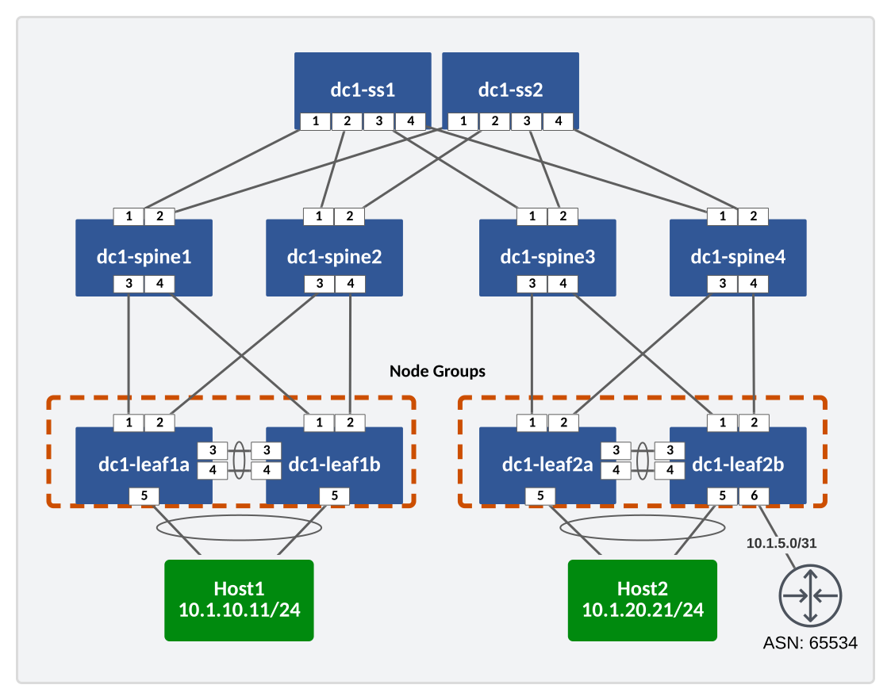
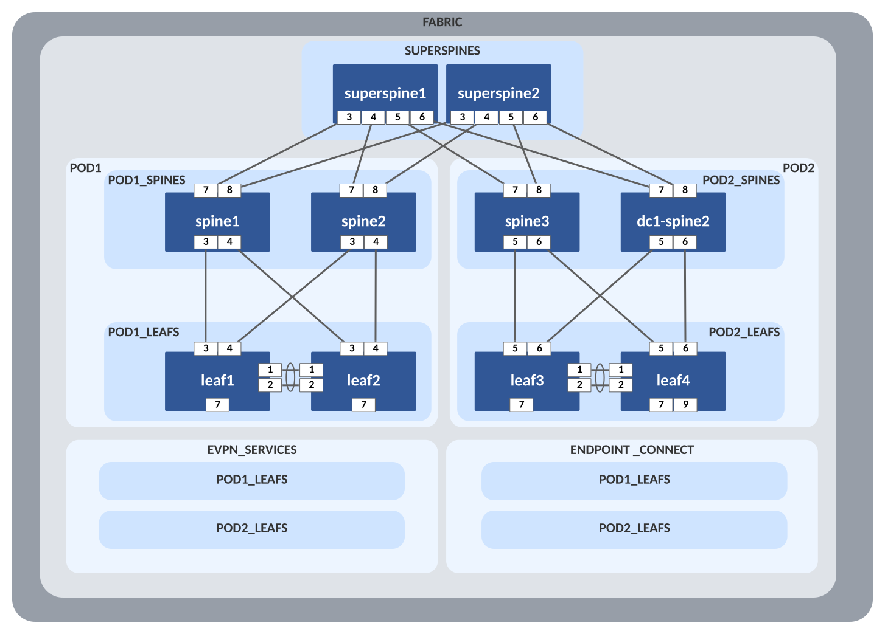

---
# This title is used for search results
title: AVD example for a single data center using multiple PODs for L3LS
---
<!--
  ~ Copyright (c) 2023-2024 Arista Networks, Inc.
  ~ Use of this source code is governed by the Apache License 2.0
  ~ that can be found in the LICENSE file.
  -->

# AVD example for a single data center with Multi-Pod using L3LS

## Introduction

This example shows how to create a multi-pod environment (a 5-stage Clos) in a single DC environment. Of course, this can be used in multiple DCs, but this example is only for two PODs in a single DC.

Also included is an example of connecting an external router to a VRF/tenant.

This example only teaches some aspects of an L3LS EVPN/VXLAN build; please see the [single DC L3LS example](../single-dc-l3ls/README.md) for additional information. It supplements the single DC example, concentrating on the unique elements of multiple PODs/5-stage Clos.

Ansible playbooks are included to show the following:

- Building the intended configuration and documentation
- Deploying the configuration via CloudVision to the switches, including a complete change-based workflow with rollback capability, etc.
- Validating the configuration

## Installation

Requirements to use this example:

- Follow the installation guide for AVD found [here](../../docs/installation/collection-installation.md).
- Run the following playbook to copy the AVD **examples** to your current working directory, for example `ansible-avd-examples`:

`ansible-playbook arista.avd.install_examples`

This will show the following:

```shell
 ~/ansible-avd-examples# ansible-playbook arista.avd.install_examples

PLAY [Install Examples]***************************************************************************************************************************************************************************************************************************************************************

TASK [Copy all examples to ~/ansible-avd-examples]*****************************************************************************************************************************************************
changed: [localhost]

PLAY RECAP
****************************************************************************************************************************************************************************************************************************************************************************
localhost                  : ok=1    changed=1    unreachable=0    failed=0    skipped=0    rescued=0    ignored=0
```

After the playbook has run successfully, the directory structure will look as shown below, the contents of which will be covered in later sections:

```shell
ansible-avd-examples/ (or wherever the playbook was run)
  |── single-dc-multipod-l3ls
    ├── ansible.cfg
    ├── documentation
    ├── group_vars
    ├── images
    ├── intended
    ├── inventory.yml
    ├── playbooks
    ├── README.md
```

!!! info
    If the content of any file is ***modified*** and the playbook is rerun, the file ***will not*** be overwritten. However, if any file in the example is ***deleted*** and the playbook is rerun, Ansible will re-create the file.

## Overall design overview

### Physical topology

The drawing below shows the physical topology used in this example. The interface assignment shown here are referenced across the entire example, so keep that in mind if this example must be adapted to a different topology.



### Fabric Design

The fabric is a basic L3LS EVPN/VXLAN design with a multi-pod (5-stage Clos) architecture.

## Ansible inventory, group vars, and naming scheme

The following drawing shows a graphic overview of the Ansible inventory, group variables, and naming scheme used in this example:



The SUPERSPINES group has been added, as well as POD1 and POD2 groups with PODX_LEAFS and PODX_SPINES under each. The EVPN_SERVICES and ENDPOINT_CONNECT allow separation of YAML files, and putting the PODX_LEAFS under them will build the appropriate configs for those devices (VXLAN/VLAN/anycast gateways do not get instantiated on spines, of course).

### Content of the inventory.yml file

```yaml title="inventory.yml"
--8<--
examples/single-dc-multipod-l3ls/inventory.yml
--8<-
```

## FABRIC Files

With the topology, five YAML files are used in group_vars:

- FABRIC.yml
- POD1.yml
- POD2.yml
- EVPN_SERVICES.yml
- ENDPOINT_CONNECT.yml

The FABRIC.yml file contains parameters that would apply to the entire fabric, such as `evpn_vlan_aware_bundles: true`. FABRIC.yml also includes definitions of superspines.

```yaml title="FABRIC.yml"
---

fabric_name: FABRIC

# Various fabric settings

# Enable vlan aware bundles
evpn_vlan_aware_bundles: true

# Super-Spine Switches
super_spine:
  defaults:
    platform: cEOS
    bgp_as: 65000
    loopback_ipv4_pool: 192.168.101.0/24
    mlag: false
    evpn_role: server

  nodes:
    - name: dc1-ss1
      id: 201
      mgmt_ip: 192.168.0.25/24
    - name: dc1-ss2
      id: 202
      mgmt_ip: 192.168.0.26/24
```

The POD leafs and spines are not in the FABRIC.yml file in this example (although the contents of POD1.yml and POD2.yml could be consolidated into FABRIC.yml). The super_spine section is new but works like the traditional spine section in a single POD L3LS. It will need an ASN (separate from the POD spines) and loopback pool (which can be the same pool as the PODs, as long as the IDs are unique). The `evpn_role: server` makes the super-spines a router server, as the PODs' routes need to be propagated to each other.

The rest of the FABRIC.yml would contain any parameters for your fabric, such as NTP servers, user accounts, and p2p MTUs.

The POD1 and POD2 YAML files contain the descriptions of the leafs and spines. Note that each POD's spines have its own unique ASN (eBGP). Also, the spines now have uplink interfaces and uplink switches specified (to the superspies) with the `uplink_switches` and `uplink_interfaces` directives. The uplink pool can overlap between the PODs in a DC. If doing multi-DC, the pools should be on different subnets.

The leaf configurations, EVPN_SERVICES, and ENDPOINT_CONNECT sections aren't affected by the multi-pod format.

```yaml title="POD1.yml"
--8<--
examples/single-dc-multipod-l3ls/group_vars/POD1.yml
--8<-
```

## Connecting an External Router

In addition to the multi-pod, this example has a tenant/VRF connecting to an external network via a router (R1). This is defined in the EVPN_SERVICES.yml file. The `l3_interfaces` parameter creates an L3 interface in the VRF on a specific leaf and the `bgp_peer` section.

```yaml title="EVPN_SERVICES.yml"
--8<--
examples/single-dc-multipod-l3ls/group_vars/EVPN_SERVICES.yml
--8<--
```
