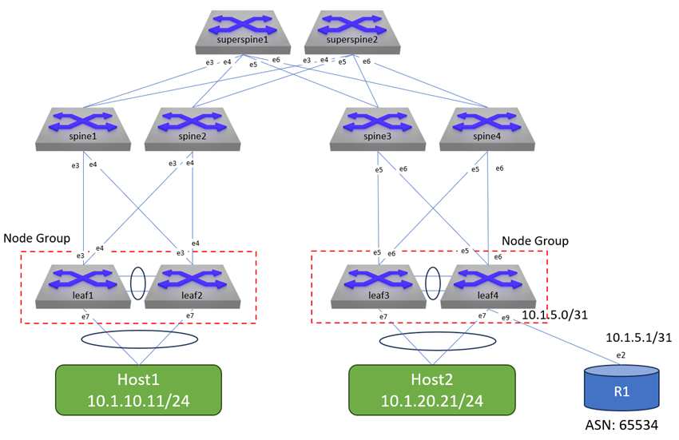
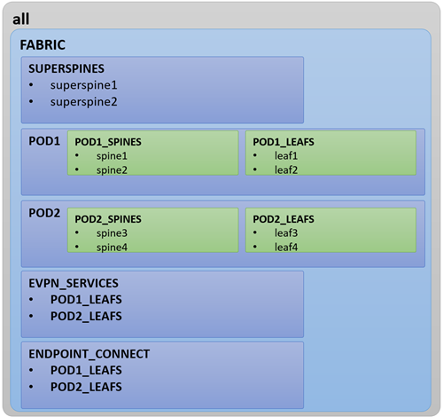

---
# This title is used for search results
title: AVD example for a single data center using multiple pods for l3ls
---
<!--
  ~ Copyright (c) 2023-2024 Arista Networks, Inc.
  ~ Use of this source code is governed by the Apache License 2.0
  ~ that can be found in the LICENSE file.
  -->

# AVD example for a single data center with multipod using L3LS

## Introduction

This example shows how to create a multipod environment (also known as a 5-stage Clos) in a single DC environment. This can be used in multiple DCs of course, but this example is only for two pods in a single DC.

Also included is an example of connecting an external router to a VRF/tenant.

This example will not teach all the aspects of a l3ls EVPN/VXLAN build, see the single-dc-l3ls directory for that. This is a supplement to single-dc-l3ls, concentrating on the aspects that are unique when doing multiple pods/5-stage Clos.

Ansible playbooks are included to show the following:

- Building the intended configuration and documentation
- Deploying the configuration via CloudVision to the switches, including a full change-based workflow with rollback capability etc.
- Validating the configuration

## Overall design overview

### Physical topology

The drawing below shows the physical topology used in this example. The interface assignment shown here are referenced across the entire example, so keep that in mind if this example must be adapted to a different topology.



### Fabric Design

The fabric is a basic l3ls EVPN/VXLAN design with a multi-pod (5-stage Clos) architecture.

## Ansible inventory, group vars, and naming scheme

The following drawing shows a graphic overview of the Ansible inventory, group variables, and naming scheme used in this example:



There is the addition of a SUPERSPINES group as well as a POD1 and POD2 groups with PODX_LEAFS and PODX_SPINES under each. The EVPN_SERVICES and ENDPOINT_CONNECT allow separation of YAML files, and putting the PODX_LEAFS under them will build the appropriate configs for those devices (VXLAN/VLAN/anycast gateways do not get instantiated on spines, of course).

### Content of the inventory.yml file

```yaml title="inventory.yml"
---
all:
  children:
    CVP_cluster:
      vars:
        ansible_user: arista
        ansible_password: arista123
        ansible_connection: httpapi
        ansible_httpapi_use_ssl: True
        ansible_httpapi_validate_certs: False
        ansible_network_os: eos
        ansible_httpapi_port: 443
      hosts:
        cvp1:
          ansible_host: 192.168.0.5
        cvp2:
          ansible_host: 192.168.0.6
        cvp3:
          ansible_host: 192.168.0.7

    FABRIC:
      vars:
        ansible_user: arista
        ansible_ssh_pass: arista123 # If using SSH keys with CLI, this can be removed
# Use this section if you want to perform testing via the eAPI
        ansible_connection: httpapi
        ansible_httpapi_use_ssl: True
        ansible_httpapi_validate_certs: False
        ansible_network_os: eos
        ansible_httpapi_port: 443
# Use this section if you want to perform testing via the CLI through SSH
        # ansible_connection: network_cli
        # ansible_network_os: eos
        # ansible_become: yes
        # ansible_become_method: enable
      children:
        SUPERSPINES:
          vars:
            type: super-spine
          hosts:
            borderleaf1:
              ansible_host: 192.168.0.15
            borderleaf2:
              ansible_host: 192.168.0.16
        POD1:
          children:
            POD1_SPINES:
              vars:
                type: spine
              hosts:
                spine1:
                  ansible_host: 192.168.0.11
                spine2:
                  ansible_host: 192.168.0.12
            POD1_LEAFS:
              vars:
                type: l3leaf
              hosts:
                leaf1:
                  ansible_host: 192.168.0.21
                leaf2:
                  ansible_host: 192.168.0.22
        POD2:
          children:
            POD2_SPINES:
              vars:
                type: spine
              hosts:
                spine3:
                  ansible_host: 192.168.0.13
                spine4:
                  ansible_host: 192.168.0.14
            POD2_LEAFS:
              vars:
                type: l3leaf
              hosts:
                leaf3:
                  ansible_host: 192.168.0.23
                leaf4:
                  ansible_host: 192.168.0.24
    EVPN_SERVICES:
      children:
        POD1_LEAFS:
        POD2_LEAFS:
    ENDPOINT_CONNECT:
      children:
        POD1_LEAFS:
        POD2_LEAFS:
```

## FABRIC Files

With the topology, five YAML files are used in group_vars:

- FABRIC.yml
- POD1.yml
- POD2.yml
- EVPN_SERVICES.yml
- ENDPOINT_CONNECT.yml

The FABRIC.yml file contains parameters that would apply to the entire fabric, such as `evpn_vlan_aware_bundles: true`. FABRIC.yml also contains the definitions for the superspines.

```yaml title="FABRIC.yml"
---

fabric_name: FABRIC

# Various fabric settings

# Enable vlan aware bundles
evpn_vlan_aware_bundles: true

# Super-Spine Switches
super_spine:
  defaults:
    platform: cEOS
    bgp_as: 65000
    loopback_ipv4_pool: 192.168.101.0/24
    mlag: false
    evpn_role: server

  nodes:
    superspine1:
      id: 201
      mgmt_ip: 192.168.0.25/24
    superspine2:
      id: 202
      mgmt_ip: 192.168.0.26/24
```

The pod leafs and spines are not in the FABRIC.yml file in this example (although the contents of POD1.yml and POD2.yml could be consolidated into FABRIC.yml). The super_spine section is new, but it works much like the traditional spine section did in a single pod l3ls. It will need an ASN (seprate from the pod spines), loopback pool (which can the same pool as the pods, as long as the IDs are unique). The `evpn_role` server makes the super-spines a router server, as the routes from the pods will need to be propagated to each other.

The rest of the FABRIC.yml would contain any parameters for your fabric, such as NTP servers, user accounts, and p2p MTUs.

The POD1 and POD2 YAML files contain the descriptions of the leafs and spines. Note that each pod's spines have their own unique ASN (eBGP). Also the spines now have uplink interfaces and uplinks switches specificed (to the superspines) with the `uplink_switches` and `uplink_interfaces` directives. The uplink pool can overlap between the pods in a DC. If doing multi-DC, the pools should be on different subnets.

The leaf configurations, EVPN_SERVICES and ENDPOINT_CONNECT sections aren't affected by the multi-pod format.

```yaml title="POD1.yml"

# Spine Switches
spine:
  defaults:
    platform: cEOS
    bgp_as: 65001
    loopback_ipv4_pool: 192.168.101.0/24
    mlag: false
    uplink_switches: [superspine1, superspine2] # Where the leaf uplinks go
    uplink_ipv4_pool: 192.168.103.0/24 # For the p2p interfaces to chopped up into /31s
    uplink_interfaces: [Ethernet7, Ethernet8] # Spine uplinks
  nodes:
    spine1:
      id: 11
      mgmt_ip: 192.168.0.11/24
      uplink_switch_interfaces: [Ethernet3, Ethernet3]
      evpn_route_servers: [superspine1, superspine2]
    spine2:
      id: 12
      mgmt_ip: 192.168.0.12/24
      uplink_switch_interfaces: [Ethernet4, Ethernet4]
      evpn_route_servers: [superspine1, superspine2]


# Leaf switches. Most leafs will be l3leaf, not l2leaf.
l3leaf:
  defaults:
    bgp_as: 65100-65199 # Gives a range which will be auto-assigned
    platform: cEOS
    loopback_ipv4_pool: 192.168.101.0/24 # This is loopback0 (underlay)
    vtep_loopback_ipv4_pool: 192.168.102.0/24 # This is loopback1 (VTEP)
    uplink_interfaces: [Ethernet3, Ethernet4] # Leaf uplinks
    uplink_switches: [spine1, spine2] # Where the leaf uplinks go
    uplink_ipv4_pool: 192.168.103.0/24 # For the p2p interfaces to chopped up into /31s
    mlag_interfaces: [Ethernet1, Ethernet2] # MLAG peer link
    mlag_peer_ipv4_pool: 10.255.252.0/24 # MLAG peer IPs
    mlag_peer_l3_ipv4_pool: 10.255.251.0/24 # iBGP peering between MLAG peers
    virtual_router_mac_address: 00:1c:73:00:00:99 # The vMAC for the anycast gateways
    bgp_defaults:
      - 'no bgp default ipv4-unicast'
      - 'distance bgp 20 200 200'
      - 'graceful-restart restart-time 300'
      - 'graceful-restart'
    spanning_tree_mode: mstp # Spanning Tree is still enabled even in EVPN setups
    spanning_tree_priority: 16384
    mlag: true # By default, use MLAG

  node_groups:
    mlag1:
      nodes:
        leaf1:
          id: 1
          mgmt_ip: 192.168.0.21/24
          uplink_switch_interfaces: [Ethernet3, Ethernet3]
        leaf2:
          id: 2
          mgmt_ip: 192.168.0.22/24
          uplink_switch_interfaces: [Ethernet4, Ethernet4]
```

## Connecting an External Router

In addition to multi-pod, this example also has a tenant/VRF connecting to an external network via a router (R1). This is defined in the EVPN_SERVICES.yml file. The `l3_interfaces` parameter creates an L3 interface in the VRF on a specific leaf, and the `bgp_peer` section.

```YAML
---
tenants:
  - name: ACME
    mac_vrf_vni_base: 10000
    vrfs:
      - name: VRF_A
        vrf_vni: 10
        svis:
          - id: 10
            # SVI Description
            name: DMZ
            enabled: true
            ip_address_virtual: 10.1.10.1/24
          - id: 20
            name: Internal
            enabled: true
            ip_address_virtual: 10.1.20.1/24
        l3_interfaces:
          - interfaces: [Ethernet9]
            ip_addresses: [10.1.5.0/31]
            nodes: [leaf4]
            enabled: True
        bgp_peers:
          - ip_address: 10.1.5.1
            remote_as: 65534
            nodes: [leaf4]
```
