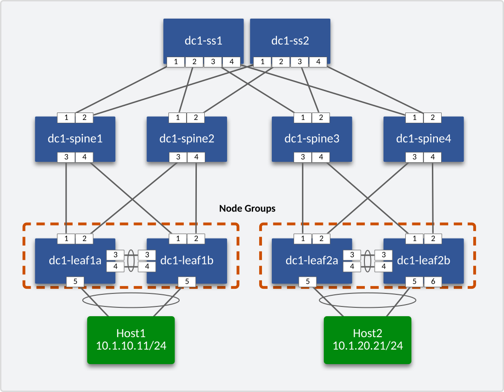
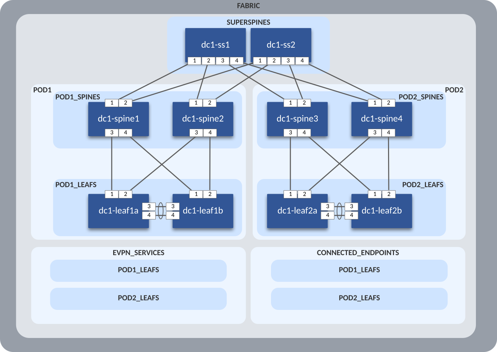

---
# This title is used for search results
title: Mutli-Pod L3LS
---
<!--
  ~ Copyright (c) 2023-2026 Arista Networks, Inc.
  ~ Use of this source code is governed by the Apache License 2.0
  ~ that can be found in the LICENSE file.
  -->

# AVD example for a single data center with Multi-Pod using L3LS

## Introduction

This example shows how to create a multi-pod environment (a 5-stage Clos) in a single DC environment. Of course, this can be used in multiple DCs, but this example is only for two PODs in a single DC.

Also included is an example of connecting an external router to a VRF/tenant.

This example only teaches some aspects of an L3LS EVPN/VXLAN build; please see the [single DC L3LS example](../single-dc-l3ls/README.md) for additional information. It supplements the single DC example, concentrating on the unique elements of multiple PODs/5-stage Clos.

Ansible playbooks are included to show the following:

- Building the intended configuration and documentation
- Deploying the configuration via CloudVision or directly to the switches via eAPI
- Validating the configuration

## AVD Playground

--8<--
ansible_collections/arista/avd/examples/common/start-avd-playground.md
--8<--

## Installation

--8<--
ansible_collections/arista/avd/examples/common/example-installation.md
--8<--

```shell
ansible-avd-examples/ (or wherever the playbook was run)
  |── single-dc-multipod-l3ls
    ├── ansible.cfg
    ├── build.yml
    ├── clab
    ├── deploy-cvp.yml
    ├── deploy.yml
    ├── documentation
    ├── group_vars
    ├── images
    ├── intended
    ├── inventory.yml
    ├── README.md
    └── validate.yml
```

## Overall design overview

### Physical topology

The drawing below shows the physical topology used in this example. The interface assignments shown here are referenced across the entire example, so keep that in mind if this example must be adapted to a different topology.



### Fabric design

The fabric is a basic L3LS EVPN/VXLAN design with a multi-pod (5-stage Clos) architecture.

## Ansible inventory, group vars, and naming scheme

The following drawing shows a graphic overview of the Ansible inventory, group variables, and naming scheme used in this example:



The SUPERSPINES group has been added, as well as POD1 and POD2 groups with PODX_LEAFS and PODX_SPINES under each. The EVPN_SERVICES and ENDPOINT_CONNECT allow separation of YAML files, and putting the PODX_LEAFS under them will build the appropriate configs for those devices (VXLAN/VLAN/anycast gateways do not get instantiated on spines, of course).

### Content of the inventory.yml file

```yaml title="inventory.yml"
--8<--
ansible_collections/arista/avd/examples/single-dc-multipod-l3ls/inventory.yml
--8<--
```

## Fabric files

With the topology, the following YAML files are used in group_vars:

- FABRIC/fabric_ansible_connectivity.yml
- FABRIC/fabric_variables.yml
- SUPERSPINES/superspines.yml
- POD1/pod1.yml
- POD2/pod2.yml
- EVPN_SERVICES/evpn_services.yml
- ENDPOINT_CONNECT/endpoints.yml

The fabric_variables.yml file contains parameters that would apply to the entire fabric, such as `evpn_vlan_aware_bundles: true`.

```yaml title="FABRIC/fabric_variables.yml"
--8<--
ansible_collections/arista/avd/examples/single-dc-multipod-l3ls/group_vars/FABRIC/fabric_variables.yml
--8<--
```

The superspines.yml file contains the super-spine definitions.

```yaml title="SUPERSPINES/superspines.yml"
--8<--
ansible_collections/arista/avd/examples/single-dc-multipod-l3ls/group_vars/SUPERSPINES/superspines.yml
--8<--
```

The super_spine section works like the traditional spine section in a single POD L3LS. It will need an ASN (separate from the POD spines) and loopback pool (which can be the same pool as the PODs, as long as the IDs are unique). The `evpn_role: server` makes the super-spines a route server, as the PODs' routes need to be propagated to each other.

The leaf configurations, EVPN services, and endpoints sections aren't affected by the multi-pod format.

=== "POD1"
    The POD1 and POD2 YAML files contain the descriptions of the leafs and spines. Note that each POD's spines have its own unique ASN (eBGP). Also, the spines now have uplink interfaces and uplink switches specified (to the superspines) with the `uplink_switches` and `uplink_switch_interfaces` directives. The uplink pool can overlap between the PODs in a DC. If doing multi-DC, the pools should be on different subnets.

    ```yaml title="POD1/pod1.yml"
    --8<--
    ansible_collections/arista/avd/examples/single-dc-multipod-l3ls/group_vars/POD1/pod1.yml
    --8<--
    ```

=== "POD2"
    Please note the similarities between POD1 and POD2.

    ```yaml title="POD2/pod2.yml"
    --8<--
    ansible_collections/arista/avd/examples/single-dc-multipod-l3ls/group_vars/POD2/pod2.yml
    --8<--
    ```

## Connecting an External Router

In addition to the multi-pod, this example has a tenant/VRF connecting to an external network via a router (R1). This is defined in the `evpn_services.yml` file. The `l3_interfaces` parameter creates an L3 interface in the VRF on a specific leaf and the `bgp_peer` section defines the BGP peering with the external router.

```yaml title="EVPN_SERVICES/evpn_services.yml"
--8<--
ansible_collections/arista/avd/examples/single-dc-multipod-l3ls/group_vars/EVPN_SERVICES/evpn_services.yml
--8<--
```

## Endpoint connectivity

The final group variables file provides an example of connecting two servers across a leaf pair.

```yaml title="ENDPOINT_CONNECT/endpoints.yml"
--8<--
ansible_collections/arista/avd/examples/single-dc-multipod-l3ls/group_vars/ENDPOINT_CONNECT/endpoints.yml
--8<--
```

## The playbooks

=== "build.yml"

    The `build.yml` playbook imports two roles from the AVD collection; `eos_designs` and `eos_cli_config_gen`. These roles will produce any relevant documentation and configuration for our fabric deployment.

    ``` yaml
    --8<--
    ansible_collections/arista/avd/examples/single-dc-multipod-l3ls/build.yml
    --8<--
    ```

=== "deploy-cvp.yml"

    The `deploy-cvp.yml` file leverages the artifacts from the build playbook to provision our fabric with CVP.

    ``` yaml
    --8<--
    ansible_collections/arista/avd/examples/single-dc-multipod-l3ls/deploy-cvp.yml
    --8<--
    ```

=== "deploy.yml"

    The deploy.yml file leverages the artifacts from the build playbook to provision our fabric but connects directly to our EOS nodes.

    ``` yaml
    --8<--
    ansible_collections/arista/avd/examples/single-dc-multipod-l3ls/deploy.yml
    --8<--
    ```

=== "validate.yml"

    The `validate.yml` file will connect to our EOS nodes and run validation tests against our fabric.

    ``` yaml
    --8<--
    ansible_collections/arista/avd/examples/single-dc-multipod-l3ls/validate.yml
    --8<--
    ```

### Playbook Run

To build the configuration files, run the playbook called `build.yml`.

``` bash
### Build configurations
ansible-playbook build.yml
```

### EOS Intended Configurations

Your configuration files should be similar to these.

=== "dc1-ss1"

    ``` shell
    --8<--
    ansible_collections/arista/avd/examples/single-dc-multipod-l3ls/intended/configs/dc1-ss1.cfg
    --8<--
    ```

=== "dc1-ss2"

    ``` shell
    --8<--
    ansible_collections/arista/avd/examples/single-dc-multipod-l3ls/intended/configs/dc1-ss2.cfg
    --8<--
    ```

=== "dc1-spine1"

    ``` shell
    --8<--
    ansible_collections/arista/avd/examples/single-dc-multipod-l3ls/intended/configs/dc1-spine1.cfg
    --8<--
    ```

=== "dc1-spine2"

    ``` shell
    --8<--
    ansible_collections/arista/avd/examples/single-dc-multipod-l3ls/intended/configs/dc1-spine2.cfg
    --8<--
    ```

=== "dc1-spine3"

    ``` shell
    --8<--
    ansible_collections/arista/avd/examples/single-dc-multipod-l3ls/intended/configs/dc1-spine3.cfg
    --8<--
    ```

=== "dc1-spine4"

    ``` shell
    --8<--
    ansible_collections/arista/avd/examples/single-dc-multipod-l3ls/intended/configs/dc1-spine4.cfg
    --8<--
    ```

=== "dc1-leaf1a"

    ``` shell
    --8<--
    ansible_collections/arista/avd/examples/single-dc-multipod-l3ls/intended/configs/dc1-leaf1a.cfg
    --8<--
    ```

=== "dc1-leaf1b"

    ``` shell
    --8<--
    ansible_collections/arista/avd/examples/single-dc-multipod-l3ls/intended/configs/dc1-leaf1b.cfg
    --8<--
    ```

=== "dc1-leaf2a"

    ``` shell
    --8<--
    ansible_collections/arista/avd/examples/single-dc-multipod-l3ls/intended/configs/dc1-leaf2a.cfg
    --8<--
    ```

=== "dc1-leaf2b"

    ``` shell
    --8<--
    ansible_collections/arista/avd/examples/single-dc-multipod-l3ls/intended/configs/dc1-leaf2b.cfg
    --8<--
    ```
