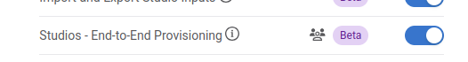

---
# This title is used for search results
title: Ansible Collection Role cv_deploy
---
<!--
  ~ Copyright (c) 2024 Arista Networks, Inc.
  ~ Use of this source code is governed by the Apache License 2.0
  ~ that can be found in the LICENSE file.
  -->

# arista.avd.cv_deploy

## Overview

**arista.avd.cv_deploy** deploys EOS device configurations and tags to the CloudVision management platform.

Depending on the configured options, the role supports multiple operations:

- Deploys configurations for one or more devices using the "Static Configuration Studio".
- Deploys device and interface Tags for one or more devices.
- Adds missing devices and updates device details for existing devices in the "Inventory & Topology Studio".
- Creates, builds, submits Workspaces.
- Creates, approves, starts Change Controls.
- Deploys special metadata for CV Pathfinder solution.

Devices will be identified using `serial_number`, `system_mac_address` or `hostname` (in prioritized order).
The available identification depends on the configured AVD variables.

The API to CloudVision is using gRPC over encrypted HTTP/2.

!!! Note

    Please note that in case of using CVaaS, the correct regional URL where the CVaaS tenant is deployed must be used
    for the `cv_server` var. The following are the cluster URLs used in production:

    | Region | URL |
    |--------|-----|
    | United States 1a | `www.arista.io` |
    | United States 1b | `www.cv-prod-us-central1-b.arista.io`|
    | United States 1c | `www.cv-prod-us-central1-c.arista.io`|
    | Canada | `www.cv-prod-na-northeast1-b.arista.io` |
    | Europe West 2| `www.cv-prod-euwest-2.arista.io` |
    | Japan| `www.cv-prod-apnortheast-1.arista.io` |
    | Australia | `www.cv-prod-ausoutheast-1.arista.io` |
    | United Kingdon | `www.cv-prod-uk-1.arista.io` |

!!! Warning

    URLs without `www` are not supported.

## Limitations

- It is not possible to authenticate with username/password. See the [instructions below](#steps-to-create-service-accounts-on-cloudvision) on how to create a service account on CloudVision.
- This role is **only** supported on **CloudVision as a Service (CVaaS)** or "on-prem" **CloudVision 2024.1.0** or later.
  - Configuration deployment is based on the "Static Configuration Studio" which was a Beta feature on CloudVision 2024.1.0.
    Make sure to enable "Studios - End-to-End Provisioning" under Settings, Features.

    
- Currently only the first of the given cv_servers is being used.

## Roadmap

This feature is still under development, so several planned features are not implemented yet.

- Make all timeouts configurable. Current exposed settings have no effect.
- Detect changes in configlets and only update when needed. (Depends on newer API)
- Validate tag labels and values
- Detect conflicting devices like using the same serial number or mac for more than one hostname.
- Support for assigning change control templates.
- Add automatic testing.
- Add required CloudVision versions once the APIs are generally available.
- Update AVD examples.
- Handle multinode clusters by trying connecting to each one by one.

## Example

This basic example will deploy configurations and tags for all devices in the inventory group `FABRIC` to CVaaS:

```yaml title="playbook.yml"
- name: Configuration deployment
  hosts: FABRIC # <-- Targeted devices
  connection: local
  gather_facts: false
  tasks:
    - name: Deploy configurations and tags to CloudVision
      ansible.builtin.import_role:
        name: arista.avd.cv_deploy
      vars:
        cv_server: www.arista.io
        cv_token: <insert service_account token here - use Ansible Vault>
```

The workspace will be built and submitted, and a change control will be created and left in `pending approval` state.

## Role Inputs and Outputs

Figure 2 below provides a visualization of the role's inputs, outputs executed by the role.


### Inputs

All `cv_*` settings described below can be set either as inventory variables, group_vars, host_vars or directly in the playbook task under `vars`.

#### CloudVision Server configuration

By default this role will read information about the CloudVision server from the inventory host `cloudvision` (The name of the host is configurable with `cv_inventory_hostname`).

```yaml title="inventory.yml"
all:
  hosts:
    cloudvision:
      ansible_host: <hostname or IP address of CloudVision host. Ex. "www.arista.io" for CVaaS>
      ansible_password: <service account token as defined on CloudVision. This value should be using Ansible Vault>
```

The CloudVision inventory hostname is configurable.

```yaml
# Inventory hostname of the CloudVision host.
# This is used to pickup the ansible_host and ansible_password used to connect to CloudVision.
# Each of these can be overridden manually if CloudVision is not part of the inventory.
cv_inventory_hostname: "cloudvision"
```

It is also possible to define the hostname and token directly without defining the CloudVision server in the inventory.

```yaml
# Manually override the CV server hostname and token if CloudVision is not part of the inventory.
cv_server: <hostname or IP address of CloudVision host. Ex. "www.arista.io" for CVaaS>
cv_token: <service account token as defined on CloudVision. This value should be using Ansible Vault>
```

By default the connection to CloudVision requires valid certificates.
For test and lab usage the certificate verification can be disabled.

```yaml
# Verify Certificate for CloudVision (Always use valid certificates for production)
cv_verify_certs: false
```

#### EOS Devices configuration

By default this role will deploy configurations for all hosts targeted by the Ansible "play".

```yaml title="playbook.yml"
- name: Configuration deployment
  hosts: FABRIC # <-- Targeted devices
  connection: local
  gather_facts: false
  tasks:
    - name: Deploy configurations and tags to CloudVision
      ansible.builtin.import_role:
        name: arista.avd.cv_deploy
```

This playbook targets the Ansible inventory group "FABRIC", so all devices under this group will be used for the deployment.

!!! tip
    It is possible to only deploy to a subset of this group by supplying the `--limit <hostname or group>,<hostname or group>` flag
    to the `ansible-playbook` command.

It is also possible to manually supply a list of devices.

```yaml
# Deploy device configs and tags for these devices.
# Defaults to all hosts in the play.
# This means the role must be imported/included in a play targeting only the relevant EOS devices - *not* CloudVision.
cv_devices: [ DC1-L3LEAF1A, DC1-L3LEAF1B ]
```

!!! note
    The device name is used directly to find the EOS configuration and structured configuration files.
    This means the device names are case sensitive and must match the file names.

The role will fail if a device is not found on CloudVision. Any workspace created will be abandoned automatically.

Devices with `is_deployed: false` set as part of `eos_designs` inputs will automatically be ignored.

It is possible to ignore other missing devices by simply skipping them and continue with the remaining devices.

```yaml
# If false, the deployment will fail if any devices are missing (excempting devices where 'is_deployed' is set to false).
cv_skip_missing_devices: true
```

#### Role behavior configuration

By default the role will

1. Create a workspace.
2. Push all configurations and tags.
3. Unassign tags
4. Build and submit the Workspace.
5. Leave any created Change Control in `pending approval` state.

!!! warning
    When deploying CloudVision Tag assignments, the builtin behavior is to unassign any other tags
    with the same labels but different values. This is not configurable.

    It is possible to unassign _any_ other tag from the devices by setting `cv_strict_tags: true`.
    This may remove tags used for studios and other things, so this is *not* recommended.

These settings allow modifying the default behavior as needed. The values below are the default values.

```yaml
# Submit Workspace on deployment. Otherwise the Workspace will be left in "pending" mode.
cv_submit_workspace: true

# Force Workspace submission even if some devices are not streaming.
# If set, configurations will not be validated for non-streaming devices.
cv_submit_workspace_force: false

# Approve, start and wait for the Change Control to Complete. Otherwise the Change Control will be left in "pending approval" mode.
# Only applicable if cv_submit_workspace is true.
cv_run_change_control: false

# Set the name of the created Workspace. By default this will be "AVD <date and time>"
# cv_workspace_name: <str>

# Set the description of the created Workspace.
# cv_workspace_description: <str>

# Set the name of the created Change Control. By default this will be auto generated by CloudVision based on the workspace name.
# cv_change_control_name: <str>

# Set the description of the created Change Control.
# cv_change_control_description: <str>

# Remove any tags on the devices and interfaces not specified by AVD.
# WARNING: This may remove tags used for studios and other things, so this is *not* recommended.
# NOTICE: For tags set by AVD any other tags with the same label will _always_ be removed. This is not configurable.
cv_strict_tags: false

# Set the template to be used to generate the configlet names in CloudVision Static Config Studio.
cv_configlet_name_template: "AVD-${hostname}"

# If true, detailed deployment results will be registered into 'cv_deploy_results' variable.
# Otherwise only the basic result like 'failed', 'warnings' and 'errors' are registered.
# There is a small performance impact on this, which is why it is not registered by default.
cv_register_detailed_results: false

# Time to wait for a Workspace to build. Depending on the scale this can be adjusted.
cv_workspace_build_timeout: 300
```

#### Role default input directories

The EOS device configurations and AVD structured configurations are read from files generated by `arista.avd.eos_designs` and `arista.avd.eos_cli_config_gen` roles.

The directories are configured with the same variables as for the other AVD roles:

```yaml
--8<--
roles/cv_deploy/defaults/main/directories.yml
--8<--
```

## Steps to create service accounts on CloudVision

1. Go to Settings and Tools --> Access Control --> Service Accounts --> click `+ New Service Account`

```text
Account name: AVD
Description: "Automation with AVD"
Give a description under "Generated Service Account Token"
Specify the "valid until" date.
Make sure to copy the generated password. You only get view it once.
Click "Save" to exit the dialogue box.
```


!!! note
    The name of the service account must match a username configured to be authorized on
    EOS, otherwise device interactive API calls might fail due to authorization denial.

## License

Project is published under [Apache 2.0 License](../../LICENSE)
