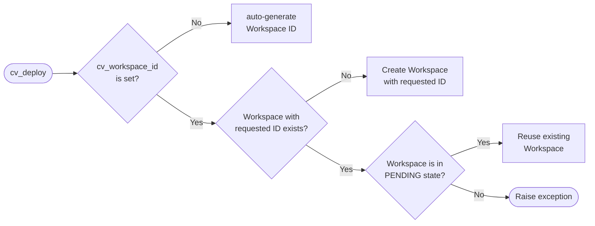
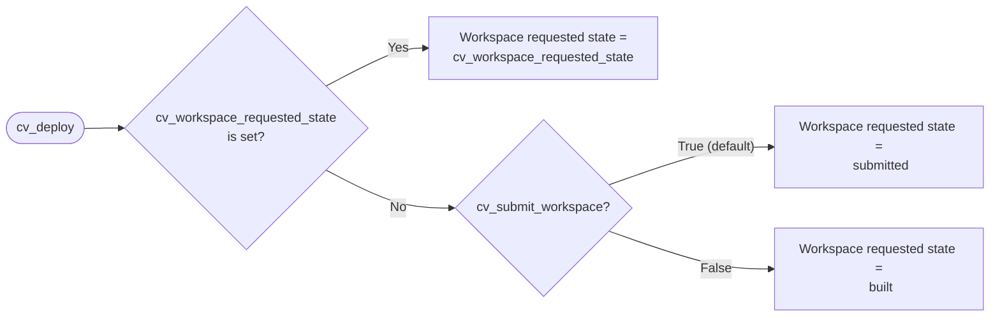
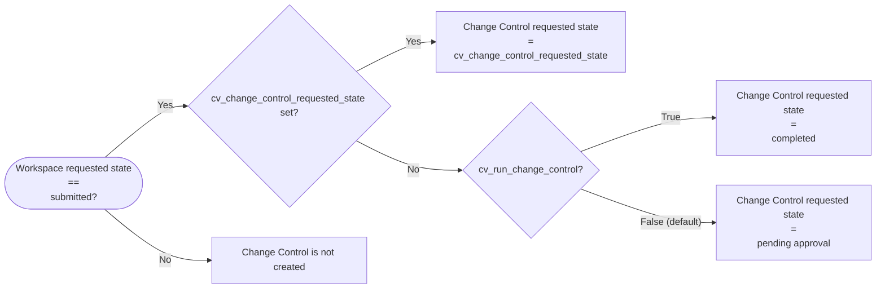

---
# This title is used for search results
title: Ansible Collection Role cv_deploy
---
<!--
  ~ Copyright (c) 2024-2026 Arista Networks, Inc.
  ~ Use of this source code is governed by the Apache License 2.0
  ~ that can be found in the LICENSE file.
  -->

# arista.avd.cv_deploy

## Overview

**arista.avd.cv_deploy** deploys EOS device configurations and tags to the CloudVision management platform.

Depending on the configured options, the role supports multiple operations:

- Deploys device-specific configurations for one or more devices using the "Static Configuration Studio".
- Deploys a full hierarchy of containers and configlets using the "Static Configuration Studio".
- Deploys device and interface Tags for one or more devices.
- Adds missing devices and updates device details for existing devices in the "Inventory & Topology Studio".
- Creates, builds, submits Workspaces.
- Creates, approves, starts Change Controls.
- Deploys special metadata for CV Pathfinder solution.

Devices will be identified using `serial_number`, `system_mac_address` or `hostname` (in prioritized order).
The available identification depends on the configured inputs.

The API to CloudVision is using gRPC over encrypted HTTP/2.

!!! Note

    Please note that in case of using CVaaS, the correct regional URL where the CVaaS tenant is deployed must be used
    for the `cv_server` var. The following are the cluster URLs used in production:

    | Region | URL |
    |--------|-----|
    | United States 1a | `www.arista.io` |
    | United States 1b | `www.cv-prod-us-central1-b.arista.io`|
    | United States 1c | `www.cv-prod-us-central1-c.arista.io`|
    | Canada | `www.cv-prod-na-northeast1-b.arista.io` |
    | Europe West 2| `www.cv-prod-euwest-2.arista.io` |
    | Japan| `www.cv-prod-apnortheast-1.arista.io` |
    | Australia | `www.cv-prod-ausoutheast-1.arista.io` |
    | United Kingdon | `www.cv-prod-uk-1.arista.io` |

!!! Warning

    URLs without `www` are not supported.

## Limitations

- It is not possible to authenticate with username/password. See the [instructions below](#steps-to-create-service-accounts-on-cloudvision) on how to create a service account on CloudVision.
- This role is **only** supported on **CloudVision as a Service (CVaaS)** or "on-prem" **CloudVision 2024.1.0** or later.
  - Configuration deployment is based on the "Static Configuration Studio" which was a Beta feature on CloudVision 2024.1.0.
    Make sure to enable "Studios - End-to-End Provisioning" under Settings, Features.

    

- **CloudVision device replacement** is not fully supported when using the default flat-layout configuration deployment.
  When CloudVision replaces a device using the
  [Replace](https://www.arista.io/help/articles/provisioning-studios-built-in-inventory#cHJvdmlzaW9uaW5nLnN0dWRpby9UT1BPTE9HWQ==-replacing-devices)
  workflow in the [Inventory & Topology Studio](https://www.arista.io/help/articles/provisioning-studios-built-in-inventory#inventory-and-topology-studio), it updates the serial number reference inside the existing Static Configuration Studio container.
  On the next `cv_deploy` run, AVD creates a **new** container and configlet keyed to the new serial number. While the original container and
  configlet become orphaned (from `cv_deploy` point of view), they are still associated with the replacement device through the updated query.

  Choose one of the following approaches to avoid duplicate configlet assignment:

  - **After replacement**: Manually delete (using CloudVision UI) the orphaned container and configlet from the Static Configuration Studio in CloudVision after
    the replacement is complete but before running `cv_deploy` again.
  - **Instead of replacement**: Use the CloudVision
    [Decommission](https://www.arista.io/help/articles/provisioning-studios-built-in-inventory#cHJvdmlzaW9uaW5nLnN0dWRpby9UT1BPTE9HWQ==-decommissioning-devices-from-cloud-vision)
    workflow to remove the old device first, then run `cv_deploy` again to onboard and apply the configuration to the replacement device.

  The manifest-based deployment is **not affected** by this limitation, as it automatically removes unused/orphaned manifest-created containers and
  configlets on each run.

## Roadmap

This feature is still under development, so several planned features are not implemented yet.

- Make all timeouts configurable. Current exposed settings have no effect.
- Detect changes in configlets and only update when needed. (Depends on newer API)
- Validate tag labels and values
- Support for assigning change control templates.
- Add automatic testing.
- Add required CloudVision versions once the APIs are generally available.
- Update AVD examples.
- Handle multinode clusters by trying connecting to each one by one.
- Native `eos_designs` support to build a custom Static Configuration Studio layout.

## Example

This basic example will deploy configurations and tags for all devices in the inventory group `FABRIC` to CVaaS:

```yaml title="playbook.yml"
- name: Configuration deployment
  hosts: FABRIC # <-- Targeted devices
  connection: local
  gather_facts: false
  tasks:
    - name: Deploy configurations and tags to CloudVision
      ansible.builtin.import_role:
        name: arista.avd.cv_deploy
      vars:
        cv_server: www.arista.io
        cv_token: <insert service_account token here - use Ansible Vault>
```

The workspace will be built and submitted, and a change control will be created and left in `pending approval` state.

## Role Inputs and Outputs

Figure 2 below provides a visualization of the role's inputs, outputs executed by the role.


### Inputs

All `cv_*` settings described below can be set either as inventory variables, group_vars, host_vars or directly in the playbook task under `vars`.

#### CloudVision Server configuration

By default this role will read information about the CloudVision server from the inventory host `cloudvision` (The name of the host is configurable with `cv_inventory_hostname`).

```yaml title="inventory.yml"
all:
  hosts:
    cloudvision:
      ansible_host: <hostname or IP address of CloudVision host. Ex. "www.arista.io" for CVaaS>
      ansible_password: <service account token as defined on CloudVision. This value should be using Ansible Vault>
```

The CloudVision inventory hostname is configurable.

```yaml
# Inventory hostname of the CloudVision host.
# This is used to pickup the ansible_host and ansible_password used to connect to CloudVision.
# Each of these can be overridden manually if CloudVision is not part of the inventory.
cv_inventory_hostname: "cloudvision"
```

It is also possible to define the hostname and token directly without defining the CloudVision server in the inventory.

```yaml
# Manually override the CV server hostname and token if CloudVision is not part of the inventory.
cv_server: <hostname or IP address of CloudVision host. Ex. "www.arista.io" for CVaaS>
cv_token: <service account token as defined on CloudVision. This value should be using Ansible Vault>
```

By default the connection to CloudVision requires valid certificates.
For test and lab usage the certificate verification can be disabled.

```yaml
# Verify Certificate for CloudVision (Always use valid certificates for production)
cv_verify_certs: false
```

For an on-premise CloudVision cluster it is possible to authenticate with username/password instead of a service account token.
The username and password below must be set via variables on the task, play or in the fabric-level group vars. `ansible_password` and `cv_token` **must not** be set.

```yaml
# Use username/password instead of a service account token for authentication to CloudVision.
cv_username: <username>
cv_password: <password. This value should be using Ansible Vault>
```

#### EOS Devices configuration

By default this role will deploy configurations for all hosts targeted by the Ansible "play".

```yaml title="playbook.yml"
- name: Configuration deployment
  hosts: FABRIC # <-- Targeted devices
  connection: local
  gather_facts: false
  tasks:
    - name: Deploy configurations and tags to CloudVision
      ansible.builtin.import_role:
        name: arista.avd.cv_deploy
```

This playbook targets the Ansible inventory group "FABRIC", so all devices under this group will be used for the deployment.

!!! tip
    It is possible to only deploy to a subset of this group by supplying the `--limit <hostname or group>,<hostname or group>` flag
    to the `ansible-playbook` command.

It is also possible to manually supply a list of devices.

```yaml
# Deploy device configs and tags for these devices.
# Defaults to all hosts in the play.
# This means the role must be imported/included in a play targeting only the relevant EOS devices - *not* CloudVision.
cv_devices: [ DC1-L3LEAF1A, DC1-L3LEAF1B ]
```

!!! note
    The device name is used directly to find the EOS configuration and structured configuration files.
    This means the device names are case sensitive and must match the file names.

The role will fail if a device is not found on CloudVision. Any workspace created will be abandoned automatically.

Devices with `is_deployed: false` set as part of AVD Design inputs will be ignored.

It is possible to ignore other missing devices by simply skipping them and continue with the remaining devices.

```yaml
# If false, the deployment will fail if any devices are missing (excempting devices where 'is_deployed' is set to false).
cv_skip_missing_devices: true
```

#### Role behavior configuration

By default the role will

1. Create a workspace.
2. Push all configurations and tags.
3. Unassign tags
4. Build and submit the Workspace.
5. Fetch and expose errors and warnings raised during the Workspace Build phase.
6. Leave any created Change Control in `pending approval` state.

!!! warning
    When deploying CloudVision Tag assignments, the builtin behavior is to unassign any other tags
    with the same labels but different values. This is not configurable.

    It is possible to unassign _any_ other tag from the devices by setting `cv_strict_tags: true`.
    This may remove tags used for studios and other things, so this is *not* recommended.

These settings allow modifying the default behavior as needed. The values below are the default values.

```yaml
# Submit Workspace on deployment. Otherwise the Workspace will be left in "pending" mode.
cv_submit_workspace: true

# Force Workspace submission even if some devices are not streaming.
# If set, configurations will not be validated for non-streaming devices.
cv_submit_workspace_force: false

# Fetch and expose Workspace build warnings.
# Suppress specific warnings based on pre-defined options or custom regex fullmatch pattern(s).
cv_workspace_build_warnings_enabled: true
cv_workspace_build_warnings_suppress_patterns: []
cv_workspace_build_warnings_suppress_portfast: false

# Approve, start and wait for the Change Control to Complete. Otherwise the Change Control will be left in "pending approval" mode.
cv_run_change_control: false

# Set the name of the created Workspace. By default this will be "AVD <date and time>"
# cv_workspace_name: <str>

# Set the description of the created Workspace.
# cv_workspace_description: <str>

# Set the name of the created Change Control. By default this will be auto generated by CloudVision based on the workspace name.
# cv_change_control_name: <str>

# Set the description of the created Change Control.
# cv_change_control_description: <str>

# Remove any tags on the devices and interfaces not specified by AVD.
# WARNING: This may remove tags used for studios and other things, so this is *not* recommended.
# NOTICE: For tags set by AVD any other tags with the same label will _always_ be removed. This is not configurable.
cv_strict_tags: false

# Set the template to be used to generate the configlet names in CloudVision Static Config Studio.
cv_configlet_name_template: "AVD-${hostname}"

# If true, detailed deployment results will be registered into 'cv_deploy_results' variable.
# Otherwise only the basic result like 'failed', 'warnings' and 'errors' are registered.
# There is a small performance impact on this, which is why it is not registered by default.
cv_register_detailed_results: false

# Time to wait for a Workspace to build. Depending on the scale this can be adjusted.
cv_workspace_build_timeout: 300

# Maximum number of retry attempts to synchronize Workspace.
# Requires CloudVision 2026.2.0 or later.
cv_workspace_max_sync_retries: 5

# Deploy a custom hierarchy of containers and configlets to the Static Configuration Studio.
# See the "Static Configuration Studio" section below for more details.
# cv_static_config_manifest:
#   Preserve existing manifest-managed root containers and their children when they are not declared in the current manifest.
#   This enables partial manifests managing separate root-level branches.
#   Existing manifest-managed container order is preserved, and newly declared containers are appended.
#   Manually created root containers are always preserved and ordered after the manifest-managed containers.
#   preserve_existing_containers: <bool, default=false>
#
#   # A list of dictionaries defining configlets to be created in the Configlet Library.
#   # Configlet names must be unique across all defined configlets.
#   configlets:
#     - name: <str>
#       file: <str>
#
#   # A list of dictionaries defining the root containers in the Static Configuration hierarchy.
#   # Container names must be unique among sibling containers (at the same level).
#   containers:
#     - name: <str>
#       description: <str, optional>
#       tag_query: <str>
#       match_policy: <str, default="match_all", choices=["match_all", "match_first"]>
#       preserve_existing_sub_containers: <bool, default=false>
#       configlets:
#         - name: <str>
#       sub_containers:
#         - name: <str>
#           description: <str, optional>
#           tag_query: <str>
#           match_policy: <str, default="match_all", choices=["match_all", "match_first"]>
#           preserve_existing_sub_containers: <bool, default=false>
#           configlets:
#             - name: <str>
#           sub_containers: <list of containers>

# Raise an error (instead of a warning) if two or more targeted devices share the same `system_mac_address`
# but have unique `serial_number` values. See the warning below for full duplicate-detection behavior.
cv_strict_system_mac_address: false
```

!!! warning
    The presence of the same `serial_number` or `system_mac_address` values for multiple EOS devices may lead to unexpected results (or even network outages) on CloudVision due to the possibility of pushing the configuration of one device to another.

    To eliminate this risk, the role will raise an error and terminate before updating CloudVision in the following cases:

    - Two or more targeted devices have the same `serial_number` (values of `system_mac_address` are not important in this case).
    - Two or more targeted devices have the same `system_mac_address` and at least one of these devices has an unset `serial_number` value.

    However, by default the role will only warn (not error) in the following case:

    - Two or more targeted devices have the same `system_mac_address` but unique `serial_number` values.

    To raise an error instead of a warning for the above case, set `cv_strict_system_mac_address` to `true`.

##### Advanced role configuration

The optional settings below provide direct control over Workspace and Change Control states.

```yaml
# Set the ID of the created Workspace. If a workspace with the same ID already exists, it must be in the 'pending' state.
# cv_workspace_id: <str>

# Set the requested state for the Workspace.
# Accepted values: "pending", "built", "submitted", "abandoned" or "deleted".
# cv_workspace_requested_state: <str>

# Set the requested state of the created Change Control.
# Accepted values: "pending approval", "approved", "running" or "completed".
# cv_change_control_requested_state: <str>
```

**`cv_workspace_id`**

By default, `cv_deploy` auto-generates new workspace ID on each run. Setting `cv_workspace_id` instructs the role to use a specific ID instead. If a workspace with that ID already exists in CloudVision and is in `pending` state, it will be reused (this may be useful for resuming an interrupted deployment). If the existing workspace is in any other state, the role will raise an error. If workspace with that ID does not yet exist - it will be created.


```mermaid
flowchart LR
    A([cv_deploy]) --> B{cv_workspace_id\nis set?}
    B -- No --> C[auto-generate\nWorkspace ID]
    B -- Yes --> D{Workspace with\nrequested ID exists?}
    D -- No --> E[Create Workspace\nwith requested ID]
    D -- Yes --> G{Workspace is in\nPENDING state?}
    G -- Yes --> F[Reuse existing\nWorkspace]
    G -- No --> I([Raise exception])
```

**`cv_workspace_requested_state`**

By default, the Workspace state is controlled by the `cv_submit_workspace` key. Setting `cv_workspace_requested_state` bypasses `cv_submit_workspace` entirely and applies the specified state directly. This is useful for workflows that need precise control over the target state of the Workspace.


```mermaid
flowchart LR
    A([cv_deploy]) --> B{"cv_workspace_requested_state\nis set?"}
    B -- Yes --> C["Workspace requested state =\ncv_workspace_requested_state"]
    B -- No --> D{cv_submit_workspace?}
    D -- "True (default)" --> E["Workspace requested state =\n submitted"]
    D -- False --> F["Workspace requested state =\n built"]
```

**`cv_change_control_requested_state`**

By default, the Change Control state is controlled by `cv_run_change_control`. Setting `cv_change_control_requested_state` bypasses `cv_run_change_control` entirely. Only applicable when the requested state of the Workspace is `submitted`.


```mermaid
flowchart LR
    A(["Workspace requested state\n==\nsubmitted?"]) -- Yes --> B{cv_change_control_requested_state set?}
    A -- No --> G["Change Control is not created"]
    B -- Yes --> C["Change Control requested state\n=\ncv_change_control_requested_state"]
    B -- No --> D{"cv_run_change_control?"}
    D -- True --> E["Change Control requested state\n=\ncompleted"]
    D -- "False (default)" --> F["Change Control requested state\n=\npending approval"]
```

#### Role default input directories

When using the standard AVD workflow, the EOS device configurations and AVD structured configurations are read from files generated by the `arista.avd.eos_designs` and `arista.avd.eos_cli_config_gen` roles.

The directories are configured with the same variables as for the other AVD roles:

```yaml
--8<--
ansible_collections/arista/avd/roles/cv_deploy/defaults/main/directories.yml
--8<--
# Read structured configuration from files in `structured_dir`. If set to false, `cv_deploy` will read structured configuration from hostvars.
# See the "Per-device variables" section below for more details.
read_structured_config_from_file: true
```

#### Input validation

The role automatically validates the [per-device variables](#per-device-variables) (whether sourced from structured configuration files or Ansible variables) before deploying anything. Any validation errors will block further processing. During this process, temporary files are created to store templated and validated data.

The following role variables can be used to tweak the validation behavior if needed:

```yaml
# Vault ID used for encrypting temporary files generated by the role.
# When Ansible Vault is not configured, this parameter has no effect and files are written as plain JSON.
# When Ansible Vault is configured, AVD encrypts files containing templated and validated data
# to prevent sensitive information from being exposed in the temporary directories.
#   * When `avd_vault_id` is not specified, AVD uses the *first* Vault ID in the list for encryption.
#   * When `avd_vault_id` is specified, AVD uses the specified Vault ID for encryption.
avd_vault_id: null

# Avoid deleting temporary files. Allows the user to inspect tmp files created by the role.
# When an Ansible Vault secret is set, temporary files holding input variables are encrypted. Decryption is required to inspect them.
cv_deploy_keep_tmp_files: false

# The number of hosts to process in each batch when validating inputs.
# Depending on your inventory size and the available resources, you may want to adjust this number.
cv_deploy_validate_inputs_batch_size: 10
```

## Per-device variables

`cv_deploy` can read optional per-device variables used for CloudVision identification, tagging, and feature integration.

### AVD users

When using the standard AVD workflow (`eos_designs` → `eos_cli_config_gen` → `cv_deploy`), these variables are populated by `eos_designs` under the `metadata` key of each device structured configuration. No additional configuration is required.

### cv_deploy-only users

For users running `cv_deploy` without the rest of the AVD workflow (no `eos_designs`, no `eos_cli_config_gen`), the role can be used independently by providing these variables directly as Ansible variables. Set [`read_structured_config_from_file`](#role-default-input-directories) to `false` so the role reads structured configuration from Ansible variables instead of files.

The following variables can then be set per device:

--8<--
schemas/cv_deploy/docs/tables/cv_deploy.md
--8<--

## Static Configuration Studio

`cv_deploy` deploys device configurations to the CloudVision **Static Configuration Studio**.

### Default flat layout

By default, `cv_deploy` deploys each targeted device's EOS configuration as a single configlet inside a per-device sub-container, all gathered under a top-level **AVD Configurations** root container:

```text
AVD Configurations              (root container)
├── DeviceA                     (per-device container)
│   └── AVD-DeviceA             (configlet with DeviceA's full EOS config)
├── DeviceB
│   └── AVD-DeviceB
└── ...
```

### Custom layout

!!! warning "Preview"
    `cv_use_static_config_manifest` is a **preview** setting. The data model and behavior may change in a future release.

If you want to build your own hierarchy of containers and configlets, use the `cv_static_config_manifest` role variable. See the [Role behavior configuration](#role-behavior-configuration) section above for the full schema.

To switch a device's configuration deployment from the flat layout to the manifest, set the `cv_use_static_config_manifest: true` device variable. See the [example for AVD users](#example-for-avd-users) or the [example for cv_deploy-only users](#example-for-cv_deploy-only-users) below for how this variable and the manifest fit together. Devices that do not opt in will continue to use the flat layout. When a device is opted in, any leftover flat-layout configlet or container is cleaned up automatically. Onboarding and tag deployment are unaffected by this variable.

For each opted-in device, you are responsible for ensuring the manifest defines a configlet and a container assigning it.

!!! note "Root Containers Order"
    When initially deploying or adding new root containers, the role places its managed root containers to the top of the Studio container tree. Please be aware that this automated ordering **may displace any containers you have manually arranged**.

!!! note "Partial Manifest Deployments"
    By default, the manifest owns the root-level `containers` list, so existing manifest-managed root containers not declared in the manifest are removed.
    Set `preserve_existing_containers: true` on the manifest to preserve existing root containers that are not declared in the current manifest. This enables workflows where separate manifests manage root-level branches.
    Existing manifest-managed container order is preserved, and newly declared containers are appended.
    Manually created root containers are always preserved and ordered after the manifest-managed containers.

    Additionally, every container in the manifest owns its complete `sub_containers` list, so existing child containers not declared in the manifest are removed.
    Set `preserve_existing_sub_containers: true` on a container to preserve existing manifest-managed child containers that are not declared in the current manifest. This enables workflows where separate manifests manage sibling branches under a shared parent container.
    Existing manifest-managed child container order is preserved, and any newly declared child containers are appended.

!!! warning "Manual configlet assignments"
    Before you remove a configlet created by a cv_deploy manifest, ensure it is not manually assigned to any non-manifest containers. Otherwise you must manually unassign the configlet from such containers first.

#### Example for AVD users

`eos_cli_config_gen` generates one configuration file per device in `eos_config_dir` (`intended/configs` by default). The example below puts those configurations into a custom hierarchy organized by fabric, DC, and POD.

```yaml title="group_vars/FABRIC.yml"
# Custom hierarchy of containers and configlets.
cv_static_config_manifest:
  configlets:
    - name: AVD-spine1
      file: "{{ eos_config_dir }}/spine1.cfg"
    - name: AVD-leaf1
      file: "{{ eos_config_dir }}/leaf1.cfg"
  containers:
    - name: FABRIC
      description: "Fabric devices"
      tag_query: "device:*"
      preserve_existing_sub_containers: true  # Ignore other DC containers under FABRIC
      sub_containers:
        - name: DC1
          tag_query: "DC:DC1"
          sub_containers:
            - name: DC1-POD1
              tag_query: "POD:POD1"
              sub_containers:
                - name: DC1-POD1-SPINE1
                  tag_query: "device:SN12345"
                  configlets:
                    - name: AVD-spine1
                - name: DC1-POD1-LEAF1
                  tag_query: "device:SN67890"
                  configlets:
                    - name: AVD-leaf1

# Deploy DC and POD device tags from the dc_name and pod_name AVD Design inputs.
generate_cv_tags:
  device_tags:
    - name: DC
      data_path: metadata.dc_name
    - name: POD
      data_path: metadata.pod_name

# Opt devices into the manifest (workaround until eos_designs adds native support).
custom_structured_configuration_metadata:
  cv_use_static_config_manifest: true
```

!!! note
    AVD users can also layer shared configlets at higher levels of the hierarchy (see the [cv_deploy-only users example](#example-for-cv_deploy-only-users) below for the pattern). This is less common in AVD workflows since `eos_designs` already generates a full configuration for each device, but it works the same way.

#### Example for cv_deploy-only users

The same approach applies when using `cv_deploy` directly with the [cv_deploy-only users](#cv_deploy-only-users) inputs. The example below uses the same hierarchy as above but additionally illustrates how to layer shared configlets at multiple levels of the hierarchy:

```yaml title="group_vars/FABRIC.yml"
# Use cv_deploy schema inputs (Ansible variables) instead of generated structured configuration files.
read_structured_config_from_file: false

# Custom hierarchy with shared, POD-level, and per-device configlets.
cv_static_config_manifest:
  configlets:
    # Shared configlets
    - name: COMMON-NTP
      file: configlets/ntp.txt
    - name: COMMON-DNS
      file: configlets/dns.txt
    - name: POD1-MULTICAST
      file: configlets/pod1-multicast.txt
    # Per-device configlets
    - name: SPINE1
      file: configlets/spine1.txt
    - name: LEAF1
      file: configlets/leaf1.txt
  containers:
    - name: FABRIC
      description: "Fabric devices"
      tag_query: "device:*"
      configlets:
        - name: COMMON-NTP
        - name: COMMON-DNS
      sub_containers:
        - name: DC1
          tag_query: "DC:DC1"
          sub_containers:
            - name: DC1-POD1
              tag_query: "POD:POD1"
              configlets:
                - name: POD1-MULTICAST
              sub_containers:
                - name: DC1-POD1-SPINE1
                  tag_query: "device:SN12345"
                  configlets:
                    - name: SPINE1
                - name: DC1-POD1-LEAF1
                  tag_query: "device:SN67890"
                  configlets:
                    - name: LEAF1

# Set the DC and POD device tags used by the manifest's tag queries (same for every device in this example).
cv_device_tags:
  - name: DC
    value: DC1
  - name: POD
    value: POD1

# Opt devices into the manifest.
cv_use_static_config_manifest: true
```

### Manifest-only deployment

To deploy a manifest without targeting any device, you can run a "manifest-only" deployment. Simply provide an empty list for `cv_devices` (`cv_devices: []`).

When `cv_devices` is empty, the role skips all device-specific operations (like configlet generation and tagging) and **only** deploys the content of `cv_static_config_manifest`.

!!! tip
    This mode can be useful for pre-provisioning a manifest before any devices are onboarded on CloudVision.

## Steps to create service accounts on CloudVision

1. Go to Settings and Tools --> Access Control --> Service Accounts --> click `+ New Service Account`

```text
Account name: AVD
Description: "Automation with AVD"
Give a description under "Generated Service Account Token"
Specify the "valid until" date.
Make sure to copy the generated password. You only get view it once.
Click "Save" to exit the dialogue box.
```


!!! note
    The name of the service account must match a username configured to be authorized on
    EOS, otherwise device interactive API calls might fail due to authorization denial.

## Proxy server support

The `arista.avd.cv_deploy` role supports connecting to CloudVision through an [HTTP CONNECT](https://en.wikipedia.org/wiki/HTTP_tunnel#HTTP_CONNECT_method) proxy server, with or without basic authentication.

To enable the proxy, set `proxy_host` (port `TCP/8080` will be used by default). If this variable is not defined, a proxy will not be used (default mode).

!!! Warning

    Authentication credentials (when used) are sent to the proxy server using ***HTTP Basic authentication*** over non-encrypted HTTP transport (credentials are only `Base64` encoded, not encrypted). Credentials can be exposed by intercepting and analyzing raw TCP/IP traffic between AVD and Proxy server.

    Please use AVD proxy authentication only when absolutely necessary. Always use other filtering and identification mechanisms (like HTTP filtering based on the client's SRC IP, requested destination domains, etc.) to limit the security risks.

    It is important to note that plain HTTP is used by AVD only for the initial CONNECT request to establish the tunnel with the CloudVision through proxy server. Once the TCP tunnel to CloudVision through proxy server is active, all subsequent AVD communication — including both REST and gRPC calls — is protected within a secure TLS session(s) established between AVD and CloudVision ***inside*** the TCP proxy tunnel.

Below settings allow modifying the default proxy-related behavior as needed. The values below are the default values.

```yaml
# Set FQDN/IP of the HTTP CONNECT proxy server.
proxy_host: <str>
# Set target TCP port of the HTTP CONNECT proxy server.
proxy_port: 8080
# Set authentication username for the HTTP CONNECT proxy server.
proxy_username: <str>
# Set authentication password for the HTTP CONNECT proxy server.
proxy_password: <str>
```

Example of the configuration to use unauthenticated HTTP proxy using CONNECT method:

```yaml
proxy_host: proxy.local.domain
proxy_port: 3128
```

Example of the configuration to use authenticated HTTP proxy using CONNECT method:

```yaml
proxy_host: proxy.local.domain
proxy_port: 3128
proxy_username: "avd_proxy_user"
proxy_password: "avd_proxy_password"
```

## gRPC keepalives

The `arista.avd.cv_deploy` role supports client-side gRPC keepalives on the CloudVision connection. When enabled, AVD periodically pings CloudVision over the gRPC connection so the connection is not silently terminated by intermediate firewalls or load balancers during long-running deployments.

Keepalives are disabled by default. To enable them, set `cv_grpc_keepalives.enabled: true`. The other settings can be left at their defaults and only need to be adjusted to match a specific network environment.

Below settings allow modifying the default keepalive behavior as needed. The values below are the default values.

```yaml
cv_grpc_keepalives:
  # Enable client-side gRPC keepalives. When false, the other settings have no effect.
  enabled: false
  # Interval in seconds between keepalive pings. Must be >= 30s.
  keepalive_time: 60
  # Time in seconds to wait for a keepalive ACK before considering the connection dead.
  keepalive_timeout: 20
  # If true, keepalive pings are sent even when there are no active gRPC calls.
  permit_without_calls: false
```

Example of enabling keepalives with the default settings:

```yaml
cv_grpc_keepalives:
  enabled: true
```

## Future cv_deploy Behaviors

Opt-in to future `cv_deploy` behaviors which will become default behaviors in a future major version.

```yaml
# Opt-in to future cv_deploy behaviors which will become default behaviors in a future major version.
cv_deploy_future:
  # Use system certificates instead of Python's bundled certificate store.
  # Honors `SSL_CERT_FILE` and `SSL_CERT_DIR` environment variables.
  use_system_certs: <bool; default=false>
```

## License

Project is published under [Apache 2.0 License](https://github.com/aristanetworks/avd/blob/devel/LICENSE)
