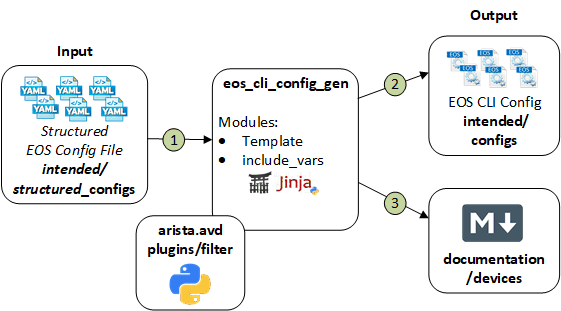

# Ansible Role: eos_cli_config_gen

**Table of Contents:**

- [Ansible Role: eos_cli_config_gen](#ansible-role-eos_cli_config_gen)
  - [Overview](#overview)
  - [Role Inputs and Outputs](#role-inputs-and-outputs)
  - [Requirements](#requirements)
  - [Input Variables](#input-variables)
    - [Terminal Settings](#terminal-settings)
    - [Aliases](#aliases)
    - [Hardware Counters](#hardware-counters)
    - [Daemon TerminAttr](#daemon-terminattr)
    - [IP DHCP Relay](#ip-dhcp-relay)
    - [Internal VLAN Allocation Policy](#internal-vlan-allocation-policy)
    - [IP IGMP Snooping](#ip-igmp-snooping)
    - [Event Monitor](#event-monitor)
    - [Event Handler](#event-handler)
    - [Load Interval](#load-interval)
    - [Errdisable](#errdisable)
    - [Service Routing Protocols Model](#service-routing-protocols-model)
    - [Queue Monitor Length](#queue-monitor-length)
    - [LLDP](#lldp)
    - [Logging](#logging)
    - [Domain Lookup](#domain-lookup)
    - [Domain-List](#domain-list)
    - [Name Servers](#name-servers)
    - [DNS Domain](#dns-domain)
    - [NTP Servers](#ntp-servers)
    - [Radius Servers](#radius-servers)
    - [Router L2 VPN](#router-l2-vpn)
    - [Sflow](#sflow)
    - [Redundancy](#redundancy)
    - [SNMP Settings](#snmp-settings)
    - [Speed-Group Settings](#speed-group-settings)
    - [Spanning Tree](#spanning-tree)
    - [Platform](#platform)
    - [Tacacs+ Servers](#tacacs-servers)
    - [AAA Server Groups](#aaa-server-groups)
    - [AAA Authentication](#aaa-authentication)
    - [AAA Authorization](#aaa-authorization)
    - [AAA Accounting](#aaa-accounting)
    - [AAA Root](#aaa-root)
    - [Local Users](#local-users)
    - [Clock Timezone](#clock-timezone)
    - [VLANs](#vlans)
    - [VRF Instances](#vrf-instances)
    - [Bfd Multihop Interval](#bfd-multihop-interval)
    - [Port-Channel Interfaces](#port-channel-interfaces)
    - [Ethernet Interfaces](#ethernet-interfaces)
    - [Loopback Interfaces](#loopback-interfaces)
    - [Interface Defaults](#interface-defaults)
    - [Management Interfaces](#management-interfaces)
    - [VLAN Interfaces](#vlan-interfaces)
    - [VxLAN Interface](#vxlan-interface)
    - [Hardware TCAM Profiles](#hardware-tcam-profiles)
    - [MAC Address-table](#mac-address-table)
    - [MACsec](#macsec)
    - [Router Virtual MAC Address](#router-virtual-mac-address)
    - [Virtual Source NAT](#virtual-source-nat)
    - [IPv6 Extended Access-Lists](#ipv6-extended-access-lists)
    - [IPv6 Standard Access-Lists](#ipv6-standard-access-lists)
    - [IP Extended Access-Lists](#ip-extended-access-lists)
    - [IP Standard Access-Lists](#ip-standard-access-lists)
    - [Static Routes](#static-routes)
    - [IPv6 Static Routes](#ipv6-static-routes)
    - [IP Routing](#ip-routing)
    - [ARP](#arp)
    - [Prefix Lists](#prefix-lists)
    - [IPv6 Prefix Lists](#ipv6-prefix-lists)
    - [IPv6 Routing](#ipv6-routing)
    - [MLAG Configuration](#mlag-configuration)
    - [Community Lists](#community-lists)
    - [IP Extended Community Lists](#ip-extended-community-lists)
    - [Route Maps](#route-maps)
    - [Peer Filters](#peer-filters)
    - [Router BGP Configuration](#router-bgp-configuration)
    - [Router Multicast](#router-multicast)
    - [Router OSPF Configuration](#router-ospf-configuration)
    - [Routing PIM Sparse Mode](#routing-pim-sparse-mode)
    - [Router ISIS Configuration](#router-isis-configuration)
    - [Queue Monitor Streaming](#queue-monitor-streaming)
    - [IP TACACS+ Source Interfaces](#ip-tacacs-source-interfaces)
    - [VM Tracer Sessions](#vm-tracer-sessions)
    - [Banners](#banners)
    - [HTTP Management API](#http-management-api)
    - [GNMI Management API](#gnmi-management-api)
    - [Management Console](#management-console)
    - [Management Security](#management-security)
    - [Management SSH](#management-ssh)
    - [QOS](#qos)
    - [QOS Profiles](#qos-profiles)
    - [PTP](#ptp)
    - [Custom Templates](#custom-templates)
  - [License](#license)

## Overview

**eos_cli_config_gen**, is a role that generates eos cli syntax and device documentation.

The **eos_cli_config_gen** role:

- Designed to generate the intended configuration offline, without relying on switch current state information.
- Facilitates the evaluation of the configuration prior to deployment with tools like [Batfish](https://www.batfish.org/)
- Facilitates the evaluation of the configuration post deployment with [eos_validate_state](../eos_validate_state) role.

## Role Inputs and Outputs

Figure 1 below provides a visualization of the roles inputs, and outputs and tasks in order executed by the role.



**Inputs:**

- Structured EOS configuration file in yaml format.

**Outputs:**

- EOS configuration in CLI format.
- Device Documentation in Markdown format.

**Tasks:**

1. Include device structured configuration that was previously generated.
2. Generate EOS configuration in CLI format.
3. Generate Device Documentation in Markdown format.

## Requirements

Requirements are located here: [avd-requirements](../../README.md#Requirements)

## Input Variables

- The input variables are documented inline within yaml formated output with: "< >"
- Variables are organized in order of how they appear in the CLI syntax.
- Available features  and variables may vary by platforms, refer to documentation on arista.com for specifics.
- All values are optional.

### Terminal Settings

```yaml
terminal:
  length: < 0-32767 >
  width: < 0-32767 >
```

### Aliases

```yaml
aliases: |
< list of alias commands in EOS CLI syntax >
```

### Hardware Counters

```yaml
hardware_counters:
  features:
    - <feature_1>: < direction | in | out >
    - <feature_1>: < direction | in | out >
```

### Daemon TerminAttr

```yaml
daemon_terminattr:
  ingestgrpcurl:
    ips:
      - < IPv4_address >
      - < IPv4_address >
      - < IPv4_address >
    port: < port_id >
  ingestauth_key: < ingest_key >
  ingestvrf: < vrf_name >
  smashexcludes: "< list as string >"
  ingestexclude: "< list as string >"
  disable_aaa: < false | true >
```

You can either provide a list of IPs to target on-premise Cloudvision cluster or either use DNS name for your Cloudvision as a Service instance. If you have both on-prem and CVaaS defined, only on-prem is going to be configured.

### IP DHCP Relay

```yaml
ip_dhcp_relay:
  information_option: < true | false >

```

### Internal VLAN Allocation Policy

```yaml
vlan_internal_allocation_policy:
  allocation: < ascending | descending >
  range:
    beginning: < vlan_id >
    ending: < vlan_id >
```

### IP IGMP Snooping

```yaml
ip_igmp_snooping:
  globally_enabled: < true | false (default is true) >
  vlans:
    < vlan_id >:
      enabled: < true | false >
```

`globally_enabled` allows to activate or deactivate IGMP snooping for all vlans where `vlans` allows user to activate / deactivate IGMP snooping per vlan.

### Event Monitor

```yaml
event_monitor:
  enabled: < true | false >
```

### Event Handler

```yaml
### Event Handler ###
event_handlers:
  evpn-blacklist-recovery:
    action_type: < Type of action. [bash, increment, log]>
    action: < Command to execute >
    delay: < Event-handler delay in seconds >
    trigger: < Configure event trigger condition. Only supports on-logging >
    regex: < Regular expression to use for searching log messages. Required for on-logging trigger >
    asynchronous: < Set the action to be non-blocking. if unset, default is False >
```

### Load Interval

```yaml
load_interval:
  default: < seconds >

```

### Errdisable

```yaml
errdisable:
  detect:
    causes:
      - acl
      - arp-inspection
      - dot1x
      - link-change
      - tapagg
      - xcvr-misconfigured
      - xcvr-overheat
      - xcvr-power-unsupported
  recovery:
    causes:
      - arp-inspection
      - bpduguard
      - dot1x
      - hitless-reload-down
      - lacp-rate-limit
      - link-flap
      - no-internal-vlan
      - portchannelguard
      - portsec
      - speed-misconfigured
      - tapagg
      - uplink-failure-detection
      - xcvr-misconfigured
      - xcvr-overheat
      - xcvr-power-unsupported
      - xcvr-unsupported
    interval: < seconds | default = 300 >
```

### Service Routing Protocols Model

```yaml
service_routing_protocols_model: < multi-agent | ribd >
```

### Queue Monitor Length

```yaml
queue_monitor_length:
  log: < seconds >
  notifying: < true | false >
```

### LLDP

```yaml
lldp:
  timer: < transmission_time >
  holdtime: < hold_time_period >
  management_address: < all | ethernetN | loopbackN | managementN | port-channelN | vlanN >
  vrf: < vrf_name >
  run: < true | false >
```

### Logging

```yaml
logging:
  console: < severity_level >
  monitor: < severity_level >
  buffered:
    size: < messages_nb (minimum of 10) >
    level: < severity_level >
  trap: < severity_level >
  format:
    timestamp: < high-resolution | traditional >
    hostname: < fqdn | ipv4 >
    sequence_numbers: < true | false >
  source_interface: < source_interface_name >
  vrfs:
    < vrf_name >:
      source_interface: < source_interface_name >
      hosts:
        - < syslog_server_1>
        - < syslog_server_2>
```

### Domain Lookup

```yaml
ip_domain_lookup:
  source_interfaces:
    < source_interface_1 >:
      vrf: < vrf_name >
```

### Domain-List

```yaml
domain_list:
  - < domain_name_1 >
  - < domain_name_2 >
```

### Name Servers

```yaml
name_server:
  source:
    vrf: < vrf_name >
  nodes:
    - < name_server_1 >
    - < name_server_2 >
```

### DNS Domain

```yaml
dns_domain: < domain_name >
```

### NTP Servers

```yaml
ntp_server:
  local_interface:
    vrf: < vrf_name >
    interface: < source_interface >
  nodes:
    - < ntp_server_1 >
    - < ntp_server_2 >
```

### Radius Servers

```yaml
radius_servers:
  - host: < host IP address or name >
    vrf: < vrf_name >
    key: < encypted_key >
```

### Router L2 VPN

```yaml
router_l2_vpn:
  nd_rs_flooding_disabled: < true | false >
  virtual_router_nd_ra_flooding_disabled: < true | false >
  arp_selective_install: < true | false >
  arp_proxy:
    prefix_list: < prefix_list_name >
```

### Sflow

```yaml
sflow:
  sample: < sample_rate >
  dangerous: < true | false >
  vrfs:
    <vrf_name_1>:
      destinations:
        < sflow_destination_ip_1>:
        < sflow_destination_ip_2>:
          port: < port_number >
      source_interface: < source_interface >
    <vrf_name_2>:
      destinations:
        < sflow_destination_ip_1>:
      source_interface: < source_interface >
  destinations:
    < sflow_destination_ip_1 >:
    < sflow_destination_ip_2 >:
  source_interface: < source_interface >
  run: < true | false >
```

### Redundancy

```yaml
Redundancy:
  protocol: < redundancy_protocol >
```

### SNMP Settings

```yaml
snmp_server:
  contact: < contact_name >
  location: < location >
  ipv4_access_list: < ipv4-access-list >
  ipv6_access_list: < ipv6-access-list >
  local_interfaces:
    - name: < interface_name_1 >
      vrf: < vrf_name >
    - name: < interface_name_2 >
  views:
    - name: < view_name >
      MIB_family_name: < MIB_family_name >
      included: < true | false >
    - name: < view_name >
      MIB_family_name: < MIB_family_name >
      included: < true | false >
  groups:
    - name: < group_name >
      version: < v1 | v2c | v3 >
      authentication: < auth | noauth | priv >
      read: < read_view >
      write: < write_view >
      notify: < notify_view >
    - name: < group_name >
      version: < v1 | v2c | v3 >
      authentication: < auth | noauth | priv >
      read: < read_view >
  users:
    - name: < username >
      group: < group_name >
      version: < v1 | v2c | v3 >
      auth: < hash_algorithm >
      auth_passphrase: < encrypted_auth_passphrase >
      priv: < encryption_algorithm >
      priv_passphrase: < encrypted_priv_passphrase >
    - name: < username >
      group: < group_name >
      version: < v1 | v2c | v3 >
  hosts:
    - host: < host IP address or name >
      vrf: < vrf_name >
      users:
        - username: < username >
          authentication_level: < auth | noauth | priv >
          version: < 1 | 2c | 3 >
    - host: < host IP address or name >
      vrf: < vrf_name >
      users:
        - username: < username >
          authentication_level: < auth | noauth | priv >
          version: < 1 | 2c | 3 >
  traps:
    enable: < true | false >
  vrfs:
    - name: < vrf_name >
      enable: < true | false >
    - name: < vrf_name >
      enable: < true | false >
```

### Speed-Group Settings

```yaml
hardware:
  speed_groups:
    1:
      serdes: <10g | 25g>
    2:
      serdes: <10g | 25g>
    ...
```

### Spanning Tree

```yaml
spanning_tree:
  edge_port:
    bpduguard_default: < true | false >
  mode: < mstp | rstp | rapid-pvst | none >
  rstp_priority: < priority >
  mst:
    pvst_border: < true | false >
    configuration:
      name: < name >
      revision: < 0-65535 >
      instances:
        "< instance_id >": "< vlan_id >, < vlan_id >-< vlan_id >"
  mst_instances:
    "< instance_id >":
      priority: < priority >
    "< instance_id >":
      priority: < priority >
  no_spanning_tree_vlan: "< vlan_id >, < vlan_id >-< vlan_id >"
  rapid_pvst_instances:
    "< vlan_id >":
      priority: < priority >
    "< vlan_id >, < vlan_id >-< vlan_id >":
      priority: < priority >
```

### Platform

```yaml
platform:
  trident:
    forwarding_table_partition: < partition >
  sand:
    lag:
      hardware_only: < true | false >
      mode: < mode | default -> 1024x16 >
```

### Tacacs+ Servers

```yaml
tacacs_servers:
  hosts:
    - host: < host1_ip_address >
      vrf: < vrf_name >
      key: < encypted_key >
    - host: < host2_ip_address >
      key: < encypted_key >
  policy_unknown_mandatory_attribute_ignore: < true | false >
```

### AAA Server Groups

```yaml
aaa_server_groups:
  - name: < server_group_name >
    type: < tacacs+ | radius | ldap >
    servers:
      - server: < server1_ip_address >
        vrf: < vrf_name >
      - server: < server1_ip_address >
        vrf: < vrf_name >
  - name: < server_group_name >
    type: < tacacs+ | radius | ladp >
    servers:
      - server: < host1_ip_address >
```

### AAA Authentication

```yaml
aaa_authentication:
  login:
    default: < group group_name | local | none > < group group_name | local | none >
    serial_console: < group group_name | local | none > < group group_name | local | none >
  dot1x:
    default: < group group_name >
  policies:
    on_failure_log: < true | false >
    on_success_log: < true | false >
    local:
      allow_nopassword: < false | true >
```

### AAA Authorization

```yaml
aaa_authorization:
  exec:
    default: < group group_name | local | none > < group group_name | local | none >
  config_commands: < true | false >
  serial_console: < true | false >
  commands:
    all_default: < group group_name | local | none > < group group_name | local | none >
```

### AAA Accounting

```yaml
aaa_accounting:
  exec:
    default:
      type: < none | start-stop | stop-only >
      group: < group_name >
  commands:
    commands_default:
      - commands: < all | 0-15 >
        type: < none | start-stop | stop-only >
        group: < group_name >
        logging: < true | false >
      - commands: < all | 0-15 >
        type: < none | start-stop | stop-only >
        group: < group_name >
        logging: < true | false >
```

### AAA Root

```yaml
aaa_root:
  secret:
    sha512_password: "< sha_512_password >"
```

### Local Users

```yaml
local_users:
  < user_1 >:
    privilege: < 1-15 >
    role: < role >
    sha512_password: "< sha_512_password >"
    no_password: < true | do not configure a password for given username. sha512_password MUST not be defined for this user. >
  < user_2 >:
    privilege: < 1-15 >
    role: < role >
    sha512_password: "< sha_512_password >"
    no_password: < true | do not configure a password for given username. sha512_password MUST not be defined for this user. >
```

### Clock Timezone

```yaml
clock:
  timezone: < timezone >
```

### VLANs

```yaml
vlans:
  < vlan_id >:
    name: < vlan_name >
    state: < active | suspend >
    trunk_groups:
      - < trunk_group_name_1 >
      - < trunk_group_name_2 >
  < vlan_id >:
    name: < vlan_name >
```

### VRF Instances

```yaml
vrfs:
  < vrf_name >:
    description: < description>
    ip_routing: < true | false >
    ipv6_routing: < true | false >
  < vrf_name >:
    description: < description>
    ip_routing: < true | false >
    ipv6_routing: < true | false >
```

### Bfd Multihop Interval

```yaml
bfd_multihop:
  interval: < rate in milliseconds >
  min_rx: < rate in milliseconds >
  multiplier: < 3-50 >
```

### Port-Channel Interfaces

```yaml
port_channel_interfaces:
  < Port-Channel_interface_1 >:
    description: < description >
    shutdown: < true | false >
    vlans: "< list of vlans as string >"
    mode: < access | dot1q-tunnel | trunk >
    mlag: < mlag_id >
    trunk_groups:
      - < trunk_group_name_1 >
      - < trunk_group_name_2 >
    lacp_fallback_timeout: <timeout in seconds, 0-300 (default 90) >
    lacp_fallback_mode: < individual | static >
    qos:
      trust: < dscp | cos >
      dscp: < dscp-value >
      cos: < cos-value >
  < Port-Channel_interface_2 >:
    description: < description >
    vlans: "< list of vlans as string >"
    mode: < access | trunk >
    esi: < EVPN Ethernet Segment Identifier (Type 1 format) >
    rt: < EVPN Route Target for ESI with format xx:xx:xx:xx:xx:xx >
    lacp_id: < LACP ID with format xxxx.xxxx.xxxx >
  < Port-Channel_interface_3 >:
    description: < description >
    vlans: "< list of vlans as string >"
    mode: < access | dot1q-tunnel | trunk >
    spanning_tree_bpdufilter: < true | false >
    spanning_tree_bpduguard: < true | false >
    spanning_tree_portfast: < edge | network >
    vmtracer: < true | false >
  < Port-Channel_interface_4 >:
    description: < description >
    mtu: < mtu >
    type: < switched | routed >
    ip_address:  < IP_address/mask >
    ipv6_enable: < true | false >
    ipv6_address: < IPv6_address/mask >
    ipv6_address_link_local: < link_local_IPv6_address/mask >
    ipv6_nd_ra_disabled: < true | false >
    ipv6_nd_managed_config_flag: < true | false >
    ipv6_nd_prefixes:
      < IPv6_address_1/Mask >:
        valid_lifetime: < infinite or lifetime in seconds >
        preferred_lifetime: < infinite or lifetime in seconds >
        no_autoconfig_flag: < true | false >
      < IPv6_address_2/Mask >:
    access_group_in: < access_list_name >
    access_group_out: < access_list_name >
    ipv6_access_group_in: < ipv6_access_list_name >
    ipv6_access_group_out: < ipv6_access_list_name >
    pim:
      ipv4:
        sparse_mode: < true | false >
    service_profile: < qos_profile >
```

### Ethernet Interfaces

```yaml
# Routed Interfaces
ethernet_interfaces:
  <Ethernet_interface_1 >:
    description: < description >
    shutdown: < true | false >
    speed: < interface_speed | forced interface_speed | auto interface_speed >
    mtu: < mtu >
    type: < routed | switched >
    vrf: < vrf_name >
    ip_address: < IPv4_address/Mask >
    ip_address_secondaries:
      - < IPv4_address/Mask >
      - < IPv4_address/Mask >
    ipv6_enable: < true | false >
    ipv6_address: < IPv6_address/Mask >
    ipv6_address_link_local: < link_local_IPv6_address/Mask >
    ipv6_nd_ra_disabled: < true | false >
    ipv6_nd_managed_config_flag: < true | false >
    ipv6_nd_prefixes:
      < IPv6_address_1/Mask >:
        valid_lifetime: < infinite or lifetime in seconds >
        preferred_lifetime: < infinite or lifetime in seconds >
        no_autoconfig_flag: < true | false >
      < IPv6_address_2/Mask >:
    access_group_in: < access_list_name >
    access_group_out: < access_list_name >
    ipv6_access_group_in: < ipv6_access_list_name >
    ipv6_access_group_out: < ipv6_access_list_name >
    ospf_network_point_to_point: < true | false >
    ospf_area: < ospf_area >
    ospf_cost: < ospf_cost >
    ospf_authentication: < none | simple | message-digest >
    ospf_authentication_key: "< encrypted_password >"
    ospf_message_digest_keys:
      < id >:
        hash_algorithm: < md5 | sha1 | sha 256 | sha384 | sha512 >
        key: "< encrypted_password >"
    pim:
      ipv4:
        sparse_mode: < true | false >
    mac_security:
      profile: < profile >
    isis_enable: < ISIS Instance >
    isis_passive: < boolean >
    isis_metric: < integer >
    isis_network_point_to_point: < boolean >
    ptp:
      enable: < true | false >
    logging:
      event:
        link_status: < true | false >
    service_profile: < qos_profile >
    qos:
      trust: < dscp | cos >
      dscp: < dscp-value >
      cos: < cos-value >

# Switched Interfaces
  <Ethernet_interface_2 >:
    description: < description >
    shutdown: < true | false >
    speed: < interface_speed | forced interface_speed | auto interface_speed >
    mtu: < mtu >
    vlans: "< list of vlans as string >"
    native_vlan: <native vlan number>
    mode: < access | dot1q-tunnel | trunk >
    flowcontrol:
      received: < received | send | on >
    mac_security:
      profile: < profile >
    channel_group:
      id: < Port-Channel_id >
      mode: < on | active | passive >
    qos:
      trust: < dscp | cos >
      dscp: < dscp-value >
      cos: < cos-value >
    spanning_tree_bpdufilter: < true | false >
    spanning_tree_bpduguard: < true | false >
    spanning_tree_portfast: < edge | network >
    vmtracer: < true | false >
    ptp:
      enable: < true | false >
    service_profile: < qos_profile >
    storm_control:
      all:
        level: < Configure maximum storm-control level >
        unit: < percent* | pps (optional and is hardware dependant - default is percent)>
      broadcast:
        level: < Configure maximum storm-control level >
        unit: < percent* | pps (optional and is hardware dependant - default is percent)>
      multicast:
        level: < Configure maximum storm-control level >
        unit: < percent* | pps (optional and is hardware dependant - default is percent) >
      unknown_unicast:
        level: < Configure maximum storm-control level >
        unit: < percent* | pps (optional and is hardware dependant - default is percent)>
```

### Loopback Interfaces

```yaml
loopback_interfaces:
  < Loopback_interface_1 >:
    description: < description >
    shutdown: < true | false >
    vrf: < vrf_name >
    ip_address: < IPv4_address/Mask >
    ip_address_secondaries:
      - < IPv4_address/Mask >
      - < IPv4_address/Mask >
    ipv6_enable: < true | false >
    ipv6_address: < IPv6_address/Mask >
    ospf_area: < ospf_area >
  < Loopback_interface_2 >:
    description: < description >
    ip_address: < IPv4_address/Mask >
    isis_enable: < ISIS Instance >
    isis_passive: < boolean >
    isis_metric: < integer >
    isis_network_point_to_point: < boolean >
```

### Interface Defaults

```yaml
interface_defaults:
  ethernet:
    shutdown: < true | false >
  mtu: < mtu >
  switchport:
    type: < routed | switched >
```

### Management Interfaces

```yaml
management_interfaces:
  < Management_interface_1 >:
    description: < description >
    shutdown: < true | false >
    vrf: < vrf_name >
    ip_address: < IPv4_address/Mask >
    ipv6_enable: < true | false >
    ipv6_address: < IPv6_address/Mask >
    gateway: <IPv4 address of gateway>
    ipv6_gateway: <IPv6 address of gateway>
```

### VLAN Interfaces

```yaml
vlan_interfaces:
  < Vlan_id_1 >:
    description: < description >
    shutdown: < true | false >
    vrf: < vrf_name >
    arp_aging_timeout: < arp_timeout >
    ip_address: < IPv4_address/Mask >
    ip_address_secondaries:
      - < IPv4_address/Mask >
      - < IPv4_address/Mask >
    ip_router_virtual_address: < IPv4_address >
    ip_address_virtual: < IPv4_address/Mask >
    ip_helpers:
      < ip_helper_address_1 >:
        source_interface: < source_interface_name >
        vrf: < vrf_name >
      < ip_helper_address_2 >:
        source_interface: < source_interface_name >
    ipv6_enable: < true | false >
    ipv6_address: < IPv6_address/Mask >
    ipv6_address_link_local: < link_local_IPv6_address/Mask >
    ipv6_nd_ra_disabled: < true | false >
    ipv6_nd_managed_config_flag: < true | false >
    ipv6_nd_prefixes:
      < IPv6_address_1/Mask >:
        valid_lifetime: < infinite or lifetime in seconds >
        preferred_lifetime: < infinite or lifetime in seconds >
        no_autoconfig_flag: < true | false >
      < IPv6_address_2/Mask >:
    access_group_in: < access_list_name >
    access_group_out: < access_list_name >
    ipv6_access_group_in: < ipv6_access_list_name >
    ipv6_access_group_out: < ipv6_access_list_name >
    multicast:
      ipv4:
        source_route_export:
          enabled: < true | false >
          administrative_distance: < 1-255 >
    ospf_network_point_to_point: < true | false >
    ospf_area: < ospf_area >
    ospf_cost: < ospf_cost >
    ospf_authentication: < none | simple | message-digest >
    ospf_authentication_key: "< encrypted_password >"
    ospf_message_digest_keys:
      < id >:
        hash_algorithm: < md5 | sha1 | sha 256 | sha384 | sha512 >
        key: "< encrypted_password >"
    pim:
      ipv4:
        sparse_mode: < true | false >
        local_interface: < local_interface_name >
    ipv6_virtual_router_address: < IPv6_address >
    isis_enable: < ISIS Instance >
    isis_passive: < boolean >
    isis_metric: < integer >
    isis_network_point_to_point: < boolean >
    mtu: < mtu >
    vrrp:
      virtual_router: < virtual_router_id >
      priority: < instance_priority >
      advertisement_interval: < advertisement_interval>
      preempt_delay_minimum: < minimum_preemption_delay >
      ipv4: < virtual_ip_address >
      ipv6: < virtual_ip_address >
    ip_attached_host_route_export:
      distance: < distance >
< Vlan_id_2 >:
    description: < description >
    ip_address: < IPv4_address/Mask >
```

### VxLAN Interface

```yaml
vxlan_tunnel_interface:
  Vxlan1:
    description: < description >
    source_interface: < source_interface_name >
    virtual_router:
      encapsulation_mac_address: < mlag-system-id | ethernet_address (H.H.H) >
    vxlan_udp_port: < udp_port >
    vxlan_vni_mappings:
      vlans:
        < vlan_id_1 >:
          vni: < vni_id_1 >
        < vlan_id_2 >:
          vni: < vni_id_2 >
      vrfs:
        < vrf_name >:
          vni: < vni_id_3 >
        < vrf_name >:
          vni: < vni_id_4 >
```

### Hardware TCAM Profiles

```yaml
tcam_profile:
  - < tcam_profile >
```

### MAC Address-table

```yaml
mac_address_table:
  aging_time: < aging_time_in_seconds >
```

### MACsec

```yaml
mac_security:
  license:
    license_name: < license-name >
    license_key: < license-number >
  fips_restrictions: < true | false >
  profiles:
    < profile >:
      cipher: < valid-cipher-string >
      connection_keys:
        < connection_key >:
          encrypted_key: < encrypted_key >
          fallback: < true | false -> default >
```

### Router Virtual MAC Address

```yaml
ip_virtual_router_mac_address: < mac_address (hh:hh:hh:hh:hh:hh) >
```

### Virtual Source NAT

```yaml
virtual_source_nat_vrfs:
  < vrf_name_1 >:
    ip_address: < IPv4_address >
  < vrf_name_2 >:
    ip_address: < IPv4_address >
```

### IPv6 Extended Access-Lists

```yaml
ipv6_access_lists:
  < ipv6_access_list_name_1 >:
    sequence_numbers:
      < sequence_id_1 >:
        action: "< action as string >"
      < sequence_id_2 >:
        action: "< action as string >"
  < ipv6_access_list_name_2 >:
    sequence_numbers:
      < sequence_id_1 >:
        action: "< action as string >"
```

### IPv6 Standard Access-Lists

```yaml
ipv6_standard_access_lists:
  < ipv6_access_list_name_1 >:
    sequence_numbers:
      < sequence_id_1 >:
        action: "< action as string >"
      < sequence_id_2 >:
        action: "< action as string >"
  < ipv6_access_list_name_2 >:
    sequence_numbers:
      < sequence_id_1 >:
        action: "< action as string >"
```

### IP Extended Access-Lists

```yaml
access_lists:
  < access_list_name_1 >:
    sequence_numbers:
      < sequence_id_1 >:
        action: "< action as string >"
      < sequence_id_2 >:
        action: "< action as string >"
  < access_list_name_2 >:
    sequence_numbers:
      < sequence_id_1 >:
        action: "< action as string >"
```

### IP Standard Access-Lists

```yaml
standard_access_lists:
  < access_list_name_1 >:
    sequence_numbers:
      < sequence_id_1 >:
        action: "< action as string >"
      < sequence_id_2 >:
        action: "< action as string >"
  < access_list_name_2 >:
    sequence_numbers:
      < sequence_id_1 >:
        action: "< action as string >"
```

### Static Routes

```yaml
static_routes:
  - vrf: < vrf_name, if vrf_name = default the route will be placed in the GRT >
    destination_address_prefix: < IPv4_network/Mask >
    interface: < interface >
    gateway: < IPv4_address >
    distance: < 1-255 >
    tag: < 0-4294967295 >
    name: < description >
    metric: < 0-4294967295 >
  - destination_address_prefix: < IPv4_network/Mask >
    gateway: < IPv4_address >
```

### IPv6 Static Routes

```yaml
ipv6_static_routes:
  - vrf: < vrf_name, if vrf_name = default the route will be placed in the GRT >
    destination_address_prefix: < IPv6_network/Mask >
    interface: < interface >
    gateway: < IPv6_address >
    distance: < 1-255 >
    tag: < 0-4294967295 >
    name: < description >
    metric: < 0-4294967295 >
  - destination_address_prefix: < IPv6_network/Mask >
    gateway: < IPv6_address >
```

### IP Routing

```yaml
ip_routing: < true | false >
```
### ARP

```yaml
arp:
  aging:
    timeout_default: < timeout-in-seconds >
```

### Prefix Lists

```yaml
prefix_lists:
  < prefix_list_name_1 >:
    sequence_numbers:
      < sequence_id_1 >:
        action: "< action as string >"
      < sequence_id_2 >:
        action: "< action as string >"
  < prefix_list_name_2 >:
    sequence_numbers:
      < sequence_id_1 >:
        action: "< action as string >"
```

### IPv6 Prefix Lists

```yaml
ipv6_prefix_lists:
  < ipv6_prefix_list_name_1 >:
    sequence_numbers:
      < sequence_id_1 >:
        action: "< action as string >"
      < sequence_id_2 >:
        action: "< action as string >"
  < ipv6_prefix_list_name_2 >:
    sequence_numbers:
      < sequence_id_1 >:
        action: "< action as string >"
```

### IPv6 Routing

```yaml
ipv6_unicast_routing: < true | false >
```

### MLAG Configuration

```yaml
mlag_configuration:
  domain_id: < domain_id_name >
  local_interface: < interface_name >
  peer_address: < IPv4_address >
  peer_address_heartbeat:
    peer_ip: < IPv4_address >
    vrf: < vrf_name >
  dual_primary_detection_delay: < seconds >
  peer_link: < Port-Channel_id >
  reload_delay_mlag: < seconds >
  reload_delay_non_mlag: < seconds >
```

### Community Lists

```yaml
community_lists:
  < community_list_name_1 >:
    action: "< action as string >"
  < community_list_name_2 >:
    action: "< action as string >"
```

### IP Extended Community Lists

```yaml
ip_extcommunity_lists:
  < community_list_name_1 >:
    - type: < permit | deny >
      extcommunities: "< communities as string >"
  < community_list_name_2 >:
    - type: < permit | deny >
      extcommunities: "< communities as string >"
```

### Route Maps

```yaml
route_maps:
  < route_map_name_1 >:
    sequence_numbers:
      < sequence_id_1 >:
        type: < permit | deny >
        description: < description >
        match:
          - "< match rule 1 as string >"
          - "< match rule 2 as string >"
        set:
          - "< set as string >"
      < sequence_id_2 >:
        type: < permit | deny >
        match:
          - "< match as string >"
  < route_map_name_2 >:
    sequence_numbers:
      < sequence_id_1 >:
        type: < permit | deny >
        description: < description >
        set:
          - "< set rule 1 as string >"
          - "< set rule 2 as string >"
```

### Peer Filters

```yaml
peer_filters:
  < peer_filter_name_1:
    sequence_numbers:
      < sequence_id_1 >:
        match: "< match as string >"
      < sequence_id_2 >:
        match: "< match as string >"
  < peer_filter_name_2:
    sequence_numbers:
      < sequence_id_1 >:
        match: "< match as string >"
```

### Router BGP Configuration

```yaml
router_bgp:
  as: < bgp_as >
  router_id: < IPv4_address >
  bgp_defaults:
    - "< bgp command as string >"
    - "< bgp command as string >"
  peer_groups:
    < peer_group_name_1>:
      type: < ipv4 | evpn >
      description: "< description as string >"
      shutdown: < true | false >
      peer_filter: < peer_filter >
      next_hop_unchanged: < true | false >
      update_source: < interface >
      bfd: < true | false >
      ebgp_multihop: < integer >
      next_hop_self: < true | false >
      password: "< encrypted_password >"
      send_community: < true | false >
      maximum_routes: < integer >
      weight: < weight_value >
      timers: < keepalive_hold_timer_values >
    < peer_group_name_2 >:
      type: < ipv4 | evpn >
      bgp_listen_range_prefix: < IP prefix range >
      peer_filter: < peer_filter >
      password: "< encrypted_password >"
      maximum_routes: < integer >
  neighbors:
    < IPv4_address_1 >:
      peer_group: < peer_group_name >
      remote_as: < bgp_as >
      description: "< description as string >"
      shutdown: < true | false >
      update_source: < interface >
      bfd: < true | false >
      weight: < weight_value >
      timers: < keepalive_hold_timer_values >
    < IPv4_address_2 >:
      remote_as: < bgp_as >
      next_hop_self: < true | false >
      password: "< encrypted_password >"
    < IPv6_address_1 >:
      remote_as: < bgp_as >
  aggregate_addresses:
    < aggregate_address_1/mask >:
      advertise_only: < true | false >
    < aggregate_address_2/mask >:
    < aggregate_address_3/mask >:
      as_set: < true | false >
      summary_only: < true | false >
      attribute_map: < route_map_name >
      match_map: < route_map_name >
      advertise_only: < true | false >
  redistribute_routes:
    < route_type >:
      route_map: < route_map_name >
    < route_type >:
      route_map: < route_map_name >
  vlan_aware_bundles:
    < vlan_aware_bundle_name_1 >:
      rd: "< route distinguisher >"
      route_targets:
        both:
          - "< route_target >"
        import:
          - "< route_target >"
          - "< route_target >"
        export:
          - "< route_target >"
          - "< route_target >"
      redistribute_routes:
        - < learned >
      vlan: < vlan_range >
    < vlan_aware_bundle_name_2 >:
      rd: "< route distinguisher >"
      route_targets:
        both:
          - "< route_target >"
        import:
          - "< route_target >"
          - "< route_target >"
        export:
          - "< route_target >"
          - "< route_target >"
      redistribute_routes:
        - < connected >
        - < learned >
      vlan: < vlan_range >
  vlans:
    < vlan_id_1>:
      rd: "< route distinguisher >"
      route_targets:
        both:
          - "< route_target >"
      redistribute_routes:
        - < connected >
        - < learned >
    <vlan_id_2 >:
      rd: "< route distinguisher >"
      route_targets:
        import:
          - "< route_target >"
          - "< route_target >"
        export:
          - "< route_target >"
          - "< route_target >"
      redistribute_routes:
        - < connected >
        - < learned >
  address_family_evpn:
    peer_groups:
      < peer_group_name >:
        activate: < true | false >
        route_map_in: < route_map_name >
        route_map_out: < route_map_name >
  address_family_rtc:
    peer_groups:
      < peer_group_name >:
        activate: < true | false >
        default_route_target:
          only: < true | false >
          encoding_origin_as_omit:
  address_family_ipv4:
    networks:
      < prefix_ipv4 >:
        route_map: < route_map_name >
    peer_groups:
      < peer_group_name >:
        route_map_in: < route_map_name >
        route_map_out: < route_map_name >
        activate: < true | false >
      < peer_group_name >:
        activate: < true | false >
        prefix_list_in: < prefix_list_name >
        prefix_list_out: < prefix_list_name >
    neighbors:
      < neighbor_ip_address>:
        route_map_in: < route_map_name >
        route_map_out: < route_map_name >
        activate: < true | false >
        prefix_list_in: < prefix_list_name >
        prefix_list_out: < prefix_list_name >
      < neighbor_ip_address>:
        activate: < true | false >
        default_originate:
          always: < true | false >
          route_map: < route_map_name >
  address_family_ipv4_multicast:
    peer_groups:
      < peer_group_name >:
        activate: < true | false >
      < peer_group_name >:
        activate: < true | false >
    neighbors:
      < neighbor_ip_address>:
    redistribute_routes:
      < route_type >:
  address_family_ipv6:
    peer_groups:
      < peer_group_name >:
        activate: < true | false >
        route_map_in: < route_map_name >
        route_map_out: < route_map_name >
      < peer_group_name >:
        activate: true
    neighbors:
      < neighbor_ip_address>:
        route_map_in: < route_map_name >
        route_map_out: < route_map_name >
        activate: < true | false >
    redistribute_routes:
      < route_type >:
        route_map: < route_map_name >
      < route_type >:
        route_map: < route_map_name >
  vrfs:
    < vrf_name_1 >:
      rd: "< route distinguisher >"
      route_targets:
        import:
          < address_family >:
            - "< route_target >"
            - "< route_target >"
          < address_family >:
            - "< route_target >"
            - "< route_target >"
        export:
          < address_family >:
            - "< route_target >"
            - "< route_target >"
      timers: < keepalive_hold_timer_values >
      networks:
        < prefix_ipv4 >:
          route_map: < route_map_name >
      neighbors:
        < neighbor_ip_address >:
          remote_as: < asn >
          description: < description >
          next_hop_self: < true | false >
          timers: < keepalive_hold_timer_values >
          send_community: < string | leave empty for all communities >
          default_originate:
            always: < true | false >
            route_map: < route_map_name >
        < neighbor_ip_address >:
          remote_as: < asn >
          description: < description >
          next_hop_self: < true | false >
          timers: < keepalive_hold_timer_values >
          send_community: < string | leave empty for all communities >
      redistribute_routes:
        < route_type >:
          route_map: < route_map_name >
        < route_type >:
          route_map: < route_map_name >
      aggregate_addresses:
        < aggregate_address_1/mask >:
          advertise_only: < true | false >
        < aggregate_address_2/mask >:
        < aggregate_address_3/mask >:
          as_set: < true | false >
          summary_only: < true | false >
          attribute_map: < route_map_name >
          match_map: < route_map_name >
          advertise_only: < true | false >
    < vrf_name_2 >:
      rd: "<route distinguisher >"
      route_targets:
        import:
          < address_family >:
            - "< route_target >"
            - "< route_target >"
          < address_family >:
            - "< route_target >"
            - "< route_target >"
        export:
          < address_family >:
            - "< route_target >"
            - "< route_target >"
      redistribute_routes:
        < route_type >:
          route_map: < route_map_name >
        < route_type >:
          route_map: < route_map_name >
```

### Router Multicast

```yaml
router_multicast:
  ipv4:
    routing: < true | false >
```

### Router OSPF Configuration

```yaml
router_ospf:
  process_ids:
    < process_id >:
      vrf: < vrf_name_for_process_id >
      passive_interface_default: < true | false >
      router_id: < IPv4_address >
      log_adjacency_changes_detail: < true | false >
      bfd_enable: < true | false >
      no_passive_interfaces:
        - < interface_1 >
        - < interface_2 >
      max_lsa: < integer >
      default_information_originate:
        always: true
      redistribute:
        static:
          route_map: < route_map_name >
        connected:
          route_map: < route_map_name >
```

### Routing PIM Sparse Mode

```yaml
router_pim_sparse_mode:
  ipv4:
    rp_addresses:
      < rp_address_1 >:
        groups:
          < group_prefix_1/mask > :
          < group_prefix_2/mask > :
      < rp_address_2 >:
    anycast_rps:
      < anycast_rp_address_1 > :
        other_anycast_rp_addresses:
          < ip_address_other_anycast_rp_1 >:
            register_count: < register_count_nb >
```

### Router ISIS Configuration

```yaml

router_isis:
  instance: <ISIS Instance Name>
  net: < CLNS Address to run ISIS | format 49.0001.0001.0000.0001.00 >
  router_id: < IPv4_address >
  no_passive_interfaces: < List no-passive-interface >
  is_type: < level-1 | level-1-2 | level-2 >
  address_family: < List of Address Families >
  isis_af_defaults:
      - maximum-paths < Integer 1-64 >
```

### Queue Monitor Streaming

```yaml
queue_monitor_streaming:
  enable: < true | false >
  vrf: < vrf_name >
```

### IP TACACS+ Source Interfaces

```yaml
ip_tacacs_source_interfaces:
    - name: <interface_name_1 >
      vrf: < vrf_name_1 >
    - name: <interface_name_2 >
```

### VM Tracer Sessions

```yaml
vmtracer_sessions:
  < vmtracer_session_name_1 >:
    url: < url >
    username: < username >
    password: "< encrypted_password >"
    autovlan_disable: < true | false >
    source_interface: < interface_name >
  < vmtracer_session_name_2 >:
    url: < url >
    username: < username >
    password: "< encrypted_password >"
```

### Banners

```yaml
banners:
  login: |
    < text ending with EOF >
  motd: |
    < text ending with EOF >
```

### HTTP Management API

```yaml
management_api_http:
  enable_http: < true | false >
  enable_https: < true | false >
  enable_vrfs:
    < vrf_name_1 >:
      access_group: < Standard IPv4 ACL name >
      ipv6_access_group: < Standard IPv6 ACL name >
    < vrf_name_2 >:
```
### GNMI Management API

```yaml
management_api_gnmi:
  enable_vrfs:
    < vrf_name_1 >:
      access_group: < Standard IPv4 ACL name >
    < vrf_name_2 >:
      access_group: < Standard IPv4 ACL name >
  octa:
```
### Management Console

```yaml
management_console:
  idle_timeout: < 0-86400 in minutes >
```

### Management Security

```yaml
management_security:
  password:
    encryption_key_common : < true | false >
  entropy_source: < entropy_source >
```

### Management SSH

```yaml
management_ssh:
  access_groups:
    - name: < standard_acl_name_1 >:
    - name: < standard_acl_name_2 >:
      vrf: < vrf name >
  ipv6_access_groups:
    - name: < standard_acl_name_1 >:
    - name: < standard_acl_name_2 >:
      vrf: < vrf name >
  idle_timeout: < 0-86400 in minutes >
  enable: < true | false >
  vrfs:
    < vrf_name_1 >:
      enable: < true | false >
    < vrf_name_2 >:
      enable: < true | false >
```
### QOS

```yaml
qos:
  map:
    cos:
      - "< cos_mapping_to_tc >"
      - "< cos_mapping_to_tc >"
    dscp:
      - "< dscp_mapping_to_tc >"
      - "< dscp_mapping_to_tc >"
    traffic_class:
      - "< tc_mapping_to_cos >"
      - "< tc_mapping_to_dscp >"
      - "< tc_mapping_to_tx_queue >"
  rewrite_dscp: < true | false >
```
### QOS Profiles

```yaml
qos_profiles:
  < profile-1 >:
    trust: < dscp | cos >
    cos: < cos-value >
    dscp: < dscp-value >
    tx-queues:
      < tx-queue-id >:
        bandwidth_percent: < value >
        priority: < string >
      < tx-queue-id >:
        bandwidth_percent: < value >
        priority: < string >
  < profile-2 >:
    trust: < dscp | cos >
    cos: < cos-value >
    dscp: < dscp-value >
    tx-queues:
      < tx-queue-id >:
        bandwidth_percent: < value >
        priority: < string >
      < tx-queue-id >:
        bandwidth_percent: < value >
        priority: < string >
```
### PTP

```yaml
ptp:
  clock_identity: < clock-id >
  source:
    ip: < source-ip>
  priority1: < priority1 >
  priority2: < priority2 >
  ttl: < ttl >
  message_type:
    general:
      dscp: < dscp-value >
    event:
      dscp: < dscp-Value >
```
### Custom Templates

```yaml
custom_templates:
  - < template 1 relative path below playbook directory >
  - < template 2 relative path below playbook directory >
```

## License

Project is published under [Apache 2.0 License](../../LICENSE)
