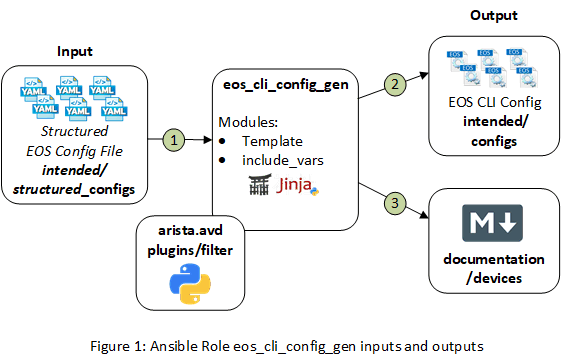

# Ansible Role: eos_cli_config_gen

**Table of Contents:**

- [Ansible Role: eos_cli_config_gen](#ansible-role-eoscliconfiggen)
  - [Overview](#overview)
  - [Role Inputs and Outputs](#role-inputs-and-outputs)
  - [Requirements](#requirements)
  - [Input Variables](#input-variables)
    - [Terminal Settings](#terminal-settings)
    - [Aliases](#aliases)
    - [Hardware Counters](#hardware-counters)
    - [Daemon TerminAttr](#daemon-terminattr)
    - [Internal VLAN Allocation Policy](#internal-vlan-allocation-policy)
    - [Event Monitor](#event-monitor)
    - [Load Interval](#load-interval)
    - [Queue Monitor Length](#queue-monitor-length)
    - [Logging](#logging)
    - [Domain Lookup](#domain-lookup)
    - [Name Servers](#name-servers)
    - [NTP Servers](#ntp-servers)
    - [Sflow](#sflow)
    - [redundancy](#redundancy)
    - [Spanning Tree](#spanning-tree)
    - [AAA Authentication](#aaa-authentication)
    - [Local users](#local-users)
    - [clock timezone](#clock-timezone)
    - [VLANs](#vlans)
    - [VRF Instances](#vrf-instances)
    - [bfd multihop interval](#bfd-multihop-interval)
    - [Port-Channel Interfaces](#port-channel-interfaces)
    - [Ethernet Interfaces](#ethernet-interfaces)
    - [Loopback Interfaces](#loopback-interfaces)
    - [Management Interfaces](#management-interfaces)
    - [VLAN Interfaces](#vlan-interfaces)
    - [VxLAN interface](#vxlan-interface)
    - [Hardware TCAM Profiles](#hardware-tcam-profiles)
    - [MAC address-table](#mac-address-table)
    - [Router Virtual MAC Address](#router-virtual-mac-address)
    - [Virtual Source NAT](#virtual-source-nat)
    - [Static Routes](#static-routes)
    - [Prefix Lists](#prefix-lists)
    - [MLAG Configuration](#mlag-configuration)
    - [Route Maps](#route-maps)
    - [Peer Filters](#peer-filters)
    - [Router BGP Configuration](#router-bgp-configuration)
    - [Router OSPF Configuration](#router-ospf-configuration)
    - [Queue Monitor Streaming](#queue-monitor-streaming)
    - [Banners](#banners)
    - [HTTP Management API](#http-management-api)
    - [Management Console](#management-console)
    - [Management SSH](#management-ssh)
  - [License](#license)

## Overview

**eos_cli_config_gen**, is a role that generates eos cli syntax and device documentation.

The **eos_cli_config_gen** role:

- Designed to generate the intended configuration offline, without relying on switch current state information.
- Facilitates the evaluation of the configuration prior to deployment with tools like [Batfish](https://www.batfish.org/)

## Role Inputs and Outputs

Figure 1 below provides a visualization of the roles inputs, and outputs and tasks in order executed by the role.



**Inputs:**

- Structured EOS configuration file in yaml format.

**Outputs:**

- EOS configuration in CLI format.
- Device Documentation in Markdown format.

**Tasks:**

1. Include device structured configuration that was previously generated.
2. Generate EOS configuration in CLI format.
3. Generate Device Documentation in Markdown format.

## Requirements

Requirements are located here: [avd-requirements](../../README.md#Requirements)

## Input Variables

- The input variables are documented inline within yaml formated output with: "< >"
- Variables are organized in order of how they appear in the CLI syntax.
- Available features  and variables may vary by platforms, refer to documentation on arista.com for specifics.
- All values are optional. Boolean variables default to "false" unless explicitly stated.

### Terminal Settings

```yaml
terminal:
  length: < integer between 0 and 32767 >
  width: < integer between 0 and 32767 >
```

### Aliases

```yaml
aliases: |
< list of alias commands in EOS CLI >
```

### Hardware Counters

```yaml
hardware_counters:
  features:
    - <feature_1>: < direction | in | out >
    - <feature_1>: < direction | in | out >
```

### Daemon TerminAttr

```yaml
daemon_terminattr:
  ingestgrpcurl:
    ips:
      - < IPv4_address >
      - < IPv4_address >
      - < IPv4_address >
    port: < port_id >
  ingestauth_key: < ingest_key >
  ingestvrf: < vrf_name >
  smashexcludes: "< list as string >"
  ingestexclude: "< list as string >"

```

### Internal VLAN Allocation Policy

```yaml
vlan_internal_allocation_policy:
  allocation: < ascending | descending >
  range:
    beginning: < vlan_id >
    ending: < vlan_id >
```

### Event Monitor

```yaml
event_monitor:
  enabled: < true | false >
```

### Load Interval

```yaml
load_interval:
  default: < seconds >

```

### Queue Monitor Length

```yaml
queue_monitor_length:
  log: < seconds >
```

### Logging

```yaml
logging:
  console: < severity_level >
  monitor: < severity_level >
  buffered:
    size: < integer between 10 and 2147483647 representing number of messages >
    level: < severity_level >
  trap: < severity_level >
  source_interface:
  vrfs:
    mgt:
      source_interface:
      hosts:
        - < syslog_server_1>
        - < syslog_server_2>  
```

### Domain Lookup

```yaml
ip_domain_lookup:
  source_interfaces:
    <source_interface_1>:
      vrf: <vrf_name>
``` 

### Name Servers

```yaml
name_server:
  source:
    vrf: < vrf_name >
  nodes:
    - < name_server_1 >
    - < name_server_2 >
```

### DNS Domain

```yaml
dns_domain: <domain_name>
``` 

### NTP Servers

```yaml
ntp_server:
  local_interface:
    vrf: < vrf_name >
    interface: < source_interface >
  nodes:
    - < ntp_server_1 >
    - < ntp_server_2 >

```

### Sflow

```yaml
sflow:
  destinations:
    < sflow_destination_ip_1 >:
    < sflow_destination_ip_2 >:
  source_interface: < interface >
  sample: < integer >
  run: < true | false >
``` 

### redundancy

```yaml
redundancy:
  protocol: < redundancy_protocol >
```

### Spanning Tree

```yaml
spanning_tree:
  mode: < spanning_tree_mode >
  priority: < priority_level >
```

### AAA Authentication

```yaml
aaa_authorization:
  exec_default: < group | local | none >
```

### Local users

```yaml
local_users:
  < user_1 >:
    privilege: < 1-15 >
    role: < role >
    sha512_password: "< sha_512_password >"
  < user_2 >:
    privilege: < 1-15 >
    role: < role >
    sha512_password: "< sha_512_password >"
```

### clock timezone

```yaml
clock:
  timezone: < timezone >
```

### VLANs

```yaml
vlans:
  < vlan_id >:
    name: < vlan_name >
    trunk_groups:
      - < trunk_group_name_1 >
      - < trunk_group_name_2 >
  < vlan_id >:
    name: < vlan_name >
```

### VRF Instances

```yaml
vrfs:
  < vrf_name >:
    description: < description>
    ip_routing: < true | false >
    ipv6_routing: < true | false >
  < vrf_name >:
    description: < description>  
    ip_routing: < true | false >
    ipv6_routing: < true | false >
```

### bfd multihop interval

```yaml
bfd_multihop:
  interval: < Rate in milliseconds >
  min_rx: < Rate in milliseconds >
  multiplier: < 3-50 >
```

### Port-Channel Interfaces

```yaml
port_channel_interfaces:
  < Port-Channel_interface_1 >:
    description: < description >
    vlans: "< list of vlans as sting >"
    mode: < access | dot1q-tunnel | trunk >
    mlag: < mlag_id >
    trunk_groups:
      - < trunk_group_name_1 >
      - < trunk_group_name_2 >
  < Port-Channel_interface_1 >:
    description: < description >
    vlans: "< list of vlans as sting >"
    mode: < access | dot1q-tunnel | trunk >
```

### Ethernet Interfaces

```yaml
# Routed Interfaces
ethernet_interfaces:
  <Ethernet_interface_1 >:
    description: < description >
    speed: < interface_speed >
    mtu: < mtu >
    type: routed
    vrf: < vrf_name >
    ip_address: < IPv4_address/Mask >
    ospf_network_point_to_point: < true | false >
    ospf_area: < ospf_area >

# Switched Interfaces
  <Ethernet_interface_2 >:
    description: < description >
    speed: < interface_speed >
    vlans: "< list of vlans as sting >"
    mode: < access | dot1q-tunnel | trunk >
    flowcontrol:
      received: < received | send | on >
    channel_group:
      id: < Port-Channel_id >
      mode: < on | active | passive >
```

### Loopback Interfaces

```yaml
loopback_interfaces:
  < Loopback_interface_1 >:
    description: < description >
    ip_address: < IPv4_address/Mask >
    ospf_area: < ospf_area >
  < Loopback_interface_2 >:
    description: < description >
    ip_address: < IPv4_address/Mask >
```

### Management Interfaces

```yaml
management_interfaces:
  < Management_interface_1:
    description: < description >
    vrf: < vrf_name >
    ip_address: < IPv4_address/Mask >
    ipv6_address: < IPv6_address/Mask >
    ipv6_enable: < true | false >
    gateway: <IPv4 address of gateway>
    ipv6_gateway: <IPv6 address of gateway>
```

### VLAN Interfaces

```yaml
vlan_interfaces:
  < Vlan_id_1 >:
    description: < description >
    vrf: < vrf_name >
    ip_address: < IPv4_address/Mask >
    ip_address_secondary: < IPv4_address/Mask >
    virtual: < true | false >
    ospf_network_point_to_point: < true | false >
    ospf_area: < ospf_area >
    mtu: < mtu >
  < Vlan_id_2 >:
    description: < description >
    ip_address: < IPv4_address/Mask >
```

### VxLAN interface

```yaml
vxlan_tunnel_interface:
  Vxlan1:
    description: < description >
    source_interface: < interface >
    virtual_router:
      encapsulation_mac_address: < mlag-system-id | ethernet_address (H.H.H) >
    vxlan_udp_port: < udp_port >
    vxlan_vni_mappings:
      vlans:
        < vlan_id_1 >:
          vni: < vni_id_1 >
        < vlan_id_2 >:
          vni: < vni_id_2 >
      vrfs:
        < vrf_name >:
          vni: < vni_id_3 >
        < vrf_name >:
          vni: < vni_id_4 >
```

### Hardware TCAM Profiles

```yaml
tcam_profile:
  - < tcam_profile >
```

### MAC address-table

```yaml
mac_address_table:
  aging_time: < agin_time_in_seconds >
```

### Router Virtual MAC Address

```yaml
ip_virtual_router_mac_address: < mac_address (hh:hh:hh:hh:hh:hh) >
```

### Virtual Source NAT

```yaml
virtual_source_nat_vrfs:
  < vrf_name_1 >:
    ip_address: < IPv4_address >
  < vrf_name_2 >:
    ip_address: < IPv4_address >
```

### Static Routes

```yaml
static_routes:
  - vrf: < vrf_name >
    destination_address_prefix: < IPv4_network/Mask >
    gateway: < IPv4_address >
  - destination_address_prefix: < IPv4_network/Mask >
    gateway: < IPv4_address >
```

### Prefix Lists

```yaml
prefix_lists:
  < prefix_list_name_1 >:
    sequence_numbers:
      < sequence_id_1 >:
        action: "< action as string >"
      < sequence_id_2 >:
        action: "< action as string >"
  < prefix_list_name_2 >:
    sequence_numbers:
      < sequence_id_1 >:
        action: "< action as string >"
```

### MLAG Configuration

```yaml
mlag_configuration:
  domain_id: < domain_id_name >
  local_interface: < interface >
  peer_address: < IPv4_address >
  peer_address_heartbeat:
    peer_ip: < IPv4_address >
    vrf: < vrf_name >
  dual_primary_detection_delay: < seconds >
  peer_link: < Port-Channel_id >
  reload_delay_mlag: < seconds >
  reload_delay_non_mlag: < seconds >
```

### Route Maps

```yaml
route_maps:
  < route_map_name_1 >:
    sequence_numbers:
      < sequence_id_1 >:
        type: < permit | deny >
        match: "< match as string >"
      < sequence_id_1 >:
        type: < permit | deny >
        match: "< match as string >"
  < route_map_name_2 >:
    sequence_numbers:
      < sequence_id_1 >:
        type: < permit | deny >
        match: "< match as string >"
```

### Peer Filters

```yaml
peer_filters:
  < peer_filter_name_1:
    sequence_numbers:
      < sequence_id_1 >:
        match: "< match as string >"
      < sequence_id_2 >:
        match: "< match as string >"
  < peer_filter_name_2:
    sequence_numbers:
      < sequence_id_1 >:
        match: "< match as string >"
```

### Router BGP Configuration

```yaml
router_bgp:
  as: < bgp_as >
  router_id: < IPv4_address >
  bgp_defaults:
    - "< bgp command as string >"
    - "< bgp command as string >"
  peer_groups:
    < peer_group_name_1>:
      type: < ipv4 | evpn >
      peer_filter: < peer_filter >
      next_hop_unchanged: < true | false >
      update_source: < interface >
      fall_over_bfd: < true | false >
      ebgp_multihop: < integer >
      next_hop_self: < true | false >
      password: "< encrypted_password >"
      send_community: < true | false >
      maximum_routes: < integer >
    < peer_group_name_2 >:
      type: < ipv4 | evpn >
      peer_filter: < peer_filter >
      password: "< encrypted_password >"
      maximum_routes: < integer >
  neighbors:
    < IPv4_address_1 >:
      peer_group: < peer_group_name >
      remote_as: < bgp_as >
    < IPv4_address_2 >:
      peer_group: < peer_group_name >
      remote_as: < bgp_as >
  redistribute_routes:
    connected:
      route_map: < route_map_name >
  vlan_aware_bundles:
    < vlan_aware_bundle_name_1 >:
      rd: "< route distinguisher >"
      route_targets:
        < both | import | export >:
          asn: "< asn >"
      redistribute_routes:
        - < connected >
        - < learned >
      vlan: < vlan_range >
    < vlan_aware_bundle_name_2 >:
      rd: "< route distinguisher >"
      route_targets:
        < both | import | export >:
          asn: "< asn >"
      redistribute_routes:
        - < connected >
        - < learned >
      vlan: < vlan_range >
  vlans:
    < vlan_id_1>:
      rd: "< route distinguisher >"
      route_targets:
        < both | import | export >:
          asn: "< asn >"
      redistribute_routes:
        - < connected >
        - < learned >
    <vlan_id_2 >:
      rd: "< route distinguisher >"
      route_targets:
        < both | import | export >:
          asn: "< asn >"
      redistribute_routes:
        - < connected >
        - < learned >
  vrfs:
    < vrf_name_1 >:
      rd: "< route distinguisher >"
      route_targets:
        import:
          address_family: < evpn >
          asn: "< asn >"
        export:
          address_family: < evpn >
          asn: "< asn >"
      redistribute_routes:
        - < connected >
        - < learned >
    < vrf_name_2 >:
      rd: "<route distinguisher >"
      route_targets:
        import:
          address_family: < evpn >
          asn: "< asn >"
        export:
          address_family: < evpn >
          asn: "< asn >"
      redistribute_routes:
        - < connected >
        - < learned >
```

### Router OSPF Configuration

```yaml
router_ospf:
  process_ids:
    < process_id >:
      passive_interface_default: < true | false >
      router_id: < IPv4_address >
      no_passive_interfaces:
        - < interface_1 >
        - < interface_2 >
      max_lsa: < integer >
```

### Queue Monitor Streaming

```yaml
queue_monitor_streaming:
  enable: < true | false >
```

### Banners

```yaml
banners:
  login: |
    < text ending by EOF >
  motd: |
    < text ending by EOF >
```

### HTTP Management API

```yaml
management_api_http:
  enable_http: < true | false >
  enable_https: < true | false >
  enable_vrfs:
    < vrf_name_1 >:
      access_group: < Standard IPv4 ACL name >
    < vrf_name_2 >:
```

### Management Console

```yaml
management_console:
  idle_timeout: < integer between 0 and 86400 representing minutes >
```

### Management SSH

```yaml
management_ssh:
  access_groups:
    < standard_acl_name_1 >:
    < standard_acl_name_2 >:
      vrf: < vrf name >
  idle_timeout: < integer between 0 and 86400 representing minutes >
  enable: < true | false >
  vrfs:
    < vrf_name_1 >:
      enable: < true | false >
    < vrf_name_2 >:
      enable: < true | false >
```


## License

Project is published under [Apache 2.0 License](../../LICENSE)
