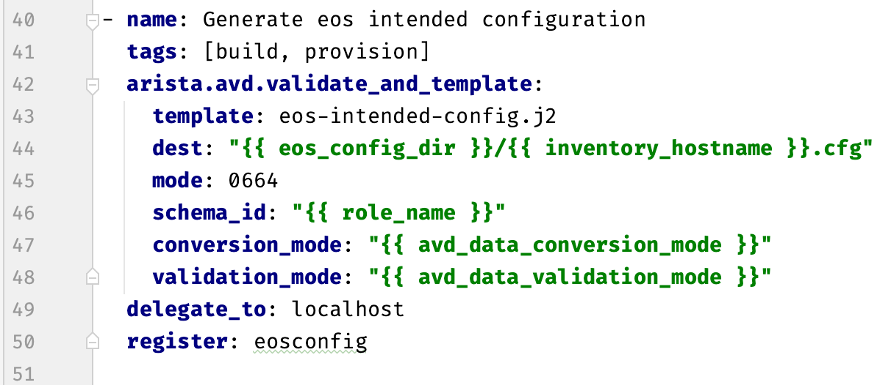
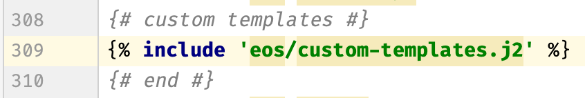

<!--
  ~ Copyright (c) 2023 Arista Networks, Inc.
  ~ Use of this source code is governed by the Apache License 2.0
  ~ that can be found in the LICENSE file.
  -->

# Custom Templates

With Custom Templates for the `eos_cli_config_gen` role, the user can create additional CLI configuration for features that are not covered by the built-in templates.

## Create a Custom Template

Custom templates should be written in Jinja2.

For details on how to create Jinja2 templates, see [Templating Jinja2](https://docs.ansible.com/ansible/latest/playbook_guide/playbooks_templating.html#templating-jinja2)

Custom templates can utilize any AVD variable for variable substitution including additional structured configuration variables created by a custom template in the `eos_designs` role. For details on how to create additional structured configuration variables see [Custom Templates for eos_designs](../../../eos_designs/docs/how-to/custom-templates.md) 

## Adding the Custom Template to groupvars

For the custom template to be automatically discovered and rendered by `eos_cli_config_gen`, a variable that references the template should be added to `groupvars`.

The format of the variable should be as follows:
```yaml
custom_templates:
  - custom_template_name.j2
```
For more details, see [Extensibility with Custom Templates](https://avd.sh/en/stable/roles/eos_cli_config_gen/docs/role-configuration.html#extensibility-with-custom-templates)

## Adding the Custom Template to the `eos_cli_config_gen` Role

This happens automatically as part of the `Generate eos intended configuration` task in `~/.ansible/collections/ansible_collections/arista/avd/roles/eos_cli_config_gen/tasks/main.yaml`.

<!--  -->

<div style="text-align:left; width:500px">
  
</div>


This task renders the main `eos-intended-config.j2` template which has multiple include statements. One of these include statements pertains to custom templates and causes any custom templates to be included in the rendering process.

<!--  -->

<div style="text-align:left; width:400px">
  
</div>