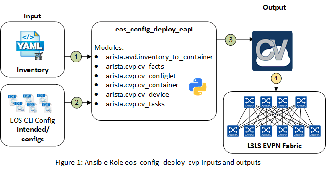

# Ansible Role: eos_config_deploy_cvp

## Overview

**eos_config_deploy_cvp** is a role that deploys the configuration to Arista EOS devices via the CloudVision Management platform.

The **eos_config_deploy_cvp** role:

- Designed to configure CloudVision with fabric configlets & topology.
- Deploy intended configlets to devices and execute pending tasks.

## Role requirements

This role requires to install `arista.cvp` collection to support CloudVision interactions.

```shell
ansible-galaxy collection install arista.cvp
```

> **NOTE**: When using ansible-cvp modules, the user executing the Ansible playbook must have access to both CVP and the EOS CLI.

## Role Inputs and Outputs

Figure 1 below provides a visualization of the role's inputs, outputs, and tasks in order executed by the role.



1. Read inventory file
   1. Build containers topology
2. Role looks for configuration previously generated by [`arista.avd.eos_cli_config_gen`](../eos_cli_config_gen/README.md)
   1. List configuration and build configlets list, one per device
3. Role looks for additional configlets to attach to either devices or containers
4. Build CloudVision configuration using [`arista.cvp`](https://github.com/aristanetworks/ansible-cvp/) collection:
   1. Build configlets on CV
   2. Create containers topology
   3. Move devices to container
   4. Bind configlet to device
5. Deploy Fabric configuration by running all pending tasks (optional, if execute_tasks == true)

### Inputs

**Inventory configuration:**

An entry must be part of the inventory to describe the CloudVision server. `arista.cvp` modules use the httpapi approach. The example below provides a framework to use in your inventory.

```yaml
all:
  children:
    cloudvision:
      hosts:
        cv_server01:
          ansible_httpapi_host: 10.83.28.164
          ansible_host: 10.83.28.164
          ansible_user: ansible
          ansible_password: ansible
          ansible_connection: httpapi
          ansible_httpapi_use_ssl: True
          ansible_httpapi_validate_certs: False
          ansible_network_os: eos
          ansible_httpapi_port: 443
          # Configuration to get Virtual Env information
          ansible_python_interpreter: $(which python3)
```

For a complete list of authentication options available with CloudVision Ansible collection, you can read the dedicated page on [arista.cvp collection](https://cvp.avd.sh/en/latest/docs/how-to/cvp-authentication/).

### Module variables

- **`container_root`**: Inventory group name where fabric devices are located. Default: `{{ fabric_name }}`.
- **`configlets_prefix`**: Prefix to use for configlet on CV side. Default: `AVD-{{ fabric_name }}-`.
- **`device_filter`**: Filter to target a specific set of devices on CV side. Default: `all`. It can be either a string or a list of strings.
- **`state`**: `present` / `absent`. Support creation or cleanup topology on CV server. Default: `present`.
- **`execute_tasks`**:  `true` / `false`. Support automatically executing pending tasks. Default: `false`.
- **`cvp_configlets`**: Structure to add additional configlets to those automatically generated by AVD roles.
- **`cv_collection`**: Version of CloudVision collection to use. Can be `v1` or `v3`. Default is `v1`.

#### Getting Started

Below is an example of how to use role with a single string as `device_filter`:

```yaml
tasks:
  - name: run CVP provisioning
    import_role:
        name: eos_config_deploy_cvp
    vars:
      container_root: 'DC1_FABRIC'
      configlets_prefix: 'DC1-AVD'
      device_filter: 'DC1'
      state: present
      execute_tasks: false
```

The following code block is an example of how to use this role with a list of strings to create `device_filter` entries:

```yaml
tasks:
  - name: run CVP provisioning
    import_role:
        name: eos_config_deploy_cvp
    vars:
      container_root: 'DC1_FABRIC'
      configlets_prefix: 'DC1-AVD'
      device_filter:
        - 'DC1'
        - 'DC2'
      state: present
      execute_tasks: false
```

### Ignore devices not provisioned in CloudVision

When you want to provision a complete topology and devices aren't already in CloudVision, you can configure inventory to ignore these devices by using a host variable: `is_deployed`.

- `is_deployed: true` or `is_deployed is not defined`: An entry in **cv_device** is generated and AVD will configure device on CloudVision. If device is undefined, an error is raised.
- `is_deployed: false`: Device isn't configured in **cv_device** topology and only its configlet is uploaded on CloudVision.

Here is an overview with the key configured in the YAML inventory:

```yaml
  DC1_BL1:
    hosts:
      DC1-BL1A:
        ansible_port: 8012
  DC1_BL2:
    hosts:
      DC1-BL2A:
        ansible_port: 8012
        # Device configuration is generated by AVD
        # Device is not configured on Cloudvision (configlet is uploaded)
        is_deployed: false
```

#### Add additional configlets

This structure **must** be part of `group_vars` targeting `container_root`. Below is an example applied to `eos_l3_evpn`:

```yaml
# group_vars/DC1_FABRIC.yml

# List of additional CVP configlets to bind to devices and containers
# Configlets MUST be configured on CVP before running AVD playbooks.
cv_configlets:
  containers:
    <name of container>:
      - <First configlet to attach>
      - <Second configlet to attach>
      - <...>
  devices:
    <inventory_hostname>:
      - <First configlet to attach>
      - <Second configlet to attach>
      - <...>
    <inventory_hostname>:
      - <First configlet to attach>
      - <Second configlet to attach>
      - <...>
```

Full example:

```yaml
# group_vars/DC1_FABRIC.yml

# List of additional CVP configlets to bind to devices and containers
# Configlets MUST be configured on CVP before running AVD playbooks.
cv_configlets:
  containers:
    DC1_L3LEAFS:
      - GLOBAL-ALIASES
  devices:
    DC1-L2LEAF2A:
      - GLOBAL-ALIASES
    DC1-L2LEAF2B:
      - GLOBAL-ALIASES
```

_Notes:_

- These configlets **must** be created previously on CloudVision server and won't be managed by AVD roles.
- Current version **doesn't** support configlets unbound from container for safety reason. In such case, configlets should be removed from variables and manually unbind from containers on CloudVision.

#### Run module with different tags

This module also supports tags to run a subset of ansible tasks:

- **`build`**: Generate Arista Validated Design configuration for EOS devices (structure_configs / configs / documentation) and CloudVision inputs.
- **`provision`**: Run `build` tags + configure CloudVision with information generated in previous tasks

```shell
ansible-playbook playbook.to.deploy.with.cvp.yml --tags "provision"
```

Other option to run a subset of ansible tasks is to use **`--skip-tags <tag>`**:

- To run the module to update existing configlets only, we can use the following command:

```shell
ansible-playbook playbook.to.deploy.with.cvp.yml --skip-tags "containers"
```

- Skipping multiple tags could make the playbook even more lightweight. For example, the command below avoids CVP task execution.

```shell
ansible-playbook playbook.to.deploy.with.cvp.yml --skip-tags "containers,apply"
```

### Outputs

- None.

### Tasks

1. Copy generated configuration to CloudVision static configlets.
2. Create container topology and attach devices to the correct container.
3. Bind configlet for each device.
4. Apply generated tasks to deploy the configuration to devices.

## Requirements

Requirements are located here: [avd-requirements](../../README.md#Requirements)

## License

Project is published under [Apache 2.0 License](../../LICENSE)
