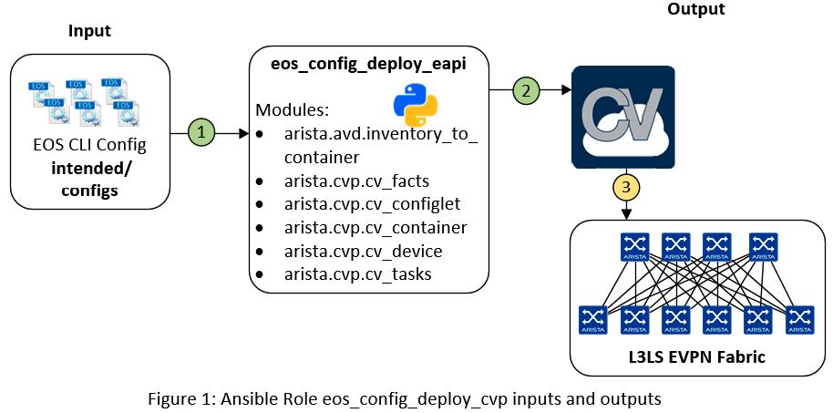

# Ansible Role: eos_config_deploy_eapi

**Table of Contents:**

- [Ansible Role: eos_config_deploy_eapi](#ansible-role-eosconfigdeployeapi)
  - [Overview](#overview)
  - [Role requirements](#role-requirements)
  - [Role Inputs and Outputs](#role-inputs-and-outputs)
  - [Requirements](#requirements)
  - [License](#license)

## Overview

**eos_config_deploy_cvp_**, is a role that deploys the configuration to Arista EOS devices via CloudVision Management platform.

The **eos_config_deploy_cvp** role:

- Designed to configure CloudVision with fabric configlets & topology.
- Deploy intended configlets to devices and execute pending tasks.

## Role requirements

This role requires to install `arista.cvp` collection to support CloudVision interactions.

```
$ ansible-galaxy collection install arista.cvp
```

## Role Inputs and Outputs

Figure 1 below provides a visualization of the roles inputs, and outputs and tasks in order executed by the role.



1. Role look for configuration previously generated by [`arista.avd.eos_cli_config_gen`](../eos_cli_config_gen/README.md)
   1. Read inventory file to build containers topology
   2. List configuration and build configlets list.
2. Build CloudVision configuration using [`arista.cvp`](https://github.com/aristanetworks/ansible-cvp/) collection:
   1. Build configlets on CV.
   2. Create containers topology.
   3. Move devices to container.
   4. Bind Configlet to device.
3. Deploy Fabric configuration by running all pending tasks.

**Inputs:**

__Inventory configuration:__

An entry must be part of the inventory to describe CloudVision server. `arista.cvp` modules use httpapi approach. Example below provides framework to use in your inventory.

```yaml
all:
  children:
    cloudvision:
      hosts:
        cv_server01:
          ansible_httpapi_host: 10.83.28.164
          ansible_host: 10.83.28.164
          ansible_user: ansible
          ansible_password: ansible
          ansible_connection: httpapi
          ansible_httpapi_use_ssl: True
          ansible_httpapi_validate_certs: False
          ansible_network_os: eos
          ansible_httpapi_port: 443
          # Configuration to get Virtual Env information
          ansible_python_interpreter: $(which python3)
```

__Module variables:__

- __`container_root`__: Inventory group name where Fabric devices are located
- __`configlets_prefix`__: Prefix to use for configlet on CV side.
- __`device_filter`__: Filter to target a specific set of devices on CV side.
- __`state`__: `present` / `absent`. Support creation or cleanup topology on CV server.

_Example_:

```yaml
tasks:
  - name: run CVP provisioning
    import_role:
        name: eos_config_deploy_cvp
    vars:
      container_root: 'DC1_FABRIC'
      configlets_prefix: 'DC1-AVD'
      device_filter: 'DC1'
      state: present
```

**Outputs:**

- None.

**Tasks:**

1. Copy generated configuration to CloudVision static configlets.
2. Create container topology and attach devices to correct container
3. Bind configlet to devices.
4. Apply generated tasks to deploy configuration to devices.

## Requirements

Requirements are located here: [avd-requirements](../../README.md#Requirements)

## License

Project is published under [Apache 2.0 License](../../../../../LICENSE)
