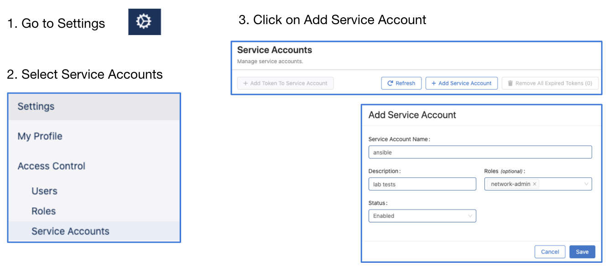
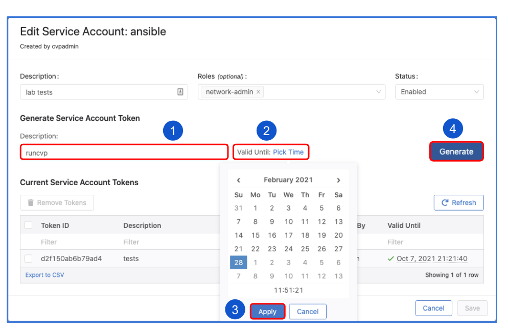
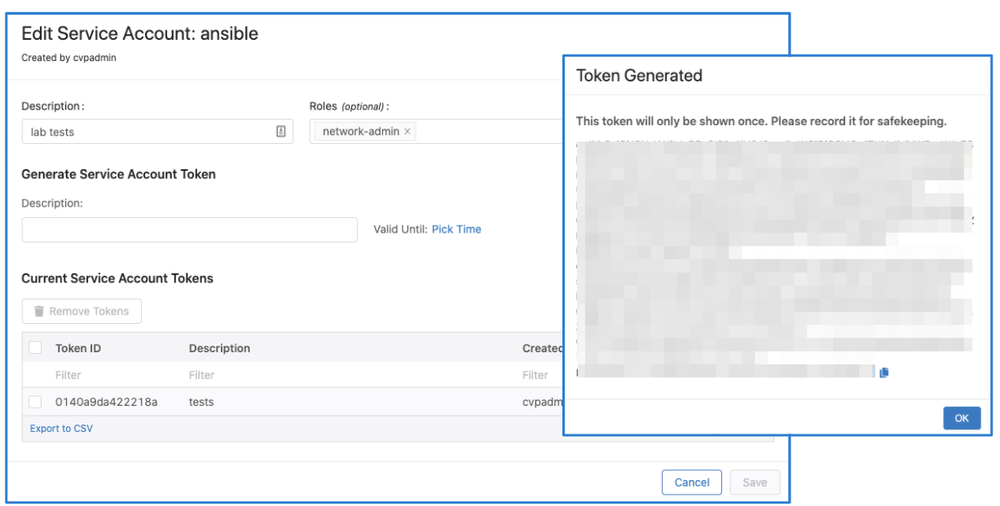

<!--
  ~ Copyright (c) 2023 Arista Networks, Inc.
  ~ Use of this source code is governed by the Apache License 2.0
  ~ that can be found in the LICENSE file.
  -->

# How to integrate AVD with CVaaS

The purpose of this tutorial is to review the steps required in order to integrate AVD with Arista CloudVision-as-a-Service.

!!! info "Important"
    The name of the service account created on CVaaS must match a username configured to be authorized on EOS,
    otherwise device interactive API calls may fail due to authorization denial.
    When using service accounts, on ansible side the `ansible_user` variable must always be `cvaas` or `svc_account`.
    The `cvaas` and `svc_account` are special variable names to notify the client to switch to using service accounts instead of creating a session using the login API with username/password.
    When using service accounts the username is embedded into the token itself so it does not need to be passed in a separate HTTP header on the client side.
    For example when using service accounts we would have the following:
    - on the CV UI the username in Users page and Service Accounts page would be john.smith
    - on EOS in the running config there would be either a local user: `username john.smith privilege 15 role <roleName> <nopassword/secret>` or one in TACACS/RADIUS
    - on ansible side in inventory.yaml the `ansible_user` has to be set to `cvaas` or `svc_account`, e.g.:  `ansible_user: cvaas` or `ansible_user: svc_account`
      and `ansible_password` will reference the service account token, e.g.: `"{{ lookup('file', '/tokens/cvaas.tok')}}"`
    - reference: [ansible-cvp authentication](https://cvp.avd.sh/en/stable/docs/how-to/cvp-authentication/)

## Steps to create service accounts on CloudVision

1. Go to Settings and Tools --> Access Control --> Service Accounts --> click `+ New Service Account`

```text
Account name: AVD
Description: "Automation with AVD"
Give a description under "Generated Service Account Token"
Specify the "valid until" date.
Make sure to copy the generated password. You only get view it once.
Click "Save" to exit the dialogue box.
```





!!! note
    The name of the service account must match a username configured to be authorized on
    EOS, otherwise device interactive API calls might fail due to authorization denial.

## Add CVAAS to your Ansible inventory file

Below is an example, the CVaaS group should be added outside of any group targeted by the AVD `eos_designs` and `eos_cli_config_gen` roles.

```yaml
DC1:
  children:
    CVAAS:
      hosts:
        cvaas:
```

## Adding group variables for the CVaaS instance

Create a folder under `group_vars` named `CVAAS` and add a file named `cvaas_auth.yml`. Your file should look similar to this:

```yaml
ansible_host: www.arista.io
ansible_user: cvaas
# Good until 1/24/2030 <update to expiration date of token that was generated in CVaaS>
# It is advised to use Ansible Vault for storing the `ansible_password`.

ansible_password: <service account token> (generated in CVP when AVD service account was created)
ansible_connection: httpapi
ansible_network_os: eos
ansible_httpapi_use_ssl: True
ansible_httpapi_validate_certs: True
ansible_httpapi_port: 443
```

Please note that the correct regional URL where the CVaaS tenant is deployed must be used. The following are the
cluster URLs used in production:

| Region | URL |
|--------|-----|
| United States 1a | [www.arista.io](https://www.arista.io) |
| United States 1c| [www.cv-prod-us-central1-c.arista.io](https://www.cv-prod-us-central1-c.arista.io)|
| Canada | [www.cv-prod-na-northeast1-b.arista.io](https://www.cv-prod-na-northeast1-b.arista.io)|
| Europe West 2| [www.cv-prod-euwest-2.arista.io](https://www.cv-prod-euwest-2.arista.io)|
| Japan| [www.cv-prod-apnortheast-1.arista.io](https://www.cv-prod-apnortheast-1.arista.io)|
| Australia | [www.cv-prod-ausoutheast-1.arista.io](https://www.cv-prod-ausoutheast-1.arista.io)|

!!! Warning

    URLs without `www` are not supported.

Click [here](#ansible-vault) for instructions on how to setup Ansible Vault.

## Testing connectivity and authentication between AVD and CVaaS

```sh
ansible -m arista.cvp.cv_facts_v3 cvaas
```

If your ansible.cfg file does not specify an inventory file you will need to add `-i inventory.yml` to the command. If the ad-hoc command runs and completes you have confirmed successful communication with CVaaS.

Now that AVD is talking to the CVaaS service you can run the "cvaas_deploy.yml" playbook to build out your containers, move devices to the proper container and then apply the generated config to the device.

## Sample playbook cvaas_deploy.yml

```yaml
---
- name: Configlet upload management
  hosts: cvaas
  connection: local
  gather_facts: no
  tasks:

  - name: "Deploying configurations to CVaaS"
    import_role:
      name: arista.avd.eos_config_deploy_cvp
    vars:
      container_root: 'DC1_FABRIC'
      configlets_prefix: 'DC1'
      state: present
      cv_collection: v3
      execute_tasks: false
```

!!! note
    For details on the supported inputs for `arista.avd.eos_config_deploy_cvp` see the [role documentation](../README.md)

## Ansible Vault

Once things are working it's a good idea to use Ansible Vault to encrypt your passwords in a production environment.

```sh
ansible-vault encrypt_string '<super long password>' --name 'ansible_ssh_pass' >> my_file.txt
```

## Key points

1. When creating the vault sometimes there will be an extra "%" sign at the end. Remove this.

   ```text
    $ANSIBLE_VAULT;1.1;AES256
    31383837323464376439313531333639373431316433636361633239663632663331383264646639
    3535386333356537643233376630636265653566636531390a663433323033653736653939663861
    33313466646363643135353065346439326633326138636331333331333338393332653231643930
    6661353835373731350a303666343334626532313361376361656235323638646264656639653139
    3437% <------------------Make sure to remove.
    ```

2. Sometimes when creating your vault there will be so much output that you will overrun the buffer on your CLI window. In order to get around this you can simply write the output to a file and then open up the file to grab the hash.

    ```sh
    ansible-vault encrypt_string '<super long password>' --name 'ansible_ssh_pass' >> my_file.txt
    ```

3. Once Ansible Vault has been added to your config simply add --ask-vault-pass when running the playbook

    ```sh
    root@6e3d94f50dca:/workspace# ansible-playbook playbooks/cvaas_facts.yml --ask-vault-pass
    Vault password:
    PLAY [Playbook to demonstrate cv_container module.]
    ***************************************************
    TASK [Gather CVaaS facts from cvaas]
    ***************************************************
    ok: [cvaas]
    PLAY RECAP
    ***************************************************
    cvaas                      : ok=1    changed=0    unreachable=0    failed=0    skipped=0    rescued=0    ignored=0
    ```
