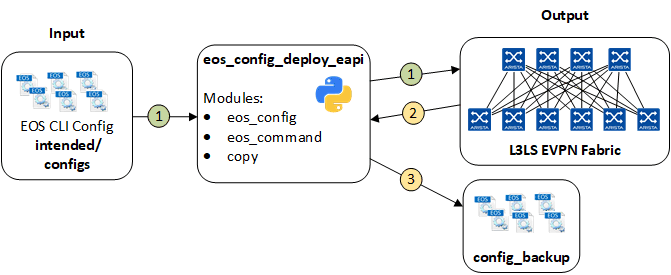

# Ansible Role: eos_config_deploy_eapi

**Table of Contents:**

- [Ansible Role: eos_config_deploy_eapi](#ansible-role-eos_config_deploy_eapi)
  - [Overview](#overview)
  - [Role Inputs and Outputs](#role-inputs-and-outputs)
  - [Default Variables](#default-variables)
  - [Requirements](#requirements)
  - [License](#license)

## Overview

**eos_config_deploy_eapi**, is a role that deploys the configuration to Arista EOS devices.

The **eos_config_deploy_eapi** role:

- Designed to replace device running-configuration with intended configuration.
- Backup configuration after successfully change.

## Role Inputs and Outputs

Figure 1 below provides a visualization of the roles inputs, and outputs and tasks in order executed by the role.



**Inputs:**

- Device configuration file in EOS CLI syntax.

**Outputs:**

- Device running-configuration before configuration is replaced (snapshot).
- Device running-configuration after configuration is replaced (backup).

**Tasks:**

1. Take a backup of the running configuration before configuration is replaced (pre) - (optional, default false).
   1. Destination: `{{ pre_running_config_backup_dir }}/{{ pre_running_config_backup_filename }}`
2. Replace configuration on device with intended EOS configuration. If changed, saves to startup-config, and notifies handler to backup configuration.
3. Backup Configuration after the configuration is replaced (post) with handler.
   1. Destination: `{{ post_running_config_backup_dir }}/{{ post_running_config_backup_filename }}`.

## Default Variables

```yaml
# Peform config backup before config replace
eos_config_deploy_eapi_pre_running_config_backup: false

# Root directory where to build output structure
root_dir: '{{ inventory_dir }}'

# Backup directories path and filenames
post_running_config_backup_filename: "{{ inventory_hostname }}_post_running-config.conf"
post_running_config_backup_dir_name: 'config_backup'
post_running_config_backup_dir: '{{ root_dir }}/{{ post_running_config_backup_dir_name }}'

pre_running_config_backup_filename: "{{ inventory_hostname }}_pre_running-config.conf"
pre_running_config_backup_dir_name: 'config_backup'
pre_running_config_backup_dir: '{{ root_dir }}/{{ pre_running_config_backup_dir_name }}'
```

## Requirements

Requirements are located here: [avd-requirements](../../README.md#Requirements)

## License

Project is published under [Apache 2.0 License](../../LICENSE)
