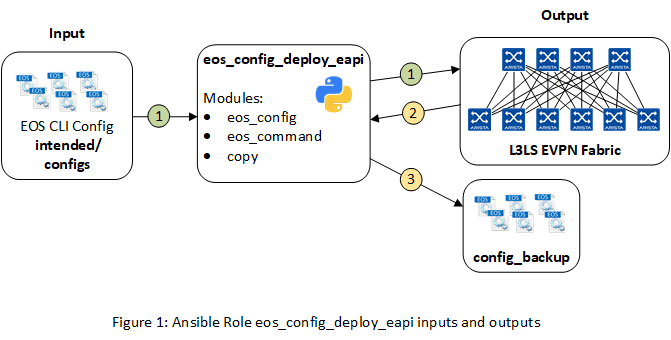

# Ansible Role: eos_config_deploy_eapi

**Table of Contents:**

- [Ansible Role: eos_config_deploy_eapi](#ansible-role-eosconfigdeployeapi)
  - [Overview](#overview)
  - [Role Inputs and Outputs](#role-inputs-and-outputs)
  - [Requirements](#requirements)
  - [License](#license)

## Overview

**eos_config_deploy_eapi**, is a role that deploys the configuration to Arista EOS devices.

The **eos_config_deploy_eapi** role:

- Designed to replace device running-configuration with intended configuration.
- Backup configuration after successfully change.

## Role Inputs and Outputs

Figure 1 below provides a visualization of the roles inputs, and outputs and tasks in order executed by the role.

**Inputs:**

- Device configuration file in EOS CLI syntax.

**Outputs:**

- Device running-configuration (backup).

**Tasks:**

1. Replace configuration on device with intended EOS configuration (Only when change is detected when configuration is generated). If changed, saves to startup-config, and notifies handler to backup configuration.
2. Show running configuration of device (handler)
3. Copy configuration to: `./config_backup/{{ inventory_hostname }}.cfg` (handler)

## Requirements

Requirements are located here: [avd-requirements](../../README.md#Requirements)

## License

Project is published under [Apache 2.0 License](../../LICENSE)
