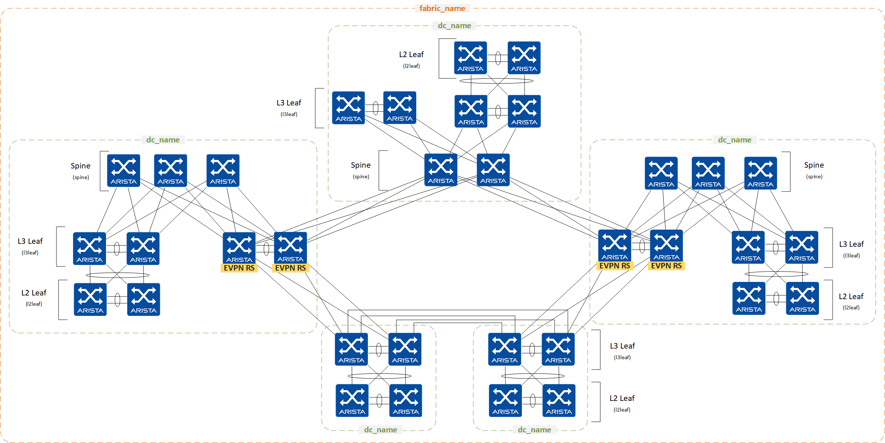

---
# This title is used for search results
title: Ansible Collection Role eos_designs
---
<!--
  ~ Copyright (c) 2023 Arista Networks, Inc.
  ~ Use of this source code is governed by the Apache License 2.0
  ~ that can be found in the LICENSE file.
  -->

# eos_designs

## Overview

**eos_designs** is a role that provides an abstracted data model to deploy various network designs and use cases. In addition, the templating framework provides the capability to extend or modify the defaults to accommodate specific environment needs.

The **eos_designs** role:

- Enables network engineers to deploy Arista Leaf & Spine fabrics with underlay and overlay network services effectively and with consistency.
- Designed to be extended easily, leveraging a ***"stackable template architecture."***
  - Enabled by the [eos_designs_custom_templates](docs/role-configuration.md#custom-templates) data model.
- Designed to be used with the [eos_cli_config_gen](../eos_cli_config_gen/README.md) role to generate a complete switch configuration and applied using a config replace strategy with either
  - [eos_config_deploy_eapi](../eos_config_deploy_eapi/README.md) role.
  - [eos_config_deploy_cvp](../eos_config_deploy_cvp/README.md)  role.
- Designed to generate the intended configuration offline, without relying on switch current state information.
- Facilitates the evaluation of the configuration post-deployment with [eos_validate_state](../eos_validate_state/README.md) role.
- Facilitates the evaluation of the configuration prior to deployment with tools like [Batfish](https://www.batfish.org/)

## Role Inputs and Outputs

Figure 1 below provides a visualization of the role's inputs, outputs, and tasks in order executed by the role.


**Inputs:**

- Desired variables are defined in: role defaults, group_vars, and host_vars variables.
- If desired, the role can be extended to leverage data from dynamic sources such as an IPAM or CMDB.

To understand the interaction between `eos_designs` input variables and `eos_cli_config_gen` input variables refer to the [Variables Precedence section](docs/how-to/custom-structured-configuration.md#variables-precedence)

**Outputs:**

- A structured EOS configuration file in YAML format. This provides the following benefits:
  - Leverage the structured data to create eos CLI configuration.
  - Leverage the structured data to create end-user documentation.
  - Leverage the structured data for pre and post-fabric validation.
- Fabric Documentation in Markdown format.
- Leaf and Spine Topology summary in CSV format.

**Tasks:**

1. Set AVD facts.
2. Generate YAML file with host variables (Optional for debugging/development with tag -> debug).
3. Set device configuration facts.
4. Write structured device configuration to YAML file.
5. Include device structured configuration that was previously generated.
6. Generate fabric documentation in Markdown format.
7. Generate fabric point-to-point links summary in CSV format.
8. Generate fabric physical topology summary in CSV format.

## Reference Designs

The following reference design types are included in the roles default variables:

- L3LS EVPN: Layer 3 Leaf Spine with VXLAN EVPN
- L2LS: Layer 2 Leaf Spine
- MPLS (BETA): MPLS Core with MPLS EVPN, VPN-IPv4, VPN-IPv6

### Layer 3 Leaf Spine with VXLAN EVPN

Feasible Layer 3 Leaf & Spine topologies leveraging VXLAN data-plane with an EVPN control-plane:

| Underlay | Overlay | Topology |
| -------- | ------- | -------- |
| eBGP | eBGP | Multi-Stage + L2 Leafs |
| ISIS | eBGP | Multi-Stage + L2 Leafs |
| ISIS | iBGP | Multi-Stage + L2 Leafs |
| OSPF | eBGP | Multi-Stage + L2 Leafs |
| OSPF | iBGP | Multi-Stage + L2 Leafs |
| RFC5549(eBGP) | eBGP | Multi-Stage + L2 Leafs |

Across all designs, the following functionality is provided:

- Flexible placement of EVPN Route Server (RS) or Route Reflector (RR), including dedicated overlay controller
- EVPN service definition: Layer 2 and Layer 3 (Network Services)
- L3 Edge ports definition
- L2 Edge ports definition (connected endpoints)
- Multi-Domain EVPN Gateway functionality

**5 Stage topology example:**

<div style="text-align:center">
  
</div>

**Disaggregated topology example:**

<div style="text-align:center">
  
</div>

### Layer 2 Leaf Spine

| Spine Uplinks | Leaf Uplinks | Topology |
| -------- | ------- | -------- |
| L2 | L2 | Arbitrary or leaf-spine |
| L3 + Static routes | L2 | Arbitrary or leaf-spine |
| L3 + eBGP | L2 | Arbitrary or leaf-spine |
| L3 + OSPF | L2 | Arbitrary or leaf-spine |
| L3 + ISIS | L2 | Arbitrary or leaf-spine |

### MPLS Core with MPLS EVPN, VPN-IPv4, VPN-IPv6

| Underlay | Overlay | Topology |
| -------- | ------- | -------- |
| ISIS-SR | iBGP | Arbitrary Mesh or leaf-spine |
| ISIS-SR + LDP | iBGP | Arbitrary Mesh or leaf-spine |
| ISIS + LDP | iBGP | Arbitrary Mesh or leaf-spine |
| OSPF + LDP | iBGP | Arbitrary Mesh or leaf-spine |

## Requirements

Requirements are located in the [collection installation guide](../../docs/installation/collection-installation.md)

## Input Variables

The input variables are documented in the [Input Variables](docs/input-variables.md) section.

Input variables are grouped by configuration elements and are typically stored in different group_vars files.

## Role Configuration

The role configuration are documented in the [Role Configuration](docs/role-configuration.md) section.

Role configuration settings can be set either as regular inventory variables or directly as task_vars on the `import_role` task.

## vEOS-LAB Know Caveats and Recommendations

- vEOS-LAB is a great tool to learn and test ansible-avd automation framework. This is the primary tool leveraged by Arista Ansible Team for development and testing efforts.
- vEOS-lab enables you to create and run replicas of physical networks within a risk-free virtual environment.
- Virtual networks created with vEOS-lab can be used for network modeling, planning for new services, or validating new features and functionality for the installed network.
- vEOS-lab isn't a network simulator but the exact EOS implementation that runs on the hardware platforms.
- Supported features are documented here: [Arista EOS overview](https://www.arista.com/en/products/eos).

However, because vEOS-LAB implements a virtual data plane, there are known caveats and adjustments required to default arista.avd settings:

**Variables adjustments required for vEOS-LAB:**

```yaml
# Update p2p_uplinks_mtu 9214 -> 1500, MTU 9214 is not supported in vEOS-LAB on some hypervisors.
p2p_uplinks_mtu: 1500

# Adjust default bfd values, to avoid high CPU.
bfd_multihop:
  interval: 1200
  min_rx: 1200
  multiplier: 3
```

## License

Project is published under [Apache 2.0 License](../../LICENSE)
