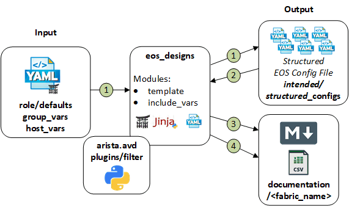

# Ansible Role: eos_designs

**Table of Contents:**

- [Ansible Role: eos_designs](#ansible-role-eos_designs)
  - [Overview](#overview)
  - [Role Inputs and Outputs](#role-inputs-and-outputs)
  - [Reference Designs](#reference-designs)
    - [Layer 3 Leaf Spine with VXLAN EVPN](#layer-3-leaf-spine-with-vxlan-evpn)
  - [Requirements](#requirements)
  - [Role Variables](#role-variables)
  - [Upgrade of eos_designs data model](#upgrade-of-eos_designs-data-model)
    - [Versioning](#versioning)
    - [Example Playbooks](#example-playbooks)
  - [vEOS-LAB Know Caveats and Recommendations](#veos-lab-know-caveats-and-recommendations)
  - [License](#license)

## Overview

**eos_designs**, is a role that provides an abstracted data model to deploy various network designs and use cases. The templating framework provides the capabilities to extend or modify the defaults to accommodate specific environment needs.

The **eos_designs** role:

- Enables network engineers to deploy Arista Leaf & Spine fabrics with underlay and overlay network services effectively and with consistency.
- Designed to be extended easily, leveraging a __*"stackable template architecture"*__.
  - Enabled by the [yaml_template_to_facts](../../plugins/README.md#yaml-templates-to-facts) action plugin.
- Designed to be used with the [eos_cli_config_gen](../eos_cli_config_gen/README.md) role to generate a complete switch configuration and applied using a config replace strategy with either
  - [eos_config_deploy_eapi](../eos_config_deploy_eapi/README.md) role.
  - [eos_config_deploy_cvp](../eos_config_deploy_cvp/README.md)  role.
- Designed to generate the intended configuration offline, without relying on switch current state information.
- Facilitates the evaluation of the configuration post-deployment with [eos_validate_state](../eos_validate_state/README.md) role.
- Facilitates the evaluation of the configuration prior to deployment with tools like [Batfish](https://www.batfish.org/)

## Role Inputs and Outputs

Figure 1 below provides a visualization of the roles inputs, outputs and tasks in order executed by the role.

<!--  -->

<div style="text-align:center">
  
</div>

**Inputs:**

- Desired variables are defined in: role defaults, group_vars, and host_vars variables.
- If desired, the role can be extended to leverage data from dynamic sources such as an IPAM or CMDB.

To understand the interaction between `eos_designs` input variables and `eos_cli_config_gen` input variables refer to the [Variables Precedence section](./doc/custom-structured-configuration.md#variables-precedence)

**Outputs:**

- A structured EOS configuration file in YAML format. This provides the following benefits:
  - Leverage the structured data to create eos CLI configuration.
  - Leverage the structured data to create end-user documentation.
  - Leverage the structured data for pre and post fabric validation.
- Fabric Documentation in Markdown format.
- Leaf and Spine Topology summary in CSV format.

**Tasks:**

1. Set AVD facts.
2. Generate YAML file with host variables (Optional for debugging/development with tag -> debug).
3. Set device configuration facts.
4. Write device structured configuration to YAML file.
5. Include device structured configuration that was previously generated.
6. Generate fabric documentation in Markdown format.
7. Generate fabric point-to-point links summary in CSV format.
8. Generate fabric physical topology summary in CSV format.

## Reference Designs

The following reference design types are included in the roles default variables:

- l3ls-evpn: Layer 3 Leaf Spine with VXLAN EVPN
- mpls (BETA): MPLS Core with MPLS EVPN, VPN-IPv4, VPN-IPv6

### Layer 3 Leaf Spine with VXLAN EVPN

Feasible Layer 3 leaf & spine topologies leveraging VXLAN data-plane with an EVPN control-plane:

| Underlay | Overlay | Topology |
| -------- | ------- | -------- |
| eBGP | eBGP | Multi-Stage + L2 Leafs |
| ISIS | eBGP | Multi-Stage + L2 Leafs |
| ISIS | iBGP | Multi-Stage + L2 Leafs |
| OSPF | eBGP | Multi-Stage + L2 Leafs |
| OSPF | iBGP | Multi-Stage + L2 Leafs |
| RFC5549(eBGP) | eBGP | Multi-Stage + L2 Leafs |

Across all designs the following functionality is provided:

- Flexible placement of EVPN Route Server (RS) or Route Reflector (RR), including dedicated overlay controller
- EVPN service definition: Layer 2 and Layer 3 (Network Services)
- L3 Edge port(s) definition
- L2 Edge ports definition (connected endpoints)
- Multi-Domain EVPN Gateway functionality

**5 Stage topology example:**

<div style="text-align:center">
  
</div>

**Dissagragated topology example:**

<div style="text-align:center">
  
</div>

### (BETA) MPLS Core with MPLS EVPN, VPN-IPv4, VPN-IPv6

| Underlay | Overlay | Topology |
| -------- | ------- | -------- |
| ISIS-SR | iBGP | Arbitrary Mesh or leaf-spine |
| ISIS-SR + LDP | iBGP | Arbitrary Mesh or leaf-spine |
| ISIS + LDP | iBGP | Arbitrary Mesh or leaf-spine |
| OSPF + LDP | iBGP | Arbitrary Mesh or leaf-spine |

## Requirements

Requirements are located here: [avd-requirements](../../README.md#Requirements)

## Role Variables

The role variables are documented inline within YAML formatted output with: "< >"
Some variables are required, while others are optional.
Default values are stored in the role defaults [main.yml](https://github.com/aristanetworks/ansible-avd/tree/devel/ansible_collections/arista/avd/roles/eos_designs/defaults) file.

Role variables are grouped by configuration elements and are typically stored in different group_vars files.

## Upgrade of eos_designs data model

The AVD **major** releases can contain breaking changes to the data models.
Data model changes requires a change to the `group_vars` and `host_vars`. To help identify needed changes and provide a smoother transition, the AVD 3.0 `eos_designs`
role can provide automatic upgrade of the data model for AVD 2.x to 3.0 upgrades.

To leverage this upgrade functionality, the playbook must include `tasks_from: upgrade` or `tasks_from: upgrade-and-run` for the `import_role` of `eos_designs`. Using `upgrade` alone will output the upgraded data files as described below. `upgrade-and-run` will also
run the regular `eos_designs` tasks after upgrading the data model.

The upgraded data will be saved in `{{ inventory_dir }}/eos_designs_upgrade_2.x_to_3.0` directory.

The user should then replace the old data structures manually in `group_vars` and `host_vars` files as applicable until no files are created in the upgrade directory when
running the playbook. After all data has been upgraded, the `tasks_from: upgrade` or `tasks_from: upgrade-and-run` can be removed again.

The upgrade does _not_ support `custom_structured_configuration` or `structured_config` keys. Content of these keys _must_ be upgraded manually as applicable.

### Versioning

To support future upgrades the relevant upgrade tasks can be chosen using a new upgrade setting.

```yaml
avd_eos_designs_upgrade: < "2.x-to-3.0" | default -> "2.x-to-3.0" >
```

### Example Playbooks

Running upgrade only

```yaml
---
- hosts: DC1_FABRIC
  tasks:
    - name: Run AVD eos_designs
      import_role:
        tasks_from: upgrade
        name: arista.avd.eos_designs
```

Running upgrade and the regular `eos_designs` tasks

```yaml
---
- hosts: DC1_FABRIC
  tasks:
    - name: Run AVD eos_designs
      import_role:
        tasks_from: upgrade-and-run
        name: arista.avd.eos_designs
```

Alternative with separate tasks:

```yaml
---
- hosts: DC1_FABRIC
  tasks:
    - name: Upgrade AVD eos_designs data model
      import_role:
        tasks_from: upgrade
        name: arista.avd.eos_designs
    - name: Run AVD eos_designs
      import_role:
        name: arista.avd.eos_designs
```

## vEOS-LAB Know Caveats and Recommendations

- vEOS-LAB is a great tool to learn and test ansible-avd automation framework.This is the primary tool leveraged by Arista Ansible Team for development and testing efforts.
- vEOS-lab enables you to create and run replicas of physical networks within a risk-free virtual environment.
- Virtual networks created with vEOS-lab can be used for network modeling, planning for new services, or validating new features and functionality for the installed network.
- vEOS-lab is not a network simulator but the exact EOS implementation that runs on the hardware platforms.
- Supported features are documented here: [Arista EOS overview](https://www.arista.com/en/products/eos)

However, because vEOS-LAB implements a virtual data plane, there are known caveats and adjustments required to default arista.avd settings:

**Variables adjustments required for vEOS-LAB:**

```yaml
# Disable update wait-for-convergence and update wait-for-install, which is not supported in vEOS-LAB.
spine_bgp_defaults:
#  - update wait-for-convergence
#  - update wait-install
  - no bgp default ipv4-unicast
  - distance bgp 20 200 200
  - graceful-restart restart-time 300
  - graceful-restart

leaf_bgp_defaults:
#  - update wait-install
  - no bgp default ipv4-unicast
  - distance bgp 20 200 200
  - graceful-restart restart-time 300
  - graceful-restart

# Update p2p mtu 9000 -> 1500, MTU 9000 not supported in vEOS-LAB.
p2p_uplinks_mtu: 1500

# Adjust default bfd values, to avoid high CPU.
bfd_multihop:
  interval: 1200
  min_rx: 1200
  multiplier: 3
```

## License

Project is published under [Apache 2.0 License](../../LICENSE)
