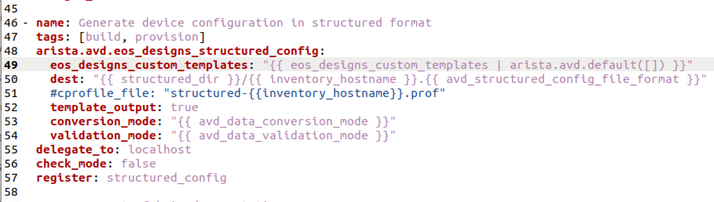

<!--
  ~ Copyright (c) 2023 Arista Networks, Inc.
  ~ Use of this source code is governed by the Apache License 2.0
  ~ that can be found in the LICENSE file.
  -->

# Custom Templates

With Custom Templates for the `eos_designs` role, the user can create additional structured configuration variables that would otherwise not be created by the builtin templates.
These additional variables will then be available for use by other AVD roles.

For example, the user may require additional structured configuration variables to render a custom template the user has created for the `eos-cli-config-gen` role.

## Create a Custom Template

Custom templates should be written in Jinja2.

For details on how to create Jinja2 templates, see [Templating Jinja2](https://docs.ansible.com/ansible/latest/playbook_guide/playbooks_templating.html#templating-jinja2)

For example:
```jinja2
_structured_configuration_variable_name: structured_configuration_variable_value {{ some_variable }}
```

At runtime, `eos_designs` searches for custom templates in several locations, therefore, custom templates should be saved in one of these locations:

```text
<path to users AVD implementation>/playbooks/templates/templates/<template name>
<path to users AVD implementation>/playbooks/templates/<template name>
<path to users AVD implementation>/playbooks/<template name>
```
The "templates" folders do not exist by default so will need to be created if that is the location chosen by the user.

### Variable Validation

As with any AVD variable, additional structured configuration variables will be subject to validation against the schema. Because they are custom variables, additional structured configuration variables will not be included in the existing schema and will therefore produce warning messages. To bypass validation, custom variables should start with an underscore.

## Adding the Custom Template to group vars

For the custom template to be automatically discovered and rendered by `eos_designs`, a variable that references the template should be added to the inventory group vars.

The format of the variable should be as follows:
```yaml
eos_designs_custom_templates:
  - template: custom_template.j2
    options:
      list_merge: prepend
      strip_empty_keys: false
```
For more details, see [Custom Templates](https://avd.arista.com/4.3/roles/eos_designs/docs/role-configuration.html#custom-templates)

## Adding the Custom Template to the `eos-designs` Role

This happens automatically via the `eos_designs_custom_templates` line that is part of the `Generate device configuration in structured format` task in `~/.ansible/collections/ansible_collections/arista/avd/roles/eos_designs/tasks/main.yaml`.

<!--  -->

<div style="text-align:center; width:600px">
  
</div>
