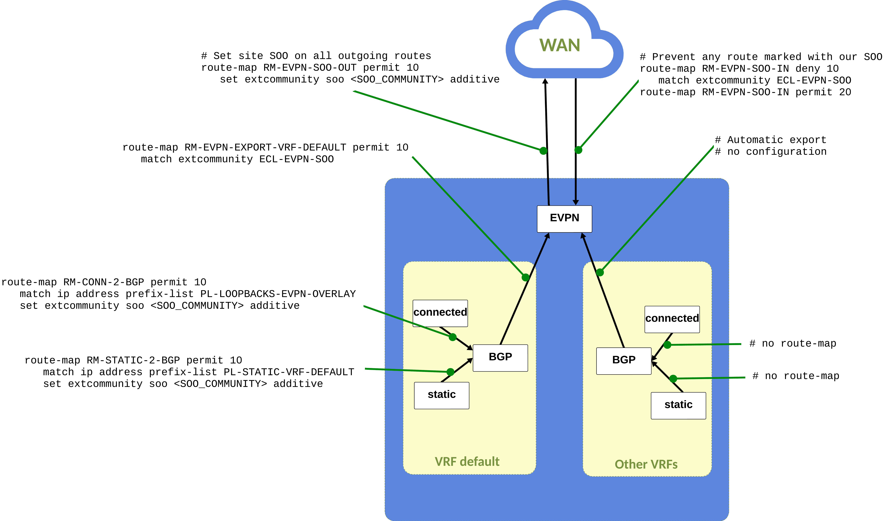

---
# This title is used for search results
title: Ansible Collection Role eos_designs - WAN
---
<!--
  ~ Copyright (c) 2023-2024 Arista Networks, Inc.
  ~ Use of this source code is governed by the Apache License 2.0
  ~ that can be found in the LICENSE file.
  -->

# WAN

!!! warning "Disclaimer"

    This how-to does not intend to be a network design nor a best practices document.
    It is about how to deploy a WAN network using AVD.

???+ warning "About PREVIEW keys in the schema"

    Some of the WAN functionality is still in PREVIEW. When this is the case it is indicated as such in the documentation.
    For these PREVIEW features, Everything is subject to change, is not supported and may not be complete.

    If you have any questions, please leverage the GitHub [discussions board](https://github.com/aristanetworks/avd/discussions)

## Overview

Please familiarize yourself with the Arista WAN terminology before proceeding:

- https://www.arista.com/en/solutions/enterprise-wan
- https://tech-library.arista.com/wan/ (Tech Library access requires an Arista account)

### Design points

- When deploying CV Pathfinder, the assumption is that the deployment is using CVaaS.
- The intent is to be able to support having the different WAN participating devices in different inventories.
- Only iBGP is supported as an overlay_routing_protocol.
- On the AutoVPN Route Reflectors and Pathfinders, a listen range statement is used for BGP to allow for distributed Ansible inventories.
- VRF `default` is being configured by default on all WAN devices with a `wan_vni` of 1. To override this, it is necessary to configure VRF `default` in a tenant in `network_services`.
- Path-group ID `65535` is reserved for the path-group called `LAN_HA`.

!!! info "CV Pathfinder & CloudVision"

    When deploying CV Pathfinder with CloudVision, it is necessary to leverage
    the `arista.avd.cv_deploy` role and not the `arista.avd.eos_config_deploy_cvp`
    role, as CloudVision relies on metadata sent by AVD for visualization and to
    generate and deliver certificates for STUN to devices.

### Features in PREVIEW

- WAN HA is in PREVIEW

  - While HA is in preview, it is required to either enable or disable HA if exactly two WAN routers are in one node group.
  - For HA, the considered interfaces are only the `uplink_interfaces` in VRF default or the interfaces defined under `wan_ha.ha_interfaces` node settings. This key can be used either to select only some `uplink_interfaces` available for establishing the HA tunnel OR to select one interface that is not an `uplink_interfaces`, for instance for direct HA connectivity.
  - HA for AutoVPN is not supported
- Internet-exit for Zscaler is in PREVIEW
- `eos_validate_state` is being enriched to support new tests for WAN designs.
    These new tests are added only in the [ANTA integration](../../../eos_validate_state/anta_integration.md) mode.

### Known limitations

- Zones are not configurable for CV Pathfinder. All sites are being configured in a default zone `<region_name>-ZONE` with ID `1`. Hence, in `eos_designs`, the `transit` node type is always configured as `transit region`.
- All Pathfinders must be able to create a full mesh
- No IPv6 support
- Path-group ID is currently required under `wan_path_groups` until an algorithm is implemented to auto generate IDs.
- The name of the AVT policies and AVT profiles are configurable in the input variables. The Load Balance policies are named `LB-<profile_name>` and are not configurable.
- LAN support is limited to single L2 using `uplink_type: lan` and eBGP L3 using `uplink_type: p2p-vrfs` in conjunction of `underlay_routing_protocol: ebgp`.
- All the WAN routers must have a common path-group with at least one WAN route server to be able to inject the default control-plane match statement in the VRF default WAN policy.
- For the default VRF, routes received over BGP peering configured under tenants in `network_services` will not be automatically advertised to the WAN (they will be advertised toward the LAN if eBGP is used). To advertise them towards the WAN, they need to be injected in EVPN and this can be achieved by adding a route-map to mark them with the site SOO.

### Future work

- New LAN scenarios (L2 port-channel, HA for L2 `lan` using VRRP..)
- HA for AutoVPN
- WAN Internet exit for other type than Zscaler
- `import path-group` functionality
- Indirect connectivity to pathfinder
- BGP peerings on WAN L3 interfaces and associated route filtering.
- Extra STUN server for a given path-group not connected to pathfinder
- Auto generation of Path-group IDs and other IDs.
- Proper OSPF-BGP redistribution in VRF default.
- Support for OSPF subinterfaces for `p2p-vrfs`.
- Increase test coverage in `eos_validate_state` support for AutoVPN and CV-Pathfinder
- Path selection outlier detection feature

!!! info

    `eos_cli_config_gen` schema should support all of the required keys to configure a WAN network, whether AutoVPN or Pathfinder except for the most recent features.
    This means that any missing `eos_designs` feature should be supported using `custom_structured_configuration` functionality.
    If you find any missing functionality, please open an issue on Github.

## Getting started with WAN

### Global settings

!!! tip

    These global settings must be the same for every WAN device participating
    in the WAN network.

    When using multiple inventories, the recommendation is
    to include these variables from a common source, for instance leveraging the `arista.avd.global_vars`
    Ansible plugin.

#### Summary

The following table list the `eos_designs` top level keys used for WAN and how they should be set:

| Key | Must be the same for all the WAN routers | Comment |
| --- | ---------------------------------------- | ------- |
| `wan_mode` | ✅ | Two possible modes, `autovpn` and `cv-pathfinder` (default). |
| `wan_virtual_topologies` | ✅ | to define the Policies and the VRF to policy mappings. |
| `wan_path_groups` | ✅ | to define the list of path-groups in the network. |
| `wan_carriers` | ✅ | to define the list of carriers in the network, each carrier is assigned to a path-group. |
| `wan_ipsec_profiles` | ✅ | to define the shared key for the Control Plane and Data Plane IPSec profiles. |
| `cv_pathfinder_regions` | ✅ | to define the Region/Zone/Site hierarchy, not required for AutoVPN. |
| `tenants` | ✅ | the default tenant key from `network_services` or any other key for tenant that would hold some WAN VRF information. |
| `wan_stun_dtls_disable` | ✅ | disable dTLS for STUN for instance for lab. (**NOT** recommended in production). |
| `application_classification` | ✅ | to define the specific traffic classification required for the WAN if any. |
| `cv_pathfinder_internet_exit_policies` | ✅ | to define the internet-exit policies. |
| `wan_route_servers` | ✘| Indicate to which WAN route servers the WAN router should connect to. This key is also used to tell every WAN Route Reflectors with which other RRs it should peer with. |
| `ipv4_acls` | ✘| List of IPv4 access-lists to be assigned to WAN interfaces. |

Additionally, following keys must be set for the WAN route servers for the connectivity to work:

- `bgp_peer_groups.wan_overlay_peers.listen_range_prefixes`: To set the ranges of IP address from which to expect BGP peerings for the WAN. Include the VTEP ranges for all routers connecting to this patfinder.

#### WAN mode

AVD supports two design types for WAN:

- AutoVPN
- CV Pathfinder

By default the mode is set to `cv-pathfinder` and can be changed using:

```yaml
---
wan_mode: autovpn | cv-pathfinder # default: cv-pathfinder
```

#### WAN node_types

There are two built-in node types for WAN:

- `wan_router`: WAN routers can be AutoVPN edges, CV Pathfinder edges or transits.
- `wan_rr`: WAN route servers, used for the AutoVPN RRs and CV Pathfinder Pathfinder nodes.

#### WAN route servers

The AVD model for WAN has been built with the intention that it should be possible to have the different WAN routers in different inventories.

The top level `wan_route_servers` allow to indicate to which AutoVPN RRs or to which Pathinders node the routers should connect to. The key can be different per region for instance.

```yaml
 WAN routers with this configuration will establish static peerings towards pf1 and pf2 and the common path-groups.
wan_route_servers: # (1)!
  - hostname: pf1
  - hostname: pf2
```

1. A `wan_router` with this configuration will establish BGP peering to all the `wan_route_servers` in the list if it has a common path-group.
    A `wan_rr` with this configuration will establish BGP peerings to every other `wan_route_servers` in the list if they have a common path-group.

!!! note

    It is recommended to always have at least 2 WAN route servers for redundancy and at least one WAN route server in each path group.

When the WAN route servers are part of the same inventory, each WAN router in the inventory is able to pick up the required information to generate the configuration from the inventory device.
However, if the WAN route servers are in a different inventory, it is then necessary to add some information under the `wan_route_servers` key entry. AVD will raise an error if any required information to generate the configuration is missing. Note that the configuration under `wan_route_servers` takes precedence over what AVD could derive from the device if it is in the same inventory.

#### WAN STUN handling

WAN STUN connections are configured by default authenticated and secured with DTLS by default. A security profile is configured with an hardcoded root certificate and matching a certificate `<profile_name>.crt` and  key `<profile_name>.key`:

```eos
management security
   ssl profile STUN-DTLS
      tls versions 1.2
      trust certificate aristaDeviceCertProvisionerDefaultRootCA.crt
      certificate STUN-DTLS.crt key STUN-DTLS.key
```

These values can be overwritten using `custom_structured_configuration`.

This configuration requires certificates to be distributed on the WAN devices to be able to authenticate themselves:

- For CV Pathinder deployments,  CloudVision will automatically generate and deploy the certificates on the devices once AVD configs and metadata have been pushed.
- For AutoVPN, the certificates must be generated and deployed to the devices for the STUN connections to work.

!!! Danger "Disabling STUN"

    It is possible to disable STUN using AVD but this implies that the STUN service is exposed with no authentication.

```yaml
# Use wan_stun_dtls_disable: true to disable STUN on all WAN devices
wan_stun_dtls_disable: true

# Use wan_stun_dtls_profile_name to overwrite the default profile name STUN-DTLS
wan_stun_dtls_profile_name: profileA
```

#### CV Pathfinder hierarchy

When deploying CV Pathfinder, it is required to define a WAN hierarchy grouping WAN sites in WAN regions using the top
level key `cv_pathfinder_regions`. Furthermore each WAN router must be assigned to a region and site in the node settings.

An example hierarchy looks like:

```yaml
cv_pathfinder_regions:
  - name: Region_1
    id: 1
    description: AVD Region 1
    sites:
      - name: Site11
        id: 11
        location: Somewhere
      - name: Site12
        id: 12
        location: Somewhere else
  - name: Region_2
    id: 2
    description: AVD Region 2
    sites:
      - name: Site11
        id: 11
      - name: Site21
        id: 21
```

!!! Note
    Site IDs and names must be unique per region.

And then for each `wan_router`:

```yaml
wan_router:
  nodes:
    - name: EDGE1
      cv_pathfinder_region: Region_1
      cv_pathfinder_site: Site11
```

For Pathfinders (`wan_rr`), both `cv_pathfinder_site` and `cv_pathfinder_region` are optional but recommended for the following use cases:

- To define a "global" pathfinder, only set the `cv_pathfinder_site` and define the site under `cv_pathfinder_global_sites`.
- To define a "regional" pathfinder, set both `cv_pathfinder_region` and `cv_pathfinder_site`. The region and site must be defined under `cv_pathfinder_hierarchy`.

#### WAN carriers and path-groups

Path-groups are used to define overlays over the various network transports a WAN can use.

In AVD, the list of desired path-groups must be defined the same across all WAN participating routers using the following top level key.

```yaml
wan_path_groups:
  - name: MPLS
    ipsec:
      static_peers: false
      dynamic_peers: false
    dps_keepalive:
      interval: 300
    id: 100
  - name: INET
    id: 101
  - name: LTE
    excluded_from_default_policy: true # (1)!
    id: 102
  - name: Equinix
    default_preference: alternate # (2)!
    id: 103
  - name: Satellite
    id: 104
```

1. The expectation here is that LTE shouldn't be present in automatically generated load balance policies.
2. This controls the preference allocated to the path-group in a load balance policy when no preference is specified.

!!! note

    The IDs are required and it is possible to turn on and off IPSec at the path-group level for dynamic or static peers.

To allow for a better visualization in CVaaS, AVD implements on level of indirection to be able to specify the carrier for the last mile provider. In addition some settings have been made available at the WAN carrier level like `trusted`.

Each carrier is associated to a path-group and multiple carriers can be assigned to the same path-group (e.g. all the Internet providers can be differentiated at the carrier level but bundled together at the path-group level).

The list of carriers must also be the same across all WAN routers:

```yaml
wan_carriers:
  - name: IPS-1
    path_group: INET
  - name: ISP-2
    path_group: INET
  - name: MPLS-SP1
    path_group: MPLS
    trusted: true # (1)!
  - name: MPLS-SP2
    path_group: MPLS
    trusted: true
  - name: LTE-5G-SP
    path_group: LTE
  - name: Satellite-SP
    path_group: Satellite
```

1. AVD won't require an interface ACL on WAN interfaces towards a `trusted` WAN carrier.

### Flow tracking

For scalabilty reasons, flow-tracking is enabled only on `Dps1` interface by default.
It can be added on WAN and LAN interfaces using `custom_structured_configuration`.

### WAN interfaces

A WAN interface in AVD is defined under the node settings under the `l3_interfaces` list. To be considered as a WAN interface by AVD, the `l3_interface` must have the `wan_carrier` key defined (which will allow to detect the path-group thanks to the carrier to path-group mapping). The `wan_circuit_id` is optional and used on CVaaS to provide more information in the visualization as well as in the AVD generated interface description. Finally the key `connected_to_pathfinder` allows to disable the static peering configuration on a given path-group.

!!! Danger

    The WAN interfaces may be connected directly to the Internet, it is the user's responsibility to craft the ACLs required to ensure only the expected traffic is accepted and sent.

```yaml
wan_router:
  defaults:
    loopback_ipv4_pool: 192.168.42.0/24
    vtep_loopback_ipv4_pool: 192.168.142.0/24
    uplink_ipv4_pool: 172.17.0.0/16
    bgp_as: 65000
    cv_pathfinder_region: Region_1
    cv_pathfinder_site: Site11
    nodes:
      - name: cv-pathfinder-edge
        id: 1
        uplink_switch_interfaces: [Ethernet1]
        l3_interfaces:
          # This is a WAN interface because `wan_carrier` is defined
          - name: Ethernet1 # (1)!
            peer: peer3
            peer_interface: Ethernet42
            wan_carrier: ISP-1
            wan_circuit_id: 666 # (2)!
            ipv4_acl_in: TEST-IPV4-ACL-WITH-IP-FIELDS-IN # (3)!
            ipv4_acl_out: TEST-IPV4-ACL-WITH-IP-FIELDS-OUT # (3)!
            dhcp_accept_default_route: true
            ip_address: dhcp
            dhcp_ip: 7.7.7.7
          - name: Ethernet2
            wan_carrier: MPLS-1
            wan_circuit_id: 10555
            ip_address: 172.15.5.5/31
            peer_ip: 172.16.5.4
            static_routes:
              - prefix: 172.16.0.0/16
            connected_to_pathfinder: False
          # This is NOT a WAN interface
          - name: Ethernet3
            ip_address: 172.20.20.20/31
```

1. `peer` and `peer_interface` are optionals and used for description.
2. `wan_circuit_id` is optional and used for description.
3. Configure IPv4 ACLs in and out for the L3 interface. The access lists must
    be defined under `ipv4_acls` top level key.

### WAN policies

The policies definition works as follow:

- The policies are defined under `wan_virtual_topologies.policies`. For AutoVPN mode, the policies are configured under `router path-selection`, for CV Pathfinder, they are configured under `router adaptive-virtual-topology`.
- A policy is composed of a list of `application_virtual_topologies` and one `default_virtual_topology`.
- The `application_virtual_topologies` entries and the `default_virtual_topology` key are used to create the policy match statement, the AVT profile (when `wan_mode` is CV Pathfinder) and the load balancing policy.
- The `default_virtual_topology` is used as the default match in the policy.  To prevent configuring it, the `drop_unmatched` boolean must be set to `true` otherwise, at least one `path-group` must be configured or AVD will raise an error.
- Policies are assigned to VRFs using the list `wan_virtual_topologies.vrfs`. A policy can be reused in multiple VRFs.
- If no policy is assigned for the `default` VRF policy, AVD auto generates one with one `default_virtual_topology` entry configured to use all available local path-groups.
- For the policy defined for VRF `default` (or the auto-generared one), an extra match statement is injected in the policy to match the traffic towards the Pathfinders or AutoVPN RRs, the name of the application-profile is hardcoded as `APP-PROFILE-CONTROL-PLANE`. A special policy is created by appending `-WITH-CP` at the end of the targeted policy name.
- For the policy defined for VRF `default` (or the auto-generated one), an extra match statement is always injected in the policy to match the traffic towards the Pathfinders or AutoVPN RRs. The name of the injected application-profile is hardcoded as `APP-PROFILE-CONTROL-PLANE`. A special policy is created by appending `-WITH-CP` at the end of the targeted policy name.

```yaml
wan_virtual_topologies:
  vrfs:
    - name: PROD  # (1)!
      policy: PROD-AVT-POLICY
      wan_vni: 42
    - name: default # (2)!
      wan_vni: 1
  policies:
    - name: PROD-AVT-POLICY  # (3)!
      default_virtual_topology: # (4)!
        path_groups:
          - names: [INET]
            preference: preferred
          - names: [MPLS]
            preference: alternate
      application_virtual_topologies:
        - application_profile: VOICE # (5)!
          lowest_hop_count: true
          path_groups:
            - names: [MPLS]
              preference: preferred
            - names: [INET]
              preference: alternate
          constraints: # (6)!
            delay: 120
            jitter: 20
            loss_rate: 0.3
          id: 2 # (7)!
        - application_profile: VIDEO
          path_groups:
            - names: [MPLS, LTE]
              preference: preferred
            - names: [INET]
              preference: alternate
          constraints:
            loss_rate: 42.0
          id: 4
        # This will not be rendered on devices without MPLS
        - application_profile: MPLS-ONLY # (8)!
          path_groups:
            - names: [MPLS]
              preference: preferred
          id: 5
```

1. Assign the `PROD-AVT-POLICY` to the `PROD` VRF, multiple VRFs can use the same policy.
2. VRF `default` will use the AVD auto-generated `DEFAULT-POLICY` as no policy is set.
3. Define the `PROD-AVT-POLICY`
4. `default_virtual_topology` is used to configure the default match in the policy.
    In this case, default traffic will use INET path-group first and MPLS as backup.
5. This list element configures the policy to apply to traffic the `VOICE` application profile.
   This block of configuration will configure the Load Balance policy, the match statement in the policy (in `router path-selection` for AutoVPN or `router adaptive-virtual-topology` for CV-Pathfinder) and for CV-Pathfinder, the AVT profile.
   The application profile must be defined under `application_classification.application_profiles`.
   The Load Balance policy will favor direct path over multihop path (`lowest_hop_count`).
   MPLS is preferred over the INET path-group.
6. The constraints are applied on the load-balance policy. If the delay, jitter or loss-rate of a given path-selection path
   exceeds the defined criteria, the path is avoided and the remaining ECMP paths are used or the next path in line meeting
   the constraints is used.
7. The `id` is used as the AVT profile ID in the configuration.
8. The `MPLS-ONLY` application profile won't be rendered on devices not having this path-group.

### Internet-exit policies

!!! info "Supported internet-exit policy types"

    In its current version, AVD supports only Internet-Exit policies towards Zscaler in PREVIEW mode.

!!! warning "PREVIEW: Changes ahead"

    This configuration currently in PREVIEW **may** change in future version of AVD.

The Internet exit feature enables hosts attached to a VRF in an edge router to reach prefixes that may be reachable over the internet.
Internet-exit can be achieved in multiple ways:

- Local exit toward the ISP
- Local exit toward an enterprise firewall
- Local exit toward a Secure Internet Gateway

#### AVD abstraction

The internet-exit policies are defined as global variables for all the WAN routers under `cv_pathfinder_internet_exit_policies`.

- A device is configured with an Internet-exit policy if the internet-exit policy is configured **both** under one of its WAN interfaces and under a WAN virtual topology applied on the device.
- The internet-exit policies are not included on the Pathfinders.

The policies are assigned a type, currently `zscaler` and `direct` are supported. Then additional parameters can be provided according to the type.

```yaml
cv_pathfinder_internet_exit_policies:
  - name: ZSCALER-EXIT-POLICY-1
    type: zscaler
    # [...] type specific options
  - name: ZSCALER-EXIT-POLICY-2
    fallback_to_system_default: False
    type: zscaler
    # [...] type specific options
  - name: DIRECT-EXIT-POLICY-1
    type: direct
    # [...] type specific options
```

An Application Virtual Topology policy is composed of multiple profiles.  An AVT profile can be assigned an Internet-policy as follow:

```yaml
wan_virtual_topologies:
  vrfs:
    [...]
  policies:
    - name: PROD-AVT-POLICY
      default_virtual_topology:
        path_groups:
          - names: [INET]
            preference: preferred
          - names: [MPLS]
            preference: alternate
        internet_exit:
          policy: DIRECT-EXIT-POLICY-1 # (2)!
      application_virtual_topologies:
        - application_profile: VOICE
          path_groups:
            - names: [MPLS]
              preference: preferred
            - names: [INET]
              preference: alternate
          internet_exit:
            policy: ZSCALER-EXIT-POLICY-1 # (1)!
          id: 2
```

1. Assign the `ZSCALER-EXIT-POLICY-1` internet-exit policy to the AVT profile.
2. Assign the `DIRECT-EXIT-POLICY-1` internet-exit policy to the default AVT.

Then on each device, the local Internet-exit policies needs to be assigned to the exit WAN interface under the node-settings `l3_interfaces`:

```yaml
wan_router:
  defaults:
    loopback_ipv4_pool: 192.168.42.0/24
    vtep_loopback_ipv4_pool: 192.168.142.0/24
    filter:
      always_include_vrfs_in_tenants: [TenantA]
    uplink_ipv4_pool: 172.17.0.0/16
    bgp_as: 65000
  nodes:
    - name: cv-pathfinder-edge1
      id: 2
      uplink_switch_interfaces: [Ethernet2]
      l3_interfaces:
        - name: Ethernet3
          wan_carrier: Comcast-5G
          wan_circuit_id: AF830
          ip_address: 172.20.20.20/31
          connected_to_pathfinder: false
          wan_circuit_id: 404
          dhcp_accept_default_route: true
          ip_address: dhcp
          cv_pathfinder_internet_exit: # (1)!
            policies:
              - name: ZSCALER-EXIT-POLICY-1
                tunnel_interface_numbers: 100-102
              - name: ZSCALER-EXIT-POLICY-2
                tunnel_interface_numbers: 110-112
              - name: DIRECT-EXIT-POLICY-1
```

1. Assign the `ZSCALER-EXIT-POLICY-1` and `ZSCALER-EXIT-POLICY-2` internet-exit policies to the Ethernet3 WAN interface.

#### Local exit toward the ISP

!!! Warning "Only supported in PREVIEW"

Internet-exit policy type should be set to `direct` to locally exit toward the ISP.
The feature requires NAT to be enabled on the interfaces part of the policy and following NAT policy will be configured on the interfaces implicitly.

```eos
ip access-list ALLOW-ALL
   10 permit ip any any
!
ip nat profile IE-DIRECT-NAT
   ip nat source dynamic access-list ALLOW-ALL overload
!
interface Ethernet3
   description Comcast-5G_AF830
   no shutdown
   no switchport
   ip address 172.20.20.20/31
   ip nat service-profile IE-DIRECT-NAT
```

#### Local exit toward an entreprise firewall

!!! Warning "Not currently supported in eos_designs."

#### Local exit toward a Secure Internet Gateway

!!! Warning "Only supported in PREVIEW toward Zscaler SIG"

An internet-exit policy of type `zscaler` leverages the following AVD data model to generate the target configuration.

AVD supports up to three tunnels (primary, secondary, tertiary).

The target is for this data to be retrieved from Cloudvision through a lookup plugin for each device to determine what are the best tunnel(s) to use for a given location.

```yaml
# Variables used by the lookup plugin to connect to Cloudvision
cv_server: <cloudvision_ip>
cv_token: <cloudvision_token>

# Lookup plugin usage
zscaler_endpoints: "{{ lookup('arista.avd.cv_zscaler_endpoints') }}"
```

For each `zscaler` type Internet-policies, AVD uses the `cv_pathinfder_internet_exit_policies[name=<POLICY-NAME>].zscaler` dictionary and the `zscaler_endpoints` in combination with the `l3_interfaces.cv_pathfinder_internet_exit.policies[name=<POLICY-NAME>].tunnel_interface_numbers` to generate the internet-exit configuration.

The `cv_pathinfder_internet_exit_policies[name=<POLICY-NAME>].zscaler` dictionary has additonnal options to configure the policy parameters shared with Zscaler through Cloudvision.

```yaml
    # PREVIEW: These keys are in preview mode.
    cv_pathfinder_internet_exit_policies:
      - name: <str; required; unique>
        type: <str; "zscaler"; required>
        fallback_to_system_default: <bool; default=True>
        zscaler:
          ipsec_key_salt: <str; required>
          domain_name: <str; required>
          encrypt_traffic: <bool; default=True>
          download_bandwidth: <int>
          upload_bandwidth: <int>
          firewall:
            enabled: <bool; default=False>
            ips: <bool; default=False>
          acceptable_use_policy: <bool; default=False>
```

!!! tip "IPsec"

    When `encrypt_traffic: true` the traffic going over the tunnels will be encrypted with AES-256-GCM.
    Otherwise the traffic will be using NULL encryption.
    Note that encryption requires a subscription on the Zscaler account.

### LAN Designs

!!! danger "VRF default routing"

    An important design point to keep in mind is that the current CV Pathfinder and AutoVPN solutions require the `Dps1` interface to be in VRF default.
    This implies that all the WAN interfaces will also be in VRF `default` and there may also be LAN interfaces in VRF `default`.

The following LAN scenarios are supported:

- Single Router L3 EBGP LAN
- Single Router L2 LAN
- Dual Router L3 EBGP LAN with HA
- Dual Router using one directed connected HA interface.

Some design points:

- The Site of Origin (SOO) extended community is configured as `<router_id>:<site_id>`
    note: site id is unique per zone (only a default zone supported today).
    for HA site, the SOO is set as `<router1_id>:<site_id>` where `router1` is
    the first router defined in the group.
- HA is not supported for more than two routers for CV Pathfinders.
- The routes to be advertised towards the WAN must be marked with the site SOO.
  - The connected routes and static routes are marked with the SOO when
    redistributed in BGP
    - the routes redistributed into BGP via the route-map `RM-CONN-2-BGP` are tagged with the SOO.
    - the routes redistributed into BGP via the route-map `RM-STATIC-2-BGP` are tagged with the SOO.
  - the routes received from LAN are marked with the SOO when received from
        the LAN over BGP or when redistributed into BGP from the LAN protocol.
        note: For other connection (e.g. L3 interface with a BGP peering, the
        user must mark them with the SOO)
- For VRF default, there is a requirement to explicitly redistribute the routes for EVPN. The `RM-EVPN-EXPORT-VRF-DEFAULT` is configured to export the routes tagged with the SOO.
- Routes received from the WAN with the local SOO are dropped.
- Routes received from the WAN are redistributed / advertised towards the LAN.
- For HA, an iBGP session using EVPN Gateway is used to share the routes from
    one peer to the other.
  - WAN, LAN and local static routes are sent to the HA peer to cater for various failure scenarii.
  - The routes received from the HA peer are made less preferred than routes received from the LAN or from the WAN.

The following diagram represents the various redistribution occurring for default
and non-default VRFs in the common case. This indicates the route-maps on each
interaction to help understand how everything fits together. This diagram
represents the common scenario for a single router, without any LAN. It will be
reused when adding LAN protocols to help understand the changes.

<!--  -->

<div style="text-align:center">
  
</div>

#### LAN HA common configuration

EOS (and hence AVD) supports maximum 2 routers for HA. To establish LAN HA the requirements are the following:

- The HA tunnels can be established only in the default VRF (EOS limitation)
- The HA interfaces must be able to establish IPSec tunnels between each other. This implies that if the interfaces are on different subnet, the LAN must be able to route traffic between each interface.
- EVPN Gateway is used to exchange the routes between the HA peers configured as follow - the advantage is that it caters for all VRFs and the default VRF export route-map is still valid.

By default, AVD uses the uplinks as the HA links. It is possible to override this by setting a single interface to be used as the *Direct HA link*:

```yaml
wan_router:
  node_groups:
    - group: Site42
      cv_pathfinder_region: AVD_Land_West
      cv_pathfinder_site: Site42
      wan_ha:
        enabled: true
        ha_interfaces: [Ethernet52] # (1)!
        ha_ipv4_pool: 10.10.10.0/24 # (2)!
```

1. Select the interface for HA, it can either be a way to select ONE interface for Direct HA, or to filter some of the uplink HA interfaces.
2. Prefix to use to allocate the IP address for the direct HA link.

!!! warning

    Only one interface can be used for Direct HA today in AVD.

From a configuration standpoint:

- The routes sent to the HA peers are applied a route-map to make the routes less preferred than the one received from the WAN or from the LAN
  - The sent routes are set with a local-preference of 75 if they originate directly from the local HA peer or 50 if they are received from the WAN.
- On the other end, all the received routes are tagged to be able to influence the redistribution towards the LAN of the HA routes when required. A tag of 50 is used to mark the routes received from the HA peer.
- The two levels of Local Preference exist to be able to always select the remote VTEP in a scenario where an HA site receives routes from another HA site:
  - The routes received directly from a given remote VTEP are received with LP 100
  - The same routes received from the HA peer of the remote VTEP are received with LP 75
  - The same routes received from the local HA peer that went through the LAN are received with LP 50
  - This hierarchy allows selecting the correct best destination VTEP first and avoid decap and re-encap at EVPN level. Then DPS kicks in and can select a path that goes over the local or remote HA peer but targeting the correct best VTEP.

The following diagram represents this scenario:

<!--  -->

<div style="text-align:center">
  
</div>

#### EBGP LAN

- the routes redistributed into BGP via the route-map `RM-CONN-2-BGP` are tagged with the SoO.
- the Underlay peer group (towards the LAN) is configured with one inbound route-map
  - one inbound route-map `RM-BGP-UNDERLAY-PEERS-IN`:
    - accept routes coming from the LAN and set the SoO extended community on them.

!!! warning
    - the Underlay peer group (towards the LAN) is not configured with any outbound route-map.
    - For VRF default, there is a requirement to explicitly redistribute the routes for EVPN. The `RM-EVPN-EXPORT-VRF-DEFAULT` is configured to export the routes tagged with the SoO.

The following diagram shows the additional route-maps configured to support eBGP on LAN:

<!--  -->

<div style="text-align:center">
  
</div>

##### HA (PREVIEW)

!!! warning "PREVIEW: Changes ahead"

    This configuration currently in PREVIEW **will** change in future version of AVD.

for eBGP LAN routing protocol the following is done to enable HA:

- the uplink interfaces are used as HA interfaces by default.
- the subnets of the HA interfaces are redistributed to BGP via the `RM-CONN-2-BGP` route-map
- BGP underlay peer group is configured with `allowas-in 1` to be able to learn the HA peer uplink interface subnet over the LAN as well as learning WAN routes from other sites (as backup in case all WAN links are lost).
- the Underlay peer group is configured with one inbound route-map
  - one inbound route-map `RM-BGP-UNDERLAY-PEERS-IN`
    - Match HA peer's uplink subnets to be able to form HA tunnel (not exported to EVPN).
    - Deny any other route from the HA peer as they are already shared over EVPN.
    - Match anything else (LAN prefixes) and mark with the SOO `<bgp_as>:<wan_site_id>` to export to EVPN.

This is described in the following diagram:

<!--  -->

<div style="text-align:center">
  
</div>

##### HA with Direct Link (PREVIEW)

In the situation where the LAN is EBGP but HA is configured over a direct link, there is no peering with the HA peer required via the LAN and the configuration is simplified as follow:

<!--  -->

<div style="text-align:center">
  
</div>

#### OSPF LAN (NOT SUPPORTED)

!!! danger "NOT SUPPORTED"

    This configuration is not supported and has not been thoroughly tested.
    Use at your own risk.

- Configure `underlay_routing_protocol` to OSPF for both the WAN router and the uplink router.

##### HA

The HA tunnel will come up properly today but route redistribution will be missing so it is not usable.

- the HA interface(s) is(are) the uplink interface(s) which are automatically included in  OSPF.

#### L2 LAN

!!! warning

    In the current implementation, OSPF on LAN is not supported as there is no redistribution of route from OSPF to BGP and vice-versa implemented.

##### HA (NOT IMPLEMENTED)

!!! danger "NOT IMPLEMENTED"

    Not Implemented - will be using VRRP

### CloudVision Tags

`arista.avd.eos_designs` will generate CloudVision Tags that assist CloudVision with visualizing the WAN.

The tags will only be generated when `wan_mode` is set to `cv-pathfinder`.

#### Device Tags

| Tag Name        | Source of information                                      |
| --------------- | ---------------------------------------------------------- |
| `Region`        | `cv_pathfinder_region`                                     |
| `Zone`          | `<region_name>-ZONE` for `wan_router`                      |
| `Site`          | `cv_pathfinder_site` for `wan_router`                      |
| `PathfinderSet` | name of `node_group` or default `PATHFINDERS` for `wan_rr` |
| `Role`          | `pathfinder`, `edge`, `transit region` or `transit zone`   |

#### Interface Tags

| Hint Tag Name | Source of information                       |
| ------------- | ------------------------------------------- |
| `Type`        | `lan` or `wan`                              |
| `Carrier`     | `wan_carrier` if this is a WAN interface    |
| `Circuit`     | `wan_circuit_id` if this is a WAN interface |

### Using separate Ansible inventories

As described in the design principles, the goal is to be able to distribute the
WAN routers in separate Ansible inventories.

When leveraging multiple inventories, the arista.avd collection provide capabilities to create [global variables](../../../../docs/plugins/Vars_plugins/global_vars.md).
The following example will be leveraging this capability to share required WAN variables across multiple inventories.

This example contains contains two sites, SITE1 and SITE2 and a dedicate inventory for pathfinder nodes.
This would still relevant for configuring AutoVPN in separate ansible inventories.

Inventory layout:

- The PATHFINDERS inventory contains the `wan_rr` node types.
- SITE1 and SITE2 inventories contains the following node types: `wan_router`, `spine`, `l3leaf`.

```bash title="Example layout for Ansible multi inventory"
├── global_vars
│   ├── common.yml
│   └── cv_pathfinder.yml
├── PATHFINDERS
│   ├── group_vars
│   │   └── Pathfinders.yml
│   └── inventory.yml
├── SITE1
│   ├── group_vars
│   │   ├── LEAFS.yml
│   │   ├── SITE1.yml
│   │   ├── SPINES.yml
│   │   └── WAN_ROUTERS.yml
│   ├── host_vars
│   │   └── inventory_hostname.yml
│   └── inventory.yml
├── SITE2
│   ├── group_vars
│   │   ├── LEAFS.yml
│   │   ├── SITE2.yml
│   │   ├── SPINES.yml
│   │   └── WAN_ROUTERS.yml
│   ├── host_vars
│   │   └── inventory_hostname.yml
│   └── inventory.yml
```

```yaml title="global_vars/cv_pathfinder.yml"
wan_mode: cv-pathfinder

# When Pathfinders are in a separate inventory in addition to the hostname you also need to capture the `vtep_ip` and `path_groups`.
wan_route_servers:
  - hostname: pf1
    vtep_ip: 10.255.0.1
    path_groups:
      - name: mpls
        interfaces:
          - name: Ethernet1
            public_ip: 172.18.1.2/24
      - name: internet
        interfaces:
          - name: Ethernet2
            public_ip: 100.64.1.2/24
  - hostname: pf2
    vtep_ip: 10.255.0.2
    path_groups:
      - name: mpls
        interfaces:
          - name: Ethernet1
            public_ip: 172.18.2.2/24
      - name: internet
        interfaces:
          - name: Ethernet2
            public_ip: 100.64.2.2/24

# Suggested variables to share in your global variables across inventories.

cv_pathfinder_regions:
  - name: Global
    id: 1
    sites:
      - name: SITE1
        id: 101
      - name: SITE2
        id: 102

bgp_peer_groups:
  wan_overlay_peers:
    password: "htm4AZe9mIQOO1uiMuGgYQ=="
    listen_range_prefixes:
      - 10.0.0.0/8

wan_ipsec_profiles:
  control_plane:
    shared_key: 0110100A480E0A0E231D1E
  data_plane:
    shared_key: 0110100A480E0A0E231D1E

wan_path_groups:
  - name: mpls
    id: 101
  - name: internet
    id: 102

wan_carriers:
  - name: isp-1
    path_group: internet
  - name: mpls-sp-1
    path_group: mpls

wan_virtual_topologies:
  vrfs:
    - name: default
      policy: DEFAULT-AVT-POLICY
      wan_vni: 1
    - name: data
      policy: DATA-AVT-POLICY
      wan_vni: 20
    - name: guest
      policy: GUEST-AVT-POLICY
      wan_vni: 10
  policies:
    - name: DEFAULT-AVT-POLICY
      default_virtual_topology:
        path_groups:
          - names: [internet]
            preference: preferred
    - name: GUEST-AVT-POLICY
      default_virtual_topology:
        path_groups:
          - names: [internet]
            preference: preferred
    - name: DATA-AVT-POLICY
      default_virtual_topology:
        path_groups:
          - names: [mpls]
            preference: preferred
          - names: [internet]
            preference: alternate
```

### WAN Validation

`eos_validate_state` is being enriched to support new tests for WAN designs. The tests listed below are validating WAN designs.

| AVD Test Class | ANTA Test Class | Description |
| -------------- | --------------- | ----------- |
| AvdTestInterfacesState | VerifyInterfacesStatus | Validate the DPS interface status. |
| AvdTestBGP | VerifyBGPSpecificPeers | Validate the state of BGP Address Family sessions, including `Path-Selection` for AutoVPN, `Link-State` and `IPv4/IPv6 SR-TE` for CV Pathfinder. |
| AvdTestIPSecurity | VerifySpecificIPSecConn | Validate the establishment of IP security connections for each static peer under the `router path-selection` section of the configuration. |
| AvdTestStun | VerifyStunClient | Validate the presence of a STUN client translation for a given source IPv4 address and port. The list of expected translations for each device is built by searching local interfaces in each path-group. |

!!! note
    More WAN-related tests are available directly in ANTA and can be added using custom catalogs.
    They will be progressively added to `eos_validate_state`.
