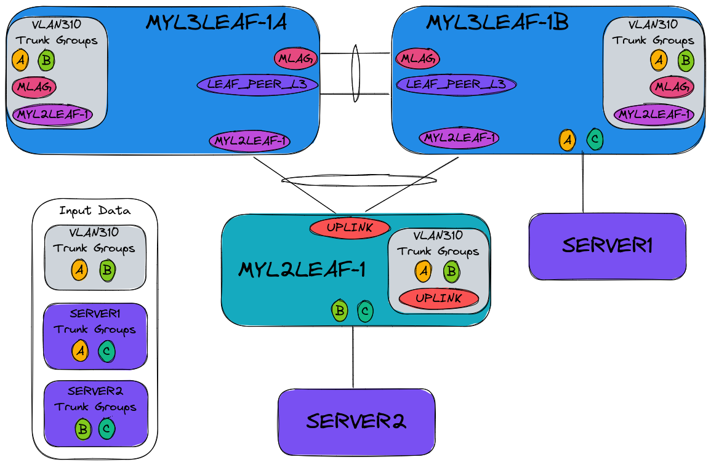

---
# This title is used for search results
title: Input variables for eos_designs
---
<!--
  ~ Copyright (c) 2023 Arista Networks, Inc.
  ~ Use of this source code is governed by the Apache License 2.0
  ~ that can be found in the LICENSE file.
  -->

# Input variables for eos_designs

This document describes the supported input variables for the role `arista.avd.eos_designs`.

Since several data models have changed between AVD versions 3.x and 4.x, it is recommended to study the [Porting Guide for AVD 4.x.x](../../../docs/porting-guides/4.x.x.md) for existing deployments.

The input variables are documented below in tables and YAML.

!!! note
    All input variables are validated by a schema. If additional custom keys are desired, a key starting with an underscore `_`, will be ignored.

!!! warning
    Available features and variables may vary by platforms, refer to documentation on arista.com for specifics.

## Supported designs

`eos_designs` supports multiple options such as L3LS-EVPN with 3-stage or 5-stage, L2LS and MPLS. The sections below highlight these 3 topologies, but you can extend `eos_designs` to support your own topology by using [`node_type_keys`](#node-type-customization) to create your own node type.

## Design type

By setting the `design.type` variable, the default node-types described in [Node Type Variables](#node-type-variables) will be used.

--8<--
roles/eos_designs/docs/tables/design.md
--8<--

### 3-stage clos topology support (Leaf & Spine)

- The **eos_designs** role support various deployments with layer 3 leaf and spine (3-stage Clos) and optionally, with dedicated overlay controllers.
- 3 stage Clos fabric can be represented as spines, L3 leafs and L2 leafs, and also referred to as a "POD".

See the following examples using the `l3ls-evpn` design:

- [AVD example for a single data center using L3LS](../../../examples/single-dc-l3ls/README.md).
- [AVD example for a dual data center using L3LS](../../../examples/dual-dc-l3ls/README.md).

### 5-stage clos topology support (Super Spine)

- The **eos_designs** role support lager deployments with super-spines (5-stage Clos) and optionally, with dedicated overlay controllers.
- 5 stage Clos fabric can be represented as multiple leaf-spine structures (called PODs - Point of Delivery) interconnected by super-spines.
- The logic to deploy every leaf-spine POD fabric remains unchanged.
- Super-spines can be deployed as a single plane (typically chassis switches) or multiple planes.

### Layer 2 Leaf Spine

- The **eos_designs** role support various deployments with layer 2 leaf and spine. For example, routing may terminate at the spine level or an external L3 device.
- The Clos fabric can be represented as L3 spines, spines, and leafs.

See the following examples using the `l2ls` design:

- [Example for L2LS Fabric](../../../examples/l2ls-fabric/README.md).
- [Example for Campus Fabric](../../../examples/campus-fabric/README.md).

### MPLS

The **eos_designs** role with the `mpls` design type supports any arbitrary physical mesh topology by combining and interconnecting different node types with the `core_interfaces` settings.

The following underlay routing protocols are supported:

- ISIS-SR (default)
- ISIS + LDP
- ISIS-SR + LDP
- OSPF + LDP

The following overlay routing protocols are supported:

- IBGP (default)

Any node group of 2 or more rr-routers will form a Route Reflector cluster.

The MPLS design supports most fabric topology variables already supported by l3ls-evpn, barring the exceptions outlined below:

- Connectivity is defined with the [`core_interfaces`](#core-interfaces-settings) settings instead of [Node type uplink](#node-type-uplink-management) settings.
- No MLAG support.
- No VXLAN support.
- EVPN overlay settings are set with `mpls_overlay_role` and `mpls_route_reflectors` instead of `evpn_role` and `evpn_route_servers`.
- No Inband Management support.

See the following example using the `mpls` design:

- [AVD example for a MPLS-VPN based WAN Network](../../../examples/isis-ldp-ipvpn/README.md).

## Fabric topology hierarchy

<div style="text-align:center">
  
</div>

As per the diagram above, the topology hierarchy is the following:

- fabric_name
  - dc_name
    - pod_name

You **must** define the `fabric_name` variable and it **must** match the Ansible inventory group name covering all devices in scope of the fabric.

--8<--
roles/eos_designs/docs/tables/fabric-topology.md
--8<--

## Fabric IP Addressing

--8<--
roles/eos_designs/docs/tables/fabric-ip-addressing.md
--8<--

## Node Type Variables

The following tables provide information on the default node types that have been pre-defined in `eos_designs` for each design type.

To customize or create new node types, please refer to [node type customization](#node-type-customization) section.

### L3LS EVPN

| Node Type Key      | Underlay Router | Uplink Type | Default EVPN Role  | L2 Network Services | L3 Network Services | VTEP | MLAG Support | Connected Endpoints |
| ------------------ | --------------- | ------------ | ----------------- | ------------------- | ------------------- | ---- | ------------ | ------------------- |
| super_spine        | ✅              | p2p          | none              | ✘                   | ✘                   | ✘    | ✘            | ✘                  |
| spine              | ✅              | p2p          | server            | ✘                   | ✘                   | ✘    | ✘            | ✘                  |
| l3leaf             | ✅              | p2p          | client            | ✅                  | ✅                  | ✅   | ✅           | ✅                 |
| l2leaf             | ✘               | port-channel | none              | ✅                  | ✘                   | ✘    | ✅           | ✅                 |
| overlay_controller | ✅              | p2p          | server            | ✘                   | ✘                   | ✘    | ✘            | ✘                  |

### L2LS

| Node Type Key      | Underlay Router | Uplink Type | Default EVPN Role  | L2 Network Services | L3 Network Services | VTEP | MLAG Support | Connected Endpoints |
| ------------------ | --------------- | ------------ | ----------------- | ------------------- | ------------------- | ---- | ------------ | ------------------- |
| l3spine            | ✅              | p2p          | none              | ✅                  | ✅                  | ✘    | ✅           | ✅                  |
| spine              | ✘               | port-channel | none              | ✅                  | ✘                   | ✘    | ✅           | ✅                 |
| leaf               | ✘               | port-channel | none              | ✅                  | ✘                   | ✘    | ✅           | ✅                 |

### MPLS

| Node Type Key | Underlay Router | Uplink Type | Default Overlay Role | L2 Network Services | L3 Network Services | VTEP | MLAG Support | Connected Endpoints |
| --------------| --------------- | ----------- | -------------------- | ------------------- | ------------------- | ---- | ------------ | ------------------- |
| p             | ✅              | p2p          | none                | ✘                   | ✘                   | ✘    | ✘            | ✘                   |
| rr            | ✅              | p2p          | server              | ✘                   | ✘                   | ✘    | ✘            | ✘                   |
| pe            | ✅              | p2p          | client              | ✅                  | ✅                  | ✅   | ✘            | ✅                  |

## Node type customization

AVD provides the capability to customize your node types, supporting a variety of designs.

!!! note
    The default values will be overridden if defining this key, so it is recommended to copy the defaults and modify them.

??? example "Default value for design `l3ls-evpn`"

    ```yaml
    node_type_keys:

      - key: spine
        type: spine
        default_evpn_role: server
        default_ptp_priority1: 20

      - key: l3leaf
        type: l3leaf
        connected_endpoints: true
        default_evpn_role: client
        default_ptp_priority1: 30
        mlag_support: true
        network_services:
          l2: true
          l3: true
        vtep: true

      - key: l2leaf
        type: l2leaf
        connected_endpoints: true
        mlag_support: true
        network_services:
          l2: true
        underlay_router: false
        uplink_type: port-channel

      - key: super_spine
        type: super-spine

      - key: overlay_controller
        type: overlay-controller
        default_evpn_role: server
    ```

??? example "Default value for design `l2ls`"

    ```yaml
    node_type_keys:

      - key: l3spine
        type: l3spine
        connected_endpoints: true
        default_overlay_routing_protocol: none
        default_underlay_routing_protocol: none
        mlag_support: true
        network_services:
          l2: true
          l3: true

      - key: spine
        type: spine
        connected_endpoints: true
        mlag_support: true
        network_services:
          l2: true
        underlay_router: false
        uplink_type: port-channel

      - key: leaf
        type: leaf
        connected_endpoints: true
        mlag_support: true
        network_services:
          l2: true
        underlay_router: false
        uplink_type: port-channel
    ```

??? example "Default value for design `mpls`"

    ```yaml
    node_type_keys:

      - key: p
        type: p
        default_mpls_overlay_role: none
        default_overlay_routing_protocol: ibgp
        default_underlay_routing_protocol: isis-sr
        mpls_lsr: true

      - key: pe
        type: pe
        connected_endpoints: true
        default_evpn_encapsulation: mpls
        default_evpn_role: client
        default_mpls_overlay_role: client
        default_overlay_address_families:
          - vpn-ipv4
        default_overlay_routing_protocol: ibgp
        default_underlay_routing_protocol: isis-sr
        mpls_lsr: true
        network_services:
          l1: true
          l2: true
          l3: true

      - key: rr
        type: rr
        default_evpn_encapsulation: mpls
        default_evpn_role: server
        default_mpls_overlay_role: server
        default_overlay_address_families:
          - vpn-ipv4
        default_overlay_routing_protocol: ibgp
        default_underlay_routing_protocol: isis-sr
        mpls_lsr: true
    ```

--8<--
roles/eos_designs/docs/tables/node-type-keys.md
--8<--

### Context for ip_addressing templates

To help calculate the custom IP addressing, the following contextual variables are available to the custom templates:

router_id:

- `{{ switch_id }}`
- `{{ loopback_ipv4_pool }}`
- `{{ loopback_ipv4_offset }}`
- All group/hostvars

mlag_ip_primary & mlag_ip_secondary:

- `{{ mlag_primary_id }}`
- `{{ mlag_secondary_id }}`
- `{{ switch_data.combined.mlag_peer_ipv4_pool }}`
- All group/hostvars

mlag_l3_ip_primary & mlag_l3_ip_secondary:

- `{{ mlag_primary_id }}`
- `{{ mlag_secondary_id }}`
- `{{ switch_data.combined.mlag_peer_l3_ipv4_pool }}`
- All group/hostvars

p2p_uplinks_ip & p2p_uplinks_peer_ip:

- `{{ switch.uplink_ipv4_pool }}`
- `{{ switch.id }}`
- `{{ switch.max_uplink_switches }}`
- `{{ switch.max_parallel_uplinks }}`
- `{{ uplink_switch_index }}`
- All group/hostvars

vtep_ip_mlag:

- `{{ switch_vtep_loopback_ipv4_pool }}`
- `{{ mlag_primary_id }}`
- `{{ loopback_ipv4_offset }}`
- All group/hostvars

vtep_ip:

- `{{ switch_vtep_loopback_ipv4_pool }}`
- `{{ switch_id }}`
- `{{ loopback_ipv4_offset }}`
- All group/hostvars

While all templates can leverage the internal switch facts (switch.*) to customize the interface descriptions,
the values are not part of the officially supported data models, and may change without notice.

### Context for interface_descriptions templates

To help format the custom interface descriptions, the following contextual variables are available to the custom templates:

underlay_ethernet_interfaces:

- `{{ link.peer }}`
- `{{ link.peer_interface }}`
- `{{ link.type }} (underlay_p2p or underlay_l2)`
- All group/hostvars

underlay_port_channel_interfaces:

- `{{ link.channel_description }}`
- `{{ link.channel_group_id }}`
- `{{ link.peer_channel_group_id }}`
- All group/hostvars

mlag_ethernet_interfaces:

- `{{ mlag_interface }}`
- `{{ mlag_peer }}`
- All group/hostvars

mlag_port_channel_interfaces:

- `{{ mlag_interfaces }}`
- `{{ mlag_peer }}`
- All group/hostvars

connected_endpoints_ethernet_interfaces:

- `{{ peer }}`
- `{{ peer_interface }}`
- All group/hostvars

connected_endpoints_port_channel_interfaces:

- `{{ peer }}`
- `{{ adapter_port_channel_description }}`
- All group/hostvars

While all templates can leverage the internal switch facts (switch.*) to customize the interface descriptions,
the values are not part of the officially supported data models and may change without notice.

## Type setting

- The `type:` variable needs to be defined for each device in the fabric.
- This is leveraged to load the appropriate settings to generate the configuration.

!!! tip
    The node type setting can be automatically derived from a switch name by defining the patterns in the [`default_node_types`](#default-node-types-settings) data model.

??? example "Type setting example"

    ```yaml
    # Defined in SPINE.yml file
    # Can also be set directly in your inventory file under spine group
    type: spine

    # Defined in L3LEAFS.yml
    # Can also be set directly in your inventory file under l3leaf group
    type: l3leaf

    # Defined in L2LEAFS.yml
    # Can also be set directly in your inventory file under l2leaf group
    type: l2leaf

    # Defined in SUPER-SPINES.yml
    # Can also be set directly in your inventory file under super-spine group
    type: super-spine

    # Defined in ROUTE-SERVERS.yml
    # Can also be set directly in your inventory file under route-server group
    type: overlay-controller
    ```

--8<--
roles/eos_designs/docs/tables/type-setting.md
--8<--

## Default node types settings

Node types can be defined statically on each node or in each group of nodes.  By leveraging `default_node_types`, regular expressions can be used to determine the node type based
on the hostname.

!!! warning
    Please note that using the `default_node_types` functionality will cause certain tests in the eos_validate_state role to not be executed.
    This functionality will be restored as part of a later update to eos_validate_state and this note will then be removed.

--8<--
roles/eos_designs/docs/tables/default-node-types.md
--8<--

## Node type settings

Node type settings are defined under the `node_type_keys.key` i.e `spine:`, `l3leaf:`, `l2leaf:` to configure management, underlay, overlay functionality.

### Node type structure

All node types have the same structure based on `defaults`, `node_group`, `node_group.node`, `node` and all variables can be defined in any section and support inheritance like this:

Under `node_type_keys.key:`

```bash
defaults <- node_group <- node_group.node <- node
```

!!! tip
    Define common node settings under defaults. This reduces user input requirements, limiting errors.

--8<--
roles/eos_designs/docs/tables/node-type-structure.md
--8<--

### Node type common configuration

Define your nodes, id, management and common configuration elements.

!!! tip
    If a node is not deployed, leverage `is_deployed: false` to indicate the node as offline.

!!! info
    A static unique identifier (id) is assigned to each device. This is leveraged to derive the IP address assignment from each summary defined in the Fabric Underlay and Overlay Topology Variables.

--8<--
roles/eos_designs/docs/tables/node-type-common-configuration.md
--8<--

### Node type inband management

--8<--
roles/eos_designs/docs/tables/node-type-inband-management-configuration.md
--8<--

### Node type uplink management

Connectivity is defined from the child's device perspective.
Source uplink interfaces and parent interfaces are defined on the child.

!!! tip
    Leverage [`default_interfaces`](#default-interface-settings) data model to auto define uplink and downlink interfaces based on the node id.

--8<--
roles/eos_designs/docs/tables/node-type-uplink-configuration.md
--8<--

### Node type L2 and MLAG configuration

!!! tip
    Alternate addressing schemes are available at [`fabric_ip_addressing`](#fabric-ip-addressing).

--8<--
roles/eos_designs/docs/tables/node-type-l2-mlag-configuration.md
--8<--

### Node type Loopback and VTEP configuration

--8<--
roles/eos_designs/docs/tables/node-type-loopback-vtep-configuration.md
--8<--

### Node type BGP configuration

--8<--
roles/eos_designs/docs/tables/node-type-bgp-configuration.md
--8<--

### Node type network services configuration

--8<--
roles/eos_designs/docs/tables/node-type-evpn-services-configuration.md
--8<--

### Node type EVPN gateway configuration

--8<--
roles/eos_designs/docs/tables/node-type-evpn-ipvpn-gateway-configuration.md
--8<--

### Node type EVPN multi-domain gateway configuration

--8<--
roles/eos_designs/docs/tables/node-type-evpn-multi-domain-gateway-configuration.md
--8<--

### Node type ISIS Configuration

--8<--
roles/eos_designs/docs/tables/node-type-isis-configuration.md
--8<--

### Node type MPLS configuration

--8<--
roles/eos_designs/docs/tables/node-type-mpls-configuration.md
--8<--

### Node type PTP configuration

--8<--
roles/eos_designs/docs/tables/node-type-ptp-configuration.md
--8<--

## Default interface settings

- Set default uplink, downlink, and MLAG interfaces, which will be used if these interfaces are not defined on a device (either directly or through inheritance).
- These are defined based on the combination of node_type (e.g., l3leaf or spine) and a regex for matching the platform.
- A list of interfaces or interface ranges can be specified.
- Each list item supports range syntax that can be expanded into a list of interfaces. Interface range examples:
  - Ethernet49-52/1: Expands to [ Ethernet49/1, Ethernet50/1, Ethernet51/1, Ethernet52/1 ]
  - Ethernet1/31-34/1: Expands to [ Ethernet1/31/1, Ethernet1/32/1, Ethernet1/33/1, Ethernet1/34/1 ]
  - Ethernet49-50,53-54: Expands to [ Ethernet49, Ethernet50, Ethernet53, Ethernet54 ]
  - Ethernet1-2/1-4: Expands to [ Ethernet1/1, Ethernet1/2, Ethernet1/3, Ethernet1/4, Ethernet2/1, Ethernet2/2, Ethernet2/3, Ethernet2/4 ]
- `uplink_interfaces` and `mlag_interfaces` under `default_interfaces` are directly inherited by `uplink_interfaces` and `mlag_interfaces`.
- `downlink_interfaces` are referenced by the child switch (e.g., the leaf in a leaf/spine network). The child switch leverages an upstream switch's `default_downlink_interfaces` using the child switch ID.  This is then used to build `uplink_switch_interfaces` for that child.
  - In the case of `max_parallel_uplinks` > 1 the `default_downlink_interfaces` are mapped with consecutive downlinks per child ID.
  - Example for `max_parallel_uplinks: 2`, downlink interfaces will be mapped as `[ <downlink1 to leaf-id1>, <downlink2 to leaf-id1>, <downlink1 to leaf-id2>, <downlink2 to leaf-id2> ...]`
- Please note that no default interfaces are defined in AVD itself. You will need to create your own based on the example below.

??? example "Default interfaces example"

    ```yaml
    default_interfaces:
      - types: [ spine, l3leaf ]
        platforms: [ "7050[SC]X3", vEOS.*, default ]
        uplink_interfaces: [ Ethernet49-54/1 ]
        mlag_interfaces: [ Ethernet55-56/1 ]
        downlink_interfaces: [ Ethernet1-32/1 ]
    ```

--8<--
roles/eos_designs/docs/tables/default-interfaces.md
--8<--

## L3 edge and DCI settings

The `l3_edge` data model can be used to configure extra L3 P2P links anywhere in the fabric. It can be between two switches that are already part of the fabric inventory, or it can be towards another device, where only one end of the link is on a switch in the fabric.

The data model supports using IP pools, Subnet per link, specifying the IP addresses manually or using ipv6 with rfc5549. One of these options must be set.
For BGP peerings the AS number must be specified. If the AS number is different than the AS number configured for the node, the local-as will be replaced on this BGP peering (`neighbor <ip> local-as <as> no-prepend replace-as`).

Make sure to configure the variables in a group_vars file covering all devices mentioned in the data model.

--8<--
roles/eos_designs/docs/tables/l3-edge.md
--8<--

## Core interfaces settings

The `core_interfaces` data model can be used to configure L3 P2P links anywhere in the fabric. It can be between two switches that are already part of the fabric inventory, or it can be towards another device, where only one end of the link is on a switch in the fabric.

The data model supports using IP pools, Subnet per link or specifying the IP addresses manually.
For BGP peerings the AS number must be specified. If the AS number is different than the AS number configured for the node, the local-as will be replaced on this BGP peering (`neighbor <ip> local-as <as> no-prepend replace-as`).

Make sure to configure the variables in a group_vars file covering all devices mentioned in the data model.

--8<--
roles/eos_designs/docs/tables/core-interfaces.md
--8<--

## Flagging a device as not deployed

- It is possible to provision configurations for a complete topology but flag devices as undeployed using the host level variable `is_deployed: false`.
- By default, this will have no impact within the `eos_designs` role. Configs will still be generated by the `eos_cli_config_gen` role and will still be pushed by the `eos_config_deploy_eapi` directly to devices if used.
- However, if the `eos_config_deploy_cvp` role is used to push configurations, CloudVision will ignore the devices flagged  as `is_deployed: false` and not attempt to configure them.
- If the device is not present in the network due to CloudVision not configuring the device, `eos_validate_state` role will fail lldp_toplogy and interface tests on peers of the undeployed device trying to verify that interfaces are up.
- To overcome this and shutdown interfaces towards undeployed peers, the variable `shutdown_interfaces_towards_undeployed_peers` can be used, satisfying the `eos_validate_state` role interface and lldp_topology tests. Again, this is only an issue if `eos_config_deploy_cvp` is used and the devices are not present in the network.

--8<--
roles/eos_designs/docs/tables/is-deployed.md
--8<--

## Fabric settings

The following underlay routing protocols are supported:

- EBGP (default for l3ls-evpn)
- OSPF.
- ISIS.
- ISIS-SR*.
- ISIS-LDP*.
- ISIS-SR-LDP*.
- OSPF-LDP*.
- none**.

\* Only supported with core_interfaces data model.<br />
\** For use with design type "l2ls" or other designs where there is no requirement for a routing protocol for underlay and/or overlay on l3 devices.

??? note "Details on `enable_trunk_groups`"
    Enabling the use of trunk groups will change the behavior of several components in AVD.

    Changes:

    - **Requires** Trunk Groups to be defined on all trunks towards connected endpoints
    - `MLAG` Trunk Group will be configured on all vlans on MLAG switches
    - Use Trunk Groups for uplinks to L2 switches instead of "switchport trunk allow vlan" lists.
      - On the parent switch a Trunk Group with the name of the L2 switch will be assigned on all vlans
        that are allowed towards the L2 switch.
      - The port-channel towards the L2 switch will be assigned to this trunk group only
      - Add `UPLINK` Trunk Group to all vlans on the L2 Switch and assign this to the uplink port-channel

    

    While it is recommended for consistency to set `enable_trunk_groups` for all devices in the fabric,
    it can also be set in group_vars or host_vars since trunk-groups are only local to a switch.

    !!! warning
        Because of the nature of the EOS Trunk Group feature, enabling this is "all or nothing".
        *All* vlans and *all* trunks towards connected endpoints must be using trunk groups as well.
        If trunk groups are not assigned to a trunk, no vlans will be enabled on that trunk.

??? note "Details on `only_local_vlan_trunk_groups`"
    Enabling this feature will prevent unneeded trunk groups from being configured on vlans.

    Using the figure under [Details on `enable_trunk_groups`](#details-on-enable_trunk_groups) as basis
    enabling with feature would remove the unmatched trunk groups like this:

    

--8<--
roles/eos_designs/docs/tables/fabric-settings.md
--8<--

## Management interface settings

--8<--
roles/eos_designs/docs/tables/management-interface-settings.md
--8<--

## BFD settings

--8<--
roles/eos_designs/docs/tables/bfd-settings.md
--8<--

## BGP settings

--8<--
roles/eos_designs/docs/tables/bgp-settings.md
--8<--

## OSPF settings

--8<--
roles/eos_designs/docs/tables/ospf-settings.md
--8<--

## ISIS settings

--8<--
roles/eos_designs/docs/tables/isis-settings.md
--8<--

## Overlay settings

The following overlay routing protocols are supported:

- EBGP (default for l3ls-evpn)
- IBGP (only with OSPF or ISIS variants in underlay)
- none*
- HER (Head-End Replication)**
- CVX (CloudVision eXchange)

\* For use with design type "l2ls" or other designs where there is no requirement for a routing protocol for underlay and/or overlay on l3 devices.<br />
\** By setting `overlay_routing_protocol:HER`, `eos_designs` will configure static VXLAN flood-lists instead of using a dynamic overlay protocol.

--8<--
roles/eos_designs/docs/tables/overlay-settings.md
--8<--

## EVPN settings

--8<--
roles/eos_designs/docs/tables/evpn-settings.md
--8<--

## Management settings

--8<--
roles/eos_designs/docs/tables/management-settings.md
--8<--

### Source-interfaces settings

--8<--
roles/eos_designs/docs/tables/management-source-interfaces-settings.md
--8<--

### SNMP settings

--8<--
roles/eos_designs/docs/tables/management-snmp-settings.md
--8<--

## System settings

--8<--
roles/eos_designs/docs/tables/system-settings.md
--8<--

## CloudVision Settings

--8<--
roles/eos_designs/docs/tables/cloudvision-settings.md
--8<--

## Endpoint connectivity

AVD supports two different data models for defining connectivity to endpoints:

- ["Connected Endpoints"](#connected-endpoints-settings) is an endpoint-centric model intended for servers or other use cases where most ports have unique configurations.
- ["Network Ports"](#network-ports-settings) is a compact and port-centric model intended for configuration of generic port configurations on large ranges of ports.

Both data models share the same underlying implementation and can coexist without conflicts.
If a switch port is defined in both "Connected Endpoints" and "Network Ports", the "Connected Endpoints" configuration will take precedence.

Both data models support variable inheritance from profiles defined under [`port_profiles`](#port-profiles-settings). The profiles can be shared between the models. Any setting defined under the `port_profiles` will be inherited from `parent_profile` to `profile` to `adapter`.

### Connected endpoints settings

- The connected endpoints variables define connectivity from the perspective of the endpoints that connect to the fabric.
- Each endpoint can have one or more `adapters` defined, under which the connected `switches`, `switch_ports` and `endpoint_ports`
  must be set.
- If port_channel mode is enabled under one "adapter", all switch_ports connected to that "adapter" will become part of this port-channel.
- The keys used to define connected endpoints are configurable using [`connected_endpoints_keys`](#connected-endpoints-keys-settings).
  The default available keys are:
  - `servers`
  - `firewalls`
  - `routers`
  - `load_balancers`
  - `storage_arrays`
  - `cpes`
  - `workstations`
  - `access_points`
  - `phones`
  - `printers`
  - `cameras`
  - `generic_devices`

??? example "Example with profiles"

    ```yaml
    port_profiles:

      - profile: VM_Servers
        mode: trunk
        vlans: "110-111,120-121,130-131"
        spanning_tree_portfast: edge

      - profile: MGMT
        mode: access
        vlans: "110"

      - profile: DB_Clusters
        mode: trunk
        vlans: "140-141"

    servers:
      - name: server01
        rack: RackB
        adapters:

          # Single homed interface from E0 toward DC1-LEAF1A_Eth5
          - endpoint_ports: [ E0 ]
            switch_ports: [ Ethernet5 ]
            switches: [ DC1-LEAF1A ]
            profile: MGMT

          # MLAG dual-homed connection from E1 to DC1-LEAF2A_Eth10
          #                            from E2 to DC1-LEAF2B_Eth10
          - endpoint_ports: [ E1, E2 ]
            switch_ports: [ Ethernet10, Ethernet10 ]
            switches: [ DC1-LEAF2A, DC1-LEAF2B ]
            profile: DB_Clusters
            port_channel:
              description: PortChanne1
              mode: active

      - name: server03
        rack: RackC
        adapters:

          # MLAG dual-homed connection from E0 to DC1-SVC3A_Eth10
          #                            from E1 to DC1-SVC3B_Eth10
          - endpoint_ports: [ E0, E1 ]
            switch_ports: [ Ethernet10, Ethernet10 ]
            switches: [ DC1-SVC3A, DC1-SVC3B ]
            profile: VM_Servers
            port_channel:
              description: PortChanne1
              mode: active
    # Firewall
    firewalls:
      - name: FIREWALL01
        rack: RackB
        adapters:
          - endpoint_ports: [ E0, E1 ]
            switch_ports: [ Ethernet20, Ethernet20 ]
            switches: [ DC1-LEAF2A, DC1-LEAF2B ]
            profile: TENANT_A_B
            port_channel:
              description: PortChanne1
              mode: active

    # Routers
    routers:
      - name: ROUTER01
        rack: RackB
        adapters:
          - endpoint_ports: [ Eth0, Eth1 ]
            switch_ports: [ Ethernet21, Ethernet21 ]
            switches: [ DC1-LEAF2A, DC1-LEAF2B ]
            profile: TENANT_A
    ```

??? example "Example with single attached endpoint"

    Single attached interface from `E0` toward `DC1-LEAF1A` interface `Eth5`

    ```yaml
    servers:
      - name: server01
        rack: RackB
        adapters:
          - endpoint_ports: [ E0 ]
            switch_ports: [ Ethernet5 ]
            switches: [ DC1-LEAF1A ]
            profile: MGMT
    ```

??? example "Example with MLAG dual-attached endpoint"

    MLAG dual-homed connection:

    - From `E0` to `DC1-SVC3A` interface `Eth10`
    - From `E1` to `DC1-SVC3B` interface `Eth10`

    ```yaml
    servers:
      - name: server01
        rack: RackB
        adapters:
          - endpoint_ports: [ E0, E1 ]
            switch_ports: [ Ethernet10, Ethernet10 ]
            switches: [ DC1-SVC3A, DC1-SVC3B ]
            profile: VM_Servers
            port_channel:
              description: PortChanne1
              mode: active
    ```

??? example "Example with EVPN A/A ESI dual-attached endpoint"

    To help provide consistency when configuring EVPN A/A ESI values, arista.avd provides an abstraction in the form of a `short_esi` key.
    `short_esi` is an abbreviated 3 octets value to encode [Ethernet Segment ID](https://tools.ietf.org/html/rfc7432#section-8.3.1) and LACP ID.
    Transformation from abstraction to network values is managed by the following Ansible filter plugins:

    - [`arista.avd.generate_esi`](../../../docs/plugins/Filter%20plugins/generate_esi.md)
    - [`arista.avd.generate_lacp_id`](../../../docs/plugins/Filter%20plugins/generate_lacp_id.md).
    - [`arista.avd.generate_route_target`](../../../docs/plugins/Filter%20plugins/generate_route_target.md).

    The plugins provides the following result:

    - *EVPN ESI*: 000:000:0303:0202:0101
    - *LACP ID*: 0303.0202.0101
    - *Route Target*: 03:03:02:02:01:01

    In addition, setting the `short_esi` key to `auto` generates the short_esi automatically using a hash of the following data elements:

    - Port-Channel Interfaces: first two uplink switch hostnames, the ports on those switches, the corresponding endpoint ports and the channel-group ID.
    - Port-Channel Subinterface: first two uplink switch hostname, the ports on those switches, the corresponding endpoint ports, the channel-group ID and the subinterface number.
    - Ethernet Interfaces: first two uplink switch hostnames, the ports on those switches, the corresponding endpoint ports and the interface number.

    It should be noted that arista.avd does not currently check for hash collisions when using `short_esi: auto` and while the risk of this happening is non-zero, it is small.

    Active/Active multihoming connections:

    - From `E0` to `DC1-SVC3A` interface `Eth10`
    - From `E1` to `DC1-SVC4A` interface `Eth10`

    ```yaml
    servers:
      - name: server01
        rack: RackB
        adapters:
          - endpoint_ports: [ E0, E1 ]
            switch_ports: [ Ethernet10, Ethernet10 ]
            switches: [ DC1-SVC3A, DC1-SVC4A ]
            profile: VM_Servers
            port_channel:
              description: PortChanne1
              mode: active
              short_esi: 0303:0202:0101
    ```

--8<--
roles/eos_designs/docs/tables/connected-endpoints.md
--8<--

### Network ports settings

The `network_ports` data model is intended to be used with `port_profiles` and `parent_profiles` to keep the configuration generic and compact,
but all features and keys supported under `connected_endpoints.adapters` are also supported directly under `network_ports`.

All ranges defined under `switch_ports` will be expanded to individual port configuration which leads to a some behavioral differences to `connected_endpoints`:

- By default each port will be configured in a port-channel with one member when leveraging automatic channel-id generation.
  To configure multiple ports as member of the same port-channel set the channel-id key (see the example below).
- Inconsistent configurations when used with `short_esi: auto` or `designated_forwarder_algorithm: auto`, since those rely on information from multiple switches and interfaces.

??? example "Example using network ports and profiles"

    ```yaml
    # Port Profiles
    # Common settings inherited to network_ports
    port_profiles:
      - profile: common
        mode: access
        vlans: "999"
        spanning_tree_portfast: edge
        spanning_tree_bpdufilter: enabled

      - profile: ap_with_port_channel
        parent_profile: common
        vlans: "101"
        port_channel:
          mode: active

      - profile: pc
        parent_profile: common
        vlans: "100"

    # Network Ports
    # All switch_ports ranges are expanded into individual port configurations
    # Switches are matched with regex matching the full hostname.
    network_ports:
      - switches:
          - network-ports-tests-1
        switch_ports:
          - Ethernet1-2
        profile: pc
        description: PCs

      - switches:
          - network-ports-tests-2$
        switch_ports:
          - Ethernet1-2
        profile: ap_with_port_channel
        description: AP1 with port_channel

      - switches:
          - network-ports-[est]{5}-.*
        switch_ports:
          - Ethernet3-4
          - Ethernet2/1-48
        profile: pc
        description: PCs
    ```

??? example "Example using network ports to configure multiple ports in the same port-channel"

    When defining port-channels, all ranges defined under `switch_ports` will be expanded to individual port configurations
    in a port-channel with one member. To configure multiple ports as members of the same port-channel, set the channel-id key manually
    like in this example:

    ```yaml
    # Network Ports
    # By setting the channel_id key under port-channel, interfaces Ethernet3-4 will
    # be configured under the same port-channel.
    network_ports:
      - switches:
          - network-ports-tests-1
        switch_ports:
          - Ethernet3-4
        description: Multiple interfaces in the same port-channel
        port_channel:
          mode: active
          channel_id: 42
    ```

    This will generate the following config:

    ```shell
    interface Port-Channel42
      description Multiple interfaces in the same port-channel
      no shutdown
      switchport
    !
    !
    interface Ethernet3
      description Multiple interfaces in the same port-channel
      no shutdown
      channel-group 42 mode active
    !
    interface Ethernet4
      description Multiple interfaces in the same port-channel
      no shutdown
      channel-group 42 mode active
    !
    ```

    !!! tip
        To leverage automatic channel-id computation and configure port-channel with multiple members, `connected_endpoints` should be used.

--8<--
roles/eos_designs/docs/tables/network-ports.md
--8<--

### Port profiles settings

Optional profiles to share common settings for connected_endpoints and/or network_ports.
Keys are the same as used under endpoint adapters. Keys defined under endpoints adapters take precedence.

A port profile can refer to another port profile using `parent_profile` to inherit settings in up to two levels (adapter->profile->parent_profile).

--8<--
roles/eos_designs/docs/tables/port-profiles.md
--8<--

### Connected endpoints keys settings

The keys used to define Connected Endpoints are configurable using `connected_endpoints_keys`.

Endpoints connecting to the fabric can be grouped by using separate keys.
The keys can be customized to provide a better better organization or grouping of your data.

`connected_endpoints_keys` should be defined in the top level group_vars for the fabric.

!!! note
    The default values will be overridden if defining this key, so it is recommended to copy the defaults and modify them.

--8<--
roles/eos_designs/docs/tables/connected-endpoints-keys.md
--8<--

## Network Services

The network services variables provide an abstracted model to define network services across the fabric.
The network services are grouped by tenants. The definition of a tenant may vary between organizations. E.g. tenants can be organizations or departments.

The filtering models defined under [Node type network services configuration](#node-type-network-services-configuration) allows
for granular deployment of network services to the fabric leveraging the tenant name and tags applied to the service definition.

- This allows for the re-use of SVI/VLAN IDs across the fabric.
- An error will be returned at runtime in case of duplicate or conflicting SVI/VLAN IDs or VNIs targeted towards the same device.

### Network services settings

The supported network services for each tenant cover:

- VRFs
  - SVIs
  - L3 Interfaces
  - BGP routing
  - OSPF routing
- L2 VLANs
- Point-to-point services (Pseudowires, only for MPLS designs)
- Multicast

Typically services within each tenant share common VNI ranges and MAC VRF assignment pattern.

The keys used to define network services are configurable using [`network_services_keys`](#network-services-keys-settings).
The default available keys is `tenants`.

--8<--
roles/eos_designs/docs/tables/network-services.md
--8<--

#### Network services VRFs configuration

--8<--
roles/eos_designs/docs/tables/network-services-vrfs-settings.md
--8<--

#### Network services VRF SVIs configuration

--8<--
roles/eos_designs/docs/tables/network-services-vrfs-svis-settings.md
--8<--

#### Network services VRF L3 Interfaces configuration

--8<--
roles/eos_designs/docs/tables/network-services-vrfs-l3-interfaces-settings.md
--8<--

#### Network services VRF BGP configuration

--8<--
roles/eos_designs/docs/tables/network-services-vrfs-bgp-settings.md
--8<--

#### Network services VRF OSPF configuration

--8<--
roles/eos_designs/docs/tables/network-services-vrfs-ospf-settings.md
--8<--

#### Network services L2 VLANs configuration

--8<--
roles/eos_designs/docs/tables/network-services-l2vlans-settings.md
--8<--

#### Network services point-to-point services configuration

--8<--
roles/eos_designs/docs/tables/network-services-point-to-point-services-settings.md
--8<--

#### Network services multicast configuration

--8<--
roles/eos_designs/docs/tables/network-services-multicast-settings.md
--8<--

### SVI profiles settings

SVI profiles can be leveraged to share common settings between SVIs.

- Keys are the same as those used under SVI settings, except for the `tags` key.
- Keys defined under SVIs take precedence.
- Structured configuration is not merged recursively and will be taken directly from the most specific level in the following order:

  1. svi.nodes[inventory_hostname].structured_config
  2. svi_profile.nodes[inventory_hostname].structured_config
  3. svi_parent_profile.nodes[inventory_hostname].structured_config
  4. svi.structured_config
  5. svi_profile.structured_config
  6. svi_parent_profile.structured_config

--8<--
roles/eos_designs/docs/tables/svi-profiles.md
--8<--

### EVPN VLAN aware bundles settings

Optional VLAN aware bundles to share common settings for l2vlans which are supposed to use the same vlan-aware-bundle.

--8<--
roles/eos_designs/docs/tables/evpn-vlan-bundles.md
--8<--

### Network services keys settings

Network Services can be grouped by using separate keys.

The keys can be customized to provide a better better organization or grouping of your data.
`network_services_keys` should be defined in the top level group_vars for the fabric.

!!! note
    The default values will be overridden if defining this key, so it is recommended to copy the defaults and modify them.

--8<--
roles/eos_designs/docs/tables/network-services-keys.md
--8<--

## Platform settings

Set platform specific settings like TCAM profile and reload delay.

If the platform is not defined, it will load parameters from the platform tagged `default`.

Management interface is modified for specific platforms like modular platforms with dual supervisor support and container EOS.

!!! note
    The reload delay values should be reviewed and tuned to the specific environment.

!!! note
    The default values will be overridden if defining this key, so it is recommended to copy the defaults and modify them.

--8<--
roles/eos_designs/docs/tables/platform-settings.md
--8<--

## PTP settings

See the [Configuring PTP](how-to/ptp.md) how-to for details.

--8<--
roles/eos_designs/docs/tables/ptp.md
--8<--

## Custom Structured Configuration

See the [Custom Structured Configuration](how-to/custom-structured-configuration.md) how-to for details.

--8<--
roles/eos_designs/docs/tables/custom-structured-configuration.md
--8<--

## CloudVision Topology settings

Generate AVD topology configurations directly from a given CloudVision topology.

This feature is intended to be used for the integration of AVD and CloudVision Studios.

The topology should be pulled from the CloudVision "Inventory and Topology Studio" inputs. Device IDs must be translated to hostnames.

This feature currently provides the following configurations based on the given CloudVision topology and `default_interfaces`:

- `uplink_switches`
- `uplink_interfaces`
- `uplink_switch_interfaces`
- `mlag_interfaces`
- `platform` (if set)
- `mgmt_interface` (if interface "ManagementX" is found in the list)

!!! note
    Any derived configuration can be overridden by setting the key manually.
    Even keys set under node type `defaults` will take precedence over these derived configurations.

    When using parallel links between the same devices for L3 uplinks it is important to set
    `max_uplink_switches` and `max_parallel_uplinks` to ensure consistent IP addressing.

??? example "`cv_topology` example"
    To use this feature set `default_interfaces` according to the intended design (see [default_intefaces](#default-interface-settings) for details) and set `use_cv_topology` to `true`.
    Provide a full topology under `cv_topology` like this example:

    ```yaml
    use_cv_topology: true
    cv_topology:
      - hostname: s2-spine2
        platform: vEOS-LAB
        interfaces:
          - name: Ethernet2
            neighbor: s2-leaf1
            neighbor_interface: Ethernet3
          - name: Ethernet3
            neighbor: s2-leaf2
            neighbor_interface: Ethernet3
          - name: Ethernet4
            neighbor: s2-leaf3
            neighbor_interface: Ethernet3
          - name: Ethernet5
            neighbor: s2-leaf4
            neighbor_interface: Ethernet3
          - name: Ethernet7
            neighbor: s2-brdr1
            neighbor_interface: Ethernet3
          - name: Ethernet8
            neighbor: s2-brdr2
            neighbor_interface: Ethernet3
          - name: Management0
            neighbor: 00:1c:73:aa:bb:cc
            neighbor_interface: Ethernet21
      - hostname: s1-spine1
      ...cut for readability...
    ```

--8<--
roles/eos_designs/docs/tables/cv-topology.md
--8<--
