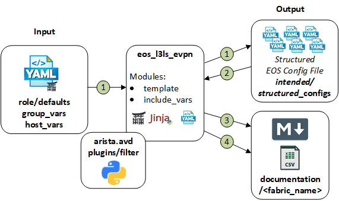
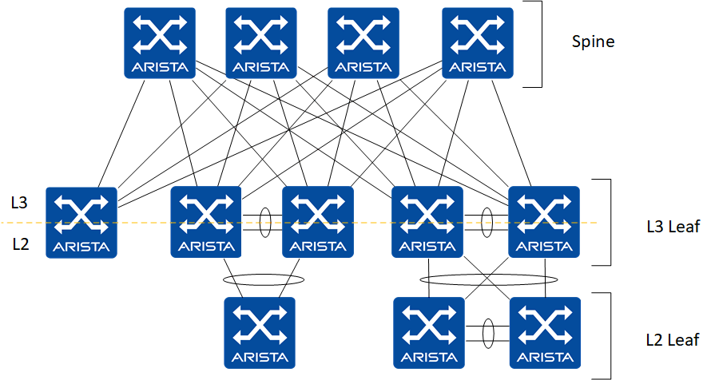

# Ansible Role: eos_l3ls_evpn

**Table of Contents:**

- [Ansible Role: eos_l3ls_evpn](#ansible-role-eos_l3ls_evpn)
  - [Overview](#overview)
  - [Role Inputs and Outputs](#role-inputs-and-outputs)
  - [Requirements](#requirements)
  - [Role Variables](#role-variables)
    - [Common Device Configuration Variables](#common-device-configuration-variables)
    - [Fabric Underlay and Overlay Topology Variables](#fabric-underlay-and-overlay-topology-variables)
    - [Fabric Topology Variables](#fabric-topology-variables)
    - [Type Variable](#type-variable)
      - [Spine Variables](#spine-variables)
      - [L3 Leaf Variables](#l3-leaf-variables)
      - [L2 Leafs Variables](#l2-leafs-variables)
    - [Network Services Variables - VRFs/VLANs](#network-services-variables---vrfsvlans)
    - [Server Edge Port Connectivity](#server-edge-port-connectivity)
      - [Single attached server scenario](#single-attached-server-scenario)
      - [MLAG dual-attached server scenario](#mlag-dual-attached-server-scenario)
      - [EVPN A/A ESI dual-attached server scenario](#evpn-aa-esi-dual-attached-server-scenario)
    - [Variable to attach additional configlets](#variable-to-attach-additional-configlets)
    - [Event Handlers](#event-handlers)
    - [Platform Specific settings](#platform-specific-settings)
    - [vEOS-LAB Know Caveats and Recommendations](#veos-lab-know-caveats-and-recommendations)
  - [License](#license)

## Overview

**eos_l3ls_evpn**, is a role that provides an abstracted data model to deploy a L3 Leaf and Spine fabric leveraging VXLAN data-plane with an EVPN control-plane.

The **eos_l3ls_evpn** role:

- Enables network engineers to deploy Arista L3 Leaf & Spine fabric underlay and overlay network services effectively and with consistency.
- Designed to be extended easily, leveraging a __*"stackable template architecture"*__.
- Designed to be used with the **eos_l3ls_config_gen** role to generate a complete switch configuration and applied using a config replace strategy with either
  - **eos_config_deploy_eapi** role.
  - **eos_config_deploy_cvp** role.
- Designed to generate the intended configuration offline, without relying on switch current state information.
- Facilitates the evaluation of the configuration prior to deployment with tools like [Batfish](https://www.batfish.org/)

## Role Inputs and Outputs

Figure 1 below provides a visualization of the roles inputs, and outputs and tasks in order executed by the role.



**Inputs:**

- Desired variables are defined in: role defaults, group_vars, and host_vars variables.
- If desired, the role can be extended to leverage data from dynamic sources such as an IPAM or CMDB.

**Outputs:**

- A structured EOS configuration file in yaml format. This provides the following benefits:
  - First, this allows us to naturally detect duplicate entries from inputs, as yaml dictionaries don't process duplicate keys.
  - Leverage the structured data to create eos cli configuration.
  - Leverage the structured data to create end user documentation.
  - Leverage the structured data for pre and post fabric tests.
- Fabric Documentation in Markdown format.
- Leaf and Spine Topology summary in csv format.

**Tasks:**

1. Generate device configuration in a structured format (yaml).
2. Include device structured configuration that was previously generated.
3. Generate VXLAN/EVPN fabric documentation in Markdown format.
4. Generate Leaf and Spine point-to-point links summary in CSV format.
5. Generate Leaf and Spine physical topology summary in CSV format.

## Requirements

Requirements are located here: [avd-requirements](../../README.md#Requirements)

## Role Variables

The role variables are documented inline within yaml formated output with: "< >"
Some variables are required while others are optional.
Default values, are stored in the role defaults [main.yml](./defaults/main.yml) file.

Role variable are grouped by configuration elements and are typically stored in different group_vars files.

### Common Device Configuration Variables

- Common device configuration variables are for elements not related specifically to the fabric configuration.
- The variables should be applied to all devices within the fabric and can be shared with other infrastructure elements.

**Variables and Options:**

```yaml
# Clock timezone | Optional
timezone: < timezone >

# Dictionary of local users | Required
local_users:
  < username_1 >:
    privilege: < (1-15) Initial privilege level with local EXEC authorization >
    role: < Specify a role for the user >
    no_password: < true | do not configure a password for given username. sha512_password MUST not be defined for this user. >
    sha512_password: "< SHA512 ENCRYPTED password >"

  < username_2 >:
    privilege: < (1-15) Initial privilege level with local EXEC authorization >
    role: < Specify a role for the user >
    sha512_password: "< SHA512 ENCRYPTED password >"

# Management eAPI | Required
# Default is https management eAPI enabled
management_eapi:
  enable_http: < boolean | default -> false >
  enable_https: < boolean | default -> true >

# CloudVision - Telemetry Agent (TerminAttr) configuration | Optional
cvp_instance_ip: < IPv4 address >
or
cvp_instance_ips:
  - < IPv4 address >
  - < IPv4 address >
  - < IPv4 address >
  - < CV as a Service hostname >
cvp_ingestauth_key: < CloudVision Ingest Authentication key >
terminattr_ingestgrpcurl_port: < port_number | default -> 9910 >
terminattr_smashexcludes: "< smash excludes | default -> ale,flexCounter,hardware,kni,pulse,strata >"
terminattr_ingestexclude: "< ingest excludes | default -> /Sysdb/cell/1/agent,/Sysdb/cell/2/agent >"


# Management interface configuration | Required
mgmt_vrf_routing: < boolean | default -> false >
mgmt_interface: < mgmt_interface | default -> Management1 >
mgmt_interface_vrf: < vrf_name | default -> MGMT >
mgmt_gateway: < IPv4 address >
# OOB mgmt interface destination networks - override default route
mgmt_destination_networks:
  - < IPv4_network/Mask >
  - < IPv4_network/Mask >

# list of DNS servers | Optional
name_servers:
 - < IPv4_address_1 >
 - < IPv4_address_2 >

# List of NTP Servers IP or DNS name | Optional
# The first NTP server in the list will be preferred
# NTP request will be sourced from < management_interface_vrf >
ntp_servers:
 - < ntp_server_1 >
 - < ntp_server_1 >

# Internal vlan allocation order and range | Required
internal_vlan_order:
  allocation: < ascending or descending | default -> ascending >
  range:
    beginning: < vlan_id | default -> 1006 >
    ending: < vlan_id | default -> 1199 >

# Redundancy for chassis platforms with dual supervisors | Optional
redundancy:
  protocol: < sso | rpr >

# MAC address-table aging time | Optional
# Use to change the EOS default of 300
mac_address_table:
  aging_time: < time_in_seconds >
```

> In `cvp_instance_ips` you can either provide a list of IPs to target on-premise Cloudvision cluster or either use DNS name for your Cloudvision as a Service instance. If you have both on-prem and CVaaS defined, only on-prem is going to be configured.

**Example:**

note: Default values are commented

```yaml
# Timezone
timezone: "US/Eastern"

# local users
local_users:
  admin:
    privilege: 15
    role: network-admin
    sha512_password: "$6$Df86J4/SFMDE3/1K$Hef4KstdoxNDaami37cBquTWOTplC.miMPjXVgQxMe92.e5wxlnXOLlebgPj8Fz1KO0za/RCO7ZIs4Q6Eiq1g1"

  cvpadmin:
    privilege: 15
    role: network-admin
    sha512_password: "$6$rZKcbIZ7iWGAWTUM$TCgDn1KcavS0s.OV8lacMTUkxTByfzcGlFlYUWroxYuU7M/9bIodhRO7nXGzMweUxvbk8mJmQl8Bh44cRktUj."

# Management eAPI
# management_eapi:
#   enable_https: true

# Cloud Vision server information
cvp_instance_ips:
 - 192.168.2.201
 - 192.168.2.202
 - 192.168.2.203
cvp_ingestauth_key: telarista
# terminattr_ingestgrpcurl_port: 9910
# terminattr_smashexcludes: "ale,flexCounter,hardware,kni,pulse,strata"
# terminattr_ingestexclude: "/Sysdb/cell/1/agent,/Sysdb/cell/2/agent

# Management interface configuration
mgmt_gateway: 192.168.2.1
# mgmt_vrf_routing: false
# mgmt_interface: Management1
# mgmt_interface_vrf: MGMT
# OOB mgmt interface destination networks
# mgmt_destination_networks:
#   - 0.0.0.0/0

# DNS servers.
name_servers:
 - 192.168.2.1
 - 8.8.8.8

# NTP Servers
ntp_servers:
 - 0.north-america.pool.ntp.org
 - 1.north-america.pool.ntp.org

# Internal vlan allocation order and range
# internal_vlan_order:
#   allocation: ascending
#   range:
#     beginning: 1006
#     ending: 1199

# Redundancy for chassis platforms with dual supervisors
redundancy:
  protocol: sso

# MAC address-table aging time
mac_address_table:
  aging_time: 1500
```

### Fabric Underlay and Overlay Topology Variables

- The fabric underlay and overlay topology variables, define the elements related to build the L3 Leaf and Spine fabric.
- The following underlay routing protocols are supported:
  - EBGP (default)
  - OSPF.
  - ISIS.
- The following overlay routing protocols are supported:
  - EBGP (default)
  - IBGP (only with OSPF or ISIS in underlay)
- Only summary network addresses need to be defined. IP addresses are then assigned to each node, based on its unique device id.
  - To view IP address allocation and consumption, a summary is provided in the auto-generated fabric documentation in Markdown format.
- The variables should be applied to all devices in the fabric.

**Variables and Options:**

```yaml

# Fabric Name, required to match group_var file name | Required.
fabric_name: < Fabric_Name >

# Underlay routing protocol | Required.
underlay_routing_protocol: < EBGP or OSPF or ISIS | Default -> EBGP >
overlay_routing_protocol: <EBGP or IBGP | default -> EBGP >

# Underlay OSFP | Required when < underlay_routing_protocol > == OSPF
underlay_ospf_process_id: < process_id | Default -> 100 >
underlay_ospf_area: < ospf_area | Default -> 0.0.0.0 >
underlay_ospf_max_lsa: < lsa | Default -> 12000 >
underlay_ospf_bfd_enable: < true | false | Default -> false >

# Underlay OSFP | Required when < underlay_routing_protocol > == ISIS
isis_area_id: < isis area | Default -> "49.0001" >
isis_site_id: < isis site ID | Default -> "0001" >

# AS number to use to configure overlay when < overlay_routing_protocol > == IBGP
bgp_as: < AS number >

# Point to Point Links MTU | Required.
p2p_uplinks_mtu: < 0-9216 | default -> 9000 >

# IP Summary for Point to Point interfaces between L3 leafs and spines used for underlay peering | Required
# Assigned as /31 for each uplink interfaces
# Assign network summary larger then:
# [ total spines * total potential L3 leafs * 2 * max_l3leaf_to_spine_links(default: 1) ]
underlay_p2p_network_summary: < IPv4_network/Mask >

# IP address summary for BGP evpn overlay peering loopback for L3 leafs and spines | Required
# Assigned as /32 to Loopback0
# Assign range larger then:
# [ total spines + total potential L3 leafs ]
overlay_loopback_network_summary: < IPv4_network/Mask >

# IP address summary VTEP VXLAN Tunnel source loopback1 IP for L3 leafs | Required
# Assigned as /32 to Loopback1
# Assign range larger then total L3 leafs
vtep_loopback_network_summary: < IPv4_network/Mask >

# IP address summary used for MLAG Peer Link (control link) and underlay L3 peering | *Required
# * When MLAG leafs present in topology.
# Assign range larger then total: L3 Leafs + 2 ]
mlag_ips:
  leaf_peer_l3: < IPv4_network/Mask >
  mlag_peer: < IPv4_network/Mask >

# BGP multi-path
# If not defined these values will be equal by default to the number of spines in the fabric
# If defined the values defined will both be applied to leaf and spine switches
# Note: these values are only relevant for an eBGP scenario
bgp_maximum_paths: <number_of_max_paths>
bgp_ecmp: <number_of_ecmp_paths>

# BGP peer groups encrypted password
# IPv4_UNDERLAY_PEERS and MLAG_IPv4_UNDERLAY_PEER | Required when < underlay_routing_protocol > == BGP
# EVPN_OVERLAY_PEERS | Required
# Leverage an Arista EOS switch to generate the encrypted password
bgp_peer_groups:
  IPv4_UNDERLAY_PEERS:
    password: "< encrypted password >"
  MLAG_IPv4_UNDERLAY_PEER:
      password: "< encrypted password >"
  EVPN_OVERLAY_PEERS:
      password: "< encrypted password >"

# Spine BGP Tuning | Optional.
spine_bgp_defaults:
  - update wait-for-convergence
  - update wait-install
  - no bgp default ipv4-unicast
  - distance bgp 20 200 200
  - graceful-restart restart-time 300
  - graceful-restart

# Leaf BGP Tuning | Optional.
leaf_bgp_defaults:
  - update wait-install
  - no bgp default ipv4-unicast
  - distance bgp 20 200 200
  - graceful-restart restart-time 300
  - graceful-restart

# Enable vlan aware bundles for EVPN MAC-VRF | Required.
vxlan_vlan_aware_bundles: < boolean | default -> false >

# Disable IGMP snooping at fabric level.
# If set, it overrides per vlan settings
default_igmp_snooping: < boolean | default -> true >

# BFD Multihop tunning | Required.
bfd_multihop:
  interval: < | default -> 300 >
  min_rx: < | default -> 300 >
  multiplier: < | default -> 3 >
```

**Example:**

note: Default values are commented

```yaml
# Defined in FABRIC.yml

fabric_name: DC1_FABRIC

# underlay_routing_protocol: BGP

# underlay_ospf_process_id: 100
# underlay_ospf_area: 0.0.0.0
# underlay_ospf_max_lsa: 12000
# underlay_ospf_bfd_enable: true

# p2p_uplinks_mtu: 9000

underlay_p2p_network_summary: 172.31.255.0/24

overlay_loopback_network_summary: 192.168.255.0/24

vtep_loopback_network_summary: 192.168.254.0/24

mlag_ips:
  leaf_peer_l3: 10.255.251.0/24
  mlag_peer: 10.255.252.0/24

bgp_peer_groups:
  IPv4_UNDERLAY_PEERS:
    password: "AQQvKeimxJu+uGQ/yYvv9w=="
  EVPN_OVERLAY_PEERS:
      password: "q+VNViP5i4rVjW1cxFv2wA=="
  MLAG_IPv4_UNDERLAY_PEER:
      password: "vnEaG8gMeQf3d3cN6PktXQ=="

# spine_bgp_defaults:
  # - update wait-for-convergence
  # - update wait-install
  # - no bgp default ipv4-unicast
  # - distance bgp 20 200 200
  # - graceful-restart restart-time 300
  # - graceful-restart

# leaf_bgp_defaults:
  # - update wait-install
  # - no bgp default ipv4-unicast
  # - distance bgp 20 200 200
  # - graceful-restart restart-time 300
  # - graceful-restart

# vxlan_vlan_aware_bundles: false

# bfd_multihop:
#   interval: 300
#   min_rx: 300
#   multiplier: 3
```

### Fabric Topology Variables

The fabric topology variables define the connectivity between the spines, L3 leafs, and L2 leafs.
The variables should be applied to all devices in the fabric.



- Connectivity is defined from the child's device perspective.
  - Source uplink interfaces and parent interfaces are defined on the child.
- A static unique identifier (id) is assigned to each device.
  - This is leveraged to derive the IP address assignment from each summary defined in the Fabric Underlay and Overlay Topology Variables.
- Within the l3_leaf and l2_leaf dictionary variables, defaults can be defined.
  - This reduces user input requirements, limiting errors.
  - The default variables can be overridden when defined under the node groups.
- The ability to define a super-spine layer is planned for a future release of ansible-avd.

### Type Variable

- The `type:` variable needs to be defined for each device in the fabric.
- This is leveraged to load to appropriate template, to generate the configuration.

**Variables and Options:**

```yaml
# define the layer type
type: < spine | l3leaf | l2leaf >
```

**Example:**

```yaml
# Defined in SPINE.yml file
type: spine

# Defined in L3LEAFS.yml
type: l3leaf

# Defined in L2LEAFS.yml
type: l2leaf
```

#### Spine Variables

**Variables and Options:**

```yaml
# Defined in FABRIC.yml

spine:

  # Arista platform family | Required.
  platform: < Arista Platform Family >

  # Spine BGP AS | Required.
  bgp_as: < bgp_as >

  # Accepted L3 leaf bgp as range | Required.
  leaf_as_range: < bgp_as_start-bgp_as_end >

  # Specify dictionary of Spine nodes | Required.
  nodes:
    < inventory_hostname >:

      # Unique identifier | Required.
      id: < integer >

      # Route Reflector when < overlay_routing_protocol > == IBGP
      bgp_route_reflector: < boolean >

      # Node management IP address | Required.
      mgmt_ip: < IPv4_address/Mask >
    < inventory_hostname >:
      id: < integer >
      mgmt_ip: < IPv4_address/Mask >

```

**Example:**

```yaml
# Defined in FABRIC.yml

spine:
  platform: vEOS-LAB
  bgp_as: 65001
  leaf_as_range: 65101-65132
  nodes:
    DC1-SPINE1:
      id: 1
      mgmt_ip: 192.168.2.101/24
    DC1-SPINE2:
      id: 2
      mgmt_ip: 192.168.2.102/24
```

#### L3 Leaf Variables

**Variables and Options:**

```yaml
l3leaf:

  # All variables defined under `node_groups` dictionary can be defined under the defaults key will be inherited by all L3 leafs.
  # The variables defined under a specific `node_group` will take precedence over defaults.
  defaults:

  # The node groups are group of one or multiple nodes where specific variables can be defined related to the topology
  # and allowed L3 and L2 network services.
  node_groups:

    # node_group_1, will result in stand-alone leaf.
    < node_group_1 >:

      # All variables defined under `defaults` will be inherited by the node group, if not specifically set inside it.

      # Arista platform family. | Required
      platform: < Arista Platform Family >

      # Parent spine switches (list), corresponding to uplink_to_spine_interfaces and spine_interfaces | Required.
      spines: [ < spine_inventory_hostname >, < spine_inventory_hostname > ]

      # Uplink to spine interfaces (list), interface located on L3 Leaf,
      # corresponding to spines and spine_interfaces | Required.
      uplink_to_spine_interfaces: [ < ethernet_interface_1 >, < ethernet_interface_2 > ]

      # Point-to-Point interface speed - will apply to L3 Leaf and Spine switches | Optional.
      p2p_link_interface_speed: < interface_speed >

      # Enable / Disable auto MLAG, when two nodes are defined in node group.
      mlag: < true | false -> default true >

      # MLAG interfaces (list) | Required when MLAG leafs present in topology.
      mlag_interfaces: [ < ethernet_interface_3 >, < ethernet_interface_4 >]

      # Spanning tree mode (note - only mstp has been validated at this time) | Required.
      spanning_tree_mode: < mstp >

      # Spanning tree priority | Required.
      spanning_tree_priority: < spanning-tree priority >

      # Virtual router mac address for anycast gateway | Required.
      virtual_router_mac_address: < mac address >

      # Activate or deactivate IGMP snooping for all l3leaf devices | Optional default is true
      igmp_snooping_enabled: < true | false >

      # L3 Leaf BGP AS. | Required.
      bgp_as: < bgp_as >

      # Filter L3 and L2 network services based on tenant and tags ( and operation filter )| Optional
      # If filter is not defined will default to all
      # This variable can only be set under the node group.
      filter:
        tenants: [ < tenant_1 >, < tenant_2 > | default all ]
        tags: [ < tag_1 >, < tag_2 > | default -> all ]]

      # Activate or deactivate IGMP snooping for node groups devices
      igmp_snooping_enabled: < true | false >

      # The node name must be the same name as inventory_hostname | Required
      # When two nodes are defined, this will automatically configure the nodes as an MLAG pair,
      # unless the "l3leaf.defaults.mlag:" key is set to false.
      nodes:

        # First node
        < l3_leaf_inventory_hostname_1 >:

          # Unique identifier | Required.
          id: < integer >

          # Node management IP address | Required.
          mgmt_ip: < IPv4_address/Mask >

          # Spine interfaces (list), interface located on Spine,
          # corresponding to spines and uplink_to_spine_interfaces | Required.
          spine_interfaces: [  < ethernet_interface_1 >, < ethernet_interface_1 > ]

    # node_group_2, will result in MLAG pair.
    < node_group_2 >:
      bgp_as: < bgp_as >
      filter:
        tenants: [ < tenant_1 >, < tenant_2 > | default all ]
        tags: [ < tag_1 >, < tag_2 > | default -> all ]
      nodes:

        # Second node
        < l3_leaf_inventory_hostname_2 >:
          id: < integer >
          mgmt_ip: < IPv4_address/Mask >
          spine_interfaces: [  < ethernet_interface_2 >, < ethernet_interface_2 > ]

        # Third node
        < l3_leaf_inventory_hostname_3 >:
          id: < integer >
          mgmt_ip: < IPv4_address/Mask >
          spine_interfaces: [  < ethernet_interface_3 >, < ethernet_interface_3 > ]
```

**Example:**

```yaml
# Defined in FABRIC.yml

l3leaf:
  defaults:
    platform: 7050X3
    bgp_as: 65100
    spines: [ DC1-SPINE1, DC1-SPINE2 ]
    uplink_to_spine_interfaces: [ Ethernet1, Ethernet2 ]
    mlag_interfaces: [ Ethernet3, Ethernet4 ]
    spanning_tree_mode: mstp
    spanning_tree_priority: 4096
    virtual_router_mac_address: 00:1c:73:00:dc:01
  node_groups:
    DC1_LEAF1:
      bgp_as: 65101
      filter:
        tenants: [ Tenant_A, Tenant_B, Tenant_C ]
        tags: [ opzone ]
      nodes:
        DC1-LEAF1A:
          id: 1
          mgmt_ip: 192.168.2.105/24
          spine_interfaces: [ Ethernet1, Ethernet1 ]
    DC1_LEAF2:
      bgp_as: 65102
      filter:
        tenants: [ Tenant_A ]
        tags: [ opzone, web, app, db, vmotion, nfs ]
      nodes:
        DC1-LEAF2A:
          id: 2
          mgmt_ip: 192.168.2.106/24
          spine_interfaces: [ Ethernet2, Ethernet2 ]
        DC1-LEAF2B:
          id: 3
          mgmt_ip: 192.168.2.107/24
          spine_interfaces: [ Ethernet3, Ethernet3 ]
    DC1_SVC3:
      bgp_as: 65103
      platform: 7280R
      mlag: false
      filter:
        tenants: [ Tenant_A ]
        tags: [ erp1 ]
      nodes:
        DC1-SVC3A:
          id: 4
          mgmt_ip: 192.168.2.108/24
          spine_interfaces: [ Ethernet4, Ethernet4 ]
        DC1-SVC3B:
          id: 5
          mgmt_ip: 192.168.2.109/24
          spine_interfaces: [ Ethernet5, Ethernet5 ]
```

#### L2 Leafs Variables

**Variables and Options:**

```yaml
l2leaf:

  # All variables defined under `node_groups` dictionary can be defined under the defaults key will be inherited by all L2 leafs.
  # The variables defined under a specific `node_group` will take precedence over defaults.
  defaults:

  # The node groups are group of one or multiple nodes where specific variables can be defined related to the topology
  # and allowed L3 and L2 network services.
  node_groups:

    # node_group_1, will result in stand-alone leaf.
    < node_group_1 >:

      # All variables defined under `defaults` will be inherited by the node group, if not specifically set inside it.

      # Arista platform family. | Required
      platform: < Arista Platform Family >

      # Parent L3 switches (list), corresponding to uplink_interfaces and l3leaf_interfaces | Required.
      parent_l3leafs: [ DC1-LEAF2A, DC1-LEAF2B]

      # Uplink interfaces (list), interface located on L2 Leaf,
      # corresponding to parent_l3leafs and l3leaf_interfaces | Required.
      uplink_interfaces: [ < ethernet_interface_1 >, < ethernet_interface_2 > ]

      # Point-to-Point interface speed - will apply to L2 Leaf and L3 Leaf switches | Optional.
      p2p_link_interface_speed: < interface_speed >

      # Enable / Disable auto MLAG, when two nodes are defined in node group.
      mlag: < true | false -> default true >

      # MLAG interfaces (list) | Required when MLAG leafs present in topology.
      mlag_interfaces: [ < ethernet_interface_3 >, < ethernet_interface_4 >]

      # Spanning tree mode (note - only mstp has been validated at this time) | Required.
      spanning_tree_mode: < mstp >

      # Spanning tree priority | Required.
      spanning_tree_priority: < spanning-tree priority >

      # Activate or deactivate IGMP snooping for all l2leaf devices | Optional default is true
      igmp_snooping_enabled: < true | false >

      # Filter L3 and L2 network services based on tenant and tags - and filter | Optional
      # If filter is not defined will default to all
      # This variable can only be set under the node group.
      filter:
        tenants: [ < tenant_1 >, < tenant_2 > | default all ]
        tags: [ < tag_1 >, < tag_2 > | default -> all ]]

      # Activate or deactivate IGMP snooping for node groups devices
      igmp_snooping_enabled: < true | false >

      # The node name must be the same name as inventory_hostname | Required
      # When two nodes are defined, this will automatically configure the nodes as an MLAG pair,
      # unless the "l2leaf.defaults.mlag:" key is set to false.
      nodes:

        # First node
        < l2_leaf_inventory_hostname_1 >:

          # Unique identifier | Required.
          id: < integer >

          # Node management IP address | Required.
          mgmt_ip: < IPv4_address/Mask >

          # l3leaf interfaces (list), interface located on l3leaf,
          # corresponding to parent_l3leafs and uplink_interfaces | Required.
          l3leaf_interfaces: [ < ethernet_interface_6 >, < ethernet_interface_6 > ]

    # node_group_2, will result in MLAG pair.
    < node_group_1 >:
      parent_l3leafs: [ DC1-SVC3A, DC1-SVC3B ]
      nodes:

        # Second node.
        < l2_leaf_inventory_hostname_2 >:
          id: < integer >
          mgmt_ip: < IPv4_address/Mask >
          l3leaf_interfaces: [ < ethernet_interface_7 >, < ethernet_interface_7 > ]

        # Third node.
        < l2_leaf_inventory_hostname_3 >:
          id: < integer >
          mgmt_ip: < IPv4_address/Mask >
          l3leaf_interfaces: [ < ethernet_interface_8 >, < ethernet_interface_8 > ]
```

**Example:**

```yaml
# Defined in FABRIC.yml

l2leaf:
  defaults:
    platform: vEOS-LAB
    parent_l3leafs: [ DC1-LEAF2A, DC1-LEAF2B]
    uplink_interfaces: [ Ethernet1, Ethernet2 ]
    mlag_interfaces: [ Ethernet3, Ethernet4 ]
    spanning_tree_mode: mstp
    spanning_tree_priority: 16384
  node_groups:
    DC1_L2LEAF4:
      uplink_interfaces: [ Ethernet11, Ethernet12 ]
      filter:
        tenants: [ Tenant_A ]
        tags: [ opzone, web, app ]
      nodes:
        DC1-L2LEAF4A:
          id: 8
          mgmt_ip: 192.168.2.112/24
          l3leaf_interfaces: [ Ethernet6, Ethernet6 ]
    DC1_L2LEAF5:
      parent_l3leafs: [ DC1-SVC3A, DC1-SVC3B ]
      nodes:
        DC1-L2LEAF5A:
          id: 10
          mgmt_ip: 192.168.2.113/24
          l3leaf_interfaces: [ Ethernet5, Ethernet5 ]
        DC1-L2LEAF5B:
          id: 11
          mgmt_ip: 192.168.2.114/24
          l3leaf_interfaces: [ Ethernet6, Ethernet6 ]
```

### Network Services Variables - VRFs/VLANs

- The network services variables provide an abstracted model to create L2 and L3 network services across the fabric.
- The network services are grouped by tenants. The definition of a tenant may vary between organizations.
  - e.g. Tenants can be organizations or departments.
- The tenant shares a common vni range for mac vrf assignment.
- The filtering model allows for granular deployment of network service to the fabric leveraging the tenant name and tags applied to the service definition.
  - This allows for the re-use of SVIs and VLANs across the fabric.

**Variables and Options:**

```yaml
# On mlag leafs, an SVI interface is defined per vrf, to establish iBGP peering. | Required (when mlag leafs in topology)
# The SVI id will be derived from the base vlan defined: mlag_ibgp_peering_vrfs.base_vlan + vrf_vni
mlag_ibgp_peering_vrfs:
  base_vlan: < 1-4000 | default -> 3000 >

# Specify RD type | Optional
# Route Distinguisher (RD) for L2 / L3 services is set to <overlay_loopback>:<vni> per default.
# By configuring evpn_rd_type the Administrator subfield (first part of RD) can be set to other values.
#
# Note:
# RD is a 48-bit value which is split into <16-bit>:<32-bit> or <32-bit>:<16-bit>.
# For loopback or 32-bit ASN/number the VNI can only be a 16-bit number.
# For 16-bit ASN/number the VNI can be a 32-bit number.
evpn_rd_type:
  admin_subfield: < "overlay_loopback" | "vtep_loopback" | "leaf_asn" | "spine_asn" | < IPv4 Address > | <0-65535> | <0-4294967295> | default -> "overlay_loopback" >

# Specify RT type | Optional
# Route Target (RT) for L2 / L3 services is set to <vni>:<vni> per default
# By configuring evpn_rt_type the Administrator subfield (first part of RT) can be set to other values.
#
# Note:
# RT is a 48-bit value which is split into <16-bit>:<32-bit> or <32-bit>:<16-bit>.
# For 32-bit ASN/number the VNI can only be a 16-bit number.
# For 16-bit ASN/number the VNI can be a 32-bit number.
evpn_rt_type:
  admin_subfield: < "leaf_asn" | "spine_asn" | "vni" | <0-65535> | <0-4294967295> | default -> "vni" >

# Optional profiles to apply on SVI interfaces
# Each profile can support all or some of the following keys according your own needs.
# Keys are the same used under SVI.
svi_profiles:
  < profile_name >:
    mtu: < mtu >
    enabled: < true | false >
    ip_virtual_router_address: < IPv4_address/Mask >
    ip_address_virtual: < IPv4_address/Mask >
    ip_address_virtual_secondary: < IPv4_address/Mask >
    igmp_snooping_enabled: < true | false | default true (eos) >
    ip_helpers:
      < IPv4 dhcp server IP >:
        source_interface: < interface-name >
        source_vrf: < VRF to originate DHCP relay packets to DHCP server. If not set, uses current VRF >


# Dictionary of tenants, to define network services: L3 VRFs and L2 VLNAS.

tenants:

  # Specify a tenant name. | Required
  # Tenant provide a construct to group L3 VRFs and L2 VLANs.
  # Networks services can be filtered by tenant name.
  < tenant_a >:

    # VXLAN Network Identifier for MAC VRF | Required.
    # VXLAN VNI is derived from the base number with simple addition.
    # e.g. mac_vrf_vni_base = 10000, svi 100 = VNI 10100, svi 300 = VNI 10300.
    mac_vrf_vni_base: < 10000-16770000 >

    # Define L3 network services organized by vrf.
    vrfs:
      # VRF name | Required
      < tenant_a_vrf_1 >:

        # VRF VNI | Required.
        # The VRF VNI range is limited.
        vrf_vni: <1-1024>

        # IP Helper for DHCP relay
        ip_helpers:
          < IPv4 dhcp server IP >:
            source_interface: < interface-name >
            source_vrf: < VRF to originate DHCP relay packets to DHCP server. If not set, uses current VRF >

        # Enable VTEP Network diagnostics | Optional.
        # This will create a loopback with virtual source-nat enable to perform diagnostics from the switch.
        vtep_diagnostic:

          # Loopback interface number | Required (when vtep_diagnotics defined)
          loopback: < 2-2100 >

          # Loopback ip range, a unique ip is derived from this ranged and assigned
          # to each l3 leaf based on it's unique id. | Required (when vtep_diagnotics defined)
          loopback_ip_range: < IPv4_address/Mask >

        # Dictionary of SVIs | Required.
        # This will create both the L3 SVI and L2 VLAN based on filters applied to l3leaf and l2leaf.
        svis:

          # SVI interface id and VLAN id. | Required
          < 1-4096 >:

            # By default the vni will be derived from "mac_vrf_vni_base:"
            # The vni_override allows us to override this value and statically define it. | Optional
            vni_override: < 1-16777215 >

            # SVI profile to apply
            # If variables are configured in profile AND SVI, SVI information will overwrite profile.
            profile: < svi-profile-name >

            # vlan name + svi description. | Required
            name: < description >

            # Tags leveraged for networks services filtering. | Required
            tags: [ < tag_1 >, < tag_2 > ]

            # Enable or disable interface
            enabled: < true | false >

            # Enable IGMP Snooping
            igmp_snooping_enabled: < true | false | default true (eos) >

            # ip address virtual to configure VXLAN Anycast IP address
            # Conserves IP addresses in VXLAN deployments as it doesn't require unique IP addresses on each node.
            # Optional
            ip_address_virtual: < IPv4_address/Mask >

            # ip virtual-router address
            # note, also requires an IP address to be configured on the SVI where it is applied.
            # Optional
            ip_virtual_router_address: < IPv4_address/Mask >

            # IP Helper for DHCP relay
            ip_helpers:
              < IPv4 dhcp server IP >:
                source_interface: < interface-name >
                source_vrf: < VRF to originate DHCP relay packets to DHCP server. If not set, uses current VRF >

            # Define node specific configuration, such as unique IP addresses.
            nodes:
              < l3_leaf_inventory_hostname_1 >:
                # device unique IP address for node.
                ip_address: < IPv4_address/Mask >

              < l3_leaf_inventory_hostname_2 >:
                ip_address: < IPv4_address/Mask >

            # Defined interface MTU
            mtu: < mtu >

          < 1-4096 >:
            name: < description >
            tags: [ < tag_1 >, < tag_2 > ]
            enabled: < true | false >
            ip_address_virtual: < IPv4_address/Mask >

      < tenant_a_vrf_2 >:
        vrf_vni: <1-1024>
        svis:
          < 1-4096 >:
            name: < description >
            tags: [ < tag_1 >, < tag_2 > ]
            enabled: < true | false >
            ip_address_virtual: < IPv4_address/Mask >
          < 1-4096 >:
            name: < description >
            tags: [ < tag_1 >, < tag_2 > ]
            enabled: < true | false >
            ip_address_virtual: < IPv4_address/Mask >

   # Define L2 network services organized by vlan id.
    l2vlans:

      # VLAN id.
      < 1-4096 >:
        # By default the vni will be derived from "mac_vrf_vni_base:"
        # The vni_override, allows to override this value and statically define it.
        vni_override: < 1-16777215 >

        # VLAN name.
        name: < description >

        # Tags leveraged for networks services filtering.
        tags: [ < tag_1 >, < tag_2 > ]

      < 1-4096 >:
        name: < description >
        tags: [ < tag_1 >, < tag_2 > ]


  < tenant_a >:
    mac_vrf_vni_base: < 10000-16770000 >
    vrfs:
      < tenant_b_vrf_1 >:
        vrf_vni: <1-1024>
        vtep_diagnostic:
          loopback: < 2-2100 >
          loopback_ip_range: < IPv4_address/Mask >
        svis:
          < 1-4096 >:
            name: < description >
            tags: [ < tag_1 >, < tag_2 > ]
            enabled: < true | false >
            ip_address_virtual: < IPv4_address/Mask >
          < 1-4096 >:
            vni_override: < 1-16777215 >
            name: < description >
            tags: [ < tag_1 >, < tag_2 > ]
            enabled: < true | false >
            ip_address_virtual: < IPv4_address/Mask >
    l2vlans:
      < 1-4096 >:
        vni_override: < 1-16777215 >
        name: < description >
        tags: [ < tag_1 >, < tag_2 > ]
      < 1-4096 >:
        name: < description >
        tags: [ < tag_1 >, < tag_2 > ]

```

**Example:**

```yaml
# mlag_ibgp_peering_vrfs:
#   base_vlan: 3000

tenants:
  Tenant_A:
    mac_vrf_vni_base: 10000
    vrfs:
      Tenant_A_OP_Zone:
        vrf_vni: 10
        vtep_diagnostic:
          loopback: 100
          loopback_ip_range: 10.255.1.0/24
        svis:
          110:
            name: Tenant_A_OP_Zone_1
            tags: [ opzone ]
            enabled: true
            ip_address_virtual: 10.1.10.0/24
            mtu: 1400
          111:
            vni_override: 50111
            name: Tenant_A_OP_Zone_2
            tags: [ opzone ]
            enabled: true
            ip_address_virtual: 10.1.11.0/24
          112:
            name: Tenant_A_OP_Zone_3
            tags: [ DC1_LEAF2 ]
            enabled: true
            ip_virtual_router_address: 10.1.12.1/24
            nodes:
              DC1-LEAF2A:
                ip_address: 10.1.12.2/24
              DC1-LEAF2B:
                ip_address: 10.1.12.3/24
          113:
            name: Tenant_A_OP_Zone_WAN
            tags: [ DC1_BL1 ]
            enabled: true
            nodes:
              DC1-BL1A:
                ip_address: 10.1.13.1/24
              DC1-BL1B:
                ip_address: 10.1.13.2/24
      Tenant_A_WEB_Zone:
        vrf_vni: 11
        svis:
          120:
            name: Tenant_A_WEB_Zone_1
            tags: [ web, erp1 ]
            enabled: true
            ip_address_virtual: 10.1.20.0/24
          121:
            name: Tenant_A_WEBZone_2
            tags: [ web ]
            enabled: true
            ip_address_virtual: 10.1.21.0/24
      Tenant_A_APP_Zone:
        vrf_vni: 12
        svis:
          130:
            name: Tenant_A_APP_Zone_1
            tags: [ app, erp1 ]
            enabled: true
            ip_address_virtual: 10.1.30.0/24
          131:
            name: Tenant_A_APP_Zone_2
            tags: [ app ]
            enabled: true
            ip_address_virtual: 10.1.31.0/24
      Tenant_A_DB_Zone:
        vrf_vni: 13
        svis:
          140:
            name: Tenant_A_DB_BZone_1
            tags: [ db, erp1 ]
            enabled: true
            ip_address_virtual: 10.1.40.0/24
          141:
            name: Tenant_A_DB_Zone_2
            tags: [ db ]
            enabled: true
            ip_address_virtual: 10.1.41.0/24
      Tenant_A_WAN_Zone:
        vrf_vni: 14
        svis:
          150:
            name: Tenant_A_WAN_Zone_1
            tags: [ wan ]
            enabled: true
            ip_address_virtual: 10.1.40.0/24
    l2vlans:
      160:
        vni_override: 55160
        name: Tenant_A_VMOTION
        tags: [ vmotion ]
      161:
        name: Tenant_A_NFS
        tags: [ nfs]

  Tenant_B:
    mac_vrf_vni_base: 20000
    vrfs:
      Tenant_B_OP_Zone:
        vrf_vni: 20
        svis:
          210:
            name: Tenant_B_OP_Zone_1
            tags: [ opzone ]
            enabled: true
            ip_address_virtual: 10.2.10.0/24
          211:
            name: Tenant_B_OP_Zone_2
            tags: [ opzone ]
            enabled: true
            ip_address_virtual: 10.2.11.0/24
      Tenant_B_WAN_Zone:
        vrf_vni: 21
        svis:
          250:
            name: Tenant_B_WAN_Zone_1
            tags: [ wan ]
            enabled: true
            ip_address_virtual: 10.2.50.0/24
```

### Server Edge Port Connectivity

- The Server Edge Port Connectivity variables, define infrastructure elements that connect to the fabric on switched interface(s).
- The infrastructure elements are not limited to servers, but any device that connect to a L2 switch port, i.e.: firewalls, load balancers and storage.

**Variables and Options:**

```yaml
# Dictionary of port_profiles to be applied to elements defined in the servers variables.
port_profiles:

  # Port-profile name
  < port_profile_1 >:

    # Interface mode | required
    mode: < access | dot1q-tunnel | trunk >

    # Native VLAN for a trunk port | optional
    native_vlan: <native vlan number>

    # Interface vlans | required
    vlans: < vlans as string >

    # Spanning Tree
    spanning_tree_portfast: < edge | network >
    spanning_tree_bpdufilter: < true | false >

    # Flow control | Optional
    flowcontrol:
      received: < received | send | on >

  < port_profile_2 >:
    mode: < access | dot1q-tunnel | trunk >
    vlans: < vlans as string >

    # Storm control settings applied on port toward server | Optional
    storm_control:
      all:
        level: < Configure maximum storm-control level >
        unit: < percent | pps >
      broadcast:
        level: < Configure maximum storm-control level >
        unit: < percent | pps >
      multicast:
        level: < Configure maximum storm-control level >
        unit: < percent | pps >
      unknown_unicast:
        level: < Configure maximum storm-control level >
        unit: < percent | pps >

# Dictionary of servers, a device attaching to a L2 switched port(s)
servers:

  # Server name, this will be used in the switchport description
  < server_1 >:

    # rack is used for documentation purposes only
    rack: < rack_id >

    # A list of adapter(s), group by adapters leveraging the same port-profile.
    adapters:

      # Example of stand-alone adapter

        # Adapter speed - if not specified will be auto.
      - speed: < adapter speed >

        # Local server port(s)
        server_ports: [ < interface_name > ]

        # List of port(s) connected to switches
        switch_ports: [ < switchport_interface > ]

        # List of switche(s)
        switches: [ < device > ]

        # Port-profile name, to inherit configuration.
        profile: < port_profile_name >

      # Example of port-channel adpater
      - server_ports: [ < interface_name_1 > , < interface_name_2 >  ]
        switch_ports: [ < switchport_interface_1 >, < switchport_interface_2 > ]
        switches: [ < device_1 >, < device_2 >  ]
        profile: < port_profile_name >

        # Port- Channel
        port_channel:

          # State, create or remove port-channel.
          state: < present | absent >

          # Port-Channel Description.
          description: < port_channel_description >

          # Port-Channel Mode.
          mode: < active | passive | on >

  < server_2 >:
    rack: RackC
    adapters:
      - speed: < adapter speed >
        server_ports: [ < interface_name > ]
        switch_ports: [ < switchport_interface > ]
        switches: [ < device > ]
        profile: < port_profile_name >
      - server_ports: [ < interface_name_1 > , < interface_name_2 >  ]
        switch_ports: [ < switchport_interface_1 >, < switchport_interface_2 > ]
        switches: [ < device_1 >, < device_2 >  ]
        profile: < port_profile_name >
        port_channel:
          state: < present | absent >
          description: < port_channel_description >
          mode: < active | passive | on >
          short_esi: < 0000:0000:0000 >
```

`short_esi` is an abreviated 3 octets value to encode [Ethernet Segment ID](https://tools.ietf.org/html/rfc7432#section-8.3.1) and LACP ID. Transformation from abstraction to network values is managed by a [filter_plugin](../../plugins/filter/esi_management.py) and provides following result:

- _EVPN ESI_: 000:000:0303:0202:0101
- _LACP ID_: 0303.0202.0101
- _Route Target_: 03:03:02:02:01:01

**Example:**

```yaml
port_profiles:

  VM_Servers:
    mode: trunk
    vlans: "110-111,120-121,130-131"
    spanning_tree_portfast: edge

  MGMT:
    mode: access
    vlans: "110"

  DB_Clusters:
    mode: trunk
    vlans: "140-141"


servers:

  server01:
    rack: RackB
    adapters:

      # Single homed interface from E0 toward DC1-LEAF1A_Eth5
      - server_ports: [ E0 ]
        switch_ports: [ Ethernet5 ]
        switches: [ DC1-LEAF1A ]
        profile: MGMT

      # MLAG dual-homed connection from E1 to DC1-LEAF2A_Eth10
      #                            from E2 to DC1-LEAF2B_Eth10
      - server_ports: [ E1, E2 ]
        switch_ports: [ Ethernet10, Ethernet10 ]
        switches: [ DC1-LEAF2A, DC1-LEAF2B ]
        profile: DB_Clusters
        port_channel:
          state: present
          description: PortChanne1
          mode: active

  server03:
    rack: RackC
    adapters:

      # MLAG dual-homed connection from E0 to DC1-SVC3A_Eth10
      #                            from E1 to DC1-SVC3B_Eth10
      - server_ports: [ E0, E1 ]
        switch_ports: [ Ethernet10, Ethernet10 ]
        switches: [ DC1-SVC3A, DC1-SVC3B ]
        profile: VM_Servers
        port_channel:
          state: present
          description: PortChanne1
          mode: active
```

#### Single attached server scenario

Single attached interface from `E0` toward `DC1-LEAF1A` interface `Eth5`

```yaml
servers:
  server01:
    rack: RackB
    adapters:
      - server_ports: [ E0 ]
        switch_ports: [ Ethernet5 ]
        switches: [ DC1-LEAF1A ]
        profile: MGMT
```

#### MLAG dual-attached server scenario

MLAG dual-homed connection:

- From `E0` to `DC1-SVC3A` interface `Eth10`
- From `E1` to `DC1-SVC3B` interface `Eth10`

```yaml
servers:
  server01:
    rack: RackB
    adapters:

      - server_ports: [ E0, E1 ]
        switch_ports: [ Ethernet10, Ethernet10 ]
        switches: [ DC1-SVC3A, DC1-SVC3B ]
        profile: VM_Servers
        port_channel:
          state: present
          description: PortChanne1
          mode: active
```

#### EVPN A/A ESI dual-attached server scenario

Active/Active multihoming connections:

- From `E0` to `DC1-SVC3A` interface `Eth10`
- From `E1` to `DC1-SVC4A` interface `Eth10`

```yaml
servers:
  server01:
    rack: RackB
    adapters:

      - server_ports: [ E0, E1 ]
        switch_ports: [ Ethernet10, Ethernet10 ]
        switches: [ DC1-SVC3A, DC1-SVC4A ]
        profile: VM_Servers
        port_channel:
          state: present
          description: PortChanne1
          mode: active
          short_esi: 0303:0202:0101
```

`short_esi` is an abreviated 3 octets value to encode [Ethernet Segment ID](https://tools.ietf.org/html/rfc7432#section-8.3.1) and LACP ID. Transformation from abstraction to network values is managed by a [filter_plugin](../../plugins/filter/esi_management.py) and provides following result:

- _EVPN ESI_: 000:000:0303:0202:0101
- _LACP ID_: 0303.0202.0101
- _Route Target_: 03:03:02:02:01:01

### Variable to attach additional configlets

Role [`eos_config_deploy_cvp`](../eos_config_deploy_cvp/README.md#add-additional-configlets) provides an option to attach additional configlets to both devices or containers.

This function allows users to quickly deployed a new feature with no JINJA2 implementation. These configlets **must** be managed on Cloudvision as current role does not upload additional containers.

To attach configlets to containers or devices, please refer to [**`eos_config_deploy_cvp` documentation**](../eos_config_deploy_cvp/README.md#add-additional-configlets)

Below is an example provided as-is:

```yaml
# group_vars/DC1_FABRIC.yml

# List of additional CVP configlets to bind to devices and containers
# Configlets MUST be configured on CVP before running AVD playbooks.
cv_configlets:
  containers:
    DC1_L3LEAFS:
      - GLOBAL-ALIASES
  devices:
    DC1-L2LEAF2A:
      - GLOBAL-ALIASES
    DC1-L2LEAF2B:
      - GLOBAL-ALIASES
```

### Event Handlers

Gives ability to monitor and react to Syslog messages provides a powerful and flexible tool that can be used to apply self-healing actions, customize the system behavior, and implement workarounds to problems discovered in the field.

**Variables and Options:**

```yaml
event_handlers:
  evpn-blacklist-recovery:    # Name of the event-handler
    action_type: < bash, increment >
    action: < Command to run when handler is triggered >
    delay: < int / delay in sec between 2 triggers >
    trigger: < on-logging >
    regex:  < string to trigger handler >
    asynchronous: < true, false >

```

**Example:**

```yaml
event_handlers:
  evpn-blacklist-recovery:
    action_type: bash
    action: FastCli -p 15 -c "clear bgp evpn host-flap"
    delay: 300
    trigger: on-logging
    regex:  EVPN-3-BLACKLISTED_DUPLICATE_MAC
    asynchronous: true
```

### Platform Specific settings

- Set platform specific settings, TCAM profile and reload delay.
- The reload delay values should be reviewed and tuned to the specific environment.
- If the platform is not defined, it will load parameters from the platform tagged `default`.

**Variables and Options:**

```yaml
platform_settings:
  - platforms: [ default ]
    reload_delay:
      mlag: < seconds >
      non_mlag: < seconds >
  - platforms: [ < Arista Platform Family >, < Arista Platform Family > ]
    tcam_profile: < tcam_profile >
    reload_delay:
      mlag: < seconds >
      non_mlag: < seconds >

```

note: Recommended default values for Jericho based platform, and all other platforms `default` tag.

**Example:**

```yaml
# platform_settings:
#   - platforms: [ default ]
#     reload_delay:
#       mlag: 300
#       non_mlag: 330
#   - platforms: [ 7800R3, 7500R3, 7500R, 7280R3, 7280R2, 7280R ]
#     tcam_profile: vxlan-routing
#     reload_delay:
#       mlag: 780
#       non_mlag: 1020
```

### vEOS-LAB Know Caveats and Recommendations

- vEOS-LAB is a great tool to learn and test ansible-avd automation framework. In fact, this is the primary tool leveraged by Arista Ansible Team, for development and testing efforts.
- vEOS-lab enables you to create and run replicas of physical networks within a risk free virtual environment.
- Virtual networks created with vEOS-lab can be used for network modeling, planning for new services, or validating new features and functionality for the installed network.
- vEOS-lab is not a network simulator but the exact EOS implementation that runs on the hardware platforms.
- Supported features are documented here: [vEOS-LAB Datasheet](https://www.arista.com/assets/data/pdf/Datasheets/vEOS_Datasheet.pdf)

However, because vEOS-LAB implements a virtual data plane there are known caveats and adjustments that are required to default arista.avd settings:

**Variables adjustments required for vEOS-LAB:**

```yaml
# Disable update wait-for-convergence and update wait-for-install, which is not supported in vEOS-LAB.
spine_bgp_defaults:
#  - update wait-for-convergence
#  - update wait-install
  - no bgp default ipv4-unicast
  - distance bgp 20 200 200
  - graceful-restart restart-time 300
  - graceful-restart

leaf_bgp_defaults:
#  - update wait-install
  - no bgp default ipv4-unicast
  - distance bgp 20 200 200
  - graceful-restart restart-time 300
  - graceful-restart

# Update p2p mtu 9000 -> 1500, MTU 9000 not supported in vEOS-LAB.
p2p_uplinks_mtu: 1500

# Adjust default bfd values, to avoid high CPU.
bfd_multihop:
  interval: 1200
  min_rx: 1200
  multiplier: 3
```

## License

Project is published under [Apache 2.0 License](../../LICENSE)
