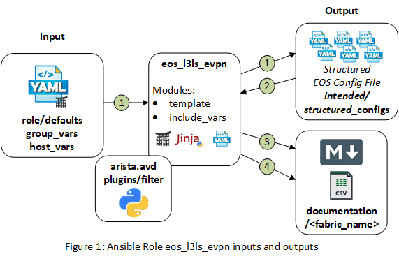
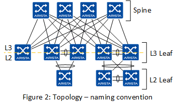

# Ansible Role: eos_l3ls_evpn

- [Ansible Role: eos_l3ls_evpn](#ansible-role-eosl3lsevpn)
  - [Overview](#overview)
  - [Role Inputs and Outputs](#role-inputs-and-outputs)
  - [Requirements](#requirements)
  - [Role Variables](#role-variables)
    - [Common Device Configuration](#common-device-configuration)
    - [Fabric Underlay and Overlay Topology Variables](#fabric-underlay-and-overlay-topology-variables)
    - [Fabric Topology Variables](#fabric-topology-variables)
      - [Spine Variables](#spine-variables)
      - [L3 Leaf Variables](#l3-leaf-variables)
      - [L2 Leafs Variables](#l2-leafs-variables)
    - [Network Services - VRFs/VLANs](#network-services---vrfsvlans)
    - [Server Edge Port Connectivity](#server-edge-port-connectivity)
  - [Example Playbook](#example-playbook)
  - [License](#license)

## Overview

**eos_l3ls_evpn**, is a role that provides an abstracted data model to deploy a L3 Leaf and Spine fabric leveraging VXLAN data-plane with an EVPN control-plane.

The **eos_l3ls_evpn** role:

- Enables network engineers to deploy Arista L3 Leaf & Spine fabric underlay and overlay network services effectively and with consistency.
- Designed to be extended easily, leveraging a __*"stackable template architecture"*__.
- Designed to be used with the **eos_l3ls_config_gen** role to generate a complete switch configuration and applied using a config replace strategy with either
  - **eos_config_deploy_eapi** role.
  - **eos_config_deploy_cvp** role.
- Designed to generate the intended configuration offline, without relying on switch current state information.
- Facilitates the evaluation of the configuration prior to deployment with tools like [Batfish](https://www.batfish.org/)

## Role Inputs and Outputs

Figure 1 below provides a visualization of the roles inputs, and outputs and tasks in order executed by the role.



**Inputs:**

- Desired variables are defined in: role defaults, group_vars, and host_vars variables.
- If desired, the role can be extended to leverage data from dynamic sources such as an IPAM or CMDB.

**Outputs:**

- A structured EOS configuration file in yaml format. This provides the following benefits:
  - First, this allows to naturally detect duplicate entries from input, as yaml dictionaries don't process duplicate keys.
  - Leverage the structured data to create eos cli configuration.
  - Leverage the structured data to create end user documentation.
  - Leverage the structured data for pre and post fabric tests.
- Fabric Documentation in Markdown format.
- Leaf and Spine Topology summary in csv format.

**Tasks:**

1. Generate device configuration in a structured format (yaml).
2. Include device structured configuration that was previously generated.
3. Generate VXLAN/EVPN fabric documentation in Markdown format.
4. Generate Leaf and Spine point-to-point links summary in CSV format.

## Requirements

**Arista EOS Version:**

- EOS 4.21.8M or later

**Python:**

- Python 3.6.8 or later

**Supported Ansible Versions:**

- ansible 2.9.2 or later

```bash
pip3 install ansible==2.9.2
```

**Ansible Collection:**

- arista.avd collection

```bash
ansible-galaxy collection install arista.avd
```

**Ansible Configuration INI file:**

- enable jinja2 extensions: loop controls and do
  - [Jinja2 Extensions Documentation](https://svn.python.org/projects/external/Jinja-2.1.1/docs/_build/html/extensions.html)
- By default Ansible will issue a warning when a duplicate dict key is encountered in YAML. We recommend to change to error instead and stop playbook execution when duplicate key are detected.

```ini
jinja2_extensions=jinja2.ext.loopcontrols,jinja2.ext.do
duplicate_dict_key=error
```

## Role Variables

The role variables are documented inline within yaml formated output with: "< >"
Some variables are required while others are optional.
Default values, are stored in the role defaults [main.yml](./defaults/main.yml) file.

Role variable have been grouped by configuration elements, and are typically stored in different group_vars files.

### Common Device Configuration

**Variable and Options:**

```yaml
# Clock timezone | Optional
timezone: < timezone >

# Dictionary of local users | Required
local_users:
  < username_1 >:
    privilege: < (1-15) Initial privilege level with local EXEC authorization >
    role: < Specify a role for the user >
    sha512_password: "< SHA512 ENCRYPTED password >"

  < username_2 >:
    privilege: < (1-15) Initial privilege level with local EXEC authorization >
    role: < Specify a role for the user >
    sha512_password: "< SHA512 ENCRYPTED password >"

# Management eAPI | Required
# Default is https management eAPI enabled
management_eapi:
  enable_http: < boolean | default -> false >
  enable_https: < boolean | default -> true >

# CloudVision - Telemetry Agent (TerminAttr) configuration | Optional
cvp_instance_ip: < IPv4 address >
cvp_ingestauth_key: < CloudVision Ingest Authentication key >
terminattr_ingestgrpcurl_port: < port_number | default -> 9910 >
terminattr_smashexcludes: "< smash excludes | default -> ale,flexCounter,hardware,kni,pulse,strata >"
terminattr_ingestexclude: "< ingest excludes | default -> /Sysdb/cell/1/agent,/Sysdb/cell/2/agent >"


# Management interface configuration | Required
mgmt_vrf_routing: < boolean | default -> false >
mgmt_interface: < mgmt_interface | default -> Management1 >
mgmt_interface_vrf: < vrf_name | default -> MGMT >
mgmt_gateway: < IPv4 address >
# OOB mgmt interface destination networks - overide default route
mgmt_destination_networks:
  - < IPv4/Mask >
  - < IPv4/Mask >

# list of DNS servers | Optional
name_servers:
 - < IPv4 address 1 >
 - < IPv4 address 2 >

# List of NTP Servers IP or DNS name | Optional
# The first NTP server in the list will be preferred
# NTP request will be sourced from < management_interface_vrf >
ntp_servers:
 - < ntp_server_1 >
 - < ntp_server_1 >

# Internal vlan allocation order and range | Required
internal_vlan_order:
  allocation: < ascending or descending | default -> ascending >
  range:
    beginning: < vlan_id | default -> 1006 >
    ending: < vlan_id | default -> 1199 >

# Redundancy for chassis platforms with dual supervisors | Optional
redundancy:
  protocol: < sso | rpr >

# MAC address-table aging time | Optional
# Use to change the EOS default of 300
mac_address_table:
  aging_time: < time_in_seconds >
```

**Example:**

note: Default values are commented

```yaml
# Timezone
timezone: "US/Eastern"

# local users
local_users:
  admin:
    privilege: 15
    role: network-admin
    sha512_password: "$6$Df86J4/SFMDE3/1K$Hef4KstdoxNDaami37cBquTWOTplC.miMPjXVgQxMe92.e5wxlnXOLlebgPj8Fz1KO0za/RCO7ZIs4Q6Eiq1g1"

  cvpadmin:
    privilege: 15
    role: network-admin
    sha512_password: "$6$rZKcbIZ7iWGAWTUM$TCgDn1KcavS0s.OV8lacMTUkxTByfzcGlFlYUWroxYuU7M/9bIodhRO7nXGzMweUxvbk8mJmQl8Bh44cRktUj."

# Management eAPI
# management_eapi:
#   enable_https: true

# Cloud Vision server information
cvp_instance_ip: 192.168.2.201
cvp_ingestauth_key: telarista
# terminattr_ingestgrpcurl_port: 9910
# terminattr_smashexcludes: "ale,flexCounter,hardware,kni,pulse,strata"
# terminattr_ingestexclude: "/Sysdb/cell/1/agent,/Sysdb/cell/2/agent

# Management interface configuration
mgmt_gateway: 192.168.2.1
# mgmt_vrf_routing: false
# mgmt_interface: Management1
# mgmt_interface_vrf: MGMT
# OOB mgmt interface destination networks
# mgmt_destination_networks:
#   - 0.0.0.0/0

# DNS servers.
name_servers:
 - 192.168.2.1
 - 8.8.8.8

# NTP Servers
ntp_servers:
 - 0.north-america.pool.ntp.org
 - 1.north-america.pool.ntp.org

# Internal vlan allocation order and range
# internal_vlan_order:
#   allocation: ascending
#   range:
#     beginning: 1006
#     ending: 1199

# Redundancy for chassis platforms with dual supervisors
redundancy:
  protocol: sso

# MAC address-table aging time
mac_address_table:
  aging_time: 1500
```

### Fabric Underlay and Overlay Topology Variables

```yaml

# Fabric Name, required to match group_var file name | Required.
fabric_name: < Fabric_Name >

# Underlay routing protocol | Required.
underlay_routing_protocol: < BGP or OSPF | Default -> BGP >

# Underlay OSFP | Required when < underlay_routing_protocol > == OSPF
underlay_ospf_process_id: < process_id | Default -> 100 >
underlay_ospf_area: < ospf_area | Default -> 0.0.0.0 >
underlay_ospf_max_lsa: < lsa | default -> 12000 >

# Point to Point Links MTU | Required.
p2p_uplinks_mtu: < 0-9216 | default -> 9000 >

# IP Summary for Point to Point interfaces between L3 leafs and spines used for underlay peering | Required
# Assigned as /31 for each uplink interfaces
# Assign network summary larger then:
# [ total spines * total potential L3 leafs * 2 * max_l3leaf_to_spine_links(default: 1) ]
underlay_p2p_network_summary: < IPv4/Mask >

# IP address summary for BGP evpn overlay peering loopback for L3 leafs and spines | Required
# Assigned as /32 to Loopback0
# Assign range larger then:
# [ total spines + total potential L3 leafs ]
overlay_loopback_network_summary: < IPv4/Mask >

# IP address summary VTEP VXLAN Tunnel source loopback1 IP for L3 leafs | Required
# Assigned as /32 to Loopback1
# Assign range larger then total L3 leafs
vtep_loopback_network_summary: < IPv4/Mask >

# IP address summary used for MLAG Peer Link (control link) and underlay L3 peering | *Required
# * When MLAG leafs present in topology.
# Assign range larger then total: L3 Leafs + 2 ]
mlag_ips:
  leaf_peer_l3: < IPv4/Mask >
  mlag_peer: < IPv4/Mask >

# BGP peer groups encrypted password
# IPv4_UNDERLAY_PEERS and MLAG_IPv4_UNDERLAY_PEER | Required when < underlay_routing_protocol > == BGP
# EVPN_OVERLAY_PEERS | Required
# Leverage an Arista EOS switch to generate the encrypted password
bgp_peer_groups:
  IPv4_UNDERLAY_PEERS:
    password: "< encrypted password >"
  MLAG_IPv4_UNDERLAY_PEER:
      password: "< encrypted password >"
  EVPN_OVERLAY_PEERS:
      password: "< encrypted password >"

# Spine BGP Tuning | Optional.
spine_bgp_defaults:
  - update wait-for-convergence
  - update wait-install
  - no bgp default ipv4-unicast
  - distance bgp 20 200 200
  - graceful-restart restart-time 300
  - graceful-restart

# Leaf BGP Tuning | Optional.
leaf_bgp_defaults:
  - update wait-install
  - no bgp default ipv4-unicast
  - distance bgp 20 200 200
  - graceful-restart restart-time 300
  - graceful-restart

# Enable vlan aware bundles for EVPN MAC-VRF | Required.
vxlan_vlan_aware_bundles: < boolean | default -> false >

# BFD Multihop tunning | Required.
bfd_multihop:
  interval: < | default -> 300 >
  min_rx: < | default -> 300 >
  multiplier: < | default -> 3 >
```

**Example:**

note: Default values are commented

```yaml
# Fabric name
fabric_name: DC1_FABRIC

# Underlay routing protocol
# underlay_routing_protocol: BGP

# Underlay OSFP
# underlay_ospf_process_id: 100
# underlay_ospf_area: 0.0.0.0
# underlay_ospf_max_lsa: 12000

# Point to Point Links MTU
# p2p_uplinks_mtu: 9000

# Underlay p2p network summary
underlay_p2p_network_summary: 172.31.255.0/24

# Overlay p2p network summary
overlay_loopback_network_summary: 192.168.255.0/24

# VTEP loopback network summary
vtep_loopback_network_summary: 192.168.254.0/24

# MLAG IPs
mlag_ips:
  leaf_peer_l3: 10.255.251.0/24
  mlag_peer: 10.255.252.0/24

# BGP peer groups passwords
bgp_peer_groups:
  IPv4_UNDERLAY_PEERS:
    password: "AQQvKeimxJu+uGQ/yYvv9w=="
  EVPN_OVERLAY_PEERS:
      password: "q+VNViP5i4rVjW1cxFv2wA=="
  MLAG_IPv4_UNDERLAY_PEER:
      password: "vnEaG8gMeQf3d3cN6PktXQ=="

# Spine BGP defaults
# spine_bgp_defaults:
  # - update wait-for-convergence
  # - update wait-install
  # - no bgp default ipv4-unicast
  # - distance bgp 20 200 200
  # - graceful-restart restart-time 300
  # - graceful-restart

# Leaf BGP defaults
# leaf_bgp_defaults:
  # - update wait-install
  # - no bgp default ipv4-unicast
  # - distance bgp 20 200 200
  # - graceful-restart restart-time 300
  # - graceful-restart

# vxlan vlan aware bundles
# vxlan_vlan_aware_bundles: false

# BFD Multihop
# bfd_multihop:
#   interval: 300
#   min_rx: 300
#   multiplier: 3
```

### Fabric Topology Variables

The fabric topology variables define the connectivity between the spines, L3 Leaves, and L2 Leaves.



- Connectivity is defined from the child's device perspective.
  - Source uplink interfaces and parent interfaces are defined on the child.
- A static unique identifier (id) is assigned to each device.
  - This is leveraged to derive the IP address assignment from each summary defined in the Fabric Underlay and Overlay Topology Variables.
- Within the l3_leaf and l2_leaf dictionary variables, defaults can be defined.
  - This reduces user input requirements, limiting errors.
  - The default variables can be overridden when defined under the node groups.
- The ability to define a super-spine layer is planned for a future release of ansible-avd.

#### Spine Variables

```yaml
spine:

  # Arista platform family | Required.
  platform: < Arista Platform Family >

  # Spine BGP AS | Required.
  bgp_as: < bgp_as >

  # Accepted L3 leaf bgp as range | Required.
  leaf_as_range: < bgp_as_start-bgp_as_end >

  # Specify dictionary of Spine nodes | Required.
  nodes:
    < inventory_hostname >:

      # Unique identifier | Required.
      id: < integer >

      # Node management IP address | Required.
      mgmt_ip: < IPv4/Mask >
    < inventory_hostname >:
      id: < integer >
      mgmt_ip: < IPv4/Mask >
```

**Example:**

```yaml
spine:
  platform: vEOS-LAB
  bgp_as: 65001
  leaf_as_range: 65101-65132
  nodes:
    DC1-SPINE1:
      id: 1
      mgmt_ip: 192.168.2.101/24
    DC1-SPINE2:
      id: 2
      mgmt_ip: 192.168.2.102/24
```

#### L3 Leaf Variables

```yaml
l3leaf:

  # L3 Leaf default variables, can be overridden when defined under < node_group >.
  defaults:

    # Arista platform family. | Required
    platform: < Arista Platform Family >

    # Parent spine switches (list), corresponding to uplink_to_spine_interfaces and spine_interfaces | Required.
    spines: [ < spine_inventory_hostname >, < spine_nventory_hostname > ]

    # Uplink to spine interfaces (list), interface located on L3 Leaf,
    # corresponding to spines and spine_interfaces | Required.
    uplink_to_spine_interfaces: [ < ethernet_interface_1 >, < ethernet_interface_2 > ]

    # Point-to-Point interface speed - will apply to L3 Leaf and Spine switches | Optional.
    p2p_link_interface_speed: < interface_speed >

    # MLAG interfaces (list) | Required when MLAG leafs present in topology.
    mlag_interfaces: [ < ethernet_interface_3 >, < ethernet_interface_4 >]

    # Spanning tree mode (note - only mstp has been validated at this time) | Required.
    spanning_tree_mode: < mstp >

    # Spanning tree priority | Required.
    spanning_tree_priority: < spanning-tree priority >

    # Virtual router mac address for anycast gateway | Required.
    virtual_router_mac_address: < mac address >

  # The node groups are group of one or two nodes where specific variables can be defined related to the topology
  # and allowed L3 and L2 network services.
  # All variables defined under `defaults` dictionary can be defined under each node group to overide it.
  node_groups:

    # node_group_1, will result in stand-alone leaf.
    < node_group_1 >:

      # L3 Leaf BGP AS. | Required.
      bgp_as: < bgp_as >

      # Filert L3 and L2 network services based on tenant and tags - and filter | Optional
      # If filter is not defined will default to all
      filter:
        tenants: [ < tenant_1 >, < tenant_2 > | default all ]
        tags: [ < tag_1 >, < tag_2 > | default -> all ]]

      # Define when one or two nodes | Required
      # When two nodes are defined, this will create an MLAG pair.
      nodes:

        # First node
        < l3_leaf_inventory_hostname_1 >:

          # Unique identifier | Required.
          id: < integer >

          # Node mnagement IP address | Required.
          mgmt_ip: < IPv4/Mask >

          # Spine interfaces (list), interface located on Spine,
          # corresponding to spines and uplink_to_spine_interfaces | Required.
          spine_interfaces: [  < ethernet_interface_1 >, < ethernet_interface_1 > ]

    # node_group_2, will result in MLAG pair.
    < node_group_2 >:
      bgp_as: < bgp_as >
      filter:
        tenants: [ < tenant_1 >, < tenant_2 > | default all ]
        tags: [ < tag_1 >, < tag_2 > | default -> all ]
      nodes:

        # Second node
        < l3_leaf_inventory_hostname_2 >:
          id: < integer >
          mgmt_ip: < IPv4/Mask >
          spine_interfaces: [  < ethernet_interface_2 >, < ethernet_interface_2 > ]

        # Third node
        < l3_leaf_inventory_hostname_3 >:
          id: < integer >
          mgmt_ip: < IPv4/Mask >
          spine_interfaces: [  < ethernet_interface_3 >, < ethernet_interface_3 > ]
```

**Example:**

```yaml
l3leaf:
  defaults:
    platform: vEOS-LAB
    bgp_as: 65100
    spines: [ DC1-SPINE1, DC1-SPINE2 ]
    uplink_to_spine_interfaces: [ Ethernet1, Ethernet2 ]
    mlag_interfaces: [ Ethernet3, Ethernet4 ]
    spanning_tree_mode: mstp
    spanning_tree_priority: 4096
    virtual_router_mac_address: 00:1c:73:00:dc:01
  node_groups:
    DC1_LEAF1:
      bgp_as: 65101
      filter:
        tenants: [ Tenant_A, Tenant_B, Tenant_C ]
        tags: [ opzone ]
      nodes:
        DC1-LEAF1A:
          id: 1
          mgmt_ip: 192.168.2.105/24
          spine_interfaces: [ Ethernet1, Ethernet1 ]
    DC1_LEAF2:
      bgp_as: 65102
      filter:
        tenants: [ Tenant_A ]
        tags: [ opzone, web, app, db, vmotion, nfs ]
      nodes:
        DC1-LEAF2A:
          id: 2
          mgmt_ip: 192.168.2.106/24
          spine_interfaces: [ Ethernet2, Ethernet2 ]
        DC1-LEAF2B:
          id: 3
          mgmt_ip: 192.168.2.107/24
          spine_interfaces: [ Ethernet3, Ethernet3 ]
    DC1_SVC3:
      bgp_as: 65103
      filter:
        tenants: [ Tenant_A ]
        tags: [ erp1 ]
      nodes:
        DC1-SVC3A:
          id: 4
          mgmt_ip: 192.168.2.108/24
          spine_interfaces: [ Ethernet4, Ethernet4 ]
        DC1-SVC3B:
          id: 5
          mgmt_ip: 192.168.2.109/24
          spine_interfaces: [ Ethernet5, Ethernet5 ]
```

#### L2 Leafs Variables

```yaml

```

**Example:**

```yaml

```

### Network Services - VRFs/VLANs

```yaml
# Underlay iBGP peering SVI based
mlag_ibgp_peering_vrfs:
  base_vlan: < 1-4000 | default -> 3000 >

```

### Server Edge Port Connectivity

## Example Playbook

An example playbook to deploy VXLAN/EVPN Fabric via eAPI:

```yml
- hosts: DC1_FABRIC

  tasks:

    - name: generate intended variables
      import_role:
         name: arista.avd.eos_l3ls_evpn

    - name: generate device intended config and documentation
      import_role:
         name: arista.avd.eos_cli_config_gen

    - name: deploy configuration to device
      import_role:
         name: arista.avd.eos_config_deploy_eapi
```

Full examples with variables and outputs, are located here:
[Arista NetDevOps Examples](https://github.com/aristanetworks/netdevops-examples)

## License

Project is published under [Apache 2.0 License](../../../../../LICENSE)
