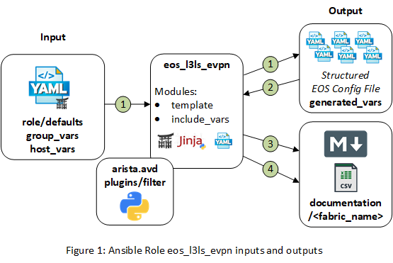

# Ansible Role: eos_l3ls_evpn

- [Ansible Role: eos_l3ls_evpn](#ansible-role-eosl3lsevpn)
  - [Overview](#overview)
  - [Role Inputs and Outputs](#role-inputs-and-outputs)
  - [Requirements](#requirements)
  - [Role Variables](#role-variables)
    - [Common Device Configuration](#common-device-configuration)
    - [Fabric Underlay / Overlay Topology](#fabric-underlay--overlay-topology)
    - [Network Services - VRFs/VLANs](#network-services---vrfsvlans)
    - [Server Edge Port Connectivity](#server-edge-port-connectivity)
  - [Example Playbook](#example-playbook)
  - [License](#license)

## Overview

**eos_l3ls_evpn** is a role that provides an abstracted data model to deploy a L3 VXLAN/EVPN Leaf and Spine Fabric. The role helps network engineers deploy Arista L3 Leaf & Spine fabric underlay and overlay network services with consistency. The role is designed to easily be extended leveraging a __*"stackable template architecture"*__. The role is designed to be used with the **eos_l3ls_config_gen** role to generate a complete switch configuration and applied using a config replace strategy with either the **eos_config_deploy_eapi** or **eos_config_deploy_cvp** roles. The role is also designed that it doesn't rely on any information from the devices, therefore can be used to generate the intended configuration offline

## Role Inputs and Outputs

Figure 1 below provides a visualization of the roles inputs, and outputs and tasks in order executed by the role.

<p align="center">
  
</p>


**Inputs:**

- Desired variables are defined in: role defaults, group_vars, and host_vars variables.
- As mentioned in the overview, if desired, the role can be extended to leverage data from dynamic sources such as an IPAM or CMDB.

**Outputs:**

- A structure EOS configuration file in yaml format. This provides the following benefits:
  - First, this allows to naturally detect duplicate entries from input, as yaml dictionaries don't process duplicate keys.
  - Leverage the structured data to create eos cli configuration.
  - Leverage the structured data to create end user documentation.
  - Leverage the structured data for pre and post fabric tests.
- Fabric Documentation in Markdown format.
- Leaf and Spine Point-To-Point Links summary in csv format.

**Tasks:**

1. Generate device configuration in a structured format (yaml).
2. Include device structured configuration that was previously generated.
3. Generate VXLAN/EVPN fabric documentation in Markdown format.
4. Generate Leaf and Spine point-to-point links summary in CSV format.

## Requirements

**Arista EOS Version:**

- EOS 4.21.8M or later

**Python:** Python 3.6.8 or later

**Supported Ansible Versions:**

- ansible 2.9.x

```bash
pip3 install ansible==2.9.2
```

**Ansible Collection:**

- arista.avd collection

```bash
ansible-galaxy collection install arista.avd
```


**Ansible Configuration INI file:**

- enable jinja2 extensions: loop controls and do
  - [Jinja2 Extensions Documentation](https://svn.python.org/projects/external/Jinja-2.1.1/docs/_build/html/extensions.html)
- By default Ansible will issue a warning when a duplicate dict key is encountered in YAML. We recommend to change to error instead and stop playbook execution when duplicate key are detected.

```ini
jinja2_extensions=jinja2.ext.loopcontrols,jinja2.ext.do
duplicate_dict_key=error
```

## Role Variables

### Common Device Configuration

```yaml
# Clock timezone | Optional
timezone: <timezone>

# Dictionary of local users | all fields required
local_users:
  <username_1>:
    privilege: < (1-15) Initial privilege level with local EXEC authorization >
    role: < Specify a role for the user >
    sha512_password: "< SHA512 ENCRYPTED password >"

  <username_2>:
    privilege: < (1-15) Initial privilege level with local EXEC authorization >
    role: < Specify a role for the user >
    sha512_password: "< SHA512 ENCRYPTED password >"

# Management eAPI | enable by default
# Default is https management eAPI enabled
management_eapi:
  enable_http: < boolean | default -> false >
  enable_https: < boolean | default -> true >

# CloudVision - Telemetry Agent (TerminAttr) configuration | Optional
cvp_instance_ip: < IPv4 address >
cvp_ingestauth_key: < CloudVision Ingest Authentication key >

terminattr_ingestgrpcurl_port: < port_number | default -> 9910 >
terminattr_smashexcludes: "< smash excludes default -> ale,flexCounter,hardware,kni,pulse,strata >"
terminattr_ingestexclude: "< ingest excludes default -> /Sysdb/cell/1/agent,/Sysdb/cell/2/agent >"


# Specify Management interface default gateway.
mgmt_gateway: < IPv4 address >

# list of dns servers.
name_servers:
 - < IPv4 address 1>
 - < IPv4 address 2>

# List of NTP Servers IP or DNS name
# The first NTP server in the list will be preferred
# NTP request will be sourced from <management_vrf>
ntp_servers:
 - < ntp_server_1>
 - < ntp_server_1>
```

### Fabric Underlay / Overlay Topology

### Network Services - VRFs/VLANs

### Server Edge Port Connectivity

## Example Playbook

An example playbook to deploy VXLAN/EVPN Fabric via eAPI:

```yml
- hosts: DC1_FABRIC

  tasks:

    - name: generate intended variables
      import_role:
         name: arista.avd.eos_l3ls_evpn

    - name: generate device intended config and documentation
      import_role:
         name: arista.avd.eos_cli_config_gen

    - name: deploy configuration to device
      import_role:
         name: arista.avd.eos_config_deploy_eapi
```

Full examples with variables, are located here:
[Arista Ansible AVD Examples](https://github.com/aristanetworks/ansible-examples)

## License

Project is published under [Apache 2.0 License](../../../../../LICENSE)
