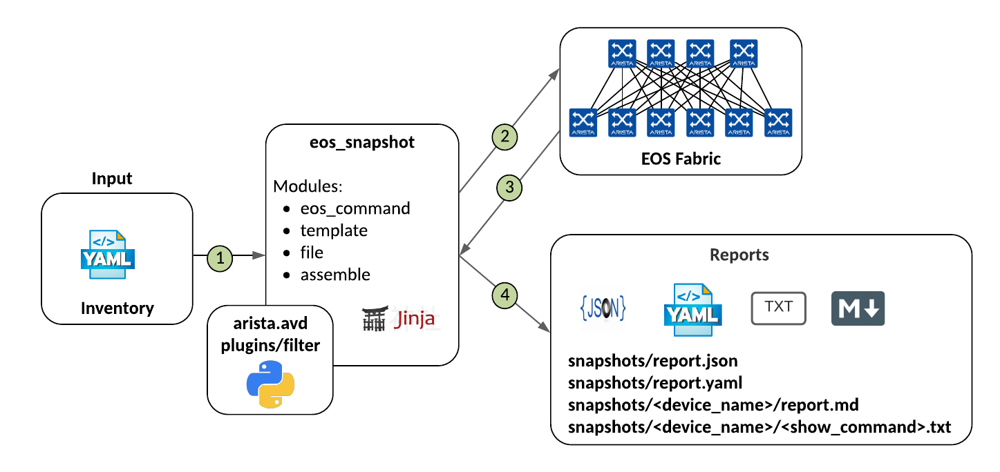

# Ansible Role: eos_snapshot

**Table of Contents:**

- [Ansible Role: eos_snapshot](#ansible-role-eos_snapshot)
  - [Overview](#overview)
  - [Role Inputs and Outputs](#role-inputs-and-outputs)
  - [Default Variables](#default-variables)
  - [Requirements](#requirements)
  - [Example Playbook](#example-playbook)
  - [Input example](#input-example)
    - [inventory/inventory.ini](#inventoryinventoryini)
    - [inventory/group_vars/DC1.yml](#inventorygroup_varsdc1yml)
  - [Usage example](#usage-example)
  - [License](#license)

## Overview

**eos_snapshot** is a role leveraged to collect commands on Arista EOS devices and generate a report.
It supports reports with the following format: text, markdown, json and yaml.

## Role Inputs and Outputs

Figure 1 below provides a visualization of the roles inputs, and outputs and tasks.



**Inputs:**

Ansible inventory to connect to EOS devices.
The default variables can be changed to select a report format and include others commands.

**Outputs:**

- text files: one file per device and show command
- markdown file: one report per device. There is a table of content at the begining of the file.
- json file: one report per fabric
- yaml file: one report per fabric

**Tasks:**

1. Create output structure
2. Collect show commands on device
3. Save the collected commands
4. Generate a JSON report
5. Generate a YAML report
6. Generate a markdown report

## Default Variables

The following default variables are defined, and can be modified as desired:

```yaml
---

root_dir: '{{ inventory_dir }}'
snapshots_backup_dir_name: 'commands'
snapshots_backup_dir: '{{ root_dir }}/{{ commands_backup_dir_name }}'

# list of desired formats. Supported values are markdown, json and text.
# text: one file per device and show command
# markdown: one report per device
# json: one report per fabric
# yaml: one report per fabric
output_format:
 - text
 - markdown
 # - json
 # - yaml

commands_list:
  - show lldp neighbors
  - show ip interface brief
  - show interfaces description
  - show version
  - show running-config
```

## Requirements

Requirements are located here: [avd-requirements](../../README.md#Requirements)

## Example Playbook

```yaml
---
- name: Collect commands
  hosts: DC1_FABRIC
  connection: local
  gather_facts: false
  collections:
    - arista.avd
  tasks:
    - name: Collect commands
      import_role:
        name: eos_snapshot
```

## Input example

### inventory/inventory.ini

```yaml
---
all:
  children:
    DC1:
      children:
        DC1_FABRIC:
          children:
            DC1_SPINES:
              hosts:
                switch2:
                  ansible_host: 10.83.28.190
            DC1_L3LEAFS:
              children:
                DC1_LEAF1:
                  hosts:
                    switch1:
                      ansible_host: 10.83.28.216
                DC1_LEAF2:
                  hosts:
                    switch3:
                      ansible_host: 10.83.28.191
```

### inventory/group_vars/DC1.yml

```yaml
ansible_user: 'arista'
ansible_password: 'arista'
ansible_network_os: eos
ansible_become: yes
ansible_become_method: enable
```

```yaml
output_format:
 - text
 - markdown
 # - json
 # - yaml

commands_to_collect:
  - show lldp neighbors
  - show ip interface brief
  - show interfaces description
  - show version
  - show running-config
```

## Usage example

```shell
ansible-playbook playbooks/pb_collect_yml --inventory inventory/inventory.yml
```

## License

Project is published under [Apache 2.0 License](../../LICENSE)
