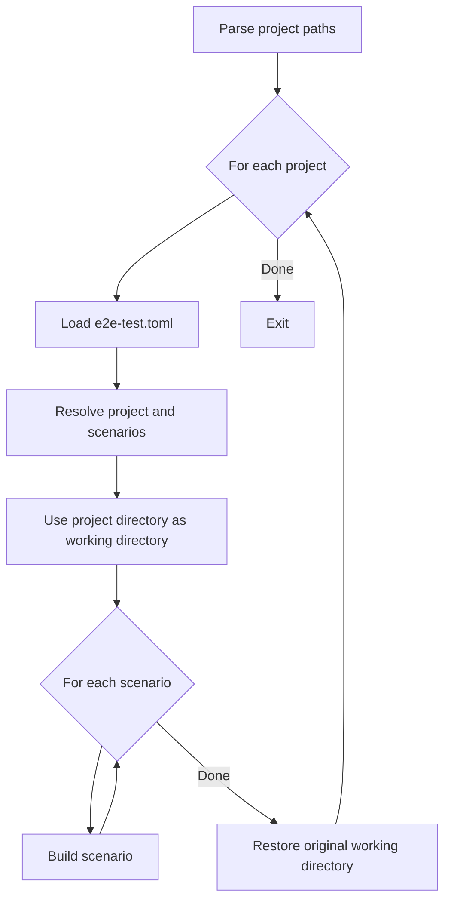
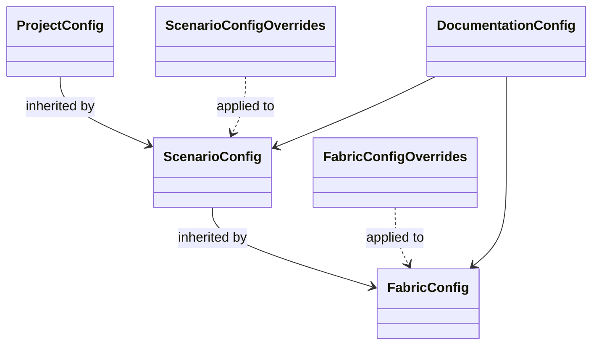
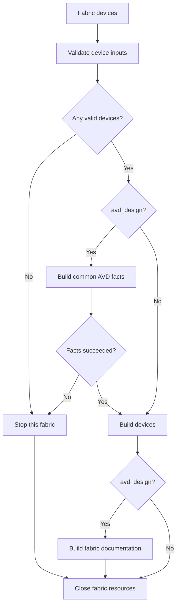
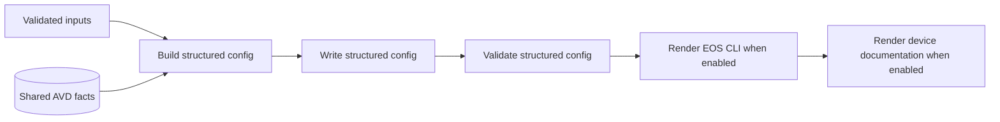
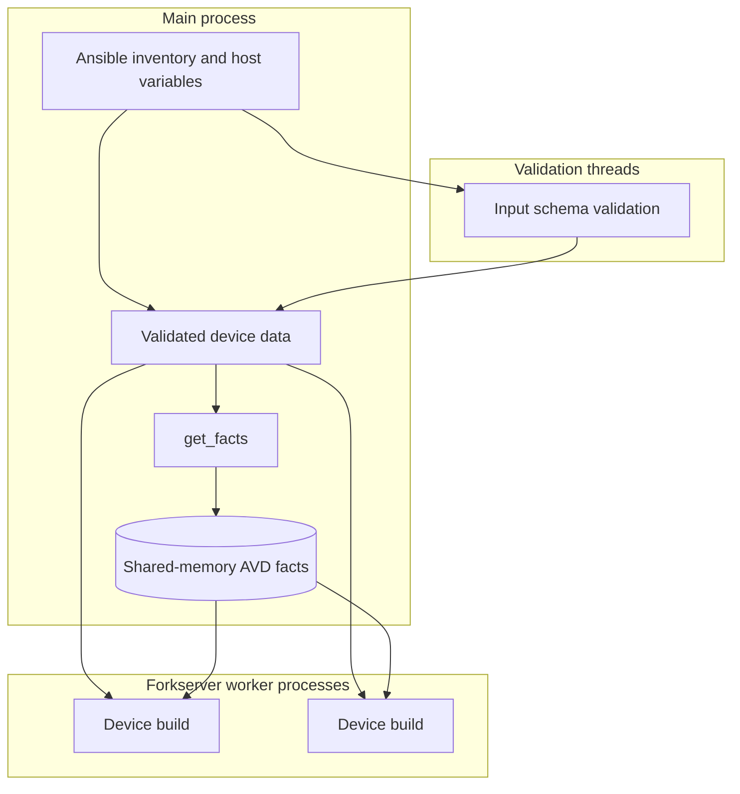

<!--
  ~ Copyright (c) 2026 Arista Networks, Inc.
  ~ Use of this source code is governed by the Apache License 2.0
  ~ that can be found in the LICENSE file.
  -->

# AVD End-to-End Test Tool Flow

This document describes the responsibilities and runtime flow of the AVD end-to-end test tool. It is intended for developers changing or debugging the tool itself. For configuration and invocation, see [Using the AVD End-to-End Test Tool](using-the-tool.md).

The implementation is currently a single script, but the concepts described here are behavioral boundaries rather than a proposed package layout.

## Responsibilities

The tool:

- loads one or more project-local `e2e-test.toml` configurations;
- resolves Ansible inventory and host variables, including configured extra variables;
- groups inventory devices by `fabric_name`;
- validates inputs and runs the relevant PyAVD build stages;
- generates structured configuration, EOS CLI, and documentation artifacts;
- captures device and fabric stage diagnostics as files;
- manages parallel workers and shared fabric facts; and
- cleans up process, shared-memory, import-path, and build resources.

It does not invoke the AVD Ansible roles or compare generated artifacts with a separate golden directory. The generated files in the project are the reviewable result.

## Top-level flow

`parse_args` accepts directories containing `e2e-test.toml` and paths directly to the file. It resolves and validates every argument before any project is built.

`load_config` converts TOML data into the project configuration and an ordered list of scenarios. A missing `scenarios` table becomes a single `default` scenario. Scenario and fabric values are represented as overrides and combined with their parent configuration before use.

The working directory changes to the project directory while its scenarios run. This supports components such as `PoolManager` that resolve some data paths relative to the current process directory. Other configured paths are resolved to absolute paths from the project directory.

## Configuration model

The runtime configuration follows three layers:

- `ProjectConfig` owns defaults and project-wide path resolution.
- `ScenarioConfig.from_project` overlays scenario values on the project.
- `FabricConfig.from_scenario` overlays supported fabric values on the scenario.
- `DocumentationConfig.from_parent` performs field-by-field inheritance for documentation options.
- Fabric `clean` is deliberately local: it defaults to `false` instead of inheriting scenario `clean`.

`load_config_from_dict` selects recognized dataclass fields from each TOML table. Consequently, unknown TOML keys are currently ignored rather than rejected.

Inheritance selects whole scalar or mapping values except for `documentation`, whose individual fields inherit independently. In particular, a scenario's `extra_vars` mapping replaces the project mapping rather than merging with it.

## Scenario setup and teardown

`build` first applies scenario cleanup when requested, then creates an `AvdBuildContext` shared by all fabrics in the scenario.

The context owns:

- the parsed `AnsibleInventory`;
- the process pool used for CPU-intensive device builds;
- main-process PyAVD schema initialization;
- optional Ansible plugin-loader initialization; and
- the temporary custom Python import path.

The inventory is loaded once per scenario. `extra_vars` are installed on Ansible's variable manager before host variables are evaluated. Devices and their resolved variables can therefore be reused across fabric builds.

The process pool uses the `forkserver` multiprocessing context. Each worker runs `initialize_worker` to initialize its own PyAVD schema store and, when custom templates are enabled, its own Ansible plugin loader. Main-process initialization is separate because initialized Python state does not implicitly cross the forkserver boundary.

If `custom_path` is configured, it is inserted at the front of `sys.path` for the scenario. During context teardown, the original path is restored and modules loaded from the custom directory are evicted from the import cache.

## Inventory grouping

`group_devices_per_fabric` requests all inventory hosts in sorted order and resolves host variables through `AnsibleInventory`. Devices are grouped by `fabric_name`. A device without `fabric_name` is placed in a fallback group, but inventories should define the value so fabric-wide processing and configured overrides have a meaningful identity.

Each discovered fabric is built in turn. A matching entry from the scenario's `fabrics` table is applied; otherwise the fabric inherits the scenario configuration. Fabric cleanup, when explicitly enabled, occurs immediately before that fabric is built.

## Per-fabric pipeline

`AvdV6Build` owns the state and resources for one fabric. The build pipeline is:

### Input validation

`validation_stage` resolves each device's inventory variables and validates devices concurrently in a `ThreadPoolExecutor`.

- With `avd_design = true`, inputs are validated against the AVD design schema.
- With `avd_design = false`, inputs are validated as EOS structured configuration.
- Deprecations and violations are written per device.
- Only devices with valid inputs proceed to later stages.
- If every device fails, the remaining stages for the fabric are skipped.

Validated data is retained in both serialized and dictionary form in the main process for the common and device stages.

### Common facts

When AVD design processing is enabled, `common_build_stage` converts validated inputs to `AVDDesign` objects and calls `get_facts` for the valid devices. `PoolManager` supplies and persists fabric-wide allocations below the output directory.

The resulting AVD facts are serialized once into a multiprocessing shared-memory block. Workers receive only the block name and size, avoiding a separate copy through the process-pool task queue for every device.

If fact generation fails, an `avd_facts` error is captured and device processing for the fabric is skipped.

### Device build

`device_build_stage` sends valid devices to the process pool. `build_validate_and_render_for_one_device` keeps the CPU-intensive phases for a device in one worker:

For an AVD design build, the worker:

1. attaches to and caches the shared AVD facts;
2. builds structured configuration with `get_structured_config`;
3. writes the structured configuration;
4. validates it;
5. renders EOS CLI when `device_configs` is enabled; and
6. renders device documentation when `documentation.device_docs` is enabled.

For a non-design build, the validated host variables are already treated as structured configuration, so fact generation and structured-configuration construction are skipped. EOS CLI and device documentation can still be rendered.

Custom configuration and documentation templates are appended during rendering when custom templates are enabled and the device data requests them. `get_avd_templar` searches the project's `templates` directory followed by the project directory.

A device stops at its first failed build, validation, or rendering phase. Other submitted devices continue.

### Fabric documentation

After device processing, an AVD design build runs `common_documentation_stage`. It reloads shared AVD facts, reads the structured configurations that were successfully written, and calls `get_fabric_documentation`.

Depending on configuration and returned content, this stage writes:

- fabric Markdown documentation;
- topology CSV;
- point-to-point links CSV; and
- digital-twin topology YAML.

Missing structured configuration files are ignored, allowing documentation to be generated from the successful device subset.

## Concurrency and data movement

Validation uses threads because the main process already holds inventory data. Device construction and rendering use processes for CPU parallelism. Worker task chunk size is calculated from valid device count and CPU count, bounded between 1 and 20.

The shared-memory facts are cached once per worker. `AvdV6Build.close` triggers their finalizer, which closes and unlinks the block after the fabric. The scenario context then terminates and joins process workers with a bounded shutdown and restores the Python import state.

## Cleaning behavior

Scenario and fabric cleanup removes these resolved directories when they exist:

- `output_dir/configs`;
- `output_dir/structured_configs`;
- `docs_dir`; and
- `error_dir`.

It deliberately does not remove the entire `output_dir`, so persistent `PoolManager` data under `output_dir/data` survives normal cleanup.

Because output paths may be shared, configuration order matters:

- a later scenario with `clean = true` can remove files produced by an earlier scenario using the same directories;
- a fabric with `clean = true` can remove files produced by an earlier fabric using the same directories; and
- distinct scenario output, documentation, and error directories avoid this interaction.

## Diagnostics and failure control flow

Validation deprecations and violations are written as text files. Exceptions from selected build stages are written either as exception summaries or full tracebacks according to `dump_tracebacks`. Diagnostics are grouped under the configured error directory by fabric and, where applicable, device.

Captured stage failures are local:

- an invalid device is removed from later processing;
- a device build failure stops that device but not other devices;
- a common-facts failure stops the remaining stages for that fabric; and
- processing then continues with later fabrics, scenarios, or projects where possible.

The boolean results yielded by validation and device stages are used for local control flow but are not currently aggregated into the program's exit status. Uncaught configuration, inventory, orchestration, or documentation exceptions propagate and terminate the command.

This distinction is important when modifying result reporting: captured diagnostic files and process-level success currently express different things.
