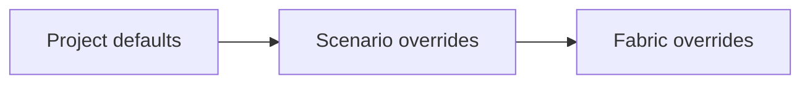

<!--
  ~ Copyright (c) 2026 Arista Networks, Inc.
  ~ Use of this source code is governed by the Apache License 2.0
  ~ that can be found in the LICENSE file.
  -->

# Using the AVD End-to-End Test Tool

The AVD end-to-end test tool builds configurations and documentation directly with PyAVD. It is intended for regenerating and reviewing the expected artifacts in AVD example and test projects without running an Ansible playbook.

Each project is described by an `e2e-test.toml` file next to its inventory. The tool can run one project, several selected projects, or every configured project in the repository.

## Before running the tool

Run commands from the root of the AVD Git repository. The repository's `uv` configuration provides the tool and its Python dependencies.

The tool rewrites generated artifacts. Review the resulting Git diff and the generated error files after every run.

!!! warning

    Device and fabric build-stage failures are captured in files under `error_dir`, and processing continues. These captured failures do not currently make the command return a nonzero exit code. Do not use the exit code alone to decide whether a run passed.

    Configuration, inventory-loading, and other uncaught setup failures do stop the command and return a nonzero exit code.

## Running the tool

### Run every configured project

The repository Make target discovers every `e2e-test.toml` file and passes the sorted list to the tool:

```shell
make e2e
```

Use this when a change can affect generated artifacts across the repository. The projects are processed sequentially.

### Run selected projects

For a focused development loop, invoke the tool manually with one or more project directories:

```shell
uv run --no-project tools/e2e-test-avd.py \
  ansible_collections/arista/avd/extensions/molecule/eos_designs_unit_tests
```

The path may instead point directly to the configuration file:

```shell
uv run --no-project tools/e2e-test-avd.py \
  ansible_collections/arista/avd/extensions/molecule/eos_designs_unit_tests/e2e-test.toml
```

Pass multiple paths to run several projects in the given order:

```shell
uv run --no-project tools/e2e-test-avd.py \
  ansible_collections/arista/avd/examples/single-dc-l3ls/e2e-test.toml \
  ansible_collections/arista/avd/examples/l2ls-fabric/e2e-test.toml
```

Each path must be inside a Git repository. A directory argument must contain `e2e-test.toml`, and a file argument must be named `e2e-test.toml`.

## Creating `e2e-test.toml`

Place the file in the project directory. All configured paths are resolved relative to this directory, regardless of the shell's current working directory.

A project using the default `inventory.yml` and all other defaults can use an empty file. A typical Molecule project only needs to select its inventory:

```toml
inventory_file = "inventory/hosts.yml"
```

### Configuration hierarchy

Configuration has three levels:



- Values at the top level apply to the whole project.
- Tables under `[scenarios.<name>]` create named runs and override project values.
- Tables under `[scenarios.<name>.fabrics.<fabric_name>]` override supported values for one inventory fabric in that scenario.
- If the file has no `scenarios` table, the tool creates one scenario named `default`.
- If `scenarios` is present, only the declared scenarios run, in TOML declaration order.

Fabric names come from the `fabric_name` resolved for each inventory host. Define `fabric_name` consistently in the inventory so devices are grouped and fabric overrides are applied predictably.

!!! note

    The loader currently ignores unrecognized keys. Check spelling and nesting carefully when adding configuration.

### Project and scenario settings

The following settings may be defined at the project level or overridden for a scenario.

| Setting | Default | Description |
| ------- | ------- | ----------- |
| `inventory_file` | `"inventory.yml"` | Inventory file to load. |
| `clean` | `true` | Remove generated configuration, structured configuration, documentation, and error directories before the scenario. |
| `custom_path` | Not set | Add one project-relative directory to the Python import path for the scenario. This is useful for custom Python modules. |
| `custom_templates` | `false` | Enable the Ansible template engine and plugin discovery for inventory processing and AVD custom templates. |
| `extra_vars` | Not set | Variables applied with Ansible extra-variable precedence while loading inventory host variables. |

The remaining build settings may also be overridden per fabric.

| Setting | Default | Description |
| ------- | ------- | ----------- |
| `avd_design` | `true` | Validate AVD design inputs and generate facts, structured configurations, device configurations, and requested documentation. When `false`, treat inventory host variables as EOS structured configuration and skip fabric-wide design and documentation stages. |
| `device_configs` | `true` | Generate an EOS CLI configuration for each successfully built device. |
| `digital_twin` | `false` | Build with PyAVD digital-twin behavior and generate digital-twin topology data during fabric documentation. |
| `output_dir` | `"intended"` | Parent directory for `configs`, `structured_configs`, and pool data. |
| `docs_dir` | `"documentation"` | Parent directory for device and fabric documentation. |
| `error_dir` | `"errors"` | Parent directory for validation messages and captured build errors. |
| `dump_tracebacks` | `false` | Include full Python tracebacks instead of exception summaries in captured error files. |
| `structured_config_suffix` | `"yml"` | Intended structured configuration format. Keep the default for now; structured configurations are currently written as YAML files with a `.yml` suffix. |

At fabric level, `clean` is independent of the scenario value and defaults to `false`. Setting it to `true` removes that fabric's configured output, documentation, and error directories immediately before building the fabric. Since fabrics commonly share these directories, fabric-level cleaning can remove artifacts produced for an earlier fabric in the same scenario.

### Documentation settings

Documentation settings belong in a `documentation` table or can use TOML dotted keys. They inherit independently through the project, scenario, and fabric levels.

| Setting | Default | Description |
| ------- | ------- | ----------- |
| `device_docs` | `true` | Generate Markdown documentation for each successfully built device. |
| `device_docs_toc` | `true` | Add a table of contents to generated device documentation. |
| `fabric_doc` | `true` | Generate Markdown documentation for the fabric. |
| `include_connected_endpoints` | `false` | Include connected endpoints in fabric documentation. |
| `topology_csv` | `false` | Generate a fabric topology CSV file. |
| `p2p_links_csv` | `false` | Generate a fabric point-to-point links CSV file. |
| `toc` | `true` | Add a table of contents to fabric documentation. |

Fabric documentation settings are used when `avd_design` is `true`. Device documentation can also be generated when `avd_design` is `false`.

### Example with scenarios and fabric overrides

This example runs the same inventory twice. The first scenario writes the normal artifacts. The second writes digital-twin artifacts to separate directories and disables device output for one fabric.

```toml
inventory_file = "inventory/hosts.yml"
custom_templates = true

documentation.include_connected_endpoints = true
documentation.topology_csv = true
documentation.p2p_links_csv = true

[scenarios.main]

[scenarios.digital_twin]
output_dir = "digital_twin/intended"
docs_dir = "digital_twin/documentation"
error_dir = "digital_twin/errors"
digital_twin = true

[scenarios.digital_twin.fabrics.DIGITAL_TWIN_SINGLE_SWITCH_FABRIC]
device_configs = false
documentation.device_docs = false
documentation.fabric_doc = false
```

Separate directories prevent one scenario's default cleanup from deleting another scenario's output. Alternatively, a later scenario may set `clean = false` when deliberately reusing the same directories, such as an idempotency-oriented rerun.

With `clean = false`, existing generated artifacts and diagnostics remain in place. Account for stale files when reviewing the result.

### Example with extra variables and a custom Python path

```toml
inventory_file = "inventory/hosts.yml"
custom_path = "custom_modules"
extra_vars = { test_mode = true, deployment_environment = "development" }
```

Only one `custom_path` can be configured at a time. It is inserted at the front of the Python import path for the scenario and removed afterward, along with modules loaded from that path.

### Custom templates and Ansible plugins

Setting `custom_templates = true` enables an Ansible-backed templating environment for the scenario. The tool initializes Ansible's plugin loaders before loading the inventory and separately in each device-build worker process. This makes Ansible built-in plugins and plugins from all installed collections discoverable, including filters, tests, and lookups used while resolving inventory variables or rendering templates. Plugins are resolved through the normal Ansible collection paths of the environment running the tool.

The templating search path, in order, is:

1. The `templates` directory under the project directory.
2. The project directory itself.

The setting enables support for AVD custom templates; it does not cause a template to run by itself. A device must also define the normal AVD `custom_templates` input. Matching custom configuration and documentation output is appended to the generated device configuration and documentation.

`custom_path` serves a different purpose: it adds a Python module directory to `sys.path`. It does not install an Ansible collection. Any collection providing plugins required by the inventory or templates must be installed in the same environment used to run the tool.

## Generated files

With default directories, the tool can produce:

```text
<project>/
├── intended/
│   ├── configs/
│   │   └── <device>.cfg
│   ├── structured_configs/
│   │   └── <device>.yml
│   └── data/
│       └── <fabric>-ids.yml
├── documentation/
│   ├── devices/
│   │   └── <device>.md
│   └── fabric/
│       ├── <fabric>-documentation.md
│       ├── <fabric>-p2p-links.csv
│       ├── <fabric>-topology.csv
│       └── <fabric>-topology.yml
└── errors/
    └── <fabric>/
        └── <device>/
```

Only requested and successfully generated artifacts are present. The pool data under `output_dir/data` is persistent and is not removed by normal scenario cleanup.

## Reviewing a run

After the command completes:

1. Inspect the terminal output for project, scenario, and fabric progress or an uncaught exception.
2. Inspect `error_dir` for new validation, deprecation, and error files.
3. Review `git status` and the generated diff, including deleted artifacts.
4. Confirm that the changed output matches the intended feature or fix.

Captured files are organized by fabric and, for device-specific stages, by device. Their names identify the stage and message type, for example:

- `input_validation_deprecations.txt`
- `input_validation_violations.txt`
- `avd_facts_error.txt`
- `structured_config_error.txt`
- `structured_config_validation_violations.txt`
- `eos_cli_error.txt`
- `device_doc_error.txt`

The exact set depends on which stages ran and where a failure occurred.

If cleanup was disabled, use the Git diff or remove known stale diagnostics before the run so old files are not mistaken for current failures.
