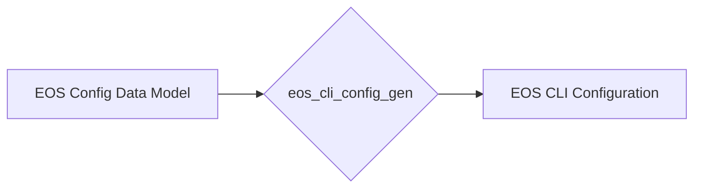
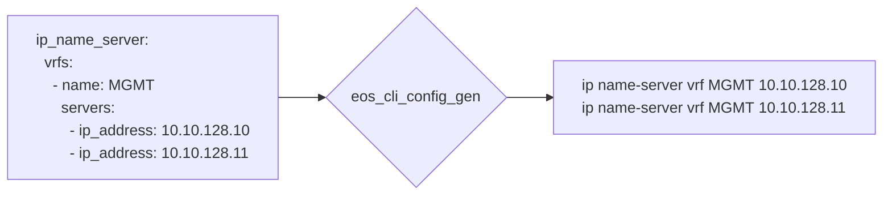
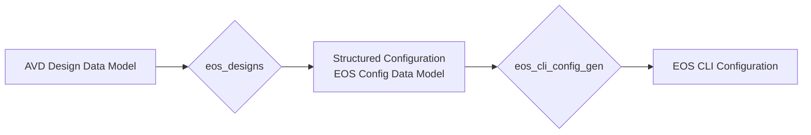
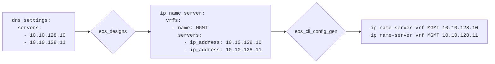
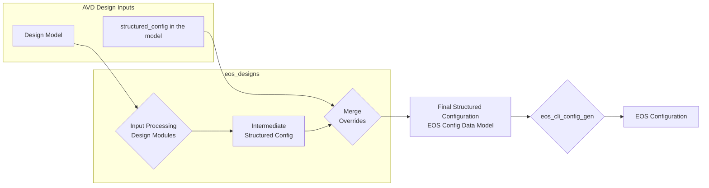
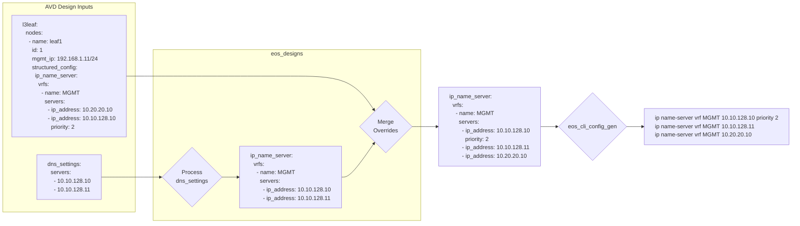
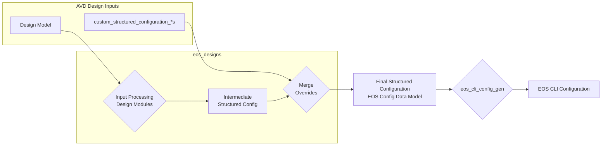

```mermaid
%%{init: {'flowchart': {'wrappingWidth': 9999}}}%%
graph LR
    A1 --> B1
    A2 --> B4
    B4 --> C["ip_name_server:<br/>&nbsp;&nbsp;vrfs:<br/>&nbsp;&nbsp;&nbsp;&nbsp;-&nbsp;name:&nbsp;MGMT<br/>&nbsp;&nbsp;&nbsp;&nbsp;&nbsp;&nbsp;servers:<br/>&nbsp;&nbsp;&nbsp;&nbsp;&nbsp;&nbsp;&nbsp;&nbsp;-&nbsp;ip_address:&nbsp;10.10.128.10<br/>&nbsp;&nbsp;&nbsp;&nbsp;&nbsp;&nbsp;&nbsp;&nbsp;&nbsp;&nbsp;priority:&nbsp;2<br/>&nbsp;&nbsp;&nbsp;&nbsp;&nbsp;&nbsp;&nbsp;&nbsp;-&nbsp;ip_address:&nbsp;10.10.128.11<br/>&nbsp;&nbsp;&nbsp;&nbsp;&nbsp;&nbsp;&nbsp;&nbsp;-&nbsp;ip_address:&nbsp;10.20.20.10"]
    C --> D{eos_cli_config_gen}
    D --> E["ip&nbsp;name-server&nbsp;vrf&nbsp;MGMT&nbsp;10.10.128.10&nbsp;priority&nbsp;2<br/>ip&nbsp;name-server&nbsp;vrf&nbsp;MGMT&nbsp;10.10.128.11<br/>ip&nbsp;name-server&nbsp;vrf&nbsp;MGMT&nbsp;10.20.20.10"]

    subgraph A[AVD Design Inputs]
        direction TB
        A1["dns_settings:<br/>&nbsp;&nbsp;servers:<br/>&nbsp;&nbsp;&nbsp;&nbsp;-&nbsp;10.10.128.10<br/>&nbsp;&nbsp;&nbsp;&nbsp;-&nbsp;10.10.128.11"]
        A2["custom_structured_configuration_ip_name_server:<br/>&nbsp;&nbsp;vrfs:<br/>&nbsp;&nbsp;&nbsp;&nbsp;-&nbsp;name:&nbsp;MGMT<br/>&nbsp;&nbsp;&nbsp;&nbsp;&nbsp;&nbsp;servers:<br/>&nbsp;&nbsp;&nbsp;&nbsp;&nbsp;&nbsp;&nbsp;&nbsp;-&nbsp;ip_address:&nbsp;10.20.20.10<br/>&nbsp;&nbsp;&nbsp;&nbsp;&nbsp;&nbsp;&nbsp;&nbsp;-&nbsp;ip_address:&nbsp;10.10.128.10<br/>&nbsp;&nbsp;&nbsp;&nbsp;&nbsp;&nbsp;&nbsp;&nbsp;&nbsp;&nbsp;priority:&nbsp;2"]
    end

    subgraph B[eos_designs]
        direction LR
        B1{Process<br/>dns_settings} --> B2["ip_name_server:<br/>&nbsp;&nbsp;vrfs:<br/>&nbsp;&nbsp;&nbsp;&nbsp;-&nbsp;name:&nbsp;MGMT<br/>&nbsp;&nbsp;&nbsp;&nbsp;&nbsp;&nbsp;servers:<br/>&nbsp;&nbsp;&nbsp;&nbsp;&nbsp;&nbsp;&nbsp;&nbsp;-&nbsp;ip_address:&nbsp;10.10.128.10<br/>&nbsp;&nbsp;&nbsp;&nbsp;&nbsp;&nbsp;&nbsp;&nbsp;-&nbsp;ip_address:&nbsp;10.10.128.11"]
        B2 --> B4{Merge<br/>Overrides}
    end

    style A1 text-align:left
    style A2 text-align:left
    style B2 text-align:left
    style C text-align:left
    style E text-align:left
```

<!--
  ~ Copyright (c) 2026 Arista Networks, Inc.
  ~ Use of this source code is governed by the Apache License 2.0
  ~ that can be found in the LICENSE file.
-->

# Ansible Usage Patterns

This guide demonstrates the different ways to use Arista AVD Ansible roles, starting from basic usage and progressively introducing more advanced patterns. Each section builds upon the previous one, showing how AVD's flexibility allows you to customize configurations to meet your specific needs.

- [eos_cli_config_gen](#eos_cli_config_gen)
- [eos_designs with eos_cli_config_gen (recommended)](#eos_designs-with-eos_cli_config_gen)
  - [AVD Design Data Model with eos_designs](#avd-design-data-model-with-eos_designs)
  - [structured_config with eos_designs](#structured_config-with-eos_designs)
  - [custom_structured_configuration Prefix](#custom_structured_configuration-prefix)

## eos_cli_config_gen

The [eos_cli_config_gen](../../ansible_collections/arista/avd/roles/eos_cli_config_gen/README.md) role is the EOS config generation layer of AVD. It converts structured configuration data (in YAML format) into EOS configuration syntax.

!!! warning
    Using `eos_cli_config_gen` directly is **not the typical way** to use AVD. Most users should leverage the `eos_designs` role, which provides a higher-level abstraction and automatically generates the structured configuration for you.

### Workflow



When using [eos_cli_config_gen](../../ansible_collections/arista/avd/roles/eos_cli_config_gen/README.md)  role directly, you provide structured configuration using the [EOS Config](../../ansible_collections/arista/avd/roles/eos_cli_config_gen/docs/data-models.md) data model. The role processes this input and generates the corresponding EOS CLI configuration file.

This approach might be useful in specific cases:

- You want full control over the exact configuration.
- You're working with a small number of devices.
- You're migrating from manual configuration to automation.
- You're using AVD for non-fabric use cases.

### Example

Configuring DNS name servers using `eos_cli_config_gen` directly.

```yaml title="Input YAML"
# host_vars/leaf1.yml
ip_name_server:
  vrfs:
    - name: MGMT
      servers:
        - ip_address: 10.10.128.10
        - ip_address: 10.10.128.11
```



```eos title="Generated EOS CLI Output"
ip name-server vrf MGMT 10.10.128.10
ip name-server vrf MGMT 10.10.128.11
```

## eos_designs with eos_cli_config_gen

The [eos_designs](../../ansible_collections/arista/avd/roles/eos_designs/README.md) role uses an abstracted data model, [AVD Design](../../ansible_collections/arista/avd/roles/eos_designs/docs/data-models.md), to deploy various network designs. Instead of defining low-level device configuration, you describe your network design intent; then `eos_designs` generates the structured configuration, which is then processed by [eos_cli_config_gen](../../ansible_collections/arista/avd/roles/eos_cli_config_gen/README.md) role.

### AVD Design Data Model with eos_designs

#### Workflow



The [eos_designs](../../ansible_collections/arista/avd/roles/eos_designs/README.md) role implements Arista's best practices and design patterns. You provide high-level design parameters using the [AVD Design](../../ansible_collections/arista/avd/roles/eos_designs/docs/data-models.md) data model, like fabric topology, VLANs and VRFs, and the role will:

1. Generate the complete structured configuration following the [EOS Config](../../ansible_collections/arista/avd/roles/eos_cli_config_gen/docs/data-models.md) data model.
2. Pass this to [eos_cli_config_gen](../../ansible_collections/arista/avd/roles/eos_cli_config_gen/README.md) for EOS configuration generation.

This two-stage process separates design intent from configuration rendering, making it easier to manage large-scale deployments.

#### Example

Configuring DNS name servers using `eos_designs`.

```yaml title="Input YAML"
# group_vars/FABRIC.yml
dns_settings:
  servers:
    - ip_address: 10.10.128.10
    - ip_address: 10.10.128.11
```



```yaml title="Generated Structured Configuration (Intermediate)"
# Automatically generated by eos_designs
ip_name_server:
  vrfs:
    - name: MGMT
      servers:
        - ip_address: 10.10.128.10
        - ip_address: 10.10.128.11
```

```eos title="Generated EOS CLI Output"
ip name-server vrf MGMT 10.10.128.10
ip name-server vrf MGMT 10.10.128.11
```

### structured_config with eos_designs

To override or extend the configuration generated by [eos_designs](../../ansible_collections/arista/avd/roles/eos_designs/README.md) for specific devices use the `structured_config` key. This allows you to inject configuration following the [EOS Config](../../ansible_collections/arista/avd/roles/eos_cli_config_gen/docs/data-models.md) Data Model that will be merged with the auto-generated configuration.

#### Workflow



The [eos_designs](../../ansible_collections/arista/avd/roles/eos_designs/README.md) role processes your design inputs in multiple stages:

1. **Input Processing & Design Modules**: Generate structured configuration based on your fabric design (topology, VLANs, VRFs, etc.).
2. **Intermediate Structured Config**: The auto-generated configuration following the EOS Config Data Model.
3. **Merge Overrides**: Apply any device-specific `structured_config` (and/or `custom_structured_configuration_*` variables) on top of the generated configuration.
4. **Final Output**: The complete structured configuration ready for [eos_cli_config_gen](../../ansible_collections/arista/avd/roles/eos_cli_config_gen/README.md).

This allows you to:

- Override specific values generated by `eos_designs`.
- Add configuration elements not covered by the design model.
- Customize individual devices while maintaining fabric-wide consistency.

The merge is recursive, so you can update specific sub-keys without replacing entire configuration sections.

**Note**: You can use both `structured_config` and `custom_structured_configuration_*` variables together - they will both be merged onto the generated configuration.

#### Example

In this example, we configure DNS servers for the entire fabric, but one leaf switch needs additional name servers with higher priority.

```yaml title="Input YAML"
# group_vars/FABRIC.yml
dns_settings:
  servers:
    - ip_address: 10.10.128.10
    - ip_address: 10.10.128.11

l3leaf:
  nodes:
    - name: leaf1
      id: 1
      mgmt_ip: 192.168.1.11/24
      structured_config:
        ip_name_server:
          vrfs:
            - name: MGMT
              servers:
                - ip_address: 10.20.20.10
                - ip_address: 10.10.128.10
                  priority: 2
```



```eos title="Generated EOS CLI Output (leaf1 only)"
ip name-server vrf MGMT 10.10.128.10 priority 2
ip name-server vrf MGMT 10.10.128.11
ip name-server vrf MGMT 10.20.20.10
```

### custom_structured_configuration Prefix

The `custom_structured_configuration` prefix provides an alternative way to supply custom structured configuration. Instead of nesting configuration under `structured_config` keys, you can define variables at any group or host level using the prefix.

#### Workflow



The `custom_structured_configuration` prefix approach works similarly to `structured_config`, but offers more flexibility in where you define the variables:

- Variables are prefixed with `custom_structured_configuration_` (by default).
- They can be defined at any level: group_vars, host_vars, or even in inventory.
- The prefix is stripped, and the remaining variable name must match an [EOS Config](../../ansible_collections/arista/avd/roles/eos_cli_config_gen/docs/data-models.md) data model key.
- Multiple custom variables are merged together, then merged on top of `eos_designs` generated configuration.

This approach is useful when:

- You want to organize custom configuration separately from design inputs.
- You need to apply custom configuration at different inventory levels.
- You prefer a flatter variable structure.

**Important**: Both `structured_config` and `custom_structured_configuration_*` can be used together in the same deployment. They are both merged onto the intermediate structured configuration during the same merge step.

#### Example

This example achieves the same result as Section 3, but uses the `custom_structured_configuration_` prefix instead of nested `structured_config`.

```yaml title="Input YAML"
# group_vars/FABRIC.yml
dns_settings:
  servers:
    - ip_address: 10.10.128.10
    - ip_address: 10.10.128.11

# host_vars/leaf1.yml
# Using custom_structured_configuration prefix
custom_structured_configuration_ip_name_server:
  vrfs:
    - name: MGMT
      servers:
        - ip_address: 10.20.20.10
        - ip_address: 10.10.128.10
          priority: 2
```



```eos title="Generated EOS CLI Output (leaf1 only)"
ip name-server vrf MGMT 10.10.128.10 priority 2
ip name-server vrf MGMT 10.10.128.11
ip name-server vrf MGMT 10.20.20.10
```

**Result**: Identical to the previous approach, but using the `custom_structured_configuration_*` prefix instead of nested `structured_config`.

## Summary and Comparison

| Approach | Use Case | Complexity | Flexibility |
| -------- | -------- | ---------- | ----------- |
| **eos_cli_config_gen only** | Small deployments, full control, migration from manual config, non-fabric use cases | Low | High (full control) |
| **eos_designs + eos_cli_config_gen** | Standard fabric deployments, best practices (recommended starting point) | Medium | Medium (design-driven) |
| **structured_config** | Device-specific overrides within AVD design data model | Medium-High | High (targeted overrides) |
| **custom_structured_configuration** | Flexible overrides across inventory levels | Medium-High | Very High (maximum flexibility) |

### Key Takeaways

1. **Start with eos_designs**: Most users should begin with [eos_designs](../../ansible_collections/arista/avd/roles/eos_designs/README.md) for fabric deployments, not [eos_cli_config_gen](../../ansible_collections/arista/avd/roles/eos_cli_config_gen/README.md) directly.
2. **Override When Needed**: Use `structured_config` or `custom_structured_configuration_` for exceptions.
3. **Combine Approaches**: The last two approaches can be used together - both `structured_config` and `custom_structured_configuration_*` variables are merged during the same step.
4. **Understand Precedence**: Custom configuration is merged *after* design generation, allowing overrides.
5. **Choose Your Style**: Pick the override method that fits your workflow - nested `structured_config` or prefixed variables.

### Next Steps

Review the following resources to learn more:

- [Custom Structured Configuration How-To](../../ansible_collections/arista/avd/roles/eos_designs/docs/how-to/custom-structured-configuration.md) for advanced patterns.
- [AVD Design](../../ansible_collections/arista/avd/roles/eos_designs/docs/data-models.md) data model for available design options.
- [EOS Config](../../ansible_collections/arista/avd/roles/eos_cli_config_gen/docs/data-models.md) data model for available EOS configuration options.
