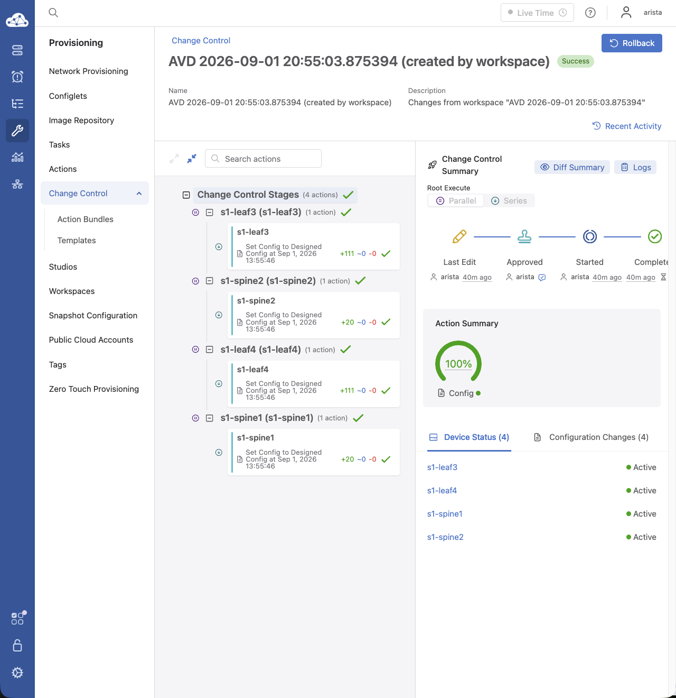

<!--
  ~ Copyright (c) 2023-2026 Arista Networks, Inc.
  ~ Use of this source code is governed by the Apache License 2.0
  ~ that can be found in the LICENSE file.
  -->

# AVD and Ansible Automation Platform

This guide will walk you through the steps required to get up and running with AVD and Red Hat's Ansible Automation Platform (AAP). AAP is Red Hat's solution for scaling automation within an organization, whether by making automation more readily available to team members, adding security capabilities, or reducing the time it takes to get started with Ansible using execution environments.

!!! note
    Red Hat supports “ansible-core” and Ansible Automation Platform. For non-AVD Ansible issues, please contact Red Hat Ansible TAC.

## Requirements to get started

- An accessible lab topology running Arista EOS, CloudVision, and Ansible core.
- An AVD project or Git repository with playbooks and an inventory. To get started, you may also use any of our [example topologies](../../ansible_collections/arista/avd/examples/single-dc-l3ls/README.md).
- A RHEL instance running AAP.
  - If you need access to a RHEL instance, you can join the [developer program](https://developers.redhat.com) to get a copy.
  - To get started with AAP, you may sign up for a 60-day [trial license](https://www.redhat.com/en/technologies/management/ansible/trial).

!!! note
    This guide leverages AAP version 2.7. The workflows should be similar in newer versions. If you have any questions, please see the official [AAP documentation](https://docs.redhat.com/en/documentation/red_hat_ansible_automation_platform/2.7). If you notice any errors in this guide, please open an [issue](https://github.com/aristanetworks/avd/issues).

## Topology

Our topology leverages two spines and four leaf nodes to create a layer 3 leaf-spine topology. The topology is managed by Arista CloudVision (CV). The EOS nodes constantly stream data to CV, giving us the ability to provision them through CV. AAP will act as our controller to communicate any updates to CV, which can then push the updates to our topology.


## AAP Dashboard

The image below provides an excellent overview of the AAP dashboard. From one pane, we have quick links to hosts, inventories, and breakdowns of recent job executions. The left pane provides us with access to anything we may need within AAP. This guide will go through setting up the following items:

- Execution environments
- Projects
- Inventories
- Job templates
- Credentials


## Execution environments with Ansible Builder

Execution environments (EEs) are Red Hat's solution for managing project dependencies. In the past, we used Python virtual environments. The Python virtual environments had pros and cons, but EEs leverage containers to wrap all dependencies within a container. EEs make environments more portable and quicker to replicate between AAP nodes and standalone projects. We will go through an EE build together, but it is highly recommended to build your own for your specific requirements.

### Ansible Builder

Ansible Builder is a tool developed by the Ansible team to aid in creating EEs. Like any tool, there are a few requirements on our development machine to get started with Ansible Builder.

- Supported Python version
- [Ansible Builder](https://docs.ansible.com/projects/builder/en/latest/)
- [Ansible core](https://pypi.org/project/ansible-core/)
- [Podman](https://podman.io/docs/installation)

You can place the Ansible Builder dependencies with your current project or leverage a separate project entirely for your EE builds. Please note that this example was created with version 6.4.0 of the AVD collection. Dependencies may change between versions.

```shell
❯ tree -I venv/
.
├── execution-environment.yml
├── requirements.txt
└── requirements.yml
```

=== "execution-environment.yml"

    ```yaml
    ---
    version: 3 #(1)

    images: #(2)
      base_image:
        name: ghcr.io/ansible-community/community-ee-minimal:2.21.3-1

    dependencies: #(3)
      python_interpreter:
        package_system: python314
        python_path: /usr/bin/python3.14

      galaxy: requirements.yml #(4)

      python: requirements.txt #(5)

    ```

    1. We are leveraging Ansible Builder 3.x, which requires version 3 of the definition file. If you leverage an older version of Ansible Builder, you may need to use `version: 1`.
    2. You may use any base container image. Please see the official documentation for more examples.
    3. This specifies which version of Python we would like installed during the container build.
    4. This is a pointer to any additional collections we want installed on our container.
    5. This is a pointer to any additional Python packages we require for our workflow.

=== "requirements.yml"

    ```yaml
    ---
    collections: #(1)
      - name: arista.avd
        version: 6.4.0

    ```

    1. Installing the `arista.avd` collection for this workflow will ensure that any other required collections are also installed.

=== "requirements.txt"

    ```text
    pyavd[ansible]==6.4.0

    ```

    The Python dependencies listed here are from the [collection installation](../../docs/installation/collection-installation.md#python-requirements-installation) instructions. Please update the requirements for the specific version of the `arista.avd` collection you are leveraging.

#### Build and push the image

Login to your respective container registry.

```shell
podman login < registry url >
```

The command below will use Ansible Builder to start building our custom EE. In this case, we leverage Podman as a container runtime and tag the image appropriately.

```shell
ansible-builder build --container-runtime podman -v 3 --tag registry-url/username/image-name:image-tag
```

Once complete, you can push the image to a public or private container registry.

```shell
podman push registry-url/username/image-name:image-tag
```

!!! note
    You will need to authenticate with your respective container registry. Please see the official documentation for authentication instructions.

### Execution environments on AAP

Once the image is located on our container registry, we are ready to add our custom EE to AAP.

=== "Click on EE"

    Scroll down on the left pane, and under `Automation Execution > Infrastructure`, click on `Execution Environments`.

    
    

=== "EE - Add"

    In the new pane, click on `Create execution environment`. You can also see the built-in EEs installed with AAP.

    
    

=== "EE - Save"

    Give the EE an appropriate `Name` and full `Image` location. The appropriate `Pull` option depends on whether the EE is under active development.

    
    

#### Authentication with Private Container Registries

If you are leveraging a private container registry, we must tell AAP how to authenticate with the private registry. You may have noticed that we leveraged a GitHub container registry credential. GitHub container registries are considered private registries by default and require authentication to pull images.

We can create the required credential by clicking on `Credentials` right below `Execution Environments` on the left pane. We can then select `Create credential`.

=== "Create credential"

    
    

=== "Save credential"

    - Give the credential an appropriate name.
    - The `Credential type` will be `Container Registry`.
    - The `Authentication URL` will differ depending on your registry. In our case, we are using `ghcr.io`.
    - The `Username` will be your Service account or username.
    - For GitHub Container Registry, we leverage a token.
    - Once complete, click on `Save credential`.

    
    

    After saving the credential, return to `Execution Environments` and edit the execution environment. If the EE image is hosted in a private registry, select the saved credential in the `Registry credential` field and save the execution environment. The credential must be associated with the execution environment before AAP attempts to pull the image.

## Projects

Projects in AAP are vital in setting up additional options. For example, we can leverage our project when defining a new inventory or reference playbooks within the project to define job workflows in AAP.

=== "Click on Projects"

    Scroll up on the left pane, and under `Automation Execution`, click on `Projects`.

    
    

=== "Projects - Add"

    In the new pane, click on `Create project`.

    
    

=== "Projects - Save"

    Give the project an appropriate `Name`. Again, you may use any examples hosted within the [AVD repository](https://github.com/aristanetworks/avd/tree/devel/ansible_collections/arista/avd/examples) or any current project you have. This example will leverage a Git repository as the `Source Control Type`. We will also set the URL for our Git project and, optionally, an alternate branch. Finally, we also check `Update Revision on Launch` and set the `Cache Timeout` to zero. Setting it to zero will also ensure the project updates when running a job that references this project, which is helpful for any projects with active development.

    
    

## Inventories

AAP provides many ways to add an inventory. For example, we can use an inventory hosted within our project or a constructed inventory made from multiple inventories. This example will leverage one inventory from our Git project.

=== "Click on Inventories"

    On the left pane, under `Automation Execution > Infrastructure`, click on `Inventories`.

    
    

=== "Inventories - Add"

    In the new pane, click on `Create inventory` and select `Create inventory`.

    
    

=== "Inventories - Save"

    Give the inventory an appropriate `Name` and click `Save inventory`.

    
    

### Inventory Sources

At this point, we have an inventory with no hosts. This is where inventory sources come into play. Like most things, we have a series of options. We can leverage an inventory source from cloud providers, virtualization platforms, or, in our case, directly from our project.

=== "Click on Sources"

    On the center pane, click on `Sources`.

    
    

=== "Sources - Add"

    - In the new pane, click on `Create source`.
    - A new pane appears. As before, enter an appropriate `Name` and select `Sourced from a Project` under `Source`.
    - Under `Source Details`, click on the search icon under `Project`:
      - Select your newly created project.
    - Under `Source Details`, if the `Inventory file` drop-down does not show your inventory, feel free to enter it manually.
    - Under `Options`:
      - `Overwrite` is checked. Overwrite will ensure our inventory source manages additions and removals of hosts and groups.
      - `Update on launch` is checked and will ensure any job run using this inventory will force an inventory update.
      - `Overwrite variables` is checked as well and ensures variables assigned to the host always originate from the source.
    - Click `Save source`.

    
    

=== "Sources - Sync"

    In the new pane, click on `Sync inventory source` to update your inventory.

    
    

### View the Inventory

There are a few locations to view the inventory, but for simplicity, we can view it by clicking on `Jobs` under `Automation Execution` on the left pane.

=== "Click on Sync Job"

    - On the left pane, click on `Jobs`.
      - You should see an inventory sync running or complete.
    - Click on the inventory sync job.

    
    

=== "Sync job output"

    Towards the bottom of the output, we see that AAP successfully parsed our inventory. In this case, we have loaded four groups and six hosts.

    
    

=== "Hosts"

    There are a few locations to view the inventory, but for simplicity, we can take a look by clicking on `Hosts` on the left pane.

    
    

## Job templates and workflow templates

One thing that may need some clarification is the naming of "job templates." These map to playbooks within our project. There is also an option to build workflow templates: a series of job templates with some control logic built in. For this example, we will use a job template to build and deploy our node configurations with CV.

=== "Click on Templates"

    On the left pane, click on `Templates`.

    
    

=== "Templates - Add"

    - On the center pane, select `Create template`.
    - In the dropdown, select `Create job template`.

    
    

=== "Templates - Job"

    The job template is where we leverage the custom execution environment. Since our setup requires specific Ansible collections and Python packages to be installed, we would like to use a pre-packaged environment with that software. In the `Execution environment` field, select the custom execution environment containing the `arista.avd` collection and `pyavd` dependencies. We can modify a decent number of settings, and they may look familiar from previous experience with Ansible configurations. If you need a refresher on these options, please see the [official documentation](https://docs.redhat.com/en/documentation/red_hat_ansible_automation_platform/2.7). Once you are happy with the settings, click `Save job template`.

    !!! warning
        The playbook is set to "Run," and the EOS instances in use will be changed. Please ensure you are leveraging nonproduction instances when testing. We also specify an Ansible Vault credential which will be covered in the next section.

    
    

### Ansible Vault

With most jobs, we need a way to authenticate with our CV instance or EOS nodes. AAP provides a multitude of ways to define credentials. Options include credentials for network devices, container registries, and HashiCorp Vault. Feel free to explore any option you need for your environment. For this guide, we will leverage a vault credential. Ansible Vault allows us to encrypt files that can then be read as variables during our playbook or job template runs.

!!! note
    You will need to create a CloudVision service account and generate a token.

=== "Create a vault file"

    ```yaml
    ---
    cv_token: < CloudVision Service Account Token >

    ```

=== "Encrypt the vault file"

    `ansible-vault encrypt group_vars/vault.yml`

    The `cv_token` variable will be leveraged when provisioning the fabric with the `cv_deploy` role.

    ```yaml
    ---
    - name: Build and Deploy configurations
      hosts: FABRIC
      gather_facts: false
      vars_files:
        - ../group_vars/vault.yml
      tasks:
    ```

    !!! note
        This guide leverages the `cv_deploy` role for provisioning through CV. The `cv_deploy` role requires additional options and tokens to be generated. Please see the `cv_deploy` role [documentation](https://avd.arista.com/stable/ansible_collections/arista/avd/roles/cv_deploy/index.html) for the most up-to-date settings. We also set `cv_run_change_control` to `true`; the default is `false`. This allows the change control to be executed automatically.

=== "Create a vault credential"

    Under `Automation Execution > Infrastructure`, click on `Credentials` and select `Create credential`.

    
    

=== "Save credential"

    The credential type will be `Vault`, and the `Vault Password` will be what we set when using the encrypt command. Once complete, click `Save credential`.

    
    

### Running the Template with CV

Below is an example of the playbook we are leveraging to build and deploy our configurations with CV.

```yaml
---
- name: Build and Deploy configurations
  hosts: FABRIC
  gather_facts: false
  vars_files:
    - ../group_vars/vault.yml
  tasks:

    - name: Generate AVD Structured Configurations and Fabric Documentation
      ansible.builtin.import_role:
        name: arista.avd.eos_designs

    - name: Generate Device Configurations and Documentation
      ansible.builtin.import_role:
        name: arista.avd.eos_cli_config_gen

    - name: Provision nodes with CloudVision
      ansible.builtin.import_role:
        name: arista.avd.cv_deploy
      vars:
        cv_server: < cv_url >
        cv_run_change_control: true

```

We have everything we need to run our job template now.

!!! note
    This guide leverages the `cv_deploy` role for provisioning through CV. The `cv_deploy` role requires additional options and tokens to be generated. Please see the `cv_deploy` role [documentation](../../ansible_collections/arista/avd/roles/cv_deploy/README.md) for the most up-to-date settings. We also set `cv_run_change_control` to `true`; the default is `false`. This allows the change control to be executed automatically.

=== "Templates Run"

    - On the left pane, click on `Templates`.
    - Click on the `Launch Template` icon to run the job template.

    
    

=== "Jobs"

    On the left pane, select `Jobs`. You may see a series of updates. For example, our source control is updating because our timeout is set to zero. The inventory has also been updating since we checked `Update on launch`. Last but not least, the job template will run.

    
    

=== "Job - Output"

    We can now click on the job run and see a successful execution.

    
    

=== "CV View"

    From CV's perspective, we can see that the `cv_deploy` role has completed our change control workflow.

    

## References

- [Ansible Builder documentation](https://ansible.readthedocs.io/projects/builder/en/latest/)
- [Getting started with Execution Environments](https://docs.ansible.com/ansible/latest/getting_started_ee/index.html)
- [Red Hat Ansible Automation Platform Installation Guide](https://access.redhat.com/documentation/en-us/red_hat_ansible_automation_platform/2.0-ea/html/red_hat_ansible_automation_platform_installation_guide/index)
