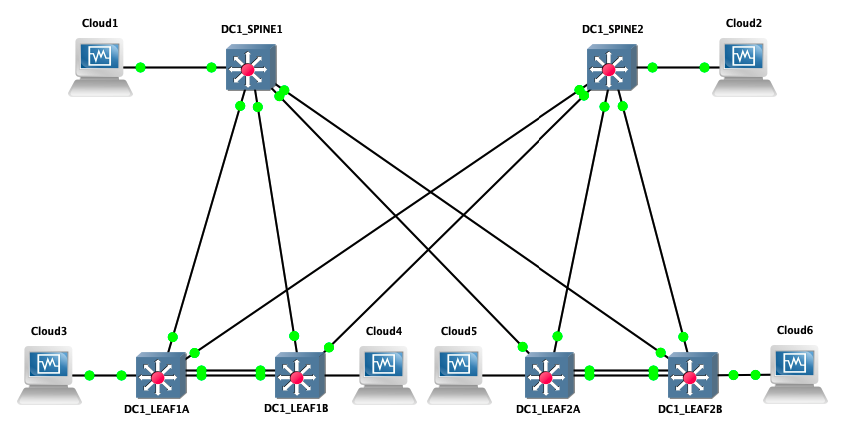

# Arista Validated Design with CloudVision deployment

<!-- @import "[TOC]" {cmd="toc" depthFrom=1 depthTo=6 orderedList=false} -->

<!-- code_chunk_output -->

- [Arista Validated Design with CloudVision deployment](#arista-validated-design-with-cloudvision-deployment)
  - [About](#about)
  - [How it works](#how-it-works)
  - [How to use this example](#how-to-use-this-example)
    - [1. Installation](#1-installation)
    - [2. Configure DHCP server on CloudVision](#2-configure-dhcp-server-on-cloudvision)
    - [3. Configure Fabric parameters](#3-configure-fabric-parameters)
    - [4. Edit Inventory](#4-edit-inventory)
      - [5. Run playbook](#5-run-playbook)

<!-- /code_chunk_output -->

## About

This example implement a basic __EVPN/VXLAN Fabric__ based on __[Arista Validated Design roles](https://github.com/aristanetworks/ansible-avd)__ with one layer of 2 spines and one layer of leafs (4 devices) using MLAG. Configuration deployment is not managed by eos EAPI, but through Arista CloudVision based on __[arista.cvp collection](https://github.com/aristanetworks/ansible-cvp/)__

It helps to demonstrate how to bring up an Arista EVPN/VXLAN Fabric from the first boot.



> Lab is based on GNS3 topology and a CloudVision server running on a VMware instance.

## How it works

This example use following specific resources:

- A specific Module named [__`inventory_to_container`__](../library/inventory_to_container.py) to convert `YAML` inventory to a structure compatible with CVP for __Containers__ and __Configlets__ definitions. it generate a variable named `CVP_VARS` with list of configlet and a topology.

- A [role](../roles/eos-config-deploy-cvp/tasks/main.yml) to support all tasks related to CV configuration:
  - Generate `cv_container` and `cv_configlet` inputs
  - Generate `cv_device` inputs
  - Load these new variables
  - Collect facts from CloudVision
  - Deploy configlets to CloudVision
  - Build Container topology without device definition
  - Configure devices to use correct list of configlets and correct container
  - Run pending tasks generated by role.

## How to use this example

### 1. Installation

To use this example, it is higly recommended to work in a Python virtual-environment:

```shell
# Configure Python virtual environment
$ virtualenv -p $(which python2.7) .venv
$ source .venv/bin/activate

# Install Python requirements
$ pip install -r requirements.txt
```

You also have to install `arista.cvp` collection to be able to connect to CloudVision

```shell
$ ansible-galaxy collection install arista-cvp-1.0.1.tar.gz -p collections
```

### 2. Configure DHCP server on CloudVision

In this scenario, we use CloudVision (CV) as ZTP server to provision devices and register them onto CV.

Once you get mac-address of your switches, edit file `/etc/dhcp/dhcpd.conf` in CloudVision. In this scenario, CV use following address to connect to devices: `10.255.0.1`

```shell
$ vi /etc/dhcp/dhcpd.conf

subnet 10.255.0.0 netmask 255.255.255.0 {
    range 10.255.0.200 10.255.0.250;
    option routers 10.255.0.1;
    option domain-name-servers 10.83.28.52, 10.83.29.222;
    option bootfile-name "http://10.255.0.1/ztp/bootstrap";
}

#############################################################
host DC1-SPINE1 {
    option host-name "DC1-SPINE1";
    hardware ethernet 0c:1d:c0:1d:62:01;
    fixed-address 10.255.0.11;
    option bootfile-name "http://10.255.0.1/ztp/bootstrap";
}

host DC1-SPINE2 {
    option host-name "DC1-SPINE2";
    hardware ethernet 0c:1d:c0:1d:62:02;
    fixed-address 10.255.0.12;
    option bootfile-name "http://10.255.0.1/ztp/bootstrap";
}

host DC1-LEAF1A {
    option host-name "DC1-LEAF1A";
    hardware ethernet 0c:1d:c0:1d:62:11;
    fixed-address 10.255.0.13;
    option bootfile-name "http://10.255.0.1/ztp/bootstrap";
}

host DC1-LEAF1B {
    option host-name "DC1-LEAF1B";
    hardware ethernet 0c:1d:c0:1d:62:12;
    fixed-address 10.255.0.14;
    option bootfile-name "http://10.255.0.1/ztp/bootstrap";
}

host DC1-LEAF2A {
    option host-name "DC1-LEAF2A";
    hardware ethernet 0c:1d:c0:1d:62:21;
    fixed-address 10.255.0.15;
    option bootfile-name "http://10.255.0.1/ztp/bootstrap";
}

host DC1-LEAF2B {
    option host-name "DC1-LEAF2B";
    hardware ethernet 0c:1d:c0:1d:62:22;
    fixed-address 10.255.0.16;
    option bootfile-name "http://10.255.0.1/ztp/bootstrap";
}

```

> Be sure to update ethernet address to match MAC addresses configured on your switches.

Then, restart your DHCP server:

```shell
$ service dhcpd restart
```

From here, you can start your devices and let CVP register them into `undefined` container.

### 3. Configure Fabric parameters

__3.1. Edit `group_vars/DC1.yml` to configure__
- Users on EOS devices (keep in mind CV will use your username to connect to EOS)
- CloudVision IP Address
- Optional Key to stream telemetry

```yaml
# local users
local_users:
  [...]
  ansible:
    privilege: 15
    role: network-admin
    sha512_password: "$6$Dzu11L7yp9j3nCM9$FSptxMPyIL555OMO.ldnjDXgwZmrfMYwHSr0uznE5Qoqvd9a6UdjiFcJUhGLtvXVZR1r.A/iF5aAt50hf/EK4/"
# Cloud Vision server information
cvp_instance_ip: 10.255.0.1
cvp_ingestauth_key: ''
```

In this example, we use ansible/ansible for both CV and EOS.

__3.2. Edit `DC1_FABRIC.yml` to configure devices information:__

- Add / Remove devices in the list.
- Management IP of every device.

In this example, we only use `spine` and `l3leafs` devices. Below is an example for `l3leafs`:

```yaml
  node_groups:
    DC1_LEAF1:
      bgp_as: 65101
      nodes:
        DC1-LEAF1A:
          id: 1
          mgmt_ip: 10.255.0.13/24
          spine_interfaces: [ Ethernet1, Ethernet1 ]
        DC1-LEAF1B:
          id: 2
          mgmt_ip: 10.255.0.14/24
          spine_interfaces: [ Ethernet2, Ethernet2 ]
```

### 4. Edit Inventory

In the inventory, update CloudVision information to target your own setup:

```yaml
# inventory.yml
all:
  children:
    CVP:
      hosts:
        cvp:
          ansible_httpapi_host: 10.83.28.164
          ansible_host: 10.83.28.164
          ansible_user: ansible
          ansible_password: ansible
          ansible_httpapi_port: 443
          # Configuration to get Virtual Env information
          ansible_python_interpreter: $(which python)
```
> This snippet shows only information you might have to change.

#### 5. Run playbook

You can run playbook to execute everything in just one command. But because it is for demo purpose, I would recommand to use tags to go step by step

__Available tags:__
- __`build`__: Build [`devices configuration`](intended_configs/) and [CVP variables](generated_vars/cvp.yml).
- __`provision`__: Create topology, configlets and configure devices with correct configlet. Do not execute tasks so you can still cancel and rollback 
- __`apply`__: Execute pending tasks related to our deployment.

__Execute Playbook:__

```shell
$ ansible-playbook dc1-fabric-deploy-cvp.yml --tags {build,provision,apply}
```

After devices rebooted, you can check everything is up and running:

```
DC1-LEAF1A#show ip bgp summary
BGP summary information for VRF default
Router identifier 192.168.255.3, local AS number 65101
Neighbor Status Codes: m - Under maintenance
  Neighbor         V  AS           MsgRcvd   MsgSent  InQ OutQ  Up/Down State   PfxRcd PfxAcc
  10.255.251.1     4  65101             34        36    0    0 00:22:48 Estab   15     15
  172.31.255.0     4  65001             32        34    0    0 00:22:49 Estab   11     11
  172.31.255.2     4  65001             33        33    0    0 00:22:49 Estab   11     11
DC1-LEAF1A#show bgp evpn summary 
BGP summary information for VRF default
Router identifier 192.168.255.3, local AS number 65101
Neighbor Status Codes: m - Under maintenance
  Neighbor         V  AS           MsgRcvd   MsgSent  InQ OutQ  Up/Down State   PfxRcd PfxAcc
  192.168.255.1    4  65001             57        63    0    0 00:22:55 Estab   44     44
  192.168.255.2    4  65001             57        45    0    0 00:22:56 Estab   44     44
```

